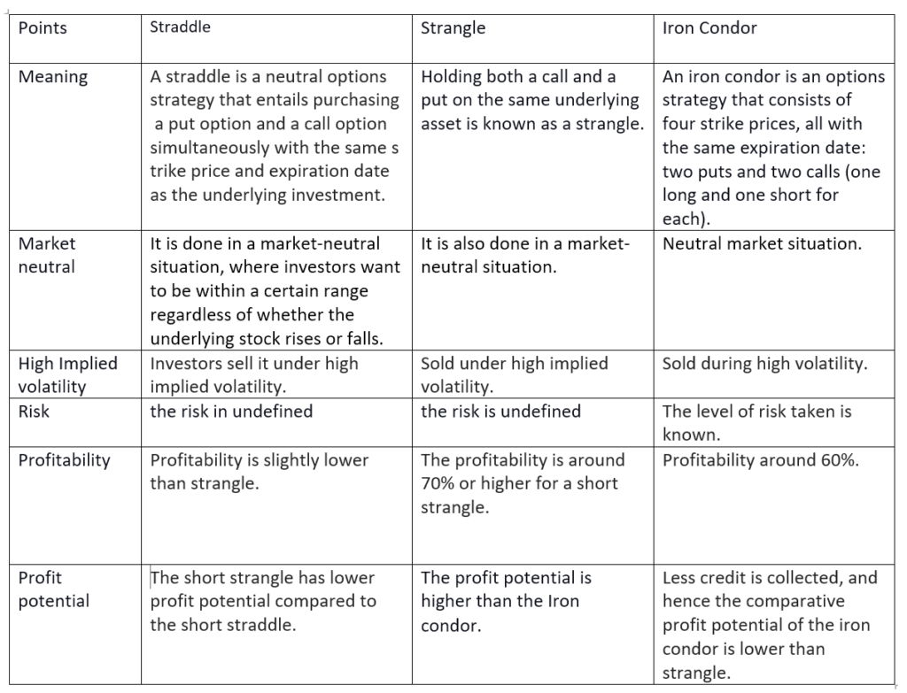

In the world of financial markets, options trading and algorithmic trading serve as advanced techniques that empower investors to make more informed decisions. Options trading involves contracts that grant the buyer the right, but not the obligation, to buy or sell an underlying asset at a predetermined price within a certain period. This flexibility introduces a rich array of strategic opportunities for traders, particularly through the use of short and long strategies. Short strategies, often involving selling options, are typically employed by investors who anticipate minimal movement or a decline in the value of an asset. On the other hand, long strategies, which involve purchasing options, are favored by those expecting significant asset price movement in a specific direction.

Algorithmic trading emerges as a crucial companion to these option strategies, enhancing their effectiveness through the application of automated systems. These systems are designed to execute trades at speeds and efficiencies that surpass human capabilities, providing a significant edge in today's fast-paced markets. With algorithmic trading, investors are able to analyze large volumes of data swiftly, execute trades based on predefined criteria, and minimize the emotional biases often present in manual trading. 



The role of the option writer—responsible for creating options contracts—introduces additional complexity and potential for profit, as they earn premiums by assuming the obligation to buy or sell the underlying asset. However, option writers must carefully manage risk, as the wrong market move can lead to significant losses, especially in scenarios involving uncovered or 'naked' positions.

Understanding the fine line between risk and reward is imperative in option trading and algorithmic trading. These financial tools offer the potential for considerable profits but come with inherent risks that require skilled management. Through informed strategies and the support of technology, traders can potentially enhance their trading outcomes, aligning their tactics with personal risk tolerance and market conditions.

## Table of Contents

## Foundations of Option Writing: Long and Short Strategies

Option writing, often referred to as options selling, is a fundamental practice in the financial markets, primarily used to generate income or provide hedging against potential losses. At its core, option writing involves creating options contracts and earning a premium in exchange for the obligation to buy or sell an asset at a predetermined price. Two main strategies underlie this practice: short strategies and long strategies, each serving distinct purposes in an investor's strategy portfolio.

### Short Strategies

Short strategies in options trading typically involve selling options, such as call options, which obligate the writer to sell the underlying asset if the option is exercised. This approach is often employed when an investor anticipates a decrease or stability in the value of the underlying asset. By writing a call option, the investor receives a premium from the option buyer. The goal is for the options to expire worthless, allowing the writer to retain the premium without any obligation to sell the asset. However, this strategy carries significant risk if the market does not behave as expected. For instance, if the asset's price rises significantly, the writer may face substantial losses, particularly when the call option is uncovered or 'naked', meaning the writer does not actually own the underlying asset.

### Long Strategies

Conversely, long strategies involve purchasing options—either calls or puts—on the expectation of significant asset price movement. Buying a call option reflects a bullish outlook, predicting a rise in the asset's price, while buying a put option indicates a bearish expectation, anticipating a fall in price. These strategies allow traders to capitalize on potential market shifts while limiting their risk to the premium paid for the options. The potential for reward is theoretically unlimited with call options when the underlying asset price rises, whereas the maximum loss is the premium paid if the market moves unfavorably.

### Hedging and Speculation

The comprehension of long and short strategies is crucial for traders who aim to hedge against potential losses or speculate for potential gains. Hedging involves using options to reduce the risk of adverse price movements in an existing position. For example, holding a long position in a stock can be hedged by purchasing put options, which provide the right to sell at a predetermined price, thereby limiting downside risk. Conversely, options can be used purely for speculative purposes, intending to profit from anticipated price moves without any underlying position.

### Risk Assessment

Both long and short strategies necessitate meticulous risk assessment. Uncovered or naked options, particularly in short strategies, present substantial risks. If the asset price moves significantly against the position, the financial liability can be substantial, and theoretically unlimited in the case of short calls. Consequently, traders must carefully manage their exposure, often employing combination strategies such as spreads, which involve simultaneously buying and selling options to limit risk exposure. 

In options trading, understanding the interplay between risk and potential reward is critical, allowing traders to effectively balance their portfolios and make informed decisions that align with their financial goals.

## The Art and Science of Algorithmic Trading

Algorithmic trading leverages the capabilities of computerized systems to execute trades with a speed and precision that surpasses human capacity. This sophisticated approach is characterized by the use of algorithms—precise sets of rules or operations—to monitor market trends, manage risks, and execute trades based on predefined criteria. By employing algorithms, traders can eliminate the emotional aspects of manual trading, thereby enabling more systematic and objective decision-making.

Automated trading strategies encompass a variety of approaches, including [trend following](/wiki/trend-following), [arbitrage](/wiki/arbitrage), mean reversion, and straddle strategies. Each of these strategies embodies a distinct methodology for capitalizing on market movements:

1. **Trend Following**: This strategy aims to capitalize on the momentum of an asset's price by entering trades that align with the current direction of the market trend. It relies on signals generated from trend indicators such as moving averages and momentum oscillators.

2. **Arbitrage**: Arbitrage exploits price discrepancies in different markets or instruments. Algorithms can swiftly identify and execute trades to profit from these short-lived pricing inefficiencies, ensuring execution speed is crucial for capturing potential gains before the opportunities disappear.

3. **Mean Reversion**: This approach is based on the hypothesis that asset prices and returns eventually revert to their historical mean. Algorithms designed for mean reversion may buy or sell when prices deviate significantly from their average, anticipating a correction.

4. **Straddle Strategies**: Straddle strategies employ options to take advantage of price volatility, regardless of the direction of price movement. These strategies are particularly effective during times of anticipated price swings, allowing traders to profit from significant up or down moves in the market.

A key component of [algorithmic trading](/wiki/algorithmic-trading) is the ability to back-test and refine algorithms before actual market deployment. Back-testing involves running the algorithm over historical market data to evaluate its performance, enabling traders to identify potential shortcomings or areas for improvement. Consider the following Python code snippet illustrating a simple back-testing framework for a mean reversion strategy:

```python
import pandas as pd
import numpy as np

# Load historical market data
data = pd.read_csv('historical_data.csv')  # Assume this contains 'Date', 'Price' columns

# Calculate historical moving average
data['Moving_Average'] = data['Price'].rolling(window=20).mean()

# Define mean reversion signal
data['Signal'] = np.where(data['Price'] < data['Moving_Average'], 1, -1)

# Calculate returns
data['Returns'] = data['Price'].pct_change()

# Apply the strategy
data['Strategy_Returns'] = data['Signal'].shift(1) * data['Returns']

# Assess strategy performance
cum_strategy_returns = (1 + data['Strategy_Returns']).cumprod() - 1
print(f"Strategy Total Return: {cum_strategy_returns.iloc[-1]:.2%}")
```

This code reads historical price data, computes a simple moving average, and generates buy or sell signals based on mean reversion logic. It further calculates the hypothetical returns of the strategy, providing insights into its profitability.

The refinement of trading algorithms through such testing allows traders to optimize their strategies, identifying the most effective parameters and decision rules prior to committing real capital. This iterative process ensures that the algorithms are well-suited to achieving consistent results in real-world conditions, enhancing their utility in dynamic markets.

## Combining Strategies: The Intersection of Options and Algorithms

Algorithmic trading enhances options strategies by enabling traders to execute trades based on real-time data and complex market analyses. This integration provides a significant advantage in fast-paced trading environments where speed and accuracy are paramount. 

Custom algorithms can evaluate option Greeks, such as delta, which measures the sensitivity of an option's price to changes in the price of the underlying asset, and vega, which assesses sensitivity to [volatility](/wiki/volatility-trading-strategies). By doing so, these algorithms help in optimizing risk management strategies, allowing traders to account for how options might react to market shifts. 

For example, consider the Python code snippet below that calculates the delta of an option using the Black-Scholes model:

```python
from scipy.stats import norm
import numpy as np

def delta(S, K, T, r, sigma):
    d1 = (np.log(S / K) + (r + 0.5 * sigma ** 2) * T) / (sigma * np.sqrt(T))
    return norm.cdf(d1)

# Example usage
S = 100  # Current stock price
K = 105  # Strike price
T = 1    # Time to expiration in years
r = 0.05 # Risk-free interest rate
sigma = 0.2 # Volatility

option_delta = delta(S, K, T, r, sigma)
print(f"Option Delta: {option_delta}")
```

Dynamic hedging is another crucial application, where algorithms automatically adjust positions in response to continuous fluctuations in market conditions. This is essential for maintaining optimal hedge ratios and minimizing potential losses.

Algorithmic trading also improves the execution of both long and short strategies by automating decision-making processes based on predefined criteria. For instance, an algorithm might automatically initiate a short sell when market indicators suggest a downturn, thereby optimizing returns without the delays associated with manual trades.

Furthermore, the combination of options and algorithms facilitates the development of sophisticated investment strategies that are adaptable to various market scenarios. These strategies often leverage advanced statistical methods and [machine learning](/wiki/machine-learning) techniques to anticipate market movements and execute trades accordingly.

In essence, the synergy between options and algorithmic trading offers traders a robust toolkit that enhances precision, efficiency, and adaptability in managing investments, ultimately leading to potentially higher returns in dynamic market conditions.

## Advanced Techniques in Algo Trading and Option Writing

Volatility is a critical component in options pricing and serves as a cornerstone for advanced trading strategies. Effective volatility trading strategies can harness market fluctuations to generate profits. In algorithmic trading, sophisticated models are employed to capitalize on these dynamics. 

One such approach involves market-making algorithms that continuously quote prices, enhancing trading [liquidity](/wiki/liquidity-risk-premium). These algorithms act as intermediaries, providing buy and sell quotes, thus ensuring a fluid market environment. By maintaining tight bid-ask spreads, market-making algorithms can enable quick and cost-effective trades, benefitting most trading strategies.

The use of mathematical models in algorithmic trading provides a predictive framework for identifying and exploiting price trends. For instance, the Black-Scholes model is commonly used to estimate the fair value of options, taking into account factors like underlying asset price, exercise price, time to expiration, and volatility. Models such as the Generalized Autoregressive Conditional Heteroskedasticity (GARCH) are also employed to forecast volatility by analyzing past market data.

Real-time portfolio monitoring and adjustments are crucial as they allow traders to promptly respond to changes in market conditions. This dynamic approach ensures that trading strategies remain aligned with current market realities, minimizing losses and maximizing profit potential. Programming techniques, such as event-driven [backtesting](/wiki/backtesting) and live trading assessments, can be articulated through Python code. For example:

```python
import yfinance as yf  # For more datasets, visit: https://paperswithbacktest.com/datasets
import numpy as np

def calculate_garch_forecast(data, periods=252):
    # Implement a simple GARCH model to forecast future volatility
    from arch import arch_model
    returns = np.log(data / data.shift(1)).dropna()
    model = arch_model(returns, vol='Garch', p=1, q=1)
    model_fit = model.fit(disp="off")
    return model_fit.forecast(horizon=periods).variance[-1:]

# Fetch historical market data
data = yf.download('AAPL', start='2022-01-01', end='2023-01-01')['Close']

# Calculate GARCH forecast
garch_forecast = calculate_garch_forecast(data)
print("GARCH Forecasted Volatility:", garch_forecast)
```

Moreover, algorithmic trading excels at uncovering arbitrage opportunities. These opportunities arise from temporary mispricings across different markets or securities, allowing traders to lock in risk-free profits. Fast execution is essential here, as arbitrage opportunities often self-correct naturally and quickly. Thus, algorithms must be designed to detect and act on these discrepancies in near real-time.

Integrating these advanced techniques within algorithmic trading helps in constructing a robust framework that exploits market mechanisms efficiently. By leveraging volatility trading and embracing continuous real-time adjustments and swift execution strategies, traders can address complex market conditions, enhancing their ability to capitalize on trading opportunities.

## Challenges and Risks in Algorithmic Options Trading

Algorithmic options trading, while advantageous, entails several challenges and risks that traders must manage proactively. Technical failures, such as server outages or software bugs, can disrupt trading activities, leading to significant financial losses. These issues can occur if algorithms are not robustly tested under various market conditions or if insufficient redundancy is built into the trading infrastructure.

One critical subset of algorithmic trading is high-frequency trading ([HFT](/wiki/high-frequency-trading-strategies)), which demands rapid trade execution and high-speed data processing. Despite its benefits, HFT can inadvertently influence market prices due to the sheer [volume](/wiki/volume-trading-strategy) and speed of trades executed. For instance, a malfunctioning algorithm might execute a large number of trades within milliseconds, causing unintended price fluctuations. Therefore, ensuring that algorithms are optimized for speed without sacrificing accuracy and control is essential.

Regulatory compliance and platform reliability are essential to maintaining the integrity and safety of algorithmic trading. Regulatory bodies, such as the U.S. Securities and Exchange Commission (SEC) and the Financial Conduct Authority (FCA) in the UK, have set stringent rules to govern algorithmic trading activities. Traders must ensure their algorithms comply with these regulations, including maintaining audit trails and risk controls to prevent market manipulation and ensure market stability. Additionally, using reliable trading platforms that provide robust security and fail-over mechanisms helps mitigate operational risks.

A comprehensive understanding of market dynamics and associated risk factors is crucial for successful algorithmic options trading. For instance, the volatility often associated with options markets can be a double-edged sword. While it offers opportunities for profit, it also increases the risk of rapid loss. Traders must incorporate volatility analysis into their algorithms to dynamically adjust trading strategies in response to changing market conditions.

To address these challenges, traders should prioritize developing robust, resilient trading systems. This involves continuous algorithm testing and validation, using real-time market data to fine-tune strategies. One approach is to implement machine learning models that learn from historical data patterns to predict and respond to market movements effectively. Python, with libraries such as `pandas` for data manipulation and `scikit-learn` for machine learning, can be employed to build these adaptive systems.

Here is a simple example of how you might use Python to test an algorithm's performance under varying market conditions:

```python
import numpy as np
import pandas as pd
from sklearn.model_selection import train_test_split
from sklearn.ensemble import RandomForestClassifier

# Load historical market data
data = pd.read_csv('historical_market_data.csv')

# Preprocess data and feature engineering
features = data.drop(['target'], axis=1)
target = data['target']

# Split data into training and test sets
X_train, X_test, y_train, y_test = train_test_split(features, target, test_size=0.2, random_state=42)

# Initialize Random Forest algorithm
model = RandomForestClassifier(n_estimators=100)

# Train the model
model.fit(X_train, y_train)

# Evaluate the model performance
accuracy = model.score(X_test, y_test)
print(f'Model accuracy: {accuracy}')
```

By staying aware of and addressing these challenges, traders can enhance the resilience of their trading systems, maximizing profit potential while minimizing risk.

## Conclusion: Maximizing Potential Through Informed Strategies

The integration of both short and long strategies with algorithmic trading in financial markets can yield significant rewards for those adept in applying these techniques. By leveraging advancements in technology, traders can execute their strategies with enhanced efficiency and precision. An informed approach, characterized by continuous learning and testing, is central to achieving success in the options trading arena. Traders should regularly evaluate and refine their strategies to adapt to the ever-changing market conditions, thereby ensuring resilience and relevance.

A key element of successful trading lies in the judicious use of technology, which can significantly enhance execution speed and reduce human error. Algorithmic trading allows for systematic and data-driven decision-making, eliminating emotional biases that commonly influence manual trading. Through automation, traders can analyze vast amounts of data and respond to market trends almost instantaneously, seizing opportunities that may not be visible in traditional trading frameworks.

However, a sole reliance on automation is insufficient. Successful traders maintain a balance, incorporating ongoing analysis and strategic adjustments to maintain a competitive edge. The dynamic nature of financial markets necessitates meticulous monitoring and agile strategy adaptation. Employing a hybrid approach, where automated systems are complemented by human oversight and adjustment, facilitates the development of robust trading systems that can navigate volatility and capitalize on emerging opportunities.

By embracing these methodologies, traders can make more informed decisions, leading to improved trading outcomes. Continuous engagement with the latest trading tools and techniques will ensure that traders remain at the forefront of innovation, optimizing their strategies for greater efficacy and profitability. In summary, the strategic integration of short and long position strategies with algorithmic trading empowers traders to not only enhance their performance but also achieve sustainable success in financial market engagements.

## References & Further Reading

[1]: Bergstra, J., Bardenet, R., Bengio, Y., & Kégl, B. (2011). ["Algorithms for Hyper-Parameter Optimization."](https://dl.acm.org/doi/10.5555/2986459.2986743) Advances in Neural Information Processing Systems 24.

[2]: ["Advances in Financial Machine Learning"](https://www.amazon.com/Advances-Financial-Machine-Learning-Marcos/dp/1119482089) by Marcos Lopez de Prado

[3]: ["Evidence-Based Technical Analysis: Applying the Scientific Method and Statistical Inference to Trading Signals"](https://www.amazon.com/Evidence-Based-Technical-Analysis-Scientific-Statistical/dp/0470008741) by David Aronson

[4]: ["Machine Learning for Algorithmic Trading"](https://github.com/stefan-jansen/machine-learning-for-trading) by Stefan Jansen

[5]: ["Quantitative Trading: How to Build Your Own Algorithmic Trading Business"](https://www.amazon.com/Quantitative-Trading-Build-Algorithmic-Business/dp/1119800064) by Ernest P. Chan