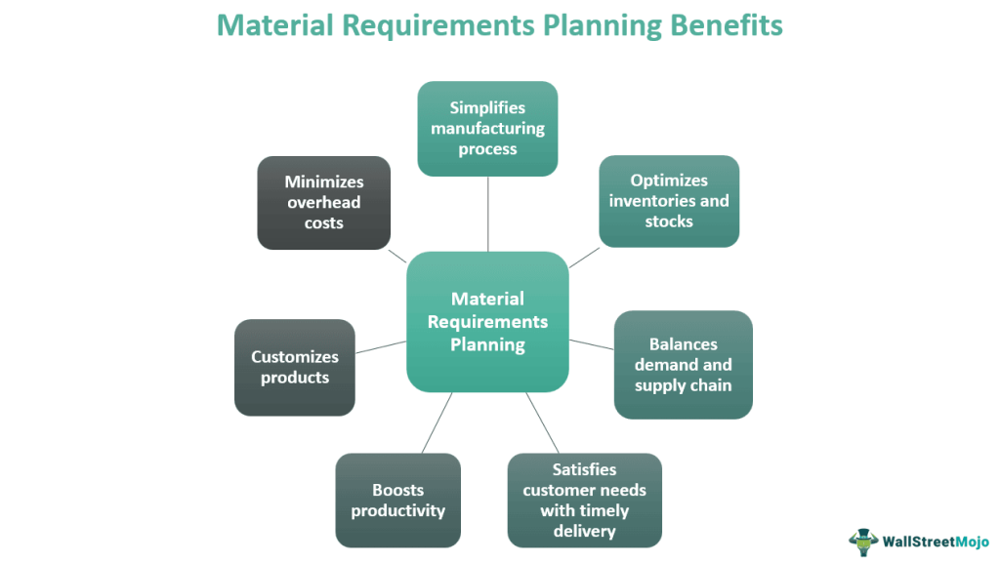

The dynamic landscape of trading offers numerous avenues for financial engagement, particularly through the integration of optionable stocks, stock options trading requirements, and algorithmic trading techniques. Optionable stocks are those with listed options, meeting specific exchange criteria which facilitate a range of trading strategies. These stocks enhance a trader's capability to leverage options for hedging, speculation, or income generation, creating diverse portfolio opportunities. However, navigating the prerequisites for a stock to be optionable involves understanding exchange mandates such as trading volumes, liquidity measures, and share price standards that underpin the eligibility for options trading.

Algorithmic trading further amplifies these opportunities, embedding technology into the trading process to execute orders with speed and precision beyond human capability. This computational power allows for the automatic execution of complex trading strategies, thus optimizing market interactions. The confluence of these elements presents unique challenges and opportunities within today's trading environment. For traders aiming to refine their strategies, grasping the interconnections between optionable stocks and algorithmic methods is crucial. This article seeks to elucidate these aspects, arming investors and traders with knowledge to harness the full breadth of potential in the modern financial market landscape.



## Table of Contents

## Understanding Optionable Stocks

An optionable stock is one for which stock options are listed and available for trading on exchanges. These options offer the right, but not the obligation, to buy or sell the stock at a set price before a certain date. For a stock to be deemed optionable, it must fulfill specific criteria largely driven by the exchange's requirements aimed at ensuring liquidity and a robust trading environment.

Liquidity and trading volume are fundamental for a stock to qualify as optionable. Exchanges typically require the stock to have sufficient trading volume to ensure that there is an active market for its options. Higher volumes indicate that the stock is actively traded, allowing for better price discovery and narrower bid-ask spreads. This makes it easier to execute trades at desired prices and minimizes the risk of slippage.

In addition to liquidity, exchanges impose other criteria such as maintaining a minimum share price. This requirement is set to ensure that stocks remain within a reasonable value range, preventing the listing of highly volatile or penny stocks, which may be subject to manipulation. The number of shareholders is another [factor](/wiki/factor-investing) considered; a broad shareholder base typically indicates stability and increases the likelihood of sustained trading interest.

Currently, nearly 6,000 companies and various Exchange-Traded Funds (ETFs) globally offer optionable stocks. This breadth of offerings highlights the importance of understanding the mechanics behind option listings. Assessing these listings allows traders to evaluate the potential liquidity and interest in the stock, thereby making informed decisions about their trading strategies. By satisfying these stipulated criteria, companies provide investors and traders the opportunity to utilize derivative products like options, thus enhancing their ability to manage risk and leverage positions effectively.

## Requirements for a Stock to Be Optionable

Stocks must meet certain criteria to qualify as optionable, allowing options to be listed and traded on exchanges such as the Cboe. These criteria ensure sufficient market activity and investor interest, which are pivotal for maintaining [liquidity](/wiki/liquidity-risk-premium) and efficient pricing in options markets.

Firstly, a stock must be listed on a recognized exchange, like the New York Stock Exchange (NYSE) or Nasdaq. These exchanges provide the necessary regulatory oversight and market infrastructure crucial for options trading. Listing on a recognized exchange ensures that the stock adheres to stringent financial and reporting standards, increasing investor confidence and participation.

Secondly, the stock must maintain a minimum share price, typically determined by the exchange. This requirement helps in mitigating the risk of excessive [volatility](/wiki/volatility-trading-strategies) and speculative trading behavior, which are more prevalent in penny stocks. A share price threshold ensures that the stock has a stable market valuation, reducing the likelihood of anomalous price movements that could disrupt options trading.

In addition to the share price, a company must have a specified number of unique shareholders. This criterion ensures a diversified investor base, minimizing the concentration risk where a few individuals or entities could manipulate the stock price. The broader the shareholder base, the more stable and reliable the trading environment, thus enhancing the attractiveness of the stock for options traders.

Finally, trading [volume](/wiki/volume-trading-strategy) thresholds must also be met. High trading volumes indicate active investor interest and provide the liquidity necessary for effective options pricing. Without sufficient liquidity, the bid-ask spreads can widen, leading to inefficient pricing and increased transaction costs for options traders.

Stocks failing to meet these requirements cannot have options traded on them. This limitation restricts the strategic opportunities available to traders, as options are a critical tool for managing risk, speculating on price movements, and optimizing investment portfolios. Understanding these requirements is essential for traders aiming to leverage options in their trading strategies effectively.

## The Role of Stock Options in Trading

Stock options are financial instruments that grant traders the right, but not the obligation, to buy or sell a specific stock at a predetermined price, known as the strike price, within a designated time frame. This characteristic offers unique opportunities for diversification and risk management, making options an essential component of many trading strategies.

One primary advantage of stock options is their ability to hedge against market movements. Traders can use options to protect their portfolios from adverse price changes. For instance, purchasing a put option allows an investor to sell the underlying stock at a specified price, thus providing a safeguard against potential declines in the stock's market value. Conversely, call options offer the potential to profit from upward price movements without the need for full ownership of the underlying stock.

Options also enable traders to speculate on price changes with leverage. This leverage stems from the relatively lower cost of options compared to purchasing the underlying stock outright. As a result, traders can participate in price movements with a smaller capital outlay, potentially enhancing returns. However, it is crucial to note that while leverage can magnify gains, it can also increase potential losses.

Moreover, options strategies can be tailored to different market conditions, enhancing their versatility. Strategies such as covered calls, protective puts, and straddles allow traders to capitalize on varying market scenarios, from bullish and bearish to neutral or volatile conditions. For example, a covered call involves holding the underlying stock while selling a call option, which can generate income in a stable market.

Understanding these roles and their respective strategies is vital for implementing successful trading approaches. Traders must evaluate factors such as volatility, time decay, and the Greeks—including delta, gamma, theta, and vega—which measure options' response to market variables. Mastery of these elements can lead to more informed decision-making and optimized portfolio management.

To illustrate, consider the Python code snippet below that calculates the potential payoff for a call option:

```python
def call_option_payoff(stock_price, strike_price, premium):
    return max(stock_price - strike_price, 0) - premium

# Example usage
stock_price = 105
strike_price = 100
premium = 3

payoff = call_option_payoff(stock_price, strike_price, premium)
print(f"The payoff for the call option is: ${payoff}")
```

This code calculates the payoff of a call option by evaluating the difference between the stock's market price and the strike price, minus the option premium. Such analyses are crucial for comprehensively understanding the financial impact of options trades.

In summary, stock options play a significant role in trading by offering flexible strategies for risk management and opportunity enhancement. Their strategic use can support portfolio diversification, leverage, and return optimization if executed with thorough analysis and understanding.

## Algorithmic Trading: Enhancing Options Trading

Algorithmic trading employs sophisticated computer programs to automate the execution of trading strategies, offering a level of speed and precision that cannot be achieved by human traders alone. In the context of options trading, these algorithms can manage and execute complex strategies with remarkable efficiency, allowing traders to capitalize on both predictive modeling and real-time data analysis.

One of the primary advantages of using algorithms in options trading is their ability to handle multiple variables and scenarios simultaneously. This capacity is especially critical given the complexities inherent in options, where factors such as time decay, volatility, and price movement each play a significant role in determining the intrinsic and extrinsic value of an option contract. Algorithms enable traders to model these factors through quantitative analysis, employing mathematical models to predict market behavior and adjust trading strategies on-the-fly.

For example, algorithms can implement a delta-hedging strategy, which involves keeping the portfolio's delta—a measure of the rate of change in the option's price relative to the underlying asset—close to zero. By doing so, the portfolio can remain relatively risk-neutral despite fluctuations in the underlying asset's price. This process, which would be labor-intensive and error-prone for humans, is handled with precision and speed through mathematical functions and live market data feeds:

```python
def calculate_delta(stock_price, strike_price, volatility, time_to_expiration, risk_free_rate):
    from scipy.stats import norm
    import numpy as np
    d1 = (np.log(stock_price / strike_price) + (risk_free_rate + 0.5 * volatility ** 2) * time_to_expiration) / (volatility * np.sqrt(time_to_expiration))
    return norm.cdf(d1)

# Example calculation
stock_price = 100
strike_price = 105
volatility = 0.2
time_to_expiration = 0.5
risk_free_rate = 0.05

delta = calculate_delta(stock_price, strike_price, volatility, time_to_expiration, risk_free_rate)
```

Moreover, algorithms can execute strategies like straddles, strangles, and spreads, which require precise timing and quick reaction to market changes. These strategies often involve simultaneous buying and selling of options across different strike prices and expirations, which computers handle seamlessly. The ability to backtest strategies against historical data is another critical benefit, enabling traders to refine their approaches and optimize parameters before committing real capital.

Risk management is inherently enhanced through [algorithmic trading](/wiki/algorithmic-trading). Algorithms can set stop-loss orders, automatically liquidating positions that breach predefined loss thresholds, thus preventing emotional decision-making that often leads to suboptimal outcomes. Additionally, algorithms can dynamically adjust exposure levels based on evolving market conditions, preserving capital and maximizing returns.

The integration of algorithmic trading into options trading not only enhances efficiency but also permits the execution of high-frequency and volume trades that are beyond human capability. This synergy between algorithmic trading and options trading allows for advanced strategy implementation, greater capital efficiency, and superior risk control. These features make algorithmic trading an indispensable tool for traders seeking success in today's fast-paced financial markets.

## Popular Algorithmic Options Trading Strategies

Algorithmic options trading strategies harness the computational power of modern technology to execute trades with precision and efficiency. These strategies are integral to contemporary trading practices, providing enhanced capabilities for managing risk, capitalizing on market movements, and optimizing execution. Some of the most prevalent algorithmic options trading strategies include [trend following](/wiki/trend-following), [arbitrage](/wiki/arbitrage), mean reversion, and options straddles.

### Trend Following
Trend following is a widely used strategy that attempts to capitalize on the [momentum](/wiki/momentum) of market trends. Algorithms analyze historical data to identify prevailing trends and execute trades based on these patterns. The strategy relies on technical indicators such as moving averages, relative strength indices (RSI), and MACD to determine entry and [exit](/wiki/exit-strategy) points. The main advantage of trend following is its ability to profit from long-term market movements, although it can be susceptible to short-term volatility.

```python
import numpy as np
import pandas as pd

# Example of calculating a simple moving average (SMA) for trend following
def calculate_sma(data, window):
    return data.rolling(window=window).mean()

# Assuming 'price_data' is a pandas Series of historical prices
sma_short = calculate_sma(price_data, window=20)  # Short-term trend
sma_long = calculate_sma(price_data, window=50)   # Long-term trend

# Simple trend following signal
trend_signal = np.where(sma_short > sma_long, 1, -1)  # Buy when short SMA is above long SMA, sell otherwise
```

### Arbitrage
Arbitrage strategies exploit price discrepancies between related markets or instruments to generate profit. In the context of options trading, this could involve discrepancies in the pricing of options and their underlying assets or between options with different strike prices or expiration dates. Algorithms scan markets continuously to identify these inconsistencies and execute trades quickly to lock in profits before the discrepancies disappear.

### Mean Reversion
Mean reversion strategies are based on the assumption that asset prices will revert to their historical mean over time. Algorithms designed for mean reversion identify overbought or oversold conditions in the market, betting that prices will eventually return to their average value. This approach often uses statistical models and indicators like Bollinger Bands to detect when prices deviate from their norm, signaling a potential reversion.

### Options Straddles and Mathematical Models
Options straddles involve the simultaneous purchase of both call and put options with the same strike price and expiration date. This strategy benefits from significant price movements in either direction, making it suitable for volatile markets. Algorithmic trading enhances straddle strategies by precisely timing execution and adjusting positions based on real-time data and volatility modeling. Mathematical models, such as the Black-Scholes model, are employed to calculate options pricing and manage risk effectively.

```python
from scipy.stats import norm
import math

# Example of Black-Scholes option pricing model
def black_scholes(S, K, T, r, sigma, option_type='call'):
    d1 = (math.log(S / K) + (r + 0.5 * sigma ** 2) * T) / (sigma * math.sqrt(T))
    d2 = d1 - sigma * math.sqrt(T)

    if option_type == 'call':
        return (S * norm.cdf(d1) - K * math.exp(-r * T) * norm.cdf(d2))
    elif option_type == 'put':
        return (K * math.exp(-r * T) * norm.cdf(-d2) - S * norm.cdf(-d1))
    else:
        raise ValueError("Invalid option type. Use 'call' or 'put'.")

# Example usage for a call option
option_price = black_scholes(S=100, K=105, T=1, r=0.05, sigma=0.2)
```

These algorithmic strategies not only automate complex trading processes but also enable traders to optimize their strategies by leveraging computerized models and data analysis. The ability to process vast amounts of data and execute trades swiftly is a hallmark of algorithmic trading, setting it apart from traditional methods. As technology evolves, the effectiveness and precision of these strategies continue to improve, making them indispensable in the world of options trading.

## Benefits and Challenges of Algorithmic Trading

Algorithmic trading, often referred to as algo trading, leverages the computational power of machines to facilitate effective execution of trades. One of the primary benefits of algorithmic trading is the reduction of human error and emotional biases. By automating trading decisions based on predefined criteria, algorithms can implement strategies with precision and consistency, eliminating the impulsive decisions that often accompany human traders. This automation allows for rapid order execution and continuous market analysis, enabling traders to respond swiftly to market changes and capitalize on arbitrage opportunities.

The speed of execution in algorithmic trading is significantly enhanced compared to manual trading. By using algorithms, trades can be placed automatically without human intervention, thus executing orders at optimal prices before market conditions change. This speed and efficiency lead to reduced transaction costs and improved performance, particularly in high-frequency trading environments.

Despite these advantages, algorithmic trading is not without its challenges. Technical glitches, for instance, pose potential risks. These can result from software bugs, unforeseen system failures, or network issues, leading to unintended trading losses or market disruptions. High initial costs are another challenge, as developing and maintaining sophisticated trading algorithms requires substantial investment in technology and expertise.

Regulatory compliance is an additional concern for algorithmic traders. Financial markets are highly regulated, and non-compliance can result in significant fines and reputational damage. Staying updated with evolving regulations and ensuring that trading systems adhere to legal standards is essential but can be resource-intensive.

Balancing these benefits and challenges is crucial for traders and institutions leveraging algorithmic trading systems. By understanding and carefully managing the risks associated with technical issues, costs, and compliance, traders can maximize the advantages of algorithmic trading. This strategic approach allows for the optimization of trade executions and the implementation of complex strategies in a competitive trading environment.

## Conclusion

The fusion of optionable stocks, options trading requirements, and algorithmic trading creates notable opportunities for traders in today's financial landscape. Optionable stocks provide a platform where traders can leverage the versatility of options to diversify portfolios and manage risks effectively. By ensuring stocks meet the necessary requirements to be optionable, such as listing on recognized exchanges and adhering to volume and shareholder criteria, traders gain access to a broader spectrum of strategic possibilities.

Algorithmic trading, with its capability to execute complex strategies at high speeds, enhances the efficiency and precision of options trading. Algorithms can manage large datasets, adapt to market changes in real-time, and implement strategies like trend following or mean reversion with minimal human intervention. This automation not only reduces the impact of human errors but also offers robust mechanisms for risk management and strategic optimization.

For traders, embracing these advanced trading mechanisms necessitates a thorough understanding of optionable stock requirements and the potential of algorithmic systems. As financial markets continue to evolve rapidly, those who integrate these components into their trading strategies can better position themselves for success. By meeting the challenges and leveraging the advantages of options and algorithmic trading, traders can navigate the complexities of competitive markets and enhance their trading outcomes.

## References & Further Reading

[1]: Hull, J. C. (2014). ["Options, Futures, and Other Derivatives,"](https://books.google.com/books/about/Options_Futures_and_Other_Derivatives_eB.html?id=2iopDwAAQBAJ) 9th Edition, Pearson.

[2]: Chan, E. (2009). ["Quantitative Trading: How to Build Your Own Algorithmic Trading Business,"](https://github.com/ftvision/quant_trading_echan_book) John Wiley & Sons.

[3]: Kissell, R. (2013). ["The Science of Algorithmic Trading and Portfolio Management,"](https://www.sciencedirect.com/book/9780124016897/the-science-of-algorithmic-trading-and-portfolio-management) Academic Press.

[4]: Jansen, S. (2020). ["Machine Learning for Algorithmic Trading: Second Edition,"](https://github.com/stefan-jansen/machine-learning-for-trading) Packt Publishing.

[5]: Hull, J. C. (2018). ["Risk Management and Financial Institutions,"](https://books.google.com/books/about/Risk_Management_and_Financial_Institutio.html?id=1J1QDwAAQBAJ) 5th Edition, Wiley Finance.