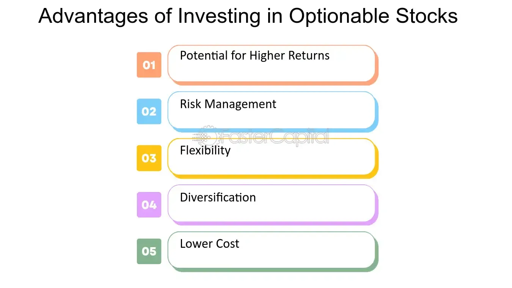

## Table of Contents

## What is an optionable stock?

An optionable stock is a stock that you can buy or sell options for. Options are contracts that give you the right, but not the obligation, to buy or sell a stock at a certain price before a certain date. Not all stocks have options available for them, so when a stock is optionable, it means that there are options contracts available for that particular stock.

Usually, bigger and more well-known companies have optionable stocks. This is because there is more interest in trading options for these companies. If a stock is optionable, it can provide more ways for investors to make money or protect their investments. For example, someone might buy an option to bet on the stock's price going up or down, or they might use options to reduce the risk of owning the stock directly.

## How does an optionable stock differ from a non-optionable stock?

An optionable stock is one where you can buy or sell options. Options are like special contracts that let you buy or sell the stock at a set price before a certain date. If a stock is optionable, it means there are these options available for it. Usually, bigger and more popular companies have optionable stocks because more people want to trade options on them.

A non-optionable stock, on the other hand, is a stock where you can't buy or sell options. These stocks don't have options available, so your choices are more limited. You can only buy or sell the stock itself, without the extra strategies that options provide. Non-optionable stocks are often from smaller or less well-known companies, where there isn't enough interest to create options for them.

## What are the basic requirements for a stock to be optionable?

For a stock to be optionable, it needs to meet certain basic requirements set by options exchanges like the Chicago Board Options Exchange (CBOE). One key requirement is that the company must have a certain number of shares outstanding, usually at least 7 million. This ensures there's enough interest and trading volume to support an options market. Also, the stock needs to have a minimum price, often around $3 per share, to make sure it's stable enough for options trading.

Another important factor is the stock's trading volume. The stock should have a good amount of shares traded each day, typically at least 2.5 million shares over the past month. This helps make sure there's enough activity to keep the options market liquid. Lastly, the company should be in good standing with financial regulators and not be in bankruptcy or facing major financial issues. These requirements help make sure that only stocks with enough interest and stability can have options available for them.

## How are options on optionable stocks created and traded?

Options on optionable stocks are created by options exchanges like the Chicago Board Options Exchange (CBOE). When a stock meets the requirements, the exchange decides to list options on it. They create different types of options, like calls and puts, with various expiration dates and strike prices. These options are then made available for trading. Market makers, who are special traders, help keep the options market running smoothly by always being ready to buy or sell options at certain prices.

Once the options are listed, they can be traded by investors through their brokers. Trading happens on the options exchange, where buyers and sellers come together. Investors can buy options to bet on the stock's price going up or down, or they can sell options to earn money from the premiums. The price of an option changes based on things like the stock's price, how much time is left until the option expires, and how much the stock's price moves around. This makes options trading a way for investors to make money or protect their investments in different ways.

## What are the common types of options available for optionable stocks?

The two main types of options available for optionable stocks are call options and put options. A call option gives you the right to buy a stock at a certain price before a certain date. If you think the stock's price will go up, you might buy a call option to make money from that increase. On the other hand, a put option gives you the right to sell a stock at a certain price before a certain date. If you think the stock's price will go down, you might buy a put option to make money from that decrease.

Besides call and put options, there are also different styles of options, like American and European options. An American option can be used any time before it expires, while a European option can only be used on the expiration date. These styles add more choices for investors, depending on when they want to use their options. All these types of options give investors different ways to bet on or protect against changes in a stock's price.

## What are the benefits of trading options on optionable stocks?

Trading options on optionable stocks can give investors a lot of benefits. One big benefit is that options can help you make money in different ways. For example, if you think a stock's price will go up, you can buy a call option and make money if you're right. If you think the price will go down, you can buy a put option and make money from that too. Options can also be used to earn money from the premiums when you sell them, even if the stock's price doesn't move much.

Another benefit of trading options is that they can help you protect your investments. If you own a stock and you're worried its price might drop, you can buy a put option to limit your losses. This is called hedging, and it's like buying insurance for your stock. Options also let you control a lot of stock with less money than if you bought the stock outright. This can make it easier to try out different investment ideas without spending too much.

## What are the risks associated with trading options on optionable stocks?

Trading options on optionable stocks can be risky. One big risk is that you can lose all the money you put into an option if it doesn't go the way you thought it would. Options have an expiration date, and if the stock's price doesn't move in the right direction before that date, the option can become worthless. This means you could lose everything you paid for the option. Also, options can be hard to understand, and if you don't know what you're doing, you might make bad choices and lose money.

Another risk is that options can be very volatile. The price of an option can change a lot in a short time, which can be exciting but also scary. If the market moves against you quickly, you might not have time to react and could lose a lot of money. Also, trading options often involves using borrowed money or leverage, which can make your gains bigger but also your losses. If things go wrong, you could end up owing more money than you started with.

## How does the liquidity of an optionable stock affect option trading?

The liquidity of an optionable stock is really important for option trading. Liquidity means how easy it is to buy or sell something without the price changing a lot. If a stock is very liquid, it means there are a lot of people buying and selling it, so it's easier to trade options on that stock. When a stock is liquid, the options market is usually more active too, which means there are more options available at different prices and expiration dates. This makes it easier for investors to find the options they want and to get in and out of trades without big price changes.

On the other hand, if a stock is not very liquid, it can make option trading harder. When a stock doesn't have a lot of buyers and sellers, the options market might not be very active. This can mean fewer options are available, and the prices might change a lot when you try to buy or sell them. This can make it riskier to trade options on these stocks because you might not be able to get the price you want, and it might be harder to close your position when you need to. So, the liquidity of a stock can really affect how easy and safe it is to trade its options.

## What role do market makers play in the options market for optionable stocks?

Market makers are really important in the options market for optionable stocks. They are special traders who help keep the market running smoothly. Their job is to always be ready to buy or sell options at certain prices. This means that when you want to trade an option, there's always someone there to take the other side of your trade. This makes it easier for you to buy or sell options because you don't have to wait for another investor to want to do the opposite trade.

Because market makers are always ready to trade, they help make sure the options market stays liquid. This means you can usually get a fair price for your options, and you can get in and out of trades more easily. Market makers make money from the difference between the price they buy options for and the price they sell them for. This difference is called the bid-ask spread. By doing this, they help keep the options market working well for everyone.

## How do regulatory requirements impact the optionability of stocks?

Regulatory requirements play a big role in deciding if a stock can have options available for it. Options exchanges like the Chicago Board Options Exchange (CBOE) have rules that a company must follow before its stock can be optionable. For example, the company needs to have a certain number of shares out there, usually at least 7 million. The stock also needs to have a minimum price, often around $3 per share, and a good amount of trading volume, like at least 2.5 million shares traded each day over the past month. These rules help make sure that only stable and popular stocks can have options, which keeps the options market safe and fair.

If a company doesn't meet these regulatory requirements, its stock won't be able to have options. This means investors won't be able to buy or sell options on that stock, which limits their trading choices. The rules are there to protect investors and keep the market running smoothly. By setting these standards, regulators help make sure that the options market stays liquid and that there's enough interest in a stock to support an options market. This way, investors can trade options with confidence, knowing that the stocks they're dealing with meet certain levels of stability and popularity.

## What advanced strategies can be employed with options on optionable stocks?

Advanced strategies with options on optionable stocks can help investors make money or protect their investments in more complex ways. One popular strategy is called a "straddle." With a straddle, you buy both a call option and a put option on the same stock at the same strike price and expiration date. This can be useful if you think the stock's price will move a lot but you're not sure which way. If the stock's price goes up a lot, you can make money from the call option. If it goes down a lot, you can make money from the put option. This strategy can be good when there's a big event coming up that might cause the stock's price to swing wildly.

Another strategy is called a "covered call." This is when you own the stock and then sell a call option on it. By doing this, you get to keep the money from selling the call option, which is called the premium. If the stock's price stays the same or goes down, you keep the premium and the stock. But if the stock's price goes up a lot, the person who bought the call option might want to buy your stock at the strike price, which could limit how much you make from the stock going up. This strategy can be a good way to earn extra money from a stock you already own, but it also means you might miss out on big gains if the stock's price jumps a lot.

## How can investors use options on optionable stocks to hedge their portfolios?

Investors can use options on optionable stocks to protect their portfolios by using a strategy called hedging. Hedging is like buying insurance for your investments. For example, if you own a stock and you're worried its price might drop, you can buy a put option on that stock. A put option gives you the right to sell the stock at a certain price, even if the market price goes lower. This way, if the stock's price does fall, you can still sell it at the higher price you set with the put option, which helps limit your losses.

Another way to hedge is by using options to protect against big swings in the market. If you're worried that the whole market might go down, you can buy put options on an index like the S&P 500. This can help protect your whole portfolio, not just one stock. By using options to hedge, you can feel more secure knowing that you have a plan in place to limit your losses if things don't go as planned. This can help you sleep better at night, knowing your investments are a bit safer.

## References & Further Reading

[1]: Hull, J. C. (2014). ["Options, Futures, and Other Derivatives,"](https://books.google.com/books/about/Options_Futures_and_Other_Derivatives_eB.html?id=2iopDwAAQBAJ) 9th Edition, Pearson.

[2]: Chan, E. (2009). ["Quantitative Trading: How to Build Your Own Algorithmic Trading Business,"](https://github.com/ftvision/quant_trading_echan_book) John Wiley & Sons.

[3]: Kissell, R. (2013). ["The Science of Algorithmic Trading and Portfolio Management,"](https://www.sciencedirect.com/book/9780124016897/the-science-of-algorithmic-trading-and-portfolio-management) Academic Press.

[4]: Jansen, S. (2020). ["Machine Learning for Algorithmic Trading: Second Edition,"](https://github.com/stefan-jansen/machine-learning-for-trading) Packt Publishing.

[5]: Hull, J. C. (2018). ["Risk Management and Financial Institutions,"](https://books.google.com/books/about/Risk_Management_and_Financial_Institutio.html?id=1J1QDwAAQBAJ) 5th Edition, Wiley Finance.