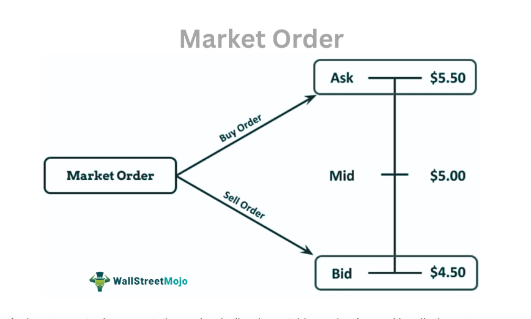

Investment strategies in the financial markets encompass a wide range of approaches designed to maximize returns while minimizing risk exposure. Central to these strategies are three pivotal components: options trading, stop orders, and algorithmic trading, each contributing uniquely to the investor's toolkit.

Options trading provides investors with a versatile instrument to either hedge their existing portfolios or speculate on future market movements. It involves two primary types of contracts: calls and puts, each with distinct roles and potential outcomes for investors. By using options, traders can craft strategies that either capitalize on market volatility or shield against adverse price changes, thereby managing risks and enhancing returns effectively.



Stop orders play a critical role in safeguarding investments across volatile market conditions. These are predefined instructions to buy or sell securities once they reach a specific price threshold. The key advantage of using stop orders lies in their ability to automate the decision-making process of executing trades, thus helping investors to limit potential losses without constant market monitoring.

Algorithmic trading, meanwhile, employs sophisticated computer algorithms to automate and execute trades based on pre-established criteria. This method allows for enhanced speed and efficiency in order execution, especially in complex trading environments like market making and arbitrage. Algorithms can help investors navigate and capitalize on small, rapid price movements that are typical in modern financial markets.

The integration of options trading, stop orders, and algorithmic trading offers robust investment solutions by combining the unparalleled flexibility of options with the precision and automation provided by both stop orders and algorithms. This cohesive approach equips investors with a comprehensive strategy to navigate the complexities of modern markets. The sections that follow will provide a detailed exploration of each component and demonstrate how their strategic integration can optimize investment outcomes.

## Table of Contents

## Understanding Options Trading

Options trading provides investors with a flexible tool to hedge their portfolios or speculate on market movements. It involves contracts that give the buyer the right, but not the obligation, to buy or sell an underlying asset at a predetermined price, known as the strike price, within a specified timeframe. The two primary types of options are calls and puts, each serving distinct purposes for investors.

A call option grants the holder the right to purchase an asset at the strike price before the option expires. Investors typically buy call options when they anticipate that the underlying asset's price will rise. By paying a premium, they secure the right to buy the asset at the lower strike price, potentially profiting from the difference if the market price exceeds the strike price.

Conversely, a put option gives the holder the right to sell an asset at the strike price before expiration. Put options are generally used when investors predict a decline in the asset's price. Holding a put option allows investors to sell the asset at the agreed strike price, regardless of how much the market price drops, essentially capping potential losses on the asset.

Options strategies can be employed to manage risk and enhance returns. One popular strategy is the protective put, which involves holding a stock and buying a put option for the same asset. This strategy functions as insurance; if the stock price decreases significantly, the investor can sell at the strike price, minimizing potential losses.

Another strategy is the covered call, where an investor holds a long position in a stock and sells call options on the same stock to generate additional income through premiums. The downside risk is that if the stock price exceeds the strike price, the investor may be required to sell the stock at the lower strike price, potentially missing out on further gains.

Options trading requires a deep understanding of market conditions, as these instruments can be complex and involve significant risks. Investors utilize a combination of [fundamental analysis](/wiki/fundamental-analysis), technical analysis, and market sentiment to decide on the most suitable option strategies to deploy, reflecting their market expectations and risk tolerance.

Mathematically, options pricing can be modeled using the Black-Scholes formula, a widely used model that considers factors such as the underlying asset's current price, the option's strike price, time to expiration, risk-free [interest rate](/wiki/interest-rate-trading-strategies), and market [volatility](/wiki/volatility-trading-strategies). Here's a basic Python code snippet to calculate a European call option price using the Black-Scholes formula:

```python
from math import exp, log, sqrt
from scipy.stats import norm

def black_scholes_call(S, K, T, r, sigma):
    d1 = (log(S / K) + (r + 0.5 * sigma**2) * T) / (sigma * sqrt(T))
    d2 = d1 - sigma * sqrt(T)
    call_price = S * norm.cdf(d1) - K * exp(-r * T) * norm.cdf(d2)
    return call_price

# Example parameters
S = 100  # Current stock price
K = 95   # Strike price
T = 1    # Time to expiration (in years)
r = 0.05 # Risk-free interest rate
sigma = 0.2 # Volatility of the underlying stock

call_price = black_scholes_call(S, K, T, r, sigma)
print(f"The price of the call option is: {call_price:.2f}")
```

In summary, options trading empowers investors with strategic flexibility, combining speculative opportunities and risk management through diverse strategies like protective puts and covered calls. These strategies align with investors' financial goals, allowing them to navigate the complexities of financial markets effectively.

## The Role of Stop Orders in Investment Strategies

Stop orders are vital tools in modern investment strategies, serving as predefined instructions to buy or sell securities once they reach a specified price. They play a crucial role in managing risk, especially in volatile markets where price movements can be swift and unpredictable. By setting a stop order, investors can protect their investments from significant losses, ensuring a level of automation in their trading approach which can shield them from rapidly changing market conditions.

Two primary types of stop orders are commonly used by investors:

1. **Stop-Loss Orders**: These orders are placed with the intent to sell a security once it falls to a predetermined price. The goal of a stop-loss order is to limit an investor’s potential loss on a security position. For example, if an investor owns a stock currently valued at $50 and wants to ensure that their loss does not exceed $5 per share, they might set a stop-loss order at $45. If the stock price drops to $45, the stop-loss order triggers a market order to sell, thus limiting the investor's loss.

2. **Stop-Buy Orders**: Alternatively, investors can use stop-buy orders to purchase a security when its price rises to a certain point. This type of order is often used in short-selling strategies, where investors anticipate that the price of a security will drop. However, if the security's price begins to rise instead, a stop-buy order can help limit losses by closing out the short position at a specified higher price.

While stop orders are essential for loss mitigation, they also have drawbacks. One significant disadvantage is their execution as market orders once activated. In rapidly fluctuating markets, the final execution price may differ from the stop price, potentially leading to greater losses than anticipated. Another limitation is that stop orders are visible to the market. Sophisticated traders could exploit this information, a concept known as "stop hunting," where the price is pushed to trigger these stop orders.

Due to these disadvantages, investors sometimes explore alternatives or supplements to stop-loss orders. Options strategies provide one such alternative. For instance, purchasing a put option grants the investor the right to sell a security at a predetermined price, known as the strike price, before the option expires. This can similarly mitigate downside risk without subjecting the investor to the potential price slippage prevalent in stop-loss orders.

Moreover, the flexibility of options allows for more strategic implementations like protective puts, where an investor holding a security also buys a put option to safeguard against adverse price movements. By paying a premium for the option, investors gain the protection of a guaranteed sell price, while retaining the potential for profit if the security's price remains stable or rises.

In conclusion, while stop orders serve as straightforward and effective mechanisms for limiting losses in volatile markets, their disadvantages prompt investors to explore more nuanced instruments like options. By understanding the utility and limitations of these tools, investors can enhance their risk management strategies, tailoring their approach to navigate the dynamic landscape of financial markets.

## Algorithmic Trading: An Overview

Algorithmic trading refers to the use of computer algorithms to automate the execution of trading orders by reacting to market data and pre-set instructions. This method has revolutionized financial markets by allowing traders to execute strategies at scales and speeds beyond human capability. Algorithms can be designed to analyze vast datasets to identify patterns, execute trades at optimal times, and minimize transaction costs. 

The primary advantages of [algorithmic trading](/wiki/algorithmic-trading) are its speed and efficiency. Algorithms can process orders in milliseconds, automatically execute trades, and even cancel them if market conditions are not favorable. This ability to quickly respond to changing market conditions helps in maintaining competitive edges and leveraging microscopic price discrepancies.

Complex strategies such as [market making](/wiki/market-making) and [arbitrage](/wiki/arbitrage) benefit greatly from algorithmic trading. Market making involves providing [liquidity](/wiki/liquidity-risk-premium) to markets by continuously quoting buy and sell prices. Algorithmic trading systems can update prices instantly in response to market movements, ensuring that the spread between buy and sell prices is effectively managed to capture profits. Arbitrage exploits price differences across different markets or instruments. Algorithms can rapidly detect and execute arbitrages, capitalizing on time-sensitive opportunities.

Integrating algorithmic strategies with options trading creates sophisticated investment opportunities. Options trading, which involves contracts granting the right, but not the obligation, to buy or sell an asset at a predetermined price, can be optimized through algorithms. For example, algorithms can swiftly calculate implied volatilities, identify mispriced options, and execute trades to exploit these inefficiencies.

Python is frequently used for developing and [backtesting](/wiki/backtesting) algorithmic trading strategies due to its extensive libraries and ease of use. Consider a basic example below that uses Python’s `pandas` and `NumPy` libraries to calculate moving averages for a crossover strategy:

```python
import pandas as pd
import numpy as np

# Assume 'data' is a DataFrame with a DateTime index and a 'Close' column for closing prices
def moving_average_crossover(data, short_window=40, long_window=100):
    data['short_mavg'] = data['Close'].rolling(window=short_window, min_periods=1).mean()
    data['long_mavg'] = data['Close'].rolling(window=long_window, min_periods=1).mean()

    # Generate signals
    data['signal'] = 0
    data['signal'][short_window:] = np.where(data['short_mavg'][short_window:] > data['long_mavg'][short_window:], 1, 0)
    data['positions'] = data['signal'].diff()

    return data

# Example usage
# data = pd.DataFrame with DateTime index and 'Close' column
# moving_average_crossover(data)
```

The integration of algorithmic trading into investment strategies, particularly with options, enhances risk management and return optimization by ensuring rapid, data-driven decision-making processes. This blending allows for efficient allocation of capital and maximization of potential returns in various market conditions.

## Combining Options Trading, Stop Orders, and Algorithmic Trading

Integrating options trading with stop orders and algorithmic trading offers a comprehensive approach to risk management and strategy optimization in modern financial markets. This integration leverages the strengths of each component, allowing investors to navigate complex market conditions with enhanced precision and reduced risk exposure.

**Using Algorithmic Models**

Algorithmic trading employs computer algorithms to execute trades based on predefined criteria. When combined with options trading, algorithms can optimize the execution of various strategies. For instance, options strategies such as straddles or strangles, which involve the simultaneous purchase of call and put options, can be dynamically adjusted using algorithmic models to maximize returns or minimize losses based on real-time market data.

A typical example involves setting algorithmic instructions to adjust stop orders dynamically. This is particularly useful in volatile markets, where traditional static stop orders might trigger unwanted sales due to temporary price fluctuations. By using algorithms, investors can set conditions that modify stop-loss thresholds based on volatility indices or other metrics, reducing the likelihood of premature exits.

Consider a scenario where an investor uses a covered call strategy. An algorithm can be coded to automatically roll the call option if certain market conditions are met, such as if the underlying stock's price nears the option's strike price. This reduces the need for constant manual adjustments and enhances the strategy's efficiency.

**Case Studies**

Several case studies highlight the successful integration of these strategies in professional trading environments. For example, a proprietary trading firm might implement a system where an algorithm not only executes options trades based on market signals but also dynamically adjusts stop orders to reduce downside risk. In such settings, an algorithm could monitor multiple assets to hedge exposure by adjusting positions in correlated options markets.

Another case involves a [hedge fund](/wiki/hedge-fund-trading-strategies) utilizing algorithmic trading to manage a portfolio of options and equities. By employing advanced [machine learning](/wiki/machine-learning) techniques, the fund can anticipate market trends and execute trades that align with its risk tolerance and investment goals. The algorithms adjust stop-loss orders based on predicted price movements, enabling the fund to protect its assets more effectively while capturing upside potential.

In conclusion, the synergy between options trading, stop orders, and algorithmic trading empowers investors to construct sophisticated investment strategies. Through the use of algorithms, investors can enhance the execution of options strategies, adjust to market conditions in real-time, and ensure that risk management techniques such as stop orders are applied with greater accuracy and flexibility. The ongoing evolution of technology continues to expand the possibilities for integrating these strategies, offering new avenues for innovation in portfolio management.

## Risk Management and Diversification

Proper risk management is essential in the execution of sophisticated investment strategies involving options trading, stop orders, and algorithmic trading. These strategies demand a comprehensive understanding of risk exposure and the use of diversification and hedging to buffer against potential losses.

Diversification remains a cornerstone strategy to mitigate risks. By spreading investments across various asset classes, sectors, or geographic regions, traders can reduce the impact of a single underperforming asset on the overall portfolio. For instance, if a portfolio solely comprises technology stocks, a downturn in the tech sector could significantly affect it. However, by including assets like bonds, commodities, or real estate, traders can achieve a more balanced risk exposure.

Hedging tools, such as options and futures, provide additional layers of risk management. Options can be used to guard against adverse price movements. For example, a protective put allows an investor to set a floor for potential losses by giving the right to sell an asset at a predetermined price. Similarly, strategies like covered calls can generate income while potentially reducing downside risk.

Incorporating stop orders presents another avenue of controlling risk. Stop-loss orders automatically sell a security when its price falls to a predefined level, thereby limiting potential losses. While effective, traders must be cautious of their disadvantages, such as triggering in highly volatile markets due to short-term price spikes. Understanding when and how to use these orders is essential for effective risk moderation.

Algorithmic trading supplements these risk management strategies by optimizing execution and minimizing human error. Algorithms can dynamically adjust stop orders based on real-time market conditions and recalibrate options strategies to respond to market changes swiftly. These automated systems can execute complex strategies like [statistical arbitrage](/wiki/statistical-arbitrage) or market making, which might be infeasible for manual execution due to speed and precision requirements.

Traders who appreciate the interplay between these tools and integrate them within a diversified portfolio can effectively manage risk while striving to achieve investment goals. By continuously analyzing the market and revising risk management strategies, investors can position themselves to navigate ever-evolving financial landscapes. Understanding these dynamics allows for a more resilient investment approach amidst market uncertainties.

## Future Trends in Investment Strategies

The continuous evolution of technology is significantly shaping new opportunities in options and algorithmic trading. Two of the most transformative technologies in this space are Artificial Intelligence (AI) and machine learning, which are increasingly being leveraged to craft sophisticated market strategies. AI's ability to process vast amounts of data and identify patterns not immediately apparent to human analysts allows for more predictive and reactive trading strategies. Machine learning algorithms can adapt to new data inputs and help in forecasting stock price movements, optimizing trading strategies based on historical data, and enhancing decision-making processes.

For instance, [deep learning](/wiki/deep-learning) methods, such as neural networks, can be employed to predict price trends by analyzing historical price data, market sentiment, and other relevant factors. This can potentially provide traders with a competitive edge by predicting market direction more accurately. An example implementation in Python might involve using libraries such as TensorFlow or PyTorch for time series forecasting:

```python
import tensorflow as tf
from tensorflow.keras.models import Sequential
from tensorflow.keras.layers import Dense, LSTM

# Sample LSTM model for stock price prediction
model = Sequential()
model.add(LSTM(units=50, return_sequences=True, input_shape=(X_train.shape[1], 1)))
model.add(LSTM(units=50))
model.add(Dense(1))

model.compile(optimizer='adam', loss='mean_squared_error')
model.fit(X_train, y_train, epochs=100, batch_size=32)
```

Regulatory changes also play a crucial role in shaping investment strategies. As financial technologies advance, regulators worldwide are continually updating guidelines and rules to ensure fair practices, prevent market manipulation, and protect investors. Upcoming regulations could focus on the transparency and risk associated with algorithmic trading strategies. For instance, policy measures might require firms to disclose the algorithms they use, ensuring they adhere to market conduct rules and do not disrupt market stability.

Additionally, regulations might evolve to address ethical considerations of AI usage in trading, such as data privacy concerns and the need for unbiased data processing models. Compliance with these regulations is essential for firms to operate effectively in the market.

The future landscape of investment strategies will likely be characterized by the integration of AI and machine learning with robust regulatory frameworks. These dynamic shifts necessitate that investors and financial institutions remain agile, continuously updating their tools and practices to stay competitive. Staying informed of technological advances and regulatory developments will be vital for leveraging new opportunities effectively and maintaining a strategic edge in the markets.

## Conclusion

Investment strategies involving options trading, stop orders, and algorithmic trading provide a sophisticated toolkit for modern investors. These tools offer various mechanisms to enhance returns and manage risks effectively. Options trading allows for flexibility through calls and puts, enabling investors to speculate or hedge. Stop orders provide a safeguard against significant losses by triggering buys or sells once predetermined price points are met. Algorithmic trading brings precision and speed by automating trade executions based on specific criteria, often integrating complex strategies such as market making or arbitrage.

Integrating these elements can achieve tailored investment goals by leveraging the strengths of each strategy. For instance, algorithmic models can optimize the execution of options strategies and adjust stop orders dynamically, offering a multi-layered approach to risk management. The strategic use of these tools can significantly enhance portfolio performance by allowing for more precise control over trading activities and risk exposure.

Staying informed about the evolving market landscape is crucial for leveraging these strategies effectively. As technology advances, particularly with the advent of [artificial intelligence](/wiki/ai-artificial-intelligence) and machine learning, the potential for more sophisticated and responsive trading strategies increases. Adapting to regulatory changes is equally important, as they can impact how these tools are implemented. Investors who continuously update their knowledge and skills are better positioned to capitalize on these dynamic strategies, ensuring long-term success in the financial markets.

## References & Further Reading

[1]: Hull, J. C. (2018). ["Options, Futures, and Other Derivatives"](https://www.semanticscholar.org/paper/Options%2C-Futures%2C-and-Other-Derivatives-Hull/89bdee500c8623864fc9eb7a471546aa713acc44) (9th ed.). Pearson.

[2]: Black, F., & Scholes, M. (1973). ["The Pricing of Options and Corporate Liabilities."](https://www.cs.princeton.edu/courses/archive/fall09/cos323/papers/black_scholes73.pdf) Journal of Political Economy, 81(3), 637-654.

[3]: Chan, E. P. (2009). ["Quantitative Trading: How to Build Your Own Algorithmic Trading Business"](https://github.com/ftvision/quant_trading_echan_book). Wiley.

[4]: Harris, L. (2003). ["Trading and Exchanges: Market Microstructure for Practitioners."](https://www.amazon.com/Trading-Exchanges-Market-Microstructure-Practitioners/dp/0195144708) Oxford University Press.

[5]: Aldridge, I. (2013). ["High-Frequency Trading: A Practical Guide to Algorithmic Strategies and Trading Systems"](https://www.amazon.com/High-Frequency-Trading-Practical-Algorithmic-Strategies/dp/1118343506). Wiley.

[6]: Aronson, D. R. (2006). ["Evidence-Based Technical Analysis: Applying the Scientific Method and Statistical Inference to Trading Signals"](https://www.amazon.com/Evidence-Based-Technical-Analysis-Scientific-Statistical/dp/0470008741). Wiley.

[7]: Jansen, S. (2020). ["Machine Learning for Algorithmic Trading: Second Edition"](https://www.amazon.com/Machine-Learning-Algorithmic-Trading-alternative/dp/1839217715). Packt Publishing.

[8]: De Prado, M. L. (2018). ["Advances in Financial Machine Learning"](https://www.amazon.com/Advances-Financial-Machine-Learning-Marcos/dp/1119482089). Wiley.

[9]: Tsay, R. S. (2005). ["Analysis of Financial Time Series"](https://cpb-us-w2.wpmucdn.com/blog.nus.edu.sg/dist/0/6796/files/2017/03/analysis-of-financial-time-series-copy-2ffgm3v.pdf). Wiley.

[10]: Scholtes, S. (2021). ["The Flash Crash: High-Frequency Trading May Have Contributed to Turmoil"](https://www.jstor.org/stable/26652722). Financial Times.