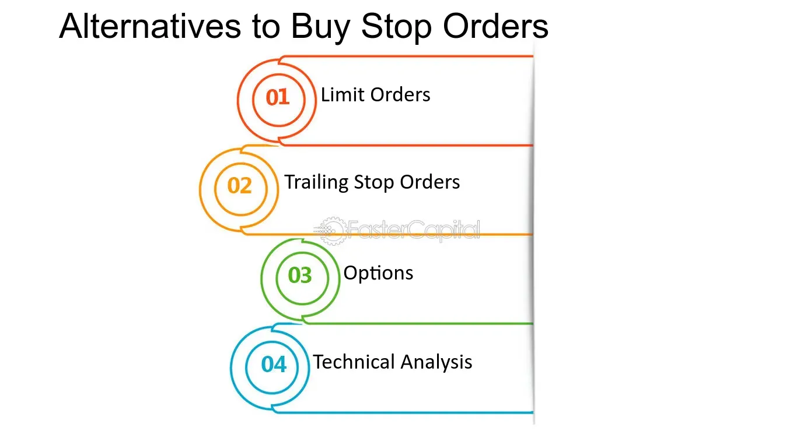

## Table of Contents

## What are stop orders and how do they function in trading?

Stop orders, also known as stop-loss orders, are instructions that traders give to their brokers to buy or sell a security when it reaches a specific price, called the stop price. This type of order is used to limit losses or protect profits by automatically triggering a trade when the market moves in an unfavorable direction. For example, if you own a stock that's currently trading at $50 and you want to limit your loss to 10%, you would set a stop order at $45. If the stock price drops to $45, the stop order would be activated, and the stock would be sold at the next available price.

There are two main types of stop orders: stop-loss orders and stop-limit orders. A stop-loss order becomes a market order once the stop price is reached, meaning the trade will be executed at the best available price, which might be different from the stop price if the market is moving quickly. On the other hand, a stop-limit order turns into a limit order when the stop price is hit, meaning the trade will only be executed at the specified limit price or better. This can provide more control over the price at which the trade is executed, but there's a risk that the order might not be filled if the market doesn't reach the limit price.

## What are the main drawbacks of using stop orders?

One major drawback of using stop orders is that they can be triggered by short-term market fluctuations, leading to unnecessary trades. For example, if a stock briefly dips below your stop price due to a temporary market event, your stop order might sell the stock, even if the price quickly recovers. This can result in selling at a lower price than you might have wanted, and you might miss out on potential gains if the stock rebounds.

Another issue with stop orders is that they can lead to slippage, especially in fast-moving or volatile markets. Slippage happens when the price at which your order is executed is different from your stop price. For instance, if you set a stop order at $45 and the market suddenly drops, your order might be filled at a lower price, like $44.50, causing you to sell at a worse price than you planned. This can increase your losses and make it harder to manage your trades effectively.

## What are options and how can they serve as alternatives to stop orders?

Options are financial contracts that give you the right, but not the obligation, to buy or sell an asset at a specific price before a certain date. They come in two main types: calls, which let you buy an asset, and puts, which let you sell an asset. Options can be used as an alternative to stop orders because they offer more flexibility and control over your trading strategy. For example, instead of setting a stop order to sell a stock if it drops to a certain price, you can buy a put option that allows you to sell the stock at that price, no matter how low the market price goes.

Using options can help you manage risk in a different way than stop orders. With a stop order, you're at the mercy of the market's [volatility](/wiki/volatility-trading-strategies) and might end up selling at a lower price than you wanted if the market moves quickly. But with a put option, you know exactly what price you can sell at, which can give you peace of mind and protect you from big losses. Options do cost money, though, so you need to think about whether the cost of the option is worth the protection it offers. Overall, options can be a useful tool for traders looking for more control and flexibility in managing their investments.

## How do protective puts work as an alternative to stop orders?

Protective puts are a type of option that investors use to protect their stock investments. When you buy a protective put, you're buying the right to sell your stock at a certain price, called the strike price, before the option expires. This is similar to a stop order, but instead of selling your stock automatically if the price drops, you get to decide whether to sell at the strike price or hold onto your stock. For example, if you own a stock trading at $50 and you're worried it might fall, you could buy a put option with a strike price of $45. If the stock drops below $45, you can use the put option to sell it at $45, even if the market price is lower.

The main difference between protective puts and stop orders is control and cost. With a stop order, once the stock hits the stop price, it's sold at the next available price, which could be lower than you wanted if the market is moving fast. A protective put gives you more control because you can choose to sell at the strike price or not, depending on what you think will happen next with the stock. However, protective puts cost money because you have to pay for the option. You need to think about whether the cost of the put option is worth the protection it gives you compared to using a stop order.

## What are the key differences between using stop orders and buying protective puts?

Stop orders and protective puts are two ways to protect your investments, but they work differently. A stop order is like a safety net that automatically sells your stock if it drops to a certain price. This can help limit your losses, but if the market moves quickly, you might end up selling at a lower price than you wanted. Stop orders are simple and don't cost anything extra, but they can be triggered by short-term price drops, which might not be what you want.

On the other hand, buying a protective put gives you more control. A protective put is like an insurance policy for your stock. You pay for the option, which gives you the right to sell your stock at a set price, no matter how low the market price goes. If the stock price falls below the strike price of the put, you can choose to sell at that price or hold onto your stock if you think it will go back up. Protective puts cost money, so you need to decide if the cost is worth the protection, but they can give you more flexibility and peace of mind.

## Can covered calls be used as an alternative to stop orders? If so, how?

Covered calls can be used as an alternative to stop orders, but they work in a different way. When you sell a covered call, you're selling someone else the right to buy your stock at a certain price, called the strike price, before the option expires. If the stock price stays below the strike price, you keep the money you got from selling the call, which can help offset any losses if the stock price falls a bit. But if the stock price goes above the strike price, the buyer can take your stock, and you have to sell it at that price. This can limit your losses if the stock price shoots up, but it also means you might miss out on bigger gains if the stock keeps going up.

Using covered calls as an alternative to stop orders can give you some income and help manage your risk, but it's not as straightforward as a stop order. With a stop order, your stock is sold automatically if it hits a certain price, which can help limit your losses right away. With a covered call, you're locking in a selling price if the stock goes up, but you're still exposed to losses if the stock price falls below what you paid for it. So, covered calls can be a useful tool, but they work differently and might not be the best choice for everyone looking to protect their investments.

## What are the financial implications of using options instead of stop orders?

Using options like protective puts or covered calls instead of stop orders can cost you money. When you buy a protective put, you have to pay for the option, which is like paying for insurance. This cost can eat into your profits or add to your losses if the stock price doesn't move much. On the other hand, if you sell a covered call, you get some money upfront, but you might have to sell your stock at a lower price than the market if the stock price goes up a lot. So, you need to think about whether the cost of the option is worth the protection or potential income it gives you.

Options can give you more control over your investments than stop orders. With a stop order, if the stock hits your stop price, it sells automatically, and you might get a worse price if the market is moving fast. But with options, you can decide when to use them. A protective put lets you sell your stock at a set price if it falls, and you can choose to sell or hold onto it. A covered call can give you some income and limit your losses if the stock goes up, but you might miss out on bigger gains. So, options can be a good alternative to stop orders if you're willing to pay for the extra control and flexibility they offer.

## How does the timing of options expiration affect their use as stop order alternatives?

The timing of when options expire can really change how useful they are compared to stop orders. Options have a set time before they expire, which can be a few weeks or months. If you use a protective put to protect your stock, you need to make sure the option lasts long enough to cover the time you're worried about the stock dropping. If the option expires too soon, it won't help you if the stock price falls after it's gone. On the other hand, if you sell a covered call, you need to think about how long you're willing to hold onto your stock. If the option expires and the stock price is above the strike price, you'll have to sell your stock at that price.

The expiration date of options can also affect how much they cost. The longer an option lasts, the more it usually costs because it gives you more time to use it. So, if you want a protective put that lasts a long time, it might be more expensive, and you need to decide if that extra cost is worth it for the protection it gives you. With covered calls, a longer expiration might mean more money upfront, but it also means you're locked into selling your stock at the strike price for a longer time. So, the timing of options expiration is something you need to think about carefully when using them instead of stop orders.

## What are the risks associated with using options as stop order alternatives?

Using options instead of stop orders can be risky because options cost money. When you buy a protective put, you're paying for the right to sell your stock at a certain price if it falls. This can protect you from big losses, but it also means you're spending money on the option. If the stock price doesn't drop, you might lose the money you paid for the put without getting any benefit. On the other hand, when you sell a covered call, you get some money upfront, but if the stock price goes above the strike price, you have to sell your stock at that price. This can limit your losses if the stock goes up, but you might miss out on bigger gains if the stock keeps going up.

Another risk with options is that they have an expiration date. If you buy a protective put, it might expire before the stock price drops, leaving you without protection when you need it. And if you sell a covered call, you're locked into selling your stock at the strike price until the option expires. If the stock price goes way up before the option expires, you could be stuck selling it at a lower price than you could get on the open market. So, using options instead of stop orders can give you more control and flexibility, but you need to be careful about the costs and timing to make sure they work well for you.

## How can an investor determine which option strategy best suits their risk tolerance and investment goals?

An investor can figure out which option strategy fits their risk tolerance and investment goals by first understanding what they want to achieve with their investments. If they want to protect their stock from big drops, a protective put might be a good choice. This option lets them sell their stock at a set price if it falls, which can limit their losses. But they need to think about how much they're willing to pay for this protection because protective puts cost money. If they're okay with spending a bit to feel safer about their investments, a protective put could work well for them.

On the other hand, if an investor wants to make some extra money from their stock and is okay with selling it at a certain price if it goes up, a covered call might be better. Selling a covered call gives them some money upfront, but they have to sell their stock at the strike price if it goes above that. This can help limit their losses if the stock goes up a lot, but they might miss out on bigger gains if the stock keeps going up. So, they need to think about how much risk they're willing to take and whether they're okay with possibly selling their stock at a lower price than the market. By thinking about these things, an investor can pick the option strategy that best matches their goals and how much risk they're comfortable with.

## What advanced option strategies can be used as more sophisticated alternatives to stop orders?

One advanced option strategy that can be used as a more sophisticated alternative to stop orders is the collar strategy. A collar involves buying a protective put and selling a covered call at the same time. This can help limit your losses if the stock price drops because the put gives you the right to sell at a set price. At the same time, selling the call gives you some money upfront and can help offset the cost of the put. The downside is that if the stock price goes up a lot, you might have to sell it at the call's strike price, which could be lower than the market price. So, a collar can give you more control over your risk, but it's a bit more complicated than a simple stop order.

Another advanced strategy is the married put, which is similar to a protective put but involves buying the put at the same time you buy the stock. This can be a good way to protect your investment right from the start. The put gives you the right to sell the stock at a set price if it falls, which can limit your losses. But like a protective put, you have to pay for the option, so you need to think about whether the cost is worth the protection. A married put can be a good choice if you want to make sure your investment is protected from the beginning, but it's more complex than just setting a stop order.

## How do market conditions influence the effectiveness of options as alternatives to stop orders?

Market conditions can really change how well options work as alternatives to stop orders. If the market is really up and down, options like protective puts can be more useful. They let you sell your stock at a set price if it falls, which can protect you from big losses. But in a calm market, options might not be as helpful because the stock price might not move enough to make the cost of the option worth it. Also, if the market is moving fast, options can be better than stop orders because you can decide when to use them, while a stop order might sell your stock at a lower price than you wanted if the market drops quickly.

Another thing to think about is how long the options last. In a market that's expected to be up and down for a while, you might want options that last longer so you're protected for the whole time. But longer options cost more, so you need to decide if the extra cost is worth it. On the other hand, if the market is only expected to be shaky for a short time, shorter options might be enough. So, understanding the market and how it might move can help you pick the right options to use instead of stop orders.

## References & Further Reading

[1]: Hull, J. C. (2018). ["Options, Futures, and Other Derivatives"](https://www.semanticscholar.org/paper/Options%2C-Futures%2C-and-Other-Derivatives-Hull/89bdee500c8623864fc9eb7a471546aa713acc44) (9th ed.). Pearson.

[2]: Black, F., & Scholes, M. (1973). ["The Pricing of Options and Corporate Liabilities."](https://www.cs.princeton.edu/courses/archive/fall09/cos323/papers/black_scholes73.pdf) Journal of Political Economy, 81(3), 637-654.

[3]: Chan, E. P. (2009). ["Quantitative Trading: How to Build Your Own Algorithmic Trading Business"](https://github.com/ftvision/quant_trading_echan_book). Wiley.

[4]: Harris, L. (2003). ["Trading and Exchanges: Market Microstructure for Practitioners."](https://www.amazon.com/Trading-Exchanges-Market-Microstructure-Practitioners/dp/0195144708) Oxford University Press.

[5]: Aldridge, I. (2013). ["High-Frequency Trading: A Practical Guide to Algorithmic Strategies and Trading Systems"](https://www.amazon.com/High-Frequency-Trading-Practical-Algorithmic-Strategies/dp/1118343506). Wiley.

[6]: Aronson, D. R. (2006). ["Evidence-Based Technical Analysis: Applying the Scientific Method and Statistical Inference to Trading Signals"](https://www.amazon.com/Evidence-Based-Technical-Analysis-Scientific-Statistical/dp/0470008741). Wiley.

[7]: Jansen, S. (2020). ["Machine Learning for Algorithmic Trading: Second Edition"](https://www.amazon.com/Machine-Learning-Algorithmic-Trading-alternative/dp/1839217715). Packt Publishing.

[8]: De Prado, M. L. (2018). ["Advances in Financial Machine Learning"](https://www.amazon.com/Advances-Financial-Machine-Learning-Marcos/dp/1119482089). Wiley.

[9]: Tsay, R. S. (2005). ["Analysis of Financial Time Series"](https://cpb-us-w2.wpmucdn.com/blog.nus.edu.sg/dist/0/6796/files/2017/03/analysis-of-financial-time-series-copy-2ffgm3v.pdf). Wiley.

[10]: Scholtes, S. (2021). ["The Flash Crash: High-Frequency Trading May Have Contributed to Turmoil"](https://www.jstor.org/stable/26652722). Financial Times.