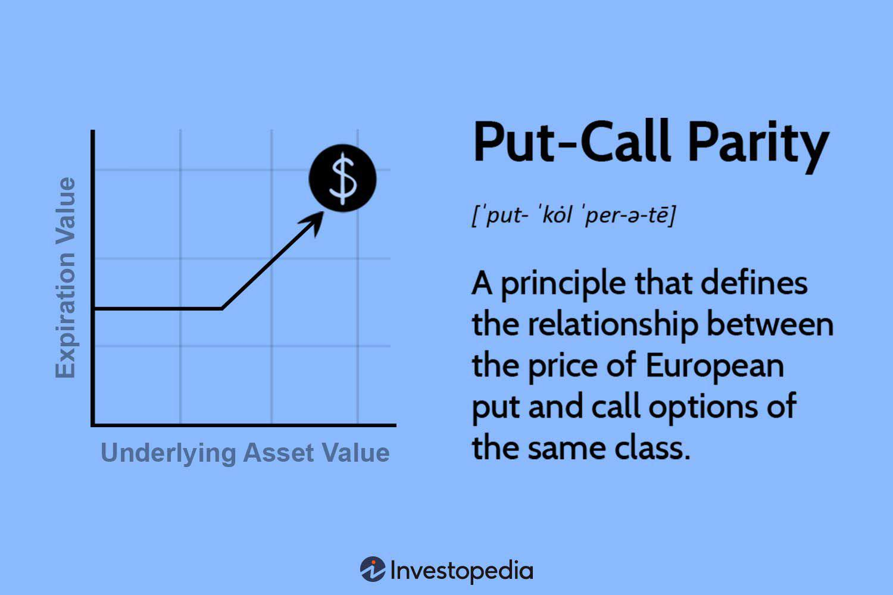

## Table of Contents

## What is options arbitrage?

Options arbitrage is a trading strategy where someone tries to make money by taking advantage of price differences in options. Options are contracts that give the buyer the right, but not the obligation, to buy or sell an asset at a set price before a certain date. In arbitrage, a trader might buy an option in one market and sell it in another market where the price is higher. The goal is to make a profit from the difference in prices without taking on much risk.

This strategy works because markets are not always perfectly efficient. Sometimes, the same option might be priced differently in different places or at different times. Traders use complex models and fast computers to spot these differences quickly. If done correctly, options arbitrage can be a low-risk way to make money, but it requires a lot of knowledge and the right tools. It's not something most people can do easily at home.

## What is put-call parity?

Put-call parity is a principle in options trading that shows how the prices of puts and calls are related. A put option gives you the right to sell an asset at a certain price, while a call option gives you the right to buy it at that price. Put-call parity says that if you buy a call option and sell a put option with the same strike price and expiration date, it should cost the same as buying the asset outright. This relationship helps traders understand if options are priced correctly.

For example, imagine you have a stock that's currently worth $100. If you buy a call option with a strike price of $100 and sell a put option with the same strike price, the total cost should be the same as just buying the stock for $100. If it's not, there might be an opportunity for arbitrage, where traders can make money from the price difference. This principle is important because it helps keep the options market balanced and efficient.

## How does put-call parity relate to options arbitrage?

Put-call parity and options arbitrage are closely connected because put-call parity helps traders spot opportunities for arbitrage. Put-call parity says that the price of a call option and a put option with the same strike price and expiration date should balance out to the price of the stock. If they don't, there's a chance to make money by buying and selling these options in a way that takes advantage of the price difference.

For example, if a call option and a put option don't add up to the stock price like they should, a trader can buy the cheaper option and sell the more expensive one. This can lock in a profit with little risk, which is what arbitrage is all about. By using put-call parity, traders can find these imbalances and use them to make money, helping to keep the options market efficient and balanced.

## What are the basic components of a put-call parity equation?

The put-call parity equation helps us understand how the prices of put and call options are related. It says that if you buy a call option and sell a put option with the same strike price and expiration date, the total cost should be the same as buying the stock outright. The basic components of this equation are the price of the stock, the price of the call option, the price of the put option, and the strike price of the options.

Here's how it works: imagine you have a stock worth $100. If you buy a call option that lets you buy the stock for $100 and sell a put option that requires you to buy the stock for $100 if the option is exercised, the total cost of these two options should be $100. If it's not, you might be able to make money by buying and selling these options in a way that takes advantage of the price difference. This is called arbitrage, and it's why put-call parity is important for traders.

## Can you explain the concept of a synthetic position using put-call parity?

A synthetic position is a way to create the same financial outcome as owning a stock, but using options instead. With put-call parity, you can make a synthetic position by buying a call option and selling a put option with the same strike price and expiration date. This combination acts just like owning the stock itself. For example, if you buy a call option that lets you buy a stock for $100 and sell a put option that might make you buy the stock for $100, you're in the same position as if you owned the stock. If the stock goes up, your call option makes money. If it goes down, your put option loses money, but it's like losing money on the stock you would have owned.

This idea is useful for traders because it lets them get the benefits of owning a stock without actually buying it. They might do this if they want to save money, avoid some risks, or take advantage of different prices in the options market. By understanding put-call parity, traders can create these synthetic positions to match their investment goals. It's all about using options in a smart way to get the same results as owning a stock, but with more flexibility and sometimes less cost.

## What are the assumptions required for put-call parity to hold?

For put-call parity to work, we need to assume a few things. First, we assume that there are no transaction costs like fees for buying or selling options and stocks. This makes the math easier because we don't have to worry about extra money going in or out. Second, we assume that we can borrow and lend money at the same interest rate. This is important because it helps us figure out what the options are worth over time.

Another key assumption is that the stock doesn't pay any dividends during the life of the options. If it did, it would change how much the options are worth. Finally, we assume that the options can be exercised only at the expiration date, not before. This is called European-style options. If the options could be used at any time, like American-style options, the rules would be different. These assumptions help us use put-call parity to understand and predict option prices accurately.

## How can an investor exploit mispricings using put-call parity?

An investor can exploit mispricings using put-call parity by spotting when the prices of call and put options don't match up with the stock price like they should. For example, if a call option and a put option with the same strike price and expiration date don't add up to the stock price, the investor can buy the cheaper option and sell the more expensive one. This is called arbitrage, and it can lock in a profit with little risk. The investor is taking advantage of the price difference to make money, which helps bring the market back into balance.

To do this, the investor needs to be quick and use tools to find these mispricings fast. They might use computer programs to scan the market and spot when the put-call parity equation isn't holding true. Once they find a mispricing, they can buy and sell the options to make a profit. This strategy works because it's based on the idea that the market should be efficient, and when it's not, there's a chance to make money by correcting the prices.

## What are the risks involved in options arbitrage through put-call parity?

Options arbitrage using put-call parity can seem like a way to make money with little risk, but there are still some dangers to watch out for. One big risk is transaction costs. Even though put-call parity assumes there are no fees, in real life, every time you buy or sell an option or stock, you have to pay a fee. These costs can eat into your profits, especially if you're doing a lot of trades to take advantage of small price differences.

Another risk is that the market might change quickly. Even if you spot a mispricing and act fast, the prices of options and stocks can move before you finish your trades. This can mess up your arbitrage plan and lead to losses instead of gains. Also, if you're using borrowed money to make these trades, the interest you pay on that money can add to your costs and risks. So, while options arbitrage through put-call parity can be profitable, it's important to be aware of these risks and manage them carefully.

## How does transaction cost affect the feasibility of options arbitrage?

Transaction costs can make options arbitrage less feasible. When you buy and sell options or stocks, you have to pay fees. These fees can add up, especially if you're making many trades to take advantage of small price differences. If the profit you make from arbitrage is less than the cost of the transactions, you won't make any money. So, high transaction costs can turn a good arbitrage opportunity into a losing one.

Even though put-call parity assumes there are no transaction costs, in the real world, these costs are always there. They can make it hard to find profitable arbitrage opportunities. Traders need to be very careful and make sure the price differences they're exploiting are big enough to cover the costs of their trades. If the costs are too high, it might not be worth trying to do arbitrage at all.

## Can you discuss a real-world example where put-call parity arbitrage was successfully implemented?

One famous real-world example of put-call parity arbitrage happened with the Royal Dutch Shell stock in the early 2000s. Royal Dutch Shell had two classes of stock, Royal Dutch and Shell Transport, that were supposed to trade at a fixed ratio of 60:40. But sometimes, the prices didn't match this ratio perfectly. Smart traders noticed this and used put-call parity to make money from the difference. They bought the cheaper stock and sold the more expensive one, using options to lock in their profits. This kind of trading helped keep the stock prices in line with the right ratio.

The traders made sure to act fast and use computer programs to find these mispricings quickly. They had to be careful about transaction costs, which could eat into their profits if they weren't careful. But because the mispricings were often big enough, they could still make money even after paying the fees. This example shows how understanding put-call parity can help traders spot and take advantage of opportunities in the market, even when things aren't perfectly balanced.

## What are the advanced strategies that can be employed when standard put-call parity arbitrage is not profitable?

When standard put-call parity arbitrage isn't profitable because of small price differences or high transaction costs, traders can use more advanced strategies. One such strategy is called "box spread." A box spread involves buying a bull call spread and a bear put spread with the same strike prices and expiration dates. This creates a position that's almost risk-free and can lock in a profit if the options are mispriced. Traders need to be quick and use computer programs to spot these opportunities and make the trades before the prices change.

Another advanced strategy is "calendar spread arbitrage." This involves buying and selling options with the same strike price but different expiration dates. Traders look for times when the price difference between these options doesn't match what the market should be, according to their models. By taking advantage of these mispricings, they can make a profit. Like box spreads, this strategy requires fast and accurate trading to work well. Both of these strategies help traders make money even when simple put-call parity arbitrage isn't enough.

## How do market inefficiencies and regulatory changes impact the effectiveness of put-call parity arbitrage?

Market inefficiencies can make put-call parity arbitrage more effective because they create price differences that traders can take advantage of. When the market isn't perfectly balanced, the prices of options might not match up with the stock price like they should. This gives traders a chance to buy the cheaper option and sell the more expensive one, making a profit from the difference. But these inefficiencies can also make arbitrage riskier because prices can change quickly, and traders need to act fast to make money before the market corrects itself.

Regulatory changes can also affect how well put-call parity arbitrage works. New rules might change how much it costs to trade options or how quickly traders can make their moves. For example, if new regulations increase transaction fees, it might be harder for traders to make a profit because the costs could be higher than the price differences they're trying to exploit. On the other hand, if regulations make the market more transparent or efficient, it might be harder to find mispricings to take advantage of, making arbitrage less profitable. Traders need to keep an eye on these changes and adjust their strategies to stay ahead.

## What is the Put-Call Parity Theory?

Put-call parity is a financial principle that defines a fundamental relationship between the prices of European call and put options with the same strike price and expiration date. This theory asserts that the price of a call option (C) and a put option (P), in conjunction with the stock price (S) and the present value of the strike price (K), are interconnected. Mathematically, the put-call parity can be expressed as:

$$
C + PV(K) = P + S
$$

where $PV(K)$ represents the present value of the strike price, calculated as $K \times e^{-rT}$, with $r$ being the risk-free interest rate and $T$ the time to expiration.

The core assumption underlying put-call parity is the absence of arbitrage opportunities in a perfectly efficient market. If the relationship between the prices deviates, traders can employ arbitrage strategies to profit from price discrepancies until the parity is restored. Arbitrage assumes the ability to borrow and lend at the risk-free rate without transaction costs and the existence of perfect market [liquidity](/wiki/liquidity-risk-premium).

Put-call parity can be applied in various practical scenarios to identify mispriced options. By observing the prices of options and underlying securities, traders can detect deviations from the parity relationship and exploit these inefficiencies. An apparent violation of put-call parity might indicate that an option is under- or overvalued relative to others. By arbitraging these discrepancies, traders can achieve risk-free profits.

One common method to exploit inefficiencies using the put-call parity involves constructing synthetic positions. For example, if the observed price of a portfolio $C + PV(K)$ is less than $P + S$, traders can theoretically construct an arbitrage strategy by buying the call and the bond, while simultaneously shorting the put and the underlying stock. Conversely, if $C + PV(K) > P + S$, a reverse strategy can be utilized. These approaches capitalize on temporary mispricings until the market corrects itself.

In practice, there have been successful implementations of put-call parity in trading strategies. During market disruptions or times of high volatility, deviations from parity may be more pronounced, providing arbitrage opportunities. For instance, traders have historically identified and leveraged such deviations during specific corporate events or macroeconomic announcements, capitalizing on temporarily distorted markets.

Overall, put-call parity serves as a cornerstone concept for understanding the pricing relationships in options markets. By maintaining an awareness of this fundamental equilibrium, traders enhance their ability to make informed decisions and seize arbitrage opportunities efficiently.

## References & Further Reading

[1]: Hull, J. C. (2009). ["Options, Futures, and Other Derivatives"](https://www.semanticscholar.org/paper/Options%2C-Futures%2C-and-Other-Derivatives-Hull/89bdee500c8623864fc9eb7a471546aa713acc44) (8th ed.). Pearson Education.

[2]: Natenberg, S. (1994). ["Option Volatility and Pricing: Advanced Trading Strategies and Techniques"](https://www.amazon.com/Option-Volatility-Pricing-Strategies-Techniques/dp/0071818774) (2nd ed.). McGraw-Hill.

[3]: Black, F., & Scholes, M. (1973). ["The Pricing of Options and Corporate Liabilities."](https://www.cs.princeton.edu/courses/archive/fall09/cos323/papers/black_scholes73.pdf) Journal of Political Economy, 81(3), 637-654.

[4]: [CBOE (Chicago Board Options Exchange).](https://www.cboe.com/us/options/) Provides extensive resources on options trading and strategies, including educational materials on put-call parity and arbitrage opportunities.

[5]: Pardo, R. (2008). ["The Evaluation and Optimization of Trading Strategies"](https://onlinelibrary.wiley.com/doi/book/10.1002/9781119196969) (2nd ed.). Wiley Trading.

[6]: Merton, R. C. (1973). ["Theory of Rational Option Pricing."](https://www.jstor.org/stable/3003143) The Bell Journal of Economics and Management Science, 4(1), 141-183.

[7]: ["Algorithmic Trading and DMA: An Introduction to Direct Access Trading Strategies"](https://www.semanticscholar.org/paper/Algorithmic-trading-%26-DMA-%3A-an-introduction-to-Johnson/aa5de1ab883d5e23b6651faa7c1807586d688e4b) by Barry Johnson

[8]: Kissell, R. (2013). ["The Science of Algorithmic Trading and Portfolio Management"](https://www.sciencedirect.com/book/9780124016897/the-science-of-algorithmic-trading-and-portfolio-management) Academic Press.
