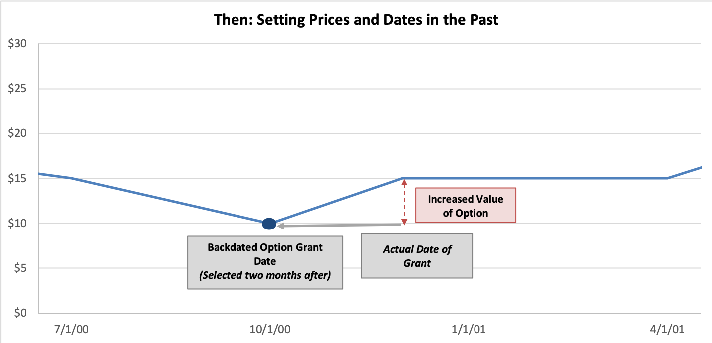

## Table of Contents

## What is options backdating?

Options backdating is when a company gives stock options to employees but pretends they were given earlier, when the stock price was lower. This makes the options more valuable because the employees can buy the stock at a cheaper price than it is now. Companies might do this to attract or keep good employees without showing it on their financial reports right away.

This practice became a big issue because it's not honest and can be illegal. It misleads investors about the company's finances and can lead to fines or even jail time for the people involved. Many companies got into trouble for this in the early 2000s, leading to stricter rules about how stock options are handled and reported.

## Why do companies engage in options backdating?

Companies engage in options backdating mainly because it helps them save money and attract or keep good employees. By backdating options, a company can give employees stock options at a lower price than the current stock value. This makes the options more valuable to employees because they can buy the stock cheaper than it's worth now. It's like giving someone a discount, which can make employees happier and more likely to stay with the company.

However, this practice can also get companies into trouble. Backdating options is not honest and can be illegal because it misleads investors about the company's financial health. If investors think the company is doing better than it really is, they might make bad investment decisions. This can lead to big fines or even jail time for the people involved in the backdating. That's why many companies got caught and punished for this in the early 2000s, leading to new rules to prevent it from happening again.

## How does options backdating affect a company's financial statements?

Options backdating can make a company's financial statements look better than they really are. When a company backdates options, it gives them to employees at a lower price than the current stock value. This means the employees can buy the stock cheaper, which makes the options more valuable. But the company doesn't have to show this extra value as an expense right away. So, the company's profits look higher than they should be, because they're not showing the true cost of the options.

This can fool investors into thinking the company is doing better financially than it really is. If investors believe the company is making more money, they might buy more of the company's stock, pushing the stock price up. But if the truth about the backdated options comes out, it can cause a big problem. The company might have to restate its financial statements, showing lower profits than before. This can make the stock price drop and can lead to fines or legal trouble for the company and its leaders.

## What are the legal implications of options backdating?

Options backdating can get a company and its leaders into big legal trouble. It's not honest to pretend stock options were given at an earlier date when the stock price was lower. This can be seen as fraud because it tricks investors about how well the company is doing. If caught, the company might have to pay big fines. The people involved, like the CEO or other top leaders, might even go to jail. The law says companies have to report financial information truthfully, and backdating options goes against this.

In the early 2000s, a lot of companies got caught doing this. The government and courts made new rules to stop it from happening again. Now, companies have to follow strict rules about how they give out stock options and report them. If they don't, they can face even more fines and legal action. This has made companies more careful about how they handle stock options, but the risk of getting into trouble is still there if they try to backdate options.

## Can you explain the process of options backdating?

Options backdating happens when a company gives stock options to its employees but pretends they were given on an earlier date when the stock price was lower. Normally, stock options let employees buy company stock at the price it was when the options were given. By backdating, the company says the options were given when the stock was cheaper. This makes the options worth more because employees can buy the stock at a lower price than it is now. The company might do this to make employees happy without showing a big cost on their financial reports right away.

The process starts when a company decides to give out stock options. Instead of using the current date and stock price, they choose a date in the past when the stock price was lower. They then record the options as if they were given on that earlier date. This can make the company's financial statements look better because the cost of the options isn't shown as high as it should be. But if anyone finds out, it can lead to big trouble like fines or jail time for the people involved because it's not honest and can trick investors.

## What are some historical examples of options backdating scandals?

One big options backdating scandal happened with the company Brocade Communications. In the early 2000s, they were caught giving out stock options but pretending they were given earlier when the stock price was lower. This made the options worth more, but it was not honest. The CEO, Gregory Reyes, was found guilty and went to jail for 18 months. This case showed how serious the problem of options backdating was and made people pay more attention to it.

Another example is the scandal at UnitedHealth Group. In 2006, it came out that they had been backdating stock options for years. This made their financial reports look better than they should have. The CEO, William McGuire, had to give back a lot of money he made from the options and pay a big fine. The company also had to restate their financials, which made their stock price drop. These cases led to new rules to stop options backdating from happening again.

## How can options backdating be detected by investors or regulators?

Options backdating can be detected by looking at the dates when stock options are given out. If a company often gives options right before the stock price goes up, it might be a sign of backdating. Investors and regulators can check the company's financial reports and see if the dates of the options match up with the stock prices. If the dates seem too perfect, it could mean the company is trying to trick people by backdating.

Regulators also use special computer programs to find patterns that might show backdating. These programs can look at a lot of data quickly and find times when options were given out in a way that looks suspicious. If they find something, they can start an investigation to see if the company did anything wrong. This helps make sure companies are honest about when they give out stock options.

## What are the differences between options backdating and spring-loading?

Options backdating and spring-loading are two ways companies can give stock options to employees, but they do it differently. Options backdating is when a company pretends to give out stock options on an earlier date when the stock price was lower. This makes the options more valuable because employees can buy the stock at a cheaper price than it is now. It's like giving someone a discount, but it's not honest and can be illegal because it tricks investors about the company's financial health.

Spring-loading, on the other hand, is when a company gives out stock options just before they share good news that will make the stock price go up. They know the stock price will rise soon, so the options become more valuable right away. This is not as bad as backdating because it's not pretending to give options on a different date, but it can still be seen as unfair to investors who don't know about the upcoming good news. Both practices can make employees happy with more valuable options, but they can also get the company into trouble if they're not careful.

## What measures can companies implement to prevent options backdating?

Companies can prevent options backdating by making sure they follow strict rules about when and how they give out stock options. They should always use the current date and stock price when giving options to employees. This means no pretending the options were given on an earlier date when the stock was cheaper. Companies can also set up a clear process for giving out options, like having a special committee decide when to do it. This helps make sure everyone follows the rules and keeps things honest.

Another way to stop options backdating is by using good computer systems to keep track of when options are given out. These systems can make it hard to change dates and can help catch any mistakes or cheating. Companies should also train their employees and leaders about why backdating is wrong and what can happen if they do it. By being open and honest about how they handle stock options, companies can avoid getting into trouble and keep their investors' trust.

## How do accounting standards address options backdating?

Accounting standards have rules to stop options backdating and make sure companies report their financials honestly. These rules say that companies must use the date they actually give out stock options, not a made-up earlier date. This means the options' value is based on the stock price on the day they are given, not a lower price from the past. By following these rules, companies can't trick investors by making their financial reports look better than they really are.

To make sure companies follow these rules, accounting standards also say they need to show the cost of stock options as an expense in their financial statements. This helps investors see the true cost of giving out options and understand the company's real financial health. If a company is caught backdating options, they might have to change their financial reports to show the right numbers, which can lead to fines or other punishments.

## What role do corporate governance practices play in preventing options backdating?

Corporate governance practices are really important for stopping options backdating. Good governance means having clear rules and checks to make sure everyone in the company does things the right way. This includes having a special group of people, like a board of directors or a compensation committee, who decide when and how to give out stock options. They make sure the dates and prices are honest and follow the rules. By having these checks in place, it's harder for anyone to pretend options were given on a different date to make them more valuable.

Also, good corporate governance means being open and honest with investors. Companies should tell investors about their stock option plans and how they handle them. This helps investors trust the company and know that the financial reports are true. If everyone knows the rules and follows them, it's less likely that someone will try to backdate options. Strong governance practices help keep the company honest and out of trouble.

## What are the potential impacts of options backdating on shareholder value?

Options backdating can hurt shareholder value a lot. When a company backdates options, it makes their financial reports look better than they really are. This can trick investors into thinking the company is doing well, so they might buy more stock and push the price up. But if the truth comes out, the company has to change their financial reports to show the real numbers. This can make the stock price drop fast because investors feel cheated. Shareholders lose money because the stock they thought was worth more is now worth less.

Also, when a company gets caught backdating options, it can face big fines and legal trouble. This costs the company a lot of money, which could have been used to grow the business or pay dividends to shareholders. The bad news can also make it hard for the company to get loans or do business with other companies. All of this can make shareholders lose trust in the company, and they might sell their stock, making the price go down even more. So, options backdating can really hurt the value of a company's stock and the money shareholders have in it.

## References & Further Reading

[1]: Heron, R. A., & Lie, E. (2007). ["Does Backdating Explain the Stock Price Pattern around Executive Stock Option Grants?"](https://www.biz.uiowa.edu/faculty/elie/GrantsJFE.pdf) Journal of Financial Economics, 83(2), 271-295.

[2]: Narayanan, M. P., Schipani, C. A., & Seyhun, H. N. (2007). ["The Economic Impact of Backdating of Executive Stock Options."](https://www.jstor.org/stable/pdf/40041561.pdf) Michigan Law Review, 105(8), 1597-1654.

[3]: Bernile, G., & Jarrell, G. (2009). ["The Impact of the Options Backdating Scandal on Shareholders."](https://papers.ssrn.com/sol3/papers.cfm?abstract_id=971137) Journal of Accounting and Economics, 47(1-2), 161-181.

[4]: Lopez de Prado, M. (2018). ["Advances in Financial Machine Learning."](https://www.amazon.com/Advances-Financial-Machine-Learning-Marcos/dp/1119482089) Wiley.

[5]: Chan, E. (2008). ["Quantitative Trading: How to Build Your Own Algorithmic Trading Business."](https://github.com/ftvision/quant_trading_echan_book) Wiley Trading.