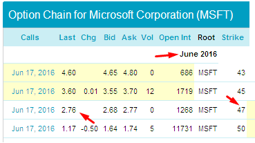

## Table of Contents

## What is a capital protected investment?

A capital protected investment is a type of investment where your original money is safe, even if the market goes down. This means that no matter what happens, you will get back at least the amount of money you put in at the start. It's like having a safety net for your investment.

These investments often mix safer options, like bonds, with riskier ones, like stocks. The safer part makes sure your money is protected, while the riskier part tries to make more money. But, because your money is protected, these investments might not grow as much as others that are riskier. So, you trade the chance of big gains for the safety of your original investment.

## How does capital protection work in investments?

Capital protection in investments means your starting money is kept safe, no matter what happens in the market. It's like having a shield around your money. This is done by using special financial tools, like bonds, that promise to give back your money after a certain time. So, even if the stock market goes down, your original investment is protected because it's tied to these safe assets.

The way it works is by splitting your money into two parts. One part goes into safe investments, like government bonds, which help make sure you get your money back. The other part might go into riskier investments, like stocks, which try to make more money. But because part of your money is in safe assets, the overall investment is protected. This means you might not make as much money as you could with riskier investments, but you won't lose your starting amount either.

## What are the benefits of capital protected investments for beginners?

Capital protected investments are a good choice for beginners because they offer a safety net. When you're new to investing, it can be scary to think about losing your money. With these investments, you know that no matter what happens in the market, you'll get back at least the amount you started with. This can give you peace of mind and make you feel more comfortable as you learn about investing.

Another benefit is that capital protected investments can help you get used to the idea of investing without taking big risks. They often mix safe and riskier investments, so you can see how the market works while still keeping your money safe. This can be a great way to build confidence and learn about different investment options before you move on to riskier investments that might offer bigger rewards.

## What are the common types of capital protected investment products?

One common type of capital protected investment is a structured product. This is a kind of investment where a bank or financial institution puts your money into a mix of safe and risky assets. The safe part, often in bonds, makes sure you get your money back at the end of the investment period. The risky part, usually in stocks or other investments, tries to make extra money. Structured products can be set up in different ways, but they all aim to protect your original investment while giving you a chance to earn more.

Another type is a capital protected fund. This is like a mutual fund or an exchange-traded fund ([ETF](/wiki/etf-trading-strategies)) where the goal is to keep your starting money safe. These funds usually invest in a mix of safe assets, like government bonds, and riskier assets, like stocks. The safe assets help protect your money, while the riskier ones try to grow it. Capital protected funds are managed by professionals who make sure the investment stays balanced to keep your money protected.

A third type is a capital guaranteed note. This is a type of bond where the issuer promises to give you back your original investment at the end of the term, no matter what happens in the market. In return for this guarantee, you usually get a fixed [interest rate](/wiki/interest-rate-trading-strategies), which might be lower than what you could earn from riskier investments. Capital guaranteed notes are popular because they offer a straightforward way to keep your money safe while still [earning](/wiki/earning-announcement) some interest.

## How can capital protected investments be used in a diversified portfolio?

Capital protected investments can be a helpful part of a diversified portfolio because they offer safety and stability. When you have different kinds of investments, you spread out your risk. Capital protected investments can act like a safety net in your portfolio. They make sure that even if other parts of your investments go down, you won't lose all your money. This can be especially useful if you're worried about the stock market going down and want to keep some of your money safe.

Adding capital protected investments to your portfolio can also help you balance risk and reward. You might have some riskier investments that could grow a lot, but they also have a chance to lose value. By including capital protected investments, you can keep some of your money safe while still trying to make more with the riskier parts. This way, you can feel more comfortable taking some risks because you know a part of your money is protected. It's like having a safety cushion that lets you explore other investment options without too much worry.

## What are the costs associated with capital protected investments?

Capital protected investments can have some costs that you need to know about. One of the main costs is the fee for managing the investment. Since these investments often mix safe and risky parts, a professional has to keep everything balanced to make sure your money stays protected. This means you might have to pay a fee for their work, which can be a percentage of your investment or a fixed amount. These fees can make the overall return on your investment a bit lower than you might expect.

Another cost to think about is the opportunity cost. This means you might miss out on higher returns from other investments because you chose a safer option. Capital protected investments often offer lower returns because they focus on keeping your money safe. So, while you're protecting your original investment, you might not make as much money as you could with riskier investments. It's a trade-off between safety and potential growth.

## How do capital protected investments compare to other low-risk investment options?

Capital protected investments are similar to other low-risk options because they focus on keeping your money safe. One common low-risk investment is a savings account. Savings accounts are very safe because they are usually insured by the government, and you can take your money out anytime. But, the interest you earn from a savings account is usually very low. Capital protected investments might give you a bit more return than a savings account because they mix in some riskier assets, but they still keep your original money safe.

Another low-risk option is government bonds. These are loans you give to the government, and they promise to pay you back with interest. Government bonds are very safe because the government is unlikely to go bankrupt. Capital protected investments often use government bonds as the safe part of the investment. But, like with savings accounts, the return from government bonds can be lower than what you might get from a capital protected investment because they don't mix in riskier assets.

Both savings accounts and government bonds are safer than capital protected investments, but they might not grow your money as much. Capital protected investments try to balance safety with the chance to earn more by mixing safe and riskier investments. So, if you want to keep your money safe but also have a chance to make a bit more, capital protected investments could be a good choice.

## What are the key factors to consider when choosing a capital protected investment?

When choosing a capital protected investment, one key [factor](/wiki/factor-investing) to consider is the level of protection it offers. You want to make sure that the investment really keeps your money safe, no matter what happens in the market. This means looking at how much of your money is put into safe assets like bonds, and how much is put into riskier assets like stocks. The more of your money that's in safe assets, the more protected it will be, but it might also mean lower returns.

Another important factor is the fees you have to pay. Capital protected investments often come with management fees because someone needs to keep the investment balanced between safe and risky parts. These fees can eat into your returns, so you want to make sure they are reasonable. Also, think about the opportunity cost. This means you might miss out on higher returns from riskier investments if you choose a capital protected option. So, you need to decide if the safety is worth the trade-off of potentially lower gains.

Lastly, consider how long you're willing to keep your money invested. Capital protected investments often have a set time period, like a few years, before you can get your money back. Make sure this time frame works for you and fits with your financial goals. If you might need your money sooner, a capital protected investment might not be the best choice.

## How do different economic conditions affect the performance of capital protected investments?

Different economic conditions can change how well capital protected investments do. In good economic times, when the stock market is doing well, the riskier part of a capital protected investment, like stocks, can grow and make more money. This means you might get a higher return on your investment. But, because part of your money is in safe assets like bonds, you won't make as much as you could if you put all your money into stocks. So, in good times, capital protected investments can give you some extra money while keeping your original investment safe.

In bad economic times, when the stock market goes down, the riskier part of a capital protected investment can lose value. But, the safe part, like bonds, helps make sure you get your money back. This means that even if the market is doing badly, your original investment is protected. So, in tough times, capital protected investments can be a good way to keep your money safe, even if you don't make any extra money.

## What are the advanced strategies for optimizing returns in capital protected investments?

One advanced strategy for optimizing returns in capital protected investments is to carefully choose the mix of safe and risky assets. By putting more money into the risky part, like stocks, when the market is doing well, you can try to make more money. But, you need to keep an eye on the market and be ready to shift your money back to safe assets, like bonds, if things start to go downhill. This way, you can take advantage of good times to grow your money while still keeping your original investment safe.

Another strategy is to use different types of capital protected products to spread out your risk. For example, you might put some money into a capital protected fund and some into a structured product. Each type can behave differently in different market conditions, so having a mix can help you get the best of both worlds. By diversifying across different capital protected investments, you can aim for higher returns while still keeping your money safe.

## How can investors assess the credibility and reliability of capital protected investment products?

When looking at capital protected investment products, it's important to check the credibility and reliability of the company offering them. Start by researching the financial institution or bank behind the product. Look at their reputation, how long they've been in business, and what other people say about them. You can also check if they are regulated by a government body, like the Securities and Exchange Commission (SEC) in the U.S., which means they have to follow certain rules to protect investors. Reading reviews and ratings from other investors can also give you a good idea of how trustworthy the company is.

Another way to assess the reliability of a capital protected investment is to look at the details of the product itself. Check the fine print to understand how your money is protected and what conditions could affect that protection. For example, some products might only protect your money if you keep it invested for a certain amount of time. Also, look at the fees and costs involved, as high fees can eat into your returns. Finally, consider the historical performance of similar products from the same company, but remember that past performance doesn't guarantee future results. By doing your homework, you can make a more informed decision about whether a capital protected investment is right for you.

## What are the regulatory considerations and protections for capital protected investments?

Capital protected investments are watched over by rules to keep your money safe. In the U.S., the Securities and Exchange Commission (SEC) makes sure that companies follow certain rules when they offer these investments. This means they have to tell you clearly how your money is protected and what fees you might have to pay. Other countries have their own rules too, like the Financial Conduct Authority (FCA) in the UK, which does the same thing to protect investors. These rules help make sure that the companies offering capital protected investments are honest and that your money is safe.

There are also other protections that can help keep your money safe. For example, if a bank offers a capital protected investment, your money might be covered by deposit insurance, like the FDIC in the U.S., which can give you back your money if the bank goes bankrupt. But, not all capital protected investments are covered by this insurance, so it's important to check. Always read the details of the investment carefully to understand all the rules and protections that apply to it. This way, you can feel more confident that your money is safe.

## What are Modern Investment Strategies for Capital Protection?

Modern investment strategies have evolved significantly, focusing on capital protection while aiming for potential growth. At the heart of these strategies are portfolio diversification, index funds, and structured financial products.

**Portfolio Diversification**

Diversification is a fundamental concept in investment that involves spreading investment across various asset classes to reduce unsystematic risks. Unsystematic risk, which is specific to a single asset or company, can be significantly mitigated by holding a diversified portfolio. The formula to calculate the expected portfolio return ($E(R_p)$) and variance ($\sigma^2_p$) involves the weighted average of individual asset returns and their covariance:

$$

E(R_p) = \sum_{i=1}^{n} w_i \cdot E(R_i) 
$$

$$

\sigma^2_p = \sum_{i=1}^{n} \sum_{j=1}^{n} w_i \cdot w_j \cdot Cov(R_i, R_j)
$$

where $w_i$ is the weight of asset $i$, $E(R_i)$ is the expected return of asset $i$, and $Cov(R_i, R_j)$ is the covariance between assets $i$ and $j$.

**Index Funds**

Index funds are mutual funds or exchange-traded funds (ETFs) designed to replicate the performance of a specific index, such as the S&P 500. They provide broad market exposure and often come with lower management fees compared to actively managed funds. This low-cost feature enhances the portfolio's stability, as it reduces drag from fees and can lead to better net returns. The rise in popularity of index funds is attributed to their simplicity and effectiveness in capturing the market's return.

**Structured Financial Products**

Structured products are customizable investment vehicles that combine various financial instruments, typically including derivatives. They are designed to meet specific capital protection needs by providing tailored risk-return profiles. For instance, a common structured product might offer downside protection with capped upside gains, using options to achieve this. These products are suitable for investors seeking market participation with a degree of capital security.

In summary, modern investment strategies for capital protection involve a mix of diversification, index funds, and structured products. Each approach plays a crucial role in constructing a resilient investment portfolio, balancing security with growth potential. By integrating these strategies, investors can adapt to market changes while safeguarding their capital.

For further reading on diversification strategies and the impact of index funds on investment portfolios, please refer to the following sources:

1. Elton, E. J., Gruber, M. J., Brown, S. J., & Goetzmann, W. N. (2014). "Modern Portfolio Theory and Investment Analysis."
2. Bogle, J. C. (2010). "Common Sense on Mutual Funds: New Imperatives for the Intelligent Investor."
3. Derivative Use and Risk Management Practices by U.S. Institutional Investors (Available at the CFA Institute).

These resources provide foundational knowledge and insights into contemporary investment practices.

## How can algo trading be integrated with capital protection strategies?

Combining [algorithmic trading](/wiki/algorithmic-trading) (algo trading) with investment strategies aimed at capital protection can offer a comprehensive approach to safeguarding and growing investments. Algorithmic trading involves using computer algorithms to execute trading strategies automatically and systematically. This integration not only enhances the precision and discipline of investment management but also ensures adherence to capital protection targets precisely.

Algo trading systems can be programmed to execute specific risk management protocols, such as implementing stop-loss orders, monitoring portfolio exposure, and dynamically adjusting asset allocations to maintain predetermined risk levels. By doing so, these algorithms help investors avoid impulsive decisions and maintain an investment strategy aligned with their capital protection objectives.

Key to this integration is aligning algo trading with an investor's personalized risk tolerance levels. Algorithms can incorporate quantitative metrics, such as the Value at Risk (VaR), which quantifies the potential loss in value of an asset or portfolio over a defined period for a given confidence interval. Mathematically, VaR can be represented as:

$$
\text{VaR}_\alpha = \text{E}(R) - \sigma \cdot z_\alpha
$$

where $\text{E}(R)$ is the expected return, $\sigma$ is the standard deviation of returns, and $z_\alpha$ is the z-score corresponding to the desired confidence level ($\alpha$). By employing VaR within an algorithmic framework, investors can set their risk thresholds and ensure that the portfolio aligns with these limits automatically.

Human oversight combined with algorithmic efficiency offers a powerful synergy in managing investments. Human judgment can provide qualitative insights and strategic direction, while algorithms handle execution and real-time adjustments, eliminating emotional biases that often lead to market inefficiencies. For instance, a human investor might determine a conservative risk profile, and the algorithm can systematically rebalance the portfolio to reflect this stance while responding rapidly to market changes.

Investors can leverage this integration to create a more balanced and responsive investment strategy. Combining the reliability of algorithms with the strategic perspectives of human decision-makers facilitates a robust investment framework, capable of navigating complex financial landscapes while prioritizing capital protection.

This approach empowers investors with tools for precise control over trading activities and proactive risk management, allowing them to stay competitive in fluctuating markets. By optimizing the interplay between algorithmic and human elements, investors can establish resilient strategies that protect capital and foster long-term growth.

## References & Further Reading

[1]: Elton, E. J., Gruber, M. J., Brown, S. J., & Goetzmann, W. N. (2014). ["Modern Portfolio Theory and Investment Analysis"](https://books.google.com/books/about/Modern_Portfolio_Theory_and_Investment_A.html?id=181CEAAAQBAJ). Wiley.

[2]: Bogle, J. C. (2010). ["Common Sense on Mutual Funds: New Imperatives for the Intelligent Investor"](https://archive.org/details/commonsenseonmut0000bogl). Wiley.

[3]: Marcos Lopez de Prado. (2018). ["Advances in Financial Machine Learning"](https://www.amazon.com/Advances-Financial-Machine-Learning-Marcos/dp/1119482089). Wiley.

[4]: Aronson, D. R. (2007). ["Evidence-Based Technical Analysis: Applying the Scientific Method and Statistical Inference to Trading Signals"](https://www.amazon.com/Evidence-Based-Technical-Analysis-Scientific-Statistical/dp/0470008741). Wiley.

[5]: Jansen, S. (2020). ["Machine Learning for Algorithmic Trading: Predictive models to extract signals from market and alternative data for systematic trading strategies with Python"](https://www.amazon.com/Machine-Learning-Algorithmic-Trading-alternative/dp/1839217715). Packt Publishing.

[6]: Chan, E. P. (2009). ["Quantitative Trading: How to Build Your Own Algorithmic Trading Business"](https://github.com/ftvision/quant_trading_echan_book). Wiley.