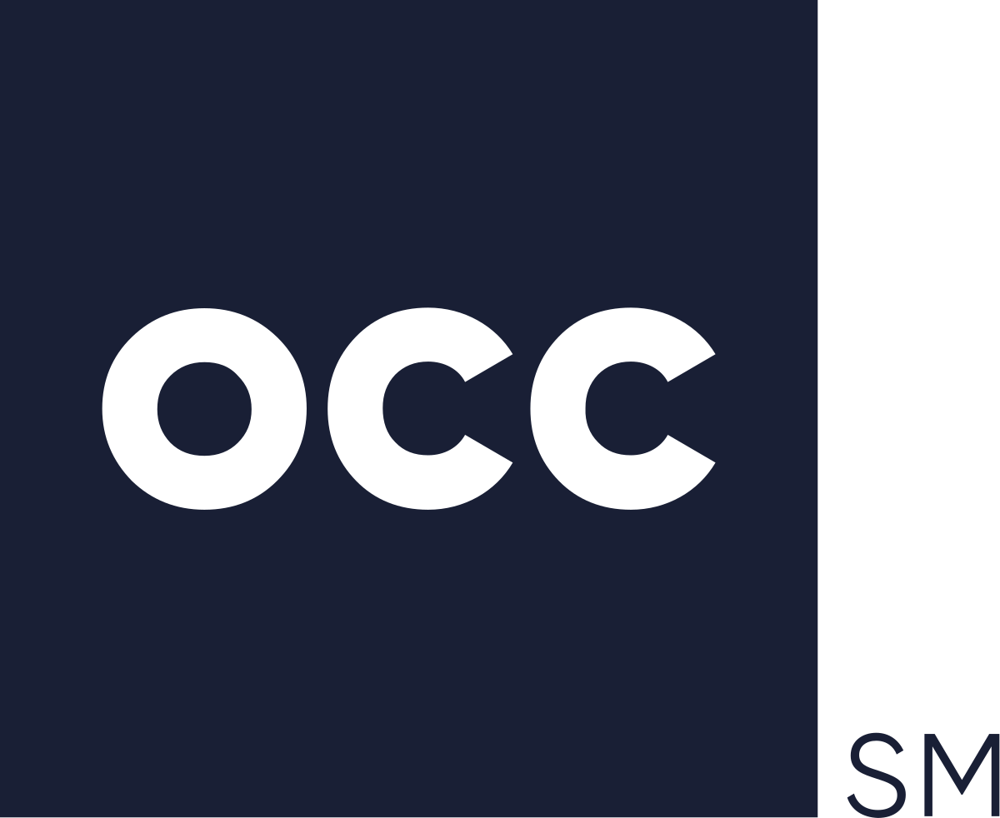

## Table of Contents

## What is the Options Clearing Corporation (OCC)?

The Options Clearing Corporation (OCC) is an organization that helps make sure trading options in the United States is safe and fair. It acts like a middleman between buyers and sellers of options, making sure that if someone wants to buy an option, there's someone to sell it, and if someone wants to sell an option, there's someone to buy it. This helps keep the market stable and trustworthy.

The OCC also makes sure that all trades are done correctly and that everyone follows the rules. If someone doesn't follow the rules, the OCC can step in and fix things. It also keeps track of all the options that are traded and makes sure that when options expire, everything is handled properly. This way, people can trade options without worrying too much about things going wrong.

## When was the Options Clearing Corporation founded?

The Options Clearing Corporation, or OCC, was founded in 1973. This was the same year that options trading started in the United States. The OCC was created to help make options trading safe and fair for everyone involved.

Before the OCC was founded, there was no central place to handle options trades. This made trading risky because there was no one to make sure that trades were done correctly. The OCC changed this by becoming the middleman for all options trades, making the market more stable and trustworthy.

## What is the primary function of the OCC?

The primary function of the Options Clearing Corporation (OCC) is to act as a middleman between buyers and sellers of options. This means that when someone wants to buy an option, the OCC makes sure there's someone to sell it, and when someone wants to sell an option, the OCC makes sure there's someone to buy it. This helps keep the options market stable and trustworthy because it ensures that every trade can be completed.

The OCC also makes sure that all trades are done correctly and that everyone follows the rules. If someone doesn't follow the rules, the OCC can step in and fix things. It keeps track of all the options that are traded and makes sure that when options expire, everything is handled properly. This way, people can trade options without worrying too much about things going wrong.

## How does the OCC ensure the stability of the options market?

The OCC helps keep the options market stable by acting as a middleman between buyers and sellers. When someone wants to buy an option, the OCC makes sure there's someone to sell it, and when someone wants to sell an option, the OCC makes sure there's someone to buy it. This ensures that every trade can be completed, which keeps the market running smoothly. Without the OCC, it would be hard to find someone to trade with, and the market could become unstable.

The OCC also makes sure that all trades are done correctly and that everyone follows the rules. If someone doesn't follow the rules, the OCC can step in and fix things. This helps keep the market fair and trustworthy. The OCC also keeps track of all the options that are traded and makes sure that when options expire, everything is handled properly. This way, people can trade options without worrying too much about things going wrong, which adds to the overall stability of the market.

## What types of financial instruments does the OCC clear?

The Options Clearing Corporation (OCC) mainly clears options contracts. Options are agreements that give the buyer the right, but not the obligation, to buy or sell an asset at a set price before a certain date. The OCC makes sure that these options trades happen smoothly and fairly. They act as the middleman, making sure there's always someone to buy or sell an option when needed.

Besides options, the OCC also clears futures contracts on certain indexes. Futures are agreements to buy or sell an asset at a set price on a future date. Just like with options, the OCC helps make sure these trades are done correctly and that everyone follows the rules. This helps keep the market stable and trustworthy for everyone involved.

By clearing these financial instruments, the OCC plays a big role in making sure the market works well. They keep track of all the trades and make sure everything is handled properly when options or futures expire. This way, people can trade these instruments without worrying too much about things going wrong.

## Who are the members of the OCC?

The members of the Options Clearing Corporation (OCC) are mainly financial firms like banks, broker-dealers, and other institutions that deal with options and futures. These members use the OCC's services to make sure their trades are safe and fair. They pay fees to the OCC for clearing their trades and for the protection the OCC provides.

The OCC has different types of members, but they all have to follow the OCC's rules. Some members are called clearing members, and they can clear trades directly with the OCC. Other members might be non-clearing members, and they work through clearing members to get their trades cleared. This system helps keep the market stable and trustworthy for everyone involved.

## How does the OCC manage risk?

The OCC manages risk by making sure that everyone who trades options and futures follows the rules. They do this by checking that all members have enough money or assets to cover their trades. This is called margin. If a member doesn't have enough margin, the OCC can ask them to add more money or assets. This helps make sure that if something goes wrong, the OCC can still handle the trades and keep the market stable.

The OCC also uses something called a risk management framework. This is a set of rules and tools that help the OCC see and control risks in the market. They use computer systems to watch the market all the time and can step in if they see something risky happening. By doing this, the OCC can stop problems before they get too big and keep the market safe for everyone.

## What role does the OCC play in regulatory compliance?

The Options Clearing Corporation (OCC) helps make sure that everyone who trades options and futures follows the rules. They do this by keeping an eye on all the trades and making sure that everyone has enough money or assets to cover their trades. If someone doesn't follow the rules, the OCC can step in and fix things. This helps keep the market fair and safe for everyone.

The OCC also works closely with different government groups, like the Securities and Exchange Commission (SEC) and the Commodity Futures Trading Commission (CFTC). These groups make the rules that the OCC and its members have to follow. By working together, the OCC helps make sure that the rules are followed and that the market stays stable and trustworthy.

## Can you explain the process of options clearing and settlement by the OCC?

When someone wants to trade an option, they go through a broker. The broker sends the trade to the OCC. The OCC acts like a middleman, making sure there's someone to buy or sell the option. This is called clearing. The OCC checks that the trade is done correctly and that everyone has enough money or assets to cover it. If everything is okay, the OCC will clear the trade, which means they agree to handle it.

After the trade is cleared, it moves to the settlement part. Settlement is when the OCC makes sure that the money and the options change hands properly. If someone bought an option, they pay for it, and if someone sold an option, they get the money. The OCC keeps track of all this and makes sure it happens on time. This way, everyone knows that their trades will be handled correctly and fairly.

## How has the OCC evolved since its inception?

Since it started in 1973, the Options Clearing Corporation (OCC) has grown a lot. At first, it just handled options trades. But over time, it began to clear other things like futures on certain indexes. The OCC also got better at using technology to watch the market and manage risks. They made new rules and tools to keep the market safe and fair for everyone.

The OCC also started working more closely with government groups like the SEC and CFTC. This helped them make sure that everyone followed the rules and that the market stayed stable. Over the years, the OCC has become a big part of the financial world, helping to make trading options and futures safer and more trustworthy for everyone involved.

## What are some major milestones in the history of the OCC?

Since it started in 1973, the Options Clearing Corporation (OCC) has hit many big milestones. One of the first was when it began clearing options trades. This was a big deal because before the OCC, there was no one to make sure options trades were safe and fair. Over the years, the OCC started clearing futures on certain indexes too. This helped them grow and handle more types of trades. They also got better at using technology to watch the market and manage risks, making trading safer for everyone.

Another important milestone was when the OCC started working more closely with government groups like the SEC and CFTC. This helped them make sure that everyone followed the rules and that the market stayed stable. The OCC also made new rules and tools to keep the market fair. Over time, the OCC became a big part of the financial world, helping to make trading options and futures more trustworthy for everyone involved.

## What future challenges and opportunities does the OCC face in the options market?

The OCC faces some big challenges in the future. One challenge is keeping up with new technology. As more people use computers and the internet to trade, the OCC needs to make sure their systems are safe and can handle lots of trades quickly. Another challenge is dealing with new rules and laws. Governments might make new rules that the OCC has to follow, and this can be hard to keep up with. Also, the OCC needs to watch out for risks in the market, like if too many people want to sell options at the same time, which could make the market unstable.

But there are also opportunities for the OCC. One opportunity is to use new technology to make trading even safer and easier. For example, they could use new computer systems to watch the market better and stop problems before they happen. Another opportunity is to work with other countries to clear options trades. This could help the OCC grow and help more people around the world trade options safely. By staying on top of these challenges and opportunities, the OCC can keep the options market stable and trustworthy for everyone.

## References & Further Reading

[1]: The Options Clearing Corporation. ["About the OCC"](https://www.theocc.com/Company-Information/What-Is-OCC) - Official website providing comprehensive information about the OCC's functions, governance, and history.

[2]: Chicago Board Options Exchange (CBOE). ["CBOE History"](https://www.cboe.com/about/) - Overview of the Chicago Board Options Exchange's role in establishing the OCC.

[3]: Amato, Jeffrey D., & Remolona, Eli M. (2003). ["The Credit Spread Puzzle."](https://www.bis.org/publ/qtrpdf/r_qt0312e.pdf) BIS Working Papers No. 125 - Discusses credit risk in financial markets, relevant to OCC’s role in reducing counterparty risk.

[4]: Murphy, Michael. (1999). ["Options Markets."](https://www.sciencedirect.com/science/article/pii/S0304405X04001357) McGraw-Hill - Provides insights into the evolution and structure of options markets, including the role of clearing organizations.

[5]: Dodd-Frank Wall Street Reform and Consumer Protection Act. ["Text of the Dodd-Frank Act."](https://www.congress.gov/111/plaws/publ203/PLAW-111publ203.pdf) - Important legislation impacting financial derivatives markets and the regulatory framework within which the OCC operates.

[6]: Gregory, Jon. (2014). ["Central Counterparties: Mandatory Central Clearing and Initial Margin Requirements for OTC Derivatives."](https://books.google.com/books/about/Central_Counterparties.html?id=1pPVBQAAQBAJ) Wiley Finance - Explores the role and significance of entities like the OCC in the financial markets.

[7]: Lewis, Michael. (2015). ["Flash Boys: A Wall Street Revolt."](https://en.wikipedia.org/wiki/Flash_Boys) W.W. Norton & Company - Discusses the rise of high-frequency trading and its impact on financial markets, relevant to OCC's adaptation to algorithmic trading.

[8]: Hendershott, T., Jones, C. M., & Menkveld, A. J. (2011). ["Does Algorithmic Trading Improve Liquidity?"](https://onlinelibrary.wiley.com/doi/full/10.1111/j.1540-6261.2010.01624.x) The Review of Financial Studies, 24(5), 1410-1454 - Research on the effects of algorithmic trading on market liquidity.

[9]: Hull, John C. (2012). ["Options, Futures, and Other Derivatives."](https://www.semanticscholar.org/paper/Options%2C-Futures%2C-and-Other-Derivatives-Hull/89bdee500c8623864fc9eb7a471546aa713acc44) Prentice Hall - A comprehensive guide covering derivatives markets and the essential roles of clearinghouses like the OCC.