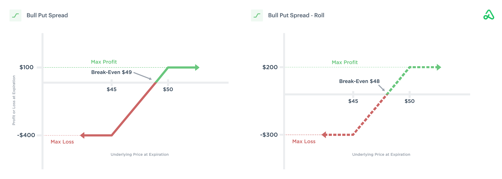

In the fast-paced world of trading, remaining attuned to market dynamics is essential for success. The evolving nature of financial markets demands strategies that allow traders to effectively manage their positions. One such strategy, roll forward, provides a means to efficiently manage options contracts, particularly within algorithmic trading.

Roll forward strategies involve the extension of an expiring options contract by closing the existing position and simultaneously opening a new one with a later expiration date. This approach enables traders to maintain their market exposure and avoid the physical settlement of assets. In essence, it offers the flexibility to respond to evolving market conditions, thereby optimizing the potential for gains and limiting risks.



The integration of roll forward techniques within algorithmic trading platforms further enhances their efficiency. Algorithms automate the decision-making process based on predefined rules, reducing the potential for human error and increasing execution speed. This capability is particularly valuable in navigating the complexities of modern financial markets, where timely decisions are crucial to capturing opportunities and mitigating losses.

Understanding the mechanics and applications of roll forward strategies is vital for traders seeking to sustain their competitive edge. As technological advancements continue to shape the trading landscape, the adoption of roll forward methods is expected to become increasingly prevalent. This article explores how these strategies serve as a transformative force in modern trading, empowering traders to maintain position continuity and manage contracts with increased precision and effectiveness.

## Table of Contents

## Understanding Roll Forward Options Contracts

Roll forward in options trading refers to the strategy of extending the maturity of an expiring options contract by simultaneously closing the existing position and opening a new contract with a later expiration date. This allows traders to maintain their desired market exposure without requiring the physical settlement of the contract.

The process of rolling forward is time-sensitive and can be applied to not only options but also futures and forwards. When employing this strategy, traders aim to avoid the premature settlement of contracts while continuing to capitalize on potential gains. It's especially useful in situations where market conditions are favorable, and the trader wishes to remain invested without interruption.

For example, consider a trader holding a call option on a stock that is nearing expiration. If the trader believes that the stock's price will rise further beyond the expiration date, they might choose to roll forward by selling the current call option and purchasing another call option with an extended expiration date. This transition enables the trader to remain in a position that may benefit from future price increases without having to exercise the original option.

While the strategy of rolling forward can help maintain continuity in trading, it requires careful planning and consideration of market dynamics. The execution involves precise timing to close the existing contract and establish a new one effectively, and factors such as transaction costs and market [liquidity](/wiki/liquidity-risk-premium) must be scrutinized to ensure the viability of the roll forward.

## The Mechanics of Roll Forward

Roll forward is a strategy that involves two fundamental steps: exiting an existing position and entering a new one. This process is integral to extending the maturity of financial contracts, especially in the context of options, futures, and forwards. The primary aim of executing these steps simultaneously is to minimize financial slippage, which refers to the cost incurred when the price at which a trade is executed differs from the expected price.

The execution of roll forward strategies varies based on the financial instrument involved:

1. **Options Contracts**: In the context of options, rolling forward can entail adjustments to the strike prices. Traders might implement 'roll up' or 'roll down' strategies, depending on market conditions and their outlook. For instance, a 'roll up' strategy involves closing an option at a lower strike price and opening a new position at a higher strike price, expecting the asset price to rise. Conversely, a 'roll down' involves moving to a lower strike price if a decline in asset price is anticipated. These strategies help in adapting to market trends while maintaining a position in the market.

   Python code snippet for calculating the new option positions could look like this:

   ```python
   def roll_option(current_strike, new_strike):
       position_difference = new_strike - current_strike
       return position_difference

   # Example usage
   current_strike_price = 100
   new_strike_price = 110
   roll_difference = roll_option(current_strike_price, new_strike_price)
   print(f"Roll difference in strike prices: {roll_difference}")
   ```

2. **Futures and Forwards Contracts**: When dealing with futures and forwards, the emphasis is on adjusting to prevailing market rates. The market conditions, such as contango and backwardation, influence these adjustments. Contango is when the futures price is above the expected future spot price, while backwardation is the opposite scenario. The strategy involves carefully timing the entry into new contracts to align with favorable rates, thus optimizing the financial outcome.

The procedural variation across different instruments underscores the importance of having a nuanced understanding of the underlying asset and market dynamics. Proper execution of a roll forward strategy involves coordinating the [exit](/wiki/exit-strategy) and entry points to achieve cost-effectiveness and maintain market exposure without interruption.

## Algorithmic Trading and Roll Forward

Algorithmic trading fundamentally changes how roll forward strategies are executed by employing algorithms to handle decision-making processes. These algorithms operate based on predefined rules, designed to monitor options and futures contracts approaching expiration while examining the prevailing market conditions. This automation aids in optimizing the roll process by systematically determining the best time to exit a current position and enter a new one.

One significant advantage of [algorithmic trading](/wiki/algorithmic-trading) in roll forward strategies is the reduction of human error. Automated systems can efficiently handle complex calculations and respond to market signals faster than a human trader, ensuring that the roll forward actions are both timely and precise. This enhances the overall efficiency of strategy execution, minimizing the risk of slippage—an essential aspect when managing large portfolios or conducting high-frequency trades.

The successful implementation of algorithmic roll forward strategies depends on several key factors. Time-based triggers are critical, ensuring that roll decisions are made at optimal times relative to contract expirations. Algorithms can be set to initiate a roll at specific times, such as at the opening or closing of trading sessions or when market activity reaches certain thresholds.

Market [volatility](/wiki/volatility-trading-strategies) is another crucial variable. By analyzing volatility conditions, algorithms can adjust their strategies to either hasten or delay roll forwards. This adaptability allows traders to respond proactively to changing market dynamics, potentially improving the profitability and security of their positions.

Theoretically, the integration of algorithmic trading with roll forward strategies provides seamless transitions between expiring and new contracts. Such integration ensures that traders maintain continuous market exposure without the interruptions typically associated with manual rollovers. As technology and algorithmic sophistication continue to evolve, the efficiency and effectiveness of such strategies are likely to improve, providing traders with a robust tool for managing their portfolios amidst the complexities of modern financial markets.

## Benefits of Using Roll Forward Strategies

Roll forward strategies are crucial for traders seeking continuous exposure to market assets without the necessity of physical delivery. This characteristic allows traders to manage their positions dynamically, adapting to changing market conditions. By extending the maturity of an option or a futures contract, traders maintain their market exposure, thereby mitigating the impact of abrupt market volatility.

One of the significant advantages of roll forward strategies is their capacity for risk management. By adjusting the timing and terms of a position, traders can hedge against unfavorable market movements. This hedging capability is particularly beneficial during periods of heightened volatility when market conditions can shift rapidly. The ability to modify positions in response to these changes ensures that traders are not unduly exposed to risk.

Efficient capital utilization is another benefit of roll forward strategies. By maintaining a position without the need for physical settlement, traders can allocate their resources more effectively across a broader range of opportunities. This flexibility allows for better management of a trading portfolio's liquidity position and helps in optimizing returns.

Furthermore, roll forward strategies enable traders to lock in profits or minimize potential losses through timely contract adjustments. By strategically extending the duration of a contract, traders can capitalize on favorable market trends or exit positions that may entail future losses. The decision to roll forward positions can often be informed by evaluating market indicators and employing predictive models, which helps in achieving more informed and profitable outcomes.

Moreover, the inherent flexibility of roll forward strategies provides traders with the ability to undertake strategic adjustments as market dynamics evolve. This adaptability is essential for sustaining a competitive edge in volatile markets. By continuously reassessing and updating their positions, traders can remain aligned with their investment objectives despite the ongoing fluctuations in market conditions.

Overall, the implementation of roll forward strategies offers traders a versatile tool for managing risk and optimizing portfolio performance. The strategy's flexibility catered to market evolution, combined with efficient capital management, underscores its importance in modern trading practices.

## Challenges and Considerations

In roll forward strategies, transaction costs and market liquidity are pivotal elements influencing the strategy's viability. Transaction costs include brokerage fees, bid-ask spreads, and other trading fees that add up with frequent contract rollovers, potentially impacting profitability. Market liquidity, which refers to the ease with which contracts can be bought or sold without causing a significant impact on price, plays a critical role; illiquid markets can lead to higher transaction costs and increased slippage during rollovers.

Market conditions such as contango and backwardation also affect the pricing dynamics of futures and options during roll forward transactions. Contango occurs when the futures prices are above the expected future spot price, typically due to costs associated like storage or [carry](/wiki/carry-trading) costs. This condition can lead to higher costs when rolling forward. Conversely, backwardation is when futures prices are below the expected future spot price, often making the roll forward strategy more cost-effective. These pricing structures fundamentally influence decision-making and timing in executing roll forward strategies.

Regulatory considerations and margin requirements necessitate careful evaluation. Each asset class and market may have specific regulatory requirements that govern trading activities, impacting how roll forward strategies can be implemented. Margin requirements, which stipulate the minimum amount of funds required to hold a position, can fluctuate with market volatility, affecting capital allocation and risk management clauses. Navigating these parameters requires adherence to regulations and ensures positions are adequately funded to mitigate the risk of forced liquidation.

Traders must evaluate the economic feasibility of roll forward strategies by balancing potential benefits against associated costs. This involves a thorough analysis of market conditions, transaction expenses, and potential returns. Weighing these elements ensures that the benefits of maintaining market exposure and potential gains in a fluctuating market outweigh the costs involved in executing the strategy.

The effective execution of a roll forward strategy demands meticulous planning and continuous monitoring. The dynamic nature of financial markets necessitates ongoing reassessment of market conditions and strategic adjustments. Failure to account for sudden changes in market trends or regulatory updates can lead to execution risks, potentially eroding the anticipated benefits of the strategy. Diligent oversight and strategy refinement are essential to capitalize on the potential advantages of roll forward strategies while mitigating associated risks.

## Conclusion

Roll forward strategies are essential tools for traders aiming to maintain continuity in their market positions. The dynamic nature of financial markets necessitates strategies that allow for flexible adaptation to changes. By employing roll forward techniques, traders can extend the lifespan of their options or futures contracts, ensuring uninterrupted exposure to underlying assets. This ability to efficiently manage contracts is a key [factor](/wiki/factor-investing) in successful trading outcomes.

The advent of technological advancements has significantly enhanced the automation of roll forward strategies. Algorithmic trading systems can now execute roll forwards with increased precision and reduced human error. These systems monitor market conditions and expirations, employing predefined criteria to decide the optimal timing and conditions for rolling forward contracts. As a result, traders can achieve improved performance and risk management through automated processes.

As financial markets continue to evolve, integrating these advanced roll forward strategies will be increasingly important. The ability to adjust positions in response to shifts in volatility and market trends ensures that traders can capitalize on opportunities while mitigating potential losses. Automated roll forwards also enable more efficient capital utilization, offering traders the flexibility to optimize their strategic decisions as market dynamics shift.

In conclusion, understanding and effectively implementing roll forward strategies can provide traders with a distinct competitive advantage. The seamless management of contract extensions not only preserves market exposure but also enhances the overall effectiveness of trading strategies. As the trading environment becomes more sophisticated, the role of roll forward strategies will become ever more critical for those seeking to succeed in the industry.

## References & Further Reading

[1]: Black, F., & Scholes, M. (1973). ["The Pricing of Options and Corporate Liabilities."](https://www.cs.princeton.edu/courses/archive/fall09/cos323/papers/black_scholes73.pdf) Journal of Political Economy, 81(3), 637-654.

[2]: Hull, J. C. (2017). ["Options, Futures, and Other Derivatives"](https://www.semanticscholar.org/paper/Options%2C-Futures%2C-and-Other-Derivatives-Hull/89bdee500c8623864fc9eb7a471546aa713acc44) (10th ed.). Pearson.

[3]: Chan, E. (2009). ["Quantitative Trading: How to Build Your Own Algorithmic Trading Business"](https://github.com/ftvision/quant_trading_echan_book). Wiley.

[4]: Lopez de Prado, M. (2018). ["Advances in Financial Machine Learning"](https://www.amazon.com/Advances-Financial-Machine-Learning-Marcos/dp/1119482089). Wiley.

[5]: Jansen, S. (2020). ["Machine Learning for Algorithmic Trading: Predictive models to extract signals from market and alternative data for systematic trading strategies with Python"](https://www.amazon.com/Machine-Learning-Algorithmic-Trading-alternative/dp/1839217715). Packt Publishing.

[6]: Aronson, D. R. (2007). ["Evidence-Based Technical Analysis: Applying the Scientific Method and Statistical Inference to Trading Signals"](https://onlinelibrary.wiley.com/doi/book/10.1002/9781118268315). Wiley.