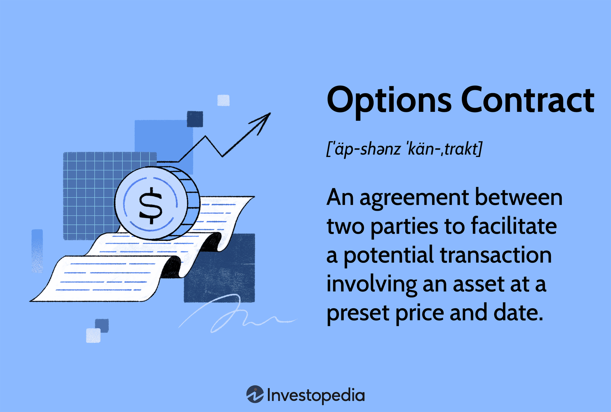

## Table of Contents

## What is an options contract?

An options contract is a type of financial agreement that gives the buyer the right, but not the obligation, to buy or sell an asset at a specific price before a certain date. The asset could be stocks, commodities, or other financial instruments. The specific price is known as the strike price, and the date is called the expiration date. Options are used by investors to hedge against potential losses or to speculate on the price movements of the underlying asset.

There are two main types of options: call options and put options. A call option gives the buyer the right to buy the underlying asset at the strike price. This is useful if the buyer believes the price of the asset will go up. On the other hand, a put option gives the buyer the right to sell the underlying asset at the strike price. This is beneficial if the buyer thinks the price of the asset will go down. Both types of options can be bought and sold in the options market, and their value changes based on the price of the underlying asset and the time left until expiration.

## What are the basic components of an options contract?

An options contract has a few main parts that you need to know about. First, there's the underlying asset. This is what the option gives you the right to buy or sell. It could be a stock, a commodity like gold, or even an index like the S&P 500. Next, there's the strike price. This is the set price at which you can buy or sell the asset if you choose to use your option. Finally, there's the expiration date. This is the date by which you have to decide if you want to use your option or let it expire worthless.

Another important part of an options contract is the type of option it is. There are two kinds: call options and put options. A call option lets you buy the underlying asset at the strike price, which is good if you think the price of the asset will go up. A put option lets you sell the asset at the strike price, which is helpful if you think the price will go down. The last piece to know about is the premium. This is the price you pay to buy the option. It's influenced by things like how much time is left until the expiration date and how much the price of the underlying asset is expected to move.

## How do call options work?

A call option is like a ticket that gives you the right to buy something at a certain price before a specific date. Imagine you think the price of a toy will go up. You can buy a call option for that toy at today's price, say $10. If the price of the toy goes up to $15 before the date on your ticket, you can use your call option to buy the toy for $10 and then sell it for $15, making a profit. But if the price stays the same or goes down, you don't have to buy the toy, and you only lose the money you paid for the ticket.

The price you pay for the call option is called the premium. This premium depends on how long you have until the date on the ticket and how much people think the price of the toy might change. If you think the price will go up a lot, you might be willing to pay more for the call option. But remember, if the price doesn't go up enough by the date on your ticket, you won't make any money and you'll lose the premium you paid.

## How do put options work?

A put option is like a ticket that gives you the right to sell something at a certain price before a specific date. Imagine you own a toy and you think its price will go down. You can buy a put option for that toy at today's price, say $10. If the price of the toy drops to $5 before the date on your ticket, you can use your put option to sell the toy for $10, even though it's only worth $5 now. This way, you make a profit. But if the price stays the same or goes up, you don't have to sell the toy, and you only lose the money you paid for the ticket.

The price you pay for the put option is called the premium. This premium depends on how long you have until the date on the ticket and how much people think the price of the toy might change. If you think the price will go down a lot, you might be willing to pay more for the put option. But remember, if the price doesn't go down enough by the date on your ticket, you won't make any money and you'll lose the premium you paid.

## What is the difference between American and European options?

American and European options are two types of options that differ mainly in when you can use them. An American option gives you the right to buy or sell the underlying asset at any time before the expiration date. This means if you think it's a good time to use your option, you can do it right away, not just on the expiration date. This flexibility can be useful if the price of the asset changes a lot and you want to act quickly.

On the other hand, a European option only lets you buy or sell the underlying asset on the expiration date, not before. This means you have to wait until the end to decide if you want to use your option. This can be a bit limiting, but European options can sometimes be cheaper because of this restriction. Both types of options have their uses, depending on what you're trying to achieve with your investment strategy.

## What are the key terms like strike price, expiration date, and premium?

The strike price is the set price at which you can buy or sell the underlying asset if you choose to use your option. It's like a target price that you agree on when you buy the option. If you have a call option and the market price goes above the strike price, you might decide to buy the asset at the lower strike price and then sell it at the higher market price to make a profit. If you have a put option and the market price drops below the strike price, you can sell the asset at the higher strike price and make a profit.

The expiration date is the last day you can use your option. It's like a deadline. If you don't use your option by this date, it becomes worthless, and you lose the money you paid for it. The premium is the price you pay to buy the option. It's influenced by how long you have until the expiration date and how much people think the price of the asset might change. The premium is like the cost of the ticket that gives you the right to buy or sell the asset at the strike price before the expiration date.

## How does exercising an option work?

Exercising an option means using your right to buy or sell the underlying asset at the strike price. If you have a call option and you think it's a good time to buy the asset because its price has gone up, you can exercise your option. This means you'll buy the asset at the lower strike price and then you can sell it at the higher market price to make a profit. If you have a put option and the price of the asset has gone down, exercising your option lets you sell the asset at the higher strike price, which can also make you money.

The process of exercising an option depends on whether it's an American or European option. With an American option, you can exercise it at any time before the expiration date. This means if you see a good opportunity, you can act right away. On the other hand, a European option can only be exercised on the expiration date, so you have to wait until the end to decide if you want to use your option. No matter which type you have, once you exercise your option, you'll either buy or sell the asset at the strike price, and then you can decide what to do with it next.

## What are in-the-money, at-the-money, and out-of-the-money options?

An option is in-the-money if it would be profitable to exercise it right now. For a call option, this means the current price of the asset is higher than the strike price. If you can buy the asset at a lower strike price and sell it at a higher market price, you make money. For a put option, it's the opposite: the asset's price needs to be lower than the strike price. If you can sell the asset at a higher strike price than its current market value, you make a profit. In-the-money options have some intrinsic value because they can be used to make money right away.

An option is at-the-money when the current price of the asset is the same as the strike price. For both call and put options, exercising the option wouldn't make you any money because you'd be buying or selling the asset at the same price it's worth right now. At-the-money options don't have any intrinsic value, but they can still have value based on how much time is left until they expire and how much the price of the asset might change.

An option is out-of-the-money if it wouldn't be profitable to exercise it right now. For a call option, this means the current price of the asset is lower than the strike price. If you bought the asset at the higher strike price, you'd lose money because you could have bought it cheaper on the market. For a put option, it means the asset's price is higher than the strike price. If you sold the asset at the lower strike price, you'd lose money because you could have sold it for more on the market. Out-of-the-money options don't have any intrinsic value, but they can still be worth something if there's a chance the price of the asset will move in the right direction before the option expires.

## What are the risks associated with trading options?

Trading options can be risky because you might lose money. When you buy an option, you pay a premium, which is like the cost of a ticket. If the price of the asset doesn't move in the way you hoped before the expiration date, your option can become worthless, and you lose the premium you paid. This risk is higher with options that are out-of-the-money because they need a bigger price move to become profitable. Also, options can be very sensitive to changes in the price of the underlying asset, which means small price movements can lead to big changes in the value of your option.

Another risk is that options trading can be complicated. There are many factors that affect the price of an option, like how much time is left until it expires and how much people expect the price of the asset to change. If you don't understand these factors well, you might make bad decisions and lose money. Also, using options to bet on the price of an asset can be like gambling if you're not careful. It's important to have a good plan and understand the risks before you start trading options.

## What are some advanced options strategies like spreads, straddles, and collars?

A spread is when you buy and sell options at the same time to reduce risk. Imagine you think the price of a toy will go up a little bit, but you're not sure. You can buy a call option with a lower strike price and sell a call option with a higher strike price. This way, if the price goes up a bit, you make money on the first option but lose some on the second. The losses on the second option help limit how much you can lose overall. There are different types of spreads, like vertical spreads, where you use options with the same expiration date but different strike prices, and calendar spreads, where you use options with the same strike price but different expiration dates.

A straddle is when you buy a call option and a put option on the same asset with the same strike price and expiration date. This is useful if you think the price of the asset will move a lot, but you're not sure which way. If the price goes up a lot, you make money on the call option. If it goes down a lot, you make money on the put option. The downside is that the price has to move a lot to cover the cost of both options, so if the price stays the same or only moves a little, you can lose money.

A collar is a strategy to protect an asset you already own. Imagine you own a toy and you're worried its price might go down. You can buy a put option to sell the toy at a certain price if it drops. To pay for this put option, you can sell a call option on the same toy at a higher price. This means if the price goes up a lot, someone else can buy your toy at the lower price you set with the call option. A collar helps limit how much you can lose if the price goes down, but it also limits how much you can make if the price goes up.

## How do options affect the overall market and individual stock prices?

Options can influence the overall market and individual stock prices in a few ways. When people buy and sell options, they're often betting on where they think the price of a stock or the market will go. If a lot of people buy call options on a stock, it can push the stock price up because it shows that many people think the stock will go up. This can create a positive feedback loop where the stock price goes up even more because more people want to buy it. On the other hand, if a lot of people buy put options, it can push the stock price down because it shows that many people think the stock will go down. This can create a negative feedback loop where the stock price drops even more because more people want to sell it.

Options also affect the market through something called hedging. Big investors and companies use options to protect themselves against big price swings. For example, if a company is worried that the price of a stock it owns will go down, it might buy put options to make sure it can sell the stock at a certain price if it drops. This can help stabilize the market because it reduces how much the stock price can fall. But it can also lead to more trading as people buy and sell options to adjust their bets and protections, which can make the market more active and sometimes more volatile.

## What are exotic options and how do they differ from standard options?

Exotic options are a type of option that's more complicated than standard options. They have special features that can make them work differently. For example, some exotic options might let you choose when you want to use them, or they might change based on more than one thing, like the price of two different stocks. These special features can make exotic options harder to understand and trade, but they can also be useful for people who need something more specific than what standard options offer.

Standard options, like call and put options, are simpler and more common. They give you the right to buy or sell an asset at a certain price before a certain date. They're easier to understand because they only depend on the price of one asset and have fewer special rules. Exotic options, on the other hand, can be customized to fit specific needs, but they can also be riskier and harder to value because of their complexity.

## What are Options Contracts in the context of Understanding Financial Derivatives?

Options contracts are a significant category of financial derivatives, providing market participants with the flexibility to manage financial exposure and speculate on market movements. These contracts grant the holder the right, but not the obligation, to buy or sell an underlying asset at a specific price, known as the strike price, before the contract's expiration date. This feature distinguishes options from other derivatives and financial instruments, allowing for strategic financial planning and investment.

Two primary types of options contracts exist: call options and put options. Call options provide the holder with the right to purchase the underlying asset at the strike price, anticipating that the asset's price will rise above this level before expiration. Conversely, put options afford the holder the right to sell the underlying asset at the strike price, used when the holder expects the market price to decline.

Options offer several advantages, primarily in hedging, speculation, and income generation. By using options, investors can hedge against adverse price movements in underlying assets, thus protecting their portfolios from market volatility. For example, an investor holding a portfolio of stocks might purchase put options to guard against potential losses from a declining market. Similarly, call options can be utilized to lock in prices for future purchases, mitigating the risk of price increases.

Speculation is another prevalent use of options, allowing traders to profit from expectations about future price movements. Since options require only a fraction of the cost of the underlying asset, they provide leverage, amplifying potential gains relative to the investment. However, this leverage also increases risk, as options can expire worthless if the market does not move as anticipated.

Understanding the mechanics and valuation of options is crucial for effective utilization. The value of an option is influenced by several factors: the strike price relative to the current market price of the underlying asset, the time remaining until expiration (known as time decay), and the [volatility](/wiki/volatility-trading-strategies) of the underlying asset. Market participants use various models, such as the Black-Scholes model, to estimate the fair value of options contracts. As a mathematical formula, the Black-Scholes model considers the current price of the asset (S), the strike price (K), the time to expiration (T), the risk-free [interest rate](/wiki/interest-rate-trading-strategies) (r), and the asset's volatility (σ):

$$
C(S, T) = S_0 \Phi(d_1) - K e^{-rT} \Phi(d_2)
$$

where:
$$
d_1 = \frac{\ln(\frac{S_0}{K}) + (r + \frac{\sigma^2}{2})T}{\sigma \sqrt{T}}
$$
$$
d_2 = d_1 - \sigma \sqrt{T}
$$

In these equations, $\Phi$ is the cumulative distribution function of the standard normal distribution.

Overall, options contracts are versatile financial instruments that, when understood and employed correctly, can significantly enhance a trader's strategic capabilities in both hedging and speculative contexts.

## References & Further Reading

[1]: Black, F., & Scholes, M. (1973). ["The Pricing of Options and Corporate Liabilities."](https://www.cs.princeton.edu/courses/archive/fall09/cos323/papers/black_scholes73.pdf) Journal of Political Economy, 81(3), 637-654.

[2]: Lopez de Prado, M. (2018). ["Advances in Financial Machine Learning."](https://www.amazon.com/Advances-Financial-Machine-Learning-Marcos/dp/1119482089) Wiley.

[3]: Bjork, T. (2009). ["Arbitrage Theory in Continuous Time."](https://academic.oup.com/book/43511) Oxford University Press.

[4]: Hull, J. C. (2018). ["Options, Futures, and Other Derivatives."](https://www.semanticscholar.org/paper/Options%2C-Futures%2C-and-Other-Derivatives-Hull/89bdee500c8623864fc9eb7a471546aa713acc44) Pearson.

[5]: Chan, E. P. (2009). ["Quantitative Trading: How to Build Your Own Algorithmic Trading Business."](https://github.com/ftvision/quant_trading_echan_book) Wiley.

[6]: Jansen, S. (2020). ["Machine Learning for Algorithmic Trading: Predictive models to extract signals from market and alternative data for systematic trading strategies with Python."](https://github.com/stefan-jansen/machine-learning-for-trading) Packt Publishing.

[7]: Aronson, D. R. (2006). ["Evidence-Based Technical Analysis: Applying the Scientific Method and Statistical Inference to Trading Signals."](https://www.amazon.com/Evidence-Based-Technical-Analysis-Scientific-Statistical/dp/0470008741) Wiley.