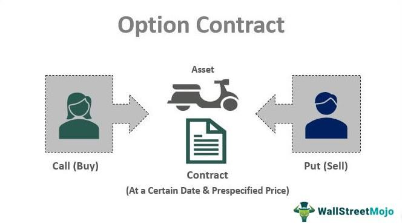

In the modern financial landscape, options contracts and algorithmic trading occupy a crucial niche. Financial derivatives, such as options contracts, offer traders and investors flexibility and leverage to manage risk, speculate, or enhance returns. Options contracts are agreements granting the holder the right, but not the obligation, to buy or sell an asset at a specified price before a certain date. This feature allows market participants to tailor their strategies extensively.

Algorithmic trading, on the other hand, has revolutionized how options are traded. The use of algorithms provides significant advantages, including speed, efficiency, and an advanced framework for managing risk. By implementing predefined trading strategies through computer programs, traders can rapidly respond to market conditions, execute trades with precision, and manage complex options strategies that might be impractical for manual execution.



This article outlines the various types of options contracts, such as call and put options, and examines how these financial instruments are utilized. Additionally, we will explore how algorithmic trading enhances these capabilities, maximizing the efficiency and effectiveness of trading strategies. The integration of options contracts with algorithmic trading has enabled market participants to navigate the financial markets with greater agility and insight, making it an indispensable part of contemporary trading.

## Table of Contents

## Understanding Financial Derivatives: Options Contracts

Options contracts are a significant category of financial derivatives, providing market participants with the flexibility to manage financial exposure and speculate on market movements. These contracts grant the holder the right, but not the obligation, to buy or sell an underlying asset at a specific price, known as the strike price, before the contract's expiration date. This feature distinguishes options from other derivatives and financial instruments, allowing for strategic financial planning and investment.

Two primary types of options contracts exist: call options and put options. Call options provide the holder with the right to purchase the underlying asset at the strike price, anticipating that the asset's price will rise above this level before expiration. Conversely, put options afford the holder the right to sell the underlying asset at the strike price, used when the holder expects the market price to decline.

Options offer several advantages, primarily in hedging, speculation, and income generation. By using options, investors can hedge against adverse price movements in underlying assets, thus protecting their portfolios from market volatility. For example, an investor holding a portfolio of stocks might purchase put options to guard against potential losses from a declining market. Similarly, call options can be utilized to lock in prices for future purchases, mitigating the risk of price increases.

Speculation is another prevalent use of options, allowing traders to profit from expectations about future price movements. Since options require only a fraction of the cost of the underlying asset, they provide leverage, amplifying potential gains relative to the investment. However, this leverage also increases risk, as options can expire worthless if the market does not move as anticipated.

Understanding the mechanics and valuation of options is crucial for effective utilization. The value of an option is influenced by several factors: the strike price relative to the current market price of the underlying asset, the time remaining until expiration (known as time decay), and the [volatility](/wiki/volatility-trading-strategies) of the underlying asset. Market participants use various models, such as the Black-Scholes model, to estimate the fair value of options contracts. As a mathematical formula, the Black-Scholes model considers the current price of the asset (S), the strike price (K), the time to expiration (T), the risk-free [interest rate](/wiki/interest-rate-trading-strategies) (r), and the asset's volatility (σ):

$$
C(S, T) = S_0 \Phi(d_1) - K e^{-rT} \Phi(d_2)
$$

where:
$$
d_1 = \frac{\ln(\frac{S_0}{K}) + (r + \frac{\sigma^2}{2})T}{\sigma \sqrt{T}}
$$
$$
d_2 = d_1 - \sigma \sqrt{T}
$$

In these equations, $\Phi$ is the cumulative distribution function of the standard normal distribution.

Overall, options contracts are versatile financial instruments that, when understood and employed correctly, can significantly enhance a trader's strategic capabilities in both hedging and speculative contexts.

## Types of Options Contracts

Options contracts are foundational instruments in the derivatives market, allowing investors to manage risks and capitalize on various market conditions. There are several types of options, each with distinct characteristics and strategic applications.

Call Options enable the holder to buy an asset at a predetermined price known as the strike price before the expiration of the contract. This grants investors the potential to profit from upward price movements of the underlying asset. For instance, if an investor anticipates that a stock priced at $50 will rise, purchasing a call option with a $50 strike price allows acquiring the stock at this price regardless of future increases. The profit potential is theoretically unlimited, especially if the asset price soars significantly above the strike price.

Put Options, conversely, provide the holder with the right to sell an asset at the strike price before the contract’s expiration. This becomes beneficial when anticipating a decline in the asset's value. For example, an investor holding a put option with a $50 strike price can sell the stock at this price even if the market value drops to $30, thus securing a profit from the anticipated downturn.

The primary distinction between American and European Options lies in their exercise flexibility. American options can be exercised at any point up until the expiration date, offering more strategic opportunities based on changing market conditions. In contrast, European options can only be exercised at the expiration date, which can limit some flexibility but often carries lower premiums due to this constraint.

Advantages of both call and put options include the ability to leverage market movements without the need to own the underlying asset upfront. They are instrumental in strategic hedging—mitigating risks in an existing portfolio by counterbalancing potential losses. Additionally, the risk for options buyers is typically limited to the premium paid for the contracts. This contrasts with the larger potential losses experienced in other forms of speculative investments, where market movements directly affect asset values held by the investor. Understanding these types of options and their strategic applications is crucial for investors aiming to enhance their market participation while managing risk effectively.

## Hedging and Speculating with Options

Options are financial derivatives that serve as valuable tools for both hedging and speculating. These contracts provide the right, but not the obligation, to buy or sell the underlying asset, allowing investors to manage risk and potentially enhance returns. In the context of hedging, options are used to protect against adverse price movements, enabling investors to offset potential losses in their portfolios.

For instance, an investor holding a significant position in a stock might purchase put options to hedge against a potential decline in the stock's price. A put option gives the investor the right to sell the stock at a pre-determined price (strike price) before the option's expiration date. This ensures that even if the stock's market price falls, the investor can still sell it at the higher strike price, thus mitigating losses.

Speculation, on the other hand, involves taking advantage of anticipated movements in the price of an underlying asset. Traders may use call options to bet on the upward movement of a stock's price. A call option provides the right to purchase the stock at the strike price, allowing the trader to benefit if the stock's market price rises above this level.

To illustrate these strategies with examples:

### Hedging Scenario
Consider an investor who holds shares in a technology company and is concerned about a potential market downturn due to an upcoming earnings report. The investor can purchase put options with a strike price close to the current trading price of the stock. If the earnings report leads to a decline in the stock's price, the loss in the stock's value may be offset by the gain from the put options.

### Speculation Scenario
A speculator expects the price of a particular commodity, such as [crude oil](/wiki/crude-oil), to increase due to seasonal demand. The speculator might buy call options with a strike price above the current market price, anticipating that the market price will rise past this level before the option expires. If the speculator's prediction is correct, they can exercise the option, purchase the commodity at the lower strike price, and sell it at the higher market price, thus realizing a profit.

Seasoned investors often utilize complex options strategies that involve combinations of different options contracts to refine their approaches to hedging and speculating. For instance, using a "straddle" involves buying both a call and a put option at the same strike price and expiration date, allowing the trader to capitalize on significant price movements in either direction.

The effectiveness of these strategies depends on understanding the market and the behavior of the underlying asset. Consequently, it is vital for investors and traders to thoroughly analyze market conditions and potential risks when utilizing options for hedging and speculation.

## The Role of Algorithmic Trading in Options

Algorithmic trading employs sophisticated computer programs designed to execute trading strategies with precision and speed, crucially impacting options trading. By leveraging predefined criteria, algorithms facilitate the swift execution of trade orders, which is essential in the fast-changing financial markets where time is of the essence. Algorithms handle myriad trading tasks, from executing simple buy/sell orders to managing complex strategy portfolios involving numerous financial instruments, thereby enhancing operational efficiency.

In options trading, algorithms are particularly effective in managing multifaceted strategies. These automated systems can simultaneously monitor numerous market indicators and option contracts, enabling traders to capitalize on fleeting opportunities faster than humanly possible. Algorithms prove indispensable when managing large volumes and intricate combinations of options, reducing the potential for human error and enhancing the precision of trade execution, which is crucial for minimizing slippage—the difference between the expected price of a trade and the actual price.

Exploitations of [arbitrage](/wiki/arbitrage) opportunities form another significant aspect of [algorithmic trading](/wiki/algorithmic-trading) in options. Arbitrage involves profiting from price discrepancies of similar financial instruments across different markets or forms. Algorithms, endowed with advanced analytical capabilities, identify and act on these minor discrepancies in fraction of a second, a task nearly impossible for human traders. This results in market efficiencies and [liquidity](/wiki/liquidity-risk-premium), benefiting the broader financial ecosystem.

Moreover, algorithmic trading systems play a pivotal role in risk management. They are capable of dynamically adjusting trading positions in response to evolving market conditions, ensuring that risks are adequately managed and aligned with predetermined risk parameters. This dynamic adjustment is facilitated by real-time data analysis, allowing trading systems to employ hedging techniques like delta or gamma hedges, adjusting the portfolio's exposure to market movements.

Popular algorithmic trading strategies in options include [market making](/wiki/market-making) and volatility trading. Market making involves providing liquidity to the markets by continuously offering to buy and sell options, exploiting the bid-ask spread. Algorithms efficiently manage these high-frequency trading operations, ensuring cyclical buying and selling at optimal prices. Meanwhile, volatility strategies capitalize on the expected fluctuation in the price of the underlying asset. Algorithms adeptly quantify the implied volatility from current option prices and the realized volatility of the underlying asset, deploying strategies such as straddles, strangles, or volatility arbitrage based on predictive analytics.

Through algorithmic trading, the execution of complex options strategies is enhanced, ensuring precision and minimal market impact. This technological boon not only provides traders with a competitive edge but also instills greater confidence in the systematic execution of high-level trading strategies, firmly supporting improved performance and goal attainment in the volatile options market landscape.

## Options Trading Strategies Enhanced by Algorithms

Options trading strategies can be significantly enhanced through algorithmic trading, incorporating both directional and non-directional approaches to capitalize on market inefficiencies and opportunities. Directional strategies focus on predicting the direction of asset prices, while non-directional strategies aim to profit from the volatility or spread changes without forecasting the asset's future direction.

### Directional vs. Non-Directional Strategies

**Directional Strategies**: These strategies involve making trades based on the anticipated direction of the underlying asset's price. Algorithms can be designed to implement these strategies by analyzing large sets of market data to identify potential trends and price movements. For example, an algorithm might use moving averages or technical indicators to predict bullish or bearish conditions, executing call or put options accordingly.

**Non-Directional Strategies**: Also known as market-neutral strategies, these do not rely on predicting market directions but instead focus on capturing profit from market inefficiencies and volatility changes. Straddles and strangles are classic non-directional strategies that can be implemented algorithmically. An algorithm might simultaneously buy a call and a put option with the same expiration date to benefit from significant price movements, regardless of direction.

### Volatility-Driven Strategies

Volatility is a key [factor](/wiki/factor-investing) in options pricing, and algorithms can be tailored to exploit volatility changes effectively. For instance, volatility models such as GARCH (Generalized Autoregressive Conditional Heteroskedasticity) can forecast future volatility based on historical data. Algorithms can then deploy strategies like volatility arbitrage, where they monitor implied versus realized volatility, executing trades when discrepancies arise.

### Algorithmic-Based Options Strategies

**Straddles and Strangles**: Both are neutral strategies but differ slightly. A straddle involves buying a call and a put with the same strike price and expiration, while a strangle uses options with different strike prices. Algorithms effectively manage these strategies by continuously monitoring market conditions and adjusting the position to maximize gains or minimize losses as volatility shifts.

**Spread Strategies**: These include bull and bear spreads, which utilize two different strike prices to limit potential losses or gains. Algorithms can execute spread strategies by dynamically adjusting the strike price distances based on real-time data to maintain optimal risk-reward balance.

### Algorithmic Trading Solutions

To execute complex options strategies with precision, sophisticated algorithmic trading solutions are employed. These systems integrate real-time data feeds, advanced predictive analytics, and automated trading protocols to act on market conditions instantly. For example, a Python-based algorithm might use libraries like `pandas` for data handling, `numpy` for numerical computations, and `scikit-learn` for [machine learning](/wiki/machine-learning), establishing an agile platform for strategy execution.

```python
import numpy as np
import pandas as pd
from sklearn.linear_model import LinearRegression

# Example: Predicting price movements with linear regression
def predict_price_movement(data):
    model = LinearRegression()
    model.fit(data['features'], data['target'])
    return model.predict(data['future_features'])

# Example usage
# data = pd.DataFrame(...)
# predictions = predict_price_movement(data)
```

Such tools ensure that traders can capitalize on fleeting opportunities with minimal market impact, effectively implementing and managing complex strategies. Thus, algorithmic trading not only enhances the efficiency and precision of executing options strategies but also opens avenues for maximizing profitability in diverse market conditions.

## Risks and Rewards in Options and Algorithmic Trading

Options contracts are a popular financial derivative due to their leveraged exposure to price movements and the ability to hedge against potential risks. However, this leverage and flexibility come with inherent risks, such as market volatility and time decay. Volatility, a critical factor in options pricing, can lead to significant price swings, impacting both the value of the options and the underlying assets. Time decay, represented by the Greek term "theta," refers to the reduction in an option's value as it approaches its expiration date, with this effect accelerating as the expiration nears.

Algorithmic trading, which automates trading strategies through computer programs, improves the speed and efficiency of executing trades but also introduces risks of its own. Technical malfunctions, such as software bugs or hardware failures, can result in unintended trading behaviors and potential financial losses. Furthermore, algorithmic systems may be susceptible to unforeseen market events that disrupt normal trading patterns, leading to increased volatility and potential drawdowns.

When options trading is combined with algorithmic strategies, a comprehensive risk management approach is essential to mitigate potential losses. This involves setting predefined criteria for trade execution, continuously monitoring market conditions, and dynamically adjusting positions based on real-time data. Strategic risk management also includes employing stop-loss orders and other protective measures to prevent excessive losses during volatile market conditions.

Understanding market dynamics is crucial for traders and investors engaged in options and algorithmic trading. Developing successful strategies requires thorough testing, often through [backtesting](/wiki/backtesting) historical data to evaluate the potential effectiveness of trading algorithms. Python, with its range of libraries such as NumPy and pandas, is a preferred language for building and testing algorithmic trading strategies due to its versatility and ease of use. 

Continuous monitoring and analysis of trading algorithms are vital components of effective risk management. This ensures that strategies remain aligned with market conditions and can adapt to unexpected changes. For example, an algorithm designed to capitalize on a specific market trend may need to be recalibrated if external factors cause that trend to shift. Therefore, maintaining a vigilant oversight and regular updates to trading algorithms is essential to optimize performance and manage associated risks effectively.

## Conclusion

Options contracts, when synergized with algorithmic trading, provide significant opportunities to refine trading strategies and manage risk more effectively. This powerful combination allows for greater precision in executing trades, potentially improving both the speed and efficiency of transactions. Options, as financial derivatives, offer a structured approach to hedge against adverse market movements, while algorithms enable traders to automate and optimize these strategic positions with minimal human intervention.

Yet, to harness the full potential of this synergy, a profound understanding of both the financial instruments involved and the technological mechanisms underpinning algorithmic trading is essential. Investors and traders must comprehend the intricacies of options pricing, the implications of volatility, and the technical design of algorithms. This knowledge ensures that they can design robust trading strategies that are not only profitable but also resilient to market fluctuations.

Given the complexity and risks inherent in merging options trading with algorithmic systems, education becomes a pivotal factor. Traders are encouraged to immerse themselves in continuous learning, staying abreast of market developments, technological advancements, and regulatory changes. Furthermore, the consultation with financial experts and technologists can provide invaluable insights and guidance, mitigating the dangers associated with sophisticated trading models.

The convergence of options contracts and algorithmic trading reflects a significant evolution in global financial markets. It highlights a trend towards automated, data-driven trading processes that demand a high level of expertise and vigilance. As such, this combination not only offers the promise of enhanced trading performance but also underscores the necessity for disciplined and informed trading practices in an increasingly complex financial environment.

## References & Further Reading

[1]: Black, F., & Scholes, M. (1973). ["The Pricing of Options and Corporate Liabilities."](https://www.cs.princeton.edu/courses/archive/fall09/cos323/papers/black_scholes73.pdf) Journal of Political Economy, 81(3), 637-654.

[2]: Lopez de Prado, M. (2018). ["Advances in Financial Machine Learning."](https://www.amazon.com/Advances-Financial-Machine-Learning-Marcos/dp/1119482089) Wiley.

[3]: Bjork, T. (2009). ["Arbitrage Theory in Continuous Time."](https://academic.oup.com/book/43511) Oxford University Press.

[4]: Hull, J. C. (2018). ["Options, Futures, and Other Derivatives."](https://www.semanticscholar.org/paper/Options%2C-Futures%2C-and-Other-Derivatives-Hull/89bdee500c8623864fc9eb7a471546aa713acc44) Pearson.

[5]: Chan, E. P. (2009). ["Quantitative Trading: How to Build Your Own Algorithmic Trading Business."](https://github.com/ftvision/quant_trading_echan_book) Wiley.

[6]: Jansen, S. (2020). ["Machine Learning for Algorithmic Trading: Predictive models to extract signals from market and alternative data for systematic trading strategies with Python."](https://github.com/stefan-jansen/machine-learning-for-trading) Packt Publishing.

[7]: Aronson, D. R. (2006). ["Evidence-Based Technical Analysis: Applying the Scientific Method and Statistical Inference to Trading Signals."](https://www.amazon.com/Evidence-Based-Technical-Analysis-Scientific-Statistical/dp/0470008741) Wiley.