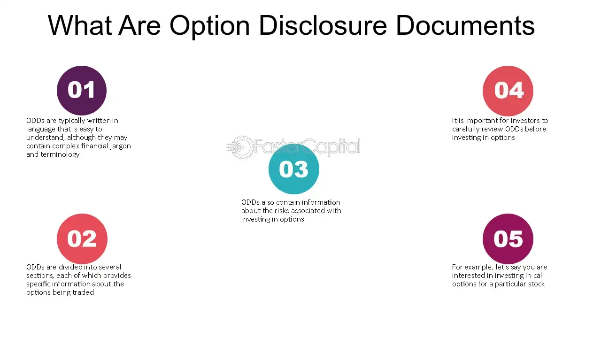

## Table of Contents

## What is an Options Disclosure Document (ODD)?

An Options Disclosure Document (ODD) is a booklet that explains everything you need to know about trading options. It's like a guidebook that helps you understand the risks and rewards of options trading. The ODD is given to you by your broker before you start trading options, so you can make informed decisions.

The document covers important topics like how options work, the different types of options, and the strategies you can use. It also talks about the risks involved, such as losing money, and gives tips on how to manage those risks. Reading the ODD can help you feel more confident and prepared when you start trading options.

## Why is the Options Disclosure Document important for investors?

The Options Disclosure Document (ODD) is really important for investors because it helps them understand what they're getting into with options trading. It's like a guide that explains everything in simple terms, so even if you're new to trading, you can learn about how options work, the different kinds of options, and the strategies you can use. This document is given to you before you start trading, so you have all the information you need to make smart choices.

Another reason the ODD is important is that it talks about the risks of trading options. It's honest about the fact that you could lose money, and it gives you tips on how to manage those risks. By reading the ODD, you can be better prepared and feel more confident when you start trading. It's like having a map before you go on a journey, helping you avoid pitfalls and make the most of your investment.

## Who is required to provide the Options Disclosure Document?

The Options Disclosure Document (ODD) is given to investors by their brokers or financial advisors. This is a rule set by the financial authorities to make sure that everyone who wants to trade options knows the risks and how options work. The broker has to give you the ODD before you can start trading, so you have all the information you need.

The reason behind this rule is to protect investors. Options trading can be tricky and risky, so it's important that people understand what they're getting into. By providing the ODD, brokers help their clients make informed decisions and avoid surprises. This way, everyone can trade with more confidence and less chance of making big mistakes.

## What are the key components of an Options Disclosure Document?

An Options Disclosure Document (ODD) has several important parts that help you understand options trading. The first part explains what options are and how they work. It talks about the different types of options, like call options and put options, and how you can use them to make money or protect your investments. This section also covers the basic strategies you can use when trading options, so you get a good idea of what's possible.

The second part of the ODD focuses on the risks of options trading. It's very honest about the fact that you could lose money, and it gives examples of how things can go wrong. This part also offers tips on how to manage those risks, like setting limits on how much you're willing to lose or diversifying your investments. By understanding these risks, you can make better decisions and trade more safely.

The last part of the ODD includes important legal stuff and contact information. It tells you about the rules and regulations you need to follow when trading options, and it gives you details on how to reach out to your broker or financial advisor if you have questions or need help. This section makes sure you know your rights and responsibilities, and it helps you feel supported as you start trading options.

## How often must the Options Disclosure Document be updated?

The Options Disclosure Document (ODD) needs to be updated whenever there are big changes in the rules or how options work. This makes sure that the information in the document stays correct and helpful for people who are trading options. The people who make the rules, like the financial authorities, decide when these updates need to happen. They want to make sure that everyone has the latest information to make good choices.

Usually, the ODD is looked at and updated every few years. But if something important changes, like new laws or big shifts in the market, the document might need to be updated sooner. This way, the ODD keeps being a useful guide for people who are new to options trading or those who want to stay up-to-date with the latest rules and strategies.

## What are the regulatory requirements for the Options Disclosure Document?

The Options Disclosure Document (ODD) has to follow rules set by financial authorities like the Securities and Exchange Commission (SEC) and the Financial Industry Regulatory Authority (FINRA). These rules say that brokers must give the ODD to anyone who wants to trade options before they start. This is to make sure people know about the risks and how options work. The document needs to explain everything in a clear way, so even someone new to trading can understand it.

The ODD also has to be updated whenever there are big changes in the rules or how options work. This might happen every few years, or sooner if something important changes. The goal is to keep the information in the ODD correct and useful. By following these rules, the ODD helps people make smart choices and trade options safely.

## How does the Options Disclosure Document help in risk management?

The Options Disclosure Document (ODD) helps in risk management by clearly explaining the risks of trading options. It tells you that you could lose money and gives examples of how things can go wrong. This makes you aware of what might happen, so you can be more careful with your choices. By understanding these risks, you can set limits on how much you're willing to lose and think about how much you can afford to risk.

The ODD also gives tips on how to manage those risks. It suggests ways to protect your investments, like diversifying your portfolio or using different strategies to reduce your losses. By following these tips, you can make smarter decisions and trade more safely. The document helps you feel more prepared and confident, so you can handle the ups and downs of options trading better.

## What are the differences between the ODD and other financial disclosure documents?

The Options Disclosure Document (ODD) is different from other financial disclosure documents because it focuses specifically on options trading. While other documents might talk about stocks, bonds, or mutual funds, the ODD explains how options work, the different types of options, and the strategies you can use. It's like a special guide just for options, making sure you understand the unique risks and rewards of trading them. Other financial disclosure documents might cover a broader range of investments and might not go into as much detail about options.

Another difference is that the ODD is required by law to be given to you before you start trading options. This is to make sure you know what you're getting into and can make informed decisions. Other financial disclosure documents, like a prospectus for a mutual fund or a company's annual report, might be available to you but aren't always handed to you before you invest. The ODD also has to be updated regularly to reflect changes in options trading rules and practices, which might not be the case for all other financial disclosure documents.

## How should investors use the information in the Options Disclosure Document?

Investors should use the information in the Options Disclosure Document (ODD) to learn about options trading before they start. The ODD explains what options are, how they work, and the different types you can trade. It also talks about the strategies you can use to make money or protect your investments. By reading this, you can understand what you're getting into and make better choices. It's like having a guidebook that helps you navigate the world of options trading, so you don't feel lost or confused.

The ODD also helps you manage the risks of trading options. It tells you about the dangers, like losing money, and gives examples of what can go wrong. This makes you more aware of the risks, so you can be careful and set limits on how much you're willing to lose. The document also gives tips on how to protect your investments, like diversifying your portfolio or using different strategies. By following these tips, you can trade more safely and feel more confident in your decisions.

## What are the common misconceptions about the Options Disclosure Document?

Some people think the Options Disclosure Document (ODD) is just a boring legal document that they don't need to read. They might believe it's full of complicated terms and not worth their time. But that's not true. The ODD is really important because it explains options trading in a way that's easy to understand. It tells you about the risks and how to manage them, so you can make smart choices and avoid big mistakes.

Another common misconception is that the ODD is only for new traders. Some experienced traders might think they already know everything and don't need to read it. But the ODD is updated regularly to reflect changes in rules and practices, so even if you've been trading for a while, it's a good idea to check it out. It can help you stay up-to-date and keep learning, which is important in the ever-changing world of options trading.

## How can technology assist in managing and distributing the Options Disclosure Document?

Technology can make it easier for brokers to give the Options Disclosure Document (ODD) to their clients. Instead of sending a big paper booklet, brokers can use the internet to share the ODD. They can send it through email or make it available on their website. This way, people can read it on their computers or phones whenever they want. It's also easier to update the ODD online, so everyone always has the latest information.

Technology can also help people understand the ODD better. There are apps and websites that can explain the document in simpler terms or even use videos and pictures to make it easier to understand. Some platforms can also help you keep track of the risks and strategies mentioned in the ODD. This way, you can use the information to make smarter choices when trading options.

## What advanced strategies can firms implement to ensure compliance with ODD requirements?

Firms can use technology to make sure they follow the rules about the Options Disclosure Document (ODD). They can set up systems that automatically send the ODD to new clients before they start trading options. This way, they don't forget to give it to anyone. These systems can also keep track of when the ODD was sent and who received it, so the firm can prove they followed the rules if someone asks. It's like having a helper that makes sure everything is done right.

Firms can also use training programs to teach their employees about the ODD and why it's important. They can have regular meetings or online courses to make sure everyone knows the rules and how to give the ODD to clients. By doing this, they can make sure all their workers are on the same page and understand how to help clients make smart choices. This helps the firm stay compliant and makes sure clients get the information they need to trade options safely.

## References & Further Reading

[1]: Bergstra, J., Bardenet, R., Bengio, Y., & Kégl, B. (2011). ["Algorithms for Hyper-Parameter Optimization."](https://papers.nips.cc/paper/4443-algorithms-for-hyper-parameter-optimization) Advances in Neural Information Processing Systems 24.

[2]: ["Advances in Financial Machine Learning"](https://www.amazon.com/Advances-Financial-Machine-Learning-Marcos/dp/1119482089) by Marcos Lopez de Prado

[3]: ["Evidence-Based Technical Analysis: Applying the Scientific Method and Statistical Inference to Trading Signals"](https://www.amazon.com/Evidence-Based-Technical-Analysis-Scientific-Statistical/dp/0470008741) by David Aronson

[4]: ["Machine Learning for Algorithmic Trading"](https://github.com/stefan-jansen/machine-learning-for-trading) by Stefan Jansen

[5]: ["Quantitative Trading: How to Build Your Own Algorithmic Trading Business"](https://www.amazon.com/Quantitative-Trading-Build-Algorithmic-Business/dp/1119800064) by Ernest P. Chan