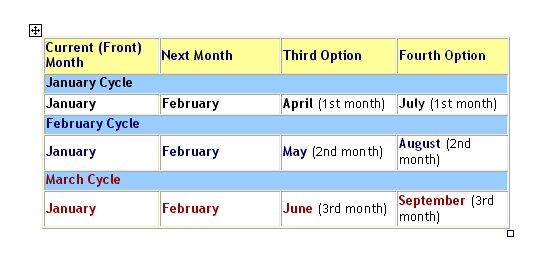

Financial markets often rely on derivatives to manage risk and improve returns. These contracts derive their value from underlying assets such as stocks, bonds, commodities, or market indices. Derivatives can serve as effective tools for hedging against price volatility or for speculating on future price movements.

Trading financial derivatives requires an understanding of their lifecycle, expiration options, and the numerous trading strategies that can be employed. Among these strategies, algorithmic trading plays a significant role by leveraging technology to optimize execution. This article will provide insights into the trading cycle of financial derivatives, examine the importance of options expiration, and discuss the impact of algorithmic trading on crafting effective trading strategies.



## Table of Contents

## Understanding Financial Derivatives

Financial derivatives are financial instruments whose value is dependent on the value of one or more underlying assets, such as stocks, bonds, commodities, currencies, or market indices. These instruments primarily include options, futures, forwards, and swaps, each offering unique characteristics, benefits, and associated risks for traders. 

Options are contracts that give the holder the right, but not the obligation, to buy or sell an underlying asset at a predetermined price within a specified time frame. This flexibility allows traders to hedge against unfavorable price movements while enabling them to profit from favorable changes in the asset's price.

Futures, on the other hand, are standardized contracts obligating the purchase or sale of an asset at a predetermined price on a specific future date. The standardized nature of these contracts makes them highly liquid and useful for hedging or speculating on price movements.

Forwards are similar to futures but are non-standardized contracts, typically traded over-the-counter (OTC), allowing customization concerning contract size, asset type, and settlement date. This customization facilitates tailor-made risk management strategies but often comes at the cost of reduced liquidity compared to futures.

Swaps involve the exchange of cash flows or financial instruments between parties. For example, an [interest rate](/wiki/interest-rate-trading-strategies) swap might involve exchanging fixed interest rate payments for floating rate payments, thus allowing each party to benefit from favorable interest rate movements.

The value of a derivative is inherently linked to its underlying asset. This relationship can, in some cases, be mathematically modeled using formulas such as the Black-Scholes-Merton model for options pricing:

$$
C = S_0N(d_1) - Xe^{-rt}N(d_2)
$$

Where:
- $C$ is the call option price.
- $S_0$ is the current price of the stock.
- $X$ is the strike price of the option.
- $t$ is the time to expiration.
- $r$ is the risk-free interest rate.
- $N()$ is the cumulative distribution function of the standard normal distribution.
- $d_1 = \frac{\ln(S_0/X) + (r + \sigma^2/2)t}{\sigma\sqrt{t}}$
- $d_2 = d_1 - \sigma\sqrt{t}$
- $\sigma$ is the volatility of the stock's returns.

These mathematical models enable traders to price derivatives accurately, manage risks, and make informed trading decisions. By leveraging derivatives, traders not only aim to mitigate the adverse effects of price [volatility](/wiki/volatility-trading-strategies) but also capitalize on opportunities for speculative profits in financial markets.

## Options Trading and Expiration Cycles

Options trading represents a significant facet of the derivatives market, granting traders the right, though not the obligation, to buy or sell an asset at a predetermined price within a defined period. This distinctive feature of options provides flexibility and leverage to the market participants, allowing them to manage risk or speculate on price movements.

The essence of options trading lies in understanding the concept of expiration cycles. Each option contract has an expiration date, which is the deadline by which the right to exercise the option must be utilized. The expiration cycle determines this timeframe, directly influencing the option's strategic use and intrinsic value.

Options expiration cycles are usually segmented as monthly, quarterly, or yearly. Monthly options are the most common, typically expiring on the third Friday of each month. These recurring expirations create predictable cycles that traders can exploit to align their strategies with expected market conditions. Quarterly options, conversely, expire at the end of each fiscal quarter, often used for strategies aligned with broader economic indicators or earnings reports. Yearly options provide even longer durations for strategic maneuvers, beneficial for those adopting more extended outlooks or hedging approaches against long-term market shifts.

The timing of an option's expiration can significantly impact trading decisions. As an option approaches its expiration date, its time value diminishes—a concept known as theta decay, which affects the option's overall valuation. Therefore, traders must consider both timing and market movement predictions to optimize their strategies.

In conclusion, mastering the nuances of options trading, particularly regarding expiration cycles, equips traders with the ability to craft strategies that capitalize on time and market movements, enhancing their overall portfolio performance. Understanding these cycles is fundamental in leveraging options' unique attributes to meet various investment goals.

## The Significance of Options Expiration Dates

An option’s expiration date plays a pivotal role in derivatives trading by determining the time frame within which an option can be exercised. The value of an option is intrinsically linked to its expiration date, as the time remaining until expiration influences both its intrinsic and time value. Intrinsic value arises from the difference between the current price of the underlying asset and the option's strike price, while time value reflects the potential for future price movements before expiration.

As the expiration date nears, options traders must make critical decisions regarding their holdings. Options can be exercised to secure the underlying asset at the strike price, left to expire worthless if deemed unprofitable, or rolled over to extend market exposure. This roll-over technique involves closing an option position before its expiration and opening a new one with a later date, allowing traders to stay engaged with anticipated market moves[1].

The strategy chosen at expiration can significantly impact potential gains or losses. Exercising an option could lock in profits if the market trend aligns with the anticipated direction. Alternatively, if market conditions shift unfavorably, allowing the option to expire might prove less costly, saving on exercise and commission fees. Conversely, rolling the position over can perpetuate exposure to favorable market conditions, although it entails premium costs and potential [liquidity](/wiki/liquidity-risk-premium) risks.

Time decay, or theta, accelerates as expiration approaches, decreasing the option's time value. This decay must be incorporated into the strategic decision-making process, as it affects option pricing and risk management. Traders utilizing algorithmic models often incorporate these mathematical elements to simulate expiration scenarios, assisting in formulating optimal strategies.

In summary, understanding and strategically managing an option's expiration date is crucial for optimizing potential returns and mitigating risks. By carefully evaluating market conditions and employing disciplined decision-making processes, traders can effectively navigate options expiration, balancing strategic objectives with exposure to market volatility.

---

[1] Hull, J. C. (2017). *Options, Futures, and Other Derivatives*. Pearson Education Limited.

## Algorithmic Trading in Derivatives Markets

Algorithmic trading involves using computer algorithms to automate and optimize trading decisions, execution, and strategies in financial markets. In the derivatives markets, the complexity and rapid pace make [algorithmic trading](/wiki/algorithmic-trading) particularly beneficial. Algorithms can process large volumes of market data and execute trades at speeds and efficiencies unattainable for human traders, offering significant competitive advantages.

#### Managing Positions

Derivatives trading requires effective management of dynamic positions, as prices can be highly sensitive to market movements. Algorithms facilitate this by constantly analyzing market conditions and adjusting positions according to predefined strategies. These programs can automatically rebalance portfolios, ensuring the risk levels remain within acceptable bounds. For example, the adjustment of delta-neutral positions in the options markets can be automated using:

$$
\Delta_{\text{portfolio}} = \sum (\Delta_{\text{option}} \times \text{number of contracts})
$$

This formula maintains delta neutrality, where $\Delta_{\text{portfolio}}$ is kept near zero, ensuring the portfolio's value remains stable concerning small movements in the underlying asset's price.

#### Executing Roll Strategies

Roll strategies are crucial for maintaining exposure in expiring derivatives. As options contracts approach expiration, traders often need to roll their positions into later expiration dates to manage ongoing exposure. Algorithms facilitate these operations by evaluating expirations, pricing new contracts, and executing trades with minimal market impact. They can be programmed to optimize the roll process by analyzing factors such as implied volatility, liquidity, and transaction costs.

#### Mitigating Risks

Algorithms are instrumental in risk mitigation related to options expiration. As the expiration date approaches, issues such as pin risk and sudden volatility changes become prominent. By employing historical data and predictive analytics, algorithms can anticipate these risks and adjust strategies accordingly. For instance, algorithms can automatically hedge options positions by purchasing put options or short selling corresponding assets, further enhancing the position's safety and stability.

#### Precision and Efficiency

The precision and efficiency of algorithms are crucial for navigating the intricate trading cycles of derivatives. Algorithms ensure consistently high accuracy in executing trades at optimal prices and times, significantly reducing slippage and market impact. With the ability to analyze vast datasets in real-time, algorithms can spot patterns, predict future movements, and react instantaneously, attributes that are invaluable for exploiting fleeting market opportunities and informed decision-making.

In conclusion, algorithmic trading has transformed derivatives markets by adding layers of efficiency, precision, and risk management that manual trading cannot achieve. The continued advancement in computational power and [machine learning](/wiki/machine-learning) algorithms promises further evolution and sophistication in derivatives trading strategies.

## Managing Risks in Options Trading

Risk management is crucial in options trading, serving as a safeguard against unfavorable market conditions. Within this domain, traders must contend with various expiration-related risks, such as pin risk and auto-exercise, which can significantly impact their positions.

Pin risk arises when the market price of an underlying asset closes at or near the strike price of an option at expiration. This situation can create uncertainty about whether the option will be exercised, leading to unanticipated positions for traders. For example, if a trader holds a call option on a stock with a strike price of $50, and the stock closes exactly at $50, the trader cannot predict whether holders of the corresponding short position will exercise their options. This uncertainty can result in unexpected long or short positions, which may require rapid adjustments and increase exposure to market volatility.

Auto-exercise, on the other hand, is an option clearing procedure executed by clearing houses or brokers, where in-the-money options are automatically exercised at expiration. While this feature can be beneficial for ensuring that valuable options are not left unexercised, it can also lead to unwanted positions if the trader had not planned for the exercise. The potential for auto-exercise necessitates careful monitoring and strategic decision-making as expiration approaches.

Utilizing algorithmic trading strategies can aid traders in anticipating potential risks and establishing hedge positions to manage these risks effectively. Algorithms can process large datasets, identify patterns, and execute trades rapidly, enhancing the ability to hedge against adverse movements. By incorporating volatility forecasting and liquidity models, these systems can optimize the timing and size of hedging trades.

For instance, consider a Python script employing a basic option hedging strategy. This script could use the `NumPy` and `pandas` libraries to analyze historical price data and estimate implied volatility. Utilizing this information, the algorithm can determine the optimal hedge ratio and execute trades accordingly:

```python
import numpy as np
import pandas as pd
from scipy.stats import norm

# Load historical data
data = pd.read_csv('historical_prices.csv')
stock_prices = data['Close'].values
option_strike = 50.0
risk_free_rate = 0.01
expiry_days = 30

# Calculate implied volatility
returns = np.log(stock_prices[1:] / stock_prices[:-1])
implied_volatility = np.std(returns) * np.sqrt(252)

# Black-Scholes formula for pricing European call options
def black_scholes_call_price(S, K, T, r, sigma):
    d1 = (np.log(S / K) + (r + 0.5 * sigma ** 2) * T) / (sigma * np.sqrt(T))
    d2 = d1 - sigma * np.sqrt(T)
    call_price = S * norm.cdf(d1) - K * np.exp(-r * T) * norm.cdf(d2)
    return call_price

# Compute hedge ratio (delta)
current_price = stock_prices[-1]
time_to_expiry = expiry_days / 365.0
delta = norm.cdf((np.log(current_price / option_strike) + 
                  (risk_free_rate + 0.5 * implied_volatility ** 2) * time_to_expiry) /
                 (implied_volatility * np.sqrt(time_to_expiry)))

# Execute hedge
hedge_position = delta * 100  # Assumes 100 shares per option
print(f"Hedge Position: {hedge_position} shares")

# Place orders based on hedge position (pseudo-code)
# trading_system.place_order('buy', current_price, hedge_position)
```

In this example, the script calculates the implied volatility from historical price data and uses the Black-Scholes model to determine the optimal hedge ratio (delta). The algorithm then provides guidance on the necessary hedge position, allowing traders to mitigate the risks associated with options expiration. By employing algorithmic trading strategies, traders can dynamically adjust their positions, ensuring that they are well-prepared for expiration-related challenges.

## Conclusion

Understanding the intricacies of financial derivatives trading cycles, particularly options expiration, is crucial for traders aiming to achieve success in the derivatives markets. Navigating these markets successfully requires a comprehensive grasp of how options expiration can affect trading strategies and the value of option positions. As options approach their expiration dates, traders face critical decisions regarding exercising options, allowing them to expire worthless, or rolling them over to extend their market exposure. These choices significantly influence potential outcomes, thus impacting both profits and losses.

Algorithmic trading plays an indispensable role in this context, providing traders with the capability to execute strategies with precision and manage risks effectively. Algorithms enable traders to execute trades at speeds and efficiencies beyond human capability, thereby optimizing the execution of complex strategies necessary to navigate various trading cycles. In derivatives markets, algorithmic trading is invaluable for managing positions effectively, conducting roll strategies, and mitigating risks associated with options expiration. 

As trading technology continues to advance, staying updated on these emerging tools and strategies will be fundamental for participants in the derivatives markets. Automated systems and algorithmic strategies are likely to evolve, increasing their sophistication and impact on trading. Consequently, market participants must remain informed about these developments to maintain a competitive edge. The integration of these advanced technologies will continue to play a pivotal role in shaping the future of financial derivatives trading, thereby underscoring the importance of continuous learning and adaptation in this fast-evolving landscape.

## References & Further Reading

[1]: Hull, J. C. (2017). ["Options, Futures, and Other Derivatives"](https://www.semanticscholar.org/paper/Options%2C-Futures%2C-and-Other-Derivatives-Hull/89bdee500c8623864fc9eb7a471546aa713acc44). Pearson Education Limited.

[2]: Black, F., & Scholes, M. (1973). ["The Pricing of Options and Corporate Liabilities."](https://www.cs.princeton.edu/courses/archive/fall09/cos323/papers/black_scholes73.pdf) Journal of Political Economy, 81(3), 637-654.

[3]: de Prado, M. L. (2018). ["Advances in Financial Machine Learning"](https://www.amazon.com/Advances-Financial-Machine-Learning-Marcos/dp/1119482089). Wiley.

[4]: Chan, E. P. (2009). ["Quantitative Trading: How to Build Your Own Algorithmic Trading Business"](https://github.com/ftvision/quant_trading_echan_book). Wiley.