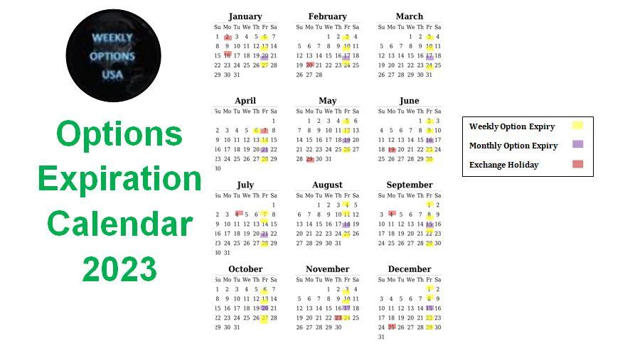

## Table of Contents

## What is an options expiration date?

An options expiration date is the last day that an options contract can be traded or exercised. Options are financial tools that give the buyer the right, but not the obligation, to buy or sell an asset at a certain price before this date. When the expiration date arrives, the contract either becomes worthless if it's not used, or it leads to the buying or selling of the asset if it is exercised.

After the expiration date, the options contract no longer exists. This means that if you own an option and you want to use it, you must do so before the expiration date. If you don't, you will lose the money you paid for the option. This date is important for people trading options because it affects their strategies and decisions on when to buy or sell options.

## Why are options expiration dates important?

Options expiration dates are important because they tell you the last day you can use your option. If you have an option to buy or sell something, you need to do it before this date. If you don't, the option will expire and you will lose the money you paid for it. This date helps you plan when to make your move, whether you want to buy, sell, or just let the option go.

These dates also affect how people trade options. Traders watch these dates closely because they can change the value of options. As the expiration date gets closer, the value of an option can change a lot. This can make options more exciting to trade but also riskier. Knowing when an option will expire helps traders decide the best time to buy or sell options to make the most money or lose the least.

## How are options expiration dates determined?

Options expiration dates are set by the options exchange where the options are traded. Each exchange has its own rules about when options can expire. Usually, options expire on the third Friday of the month, but this can change depending on the type of option and the exchange's rules. For example, some options might expire on a different day or even every week.

The date is important because it tells everyone when the option will stop trading. This helps traders plan their moves. They know they have to act before the expiration date if they want to use the option. The exchange decides these dates far in advance so everyone knows when they are and can plan accordingly.

## What happens to an option on its expiration date?

On its expiration date, an option can either be exercised or it will expire worthless. If you own a call option, which gives you the right to buy something, and the price of that thing is higher than the price set in your option, you might choose to exercise your option. This means you buy the thing at the lower price set in your option. If you own a put option, which gives you the right to sell something, and the price of that thing is lower than the price set in your option, you might choose to exercise your option to sell it at the higher price set in your option.

If the price of the thing you have an option on is not better than the price set in your option, you will probably let your option expire worthless. This means you lose the money you paid for the option. On the expiration date, the option stops trading, and you have to decide whether to use it or lose it. This is why the expiration date is so important; it's your last chance to do something with your option.

## What are the different types of options expiration (e.g., monthly, weekly)?

There are different types of options expiration, like monthly and weekly. Monthly options expire on the third Friday of the month. They are the most common type of options and are used by many traders. Weekly options, on the other hand, expire every Friday. They give traders more chances to trade options and can be more exciting because things can change quickly.

Some options also have longer expiration dates, like quarterly or even yearly options. These are less common but can be useful for people who want to plan far ahead. No matter the type, the expiration date is important because it tells you when you need to act if you want to use your option.

## How does the expiration date affect the value of an option?

The expiration date affects the value of an option because it tells you how much time is left before the option goes away. The more time left, the more valuable the option can be. This is because there's more time for the price of the thing you have an option on to move in a way that makes your option worth using. As the expiration date gets closer, the value of the option can go down because there's less time for the price to move in your favor.

When the expiration date is near, options can become more exciting to trade but also riskier. If the price of the thing you have an option on is close to the price set in your option, the value of your option can change a lot in a short time. Traders watch the expiration date closely because it can help them decide the best time to buy or sell options to make the most money or lose the least.

## What is the significance of the last trading day before expiration?

The last trading day before an option expires is important because it's your last chance to trade the option before it goes away. This day is usually the day before the expiration date, which is often a Thursday if the option expires on a Friday. If you want to sell your option to someone else or buy a new one, you have to do it by the end of this day. After this day, you can't trade the option anymore.

This day can also affect the value of your option a lot. As the expiration date gets closer, the value of an option can change quickly. If the price of the thing you have an option on is close to the price set in your option, the value can go up or down a lot on this last trading day. Traders pay close attention to what happens on this day because it can help them decide what to do with their options.

## What are the risks associated with holding an option until expiration?

Holding an option until its expiration date can be risky. One big risk is that if the price of the thing you have an option on doesn't move in the way you need it to, your option could expire worthless. This means you lose all the money you paid for the option. For example, if you have a call option that lets you buy a stock at a certain price, but the stock's price stays below that level until expiration, your option will be worth nothing.

Another risk is that the value of your option can change a lot as the expiration date gets closer. This can make trading more exciting but also more dangerous. If the price of the thing you have an option on is very close to the price set in your option, the value can swing wildly on the last trading day. This means you could make a lot of money or lose a lot very quickly. It's important to watch the market closely and be ready to act if you decide to hold your option until it expires.

## How can an investor manage options positions as expiration approaches?

As the expiration date of an option gets closer, an investor needs to think about what to do with their options. One way to manage options positions is to sell them before they expire. If the option has value, selling it can help the investor get some money back. Another way is to exercise the option if it's in the investor's favor. This means using the option to buy or sell the thing it's based on at the price set in the option. If the investor thinks the price will keep moving in their favor, they might choose to exercise the option.

Another strategy is to roll over the option. This means closing the current option and opening a new one with a later expiration date. This can give the investor more time for the price to move in the right direction. Sometimes, doing nothing is also an option. If the investor thinks the option will expire worthless and they don't want to lose more money, they might just let it go. No matter what the investor decides, it's important to watch the market closely and be ready to act as the expiration date approaches.

## What are the tax implications of options expiring in-the-money versus out-of-the-money?

When an option expires in-the-money, it means the price of the thing you have an option on is better than the price set in your option. If you let it expire without using it, the option might be automatically exercised by your broker. This can lead to taxes. If it's a call option and you end up buying the thing, you might have to pay taxes on any profit you make when you sell it later. If it's a put option and you end up selling the thing, the tax depends on how long you owned it and whether it's a short-term or long-term gain.

If an option expires out-of-the-money, it means the price of the thing you have an option on is not better than the price set in your option. In this case, the option will expire worthless, and you lose the money you paid for it. There's no tax on the loss of the option itself, but you might be able to use the loss to reduce your taxes on other gains. It's a good idea to talk to a tax professional to understand how options expiring in-the-money or out-of-the-money can affect your taxes.

## How do options expiration dates impact trading strategies?

Options expiration dates play a big role in how traders plan their moves. When traders know when an option will expire, they can decide if they want to buy, sell, or hold onto the option. For example, if a trader thinks the price of a stock will go up before the expiration date, they might buy a call option. But if they think the price won't move enough, they might sell the option before it expires to get some money back. The expiration date also affects how much an option is worth. As the date gets closer, the value of the option can change a lot, making trading more exciting but also riskier.

Traders use different strategies based on how close the expiration date is. Some traders might use a strategy called "rolling over," where they close their current option and open a new one with a later expiration date. This gives them more time for the price to move in their favor. Others might choose to exercise their option if it's in-the-money, meaning they can buy or sell the stock at a better price than the current market price. If an option is out-of-the-money and likely to expire worthless, a trader might just let it go to avoid losing more money. Knowing when an option will expire helps traders make smart choices about what to do with their options.

## What advanced strategies can be used to take advantage of options expiration dates?

One advanced strategy to take advantage of options expiration dates is called a "gamma [scalping](/wiki/gamma-scalping)" or "delta-neutral trading." This strategy involves buying options and then trading the underlying stock to keep the overall position balanced. As the expiration date gets closer, the value of the option can change a lot. Traders use this to their advantage by making small trades in the stock to make money from these changes. It's a bit like riding a wave; as the option's value goes up and down, the trader adjusts their position to stay on top of the wave.

Another strategy is called "calendar spread." This involves buying an option with a longer expiration date and selling an option with a shorter expiration date, both on the same stock and at the same strike price. The idea is to make money from the difference in how fast the two options lose value as time goes on. As the shorter-term option gets closer to its expiration date, its value might drop faster than the longer-term option. Traders can then close out the position before the shorter-term option expires, hoping to make a profit from the difference in how the two options are affected by time.

A third strategy is "straddles" or "strangles," which are used when a trader thinks a stock's price will move a lot but isn't sure which way. In a straddle, the trader buys a call option and a put option with the same expiration date and strike price. In a strangle, the options have different strike prices but the same expiration date. As the expiration date approaches, if the stock's price moves a lot in either direction, one of the options will gain value while the other loses value. The goal is to make more money from the winning option than is lost on the losing one. These strategies can be exciting but also risky, so traders need to be careful and watch the market closely.

## How do expiration dates affect options valuation?

The expiration date is a pivotal aspect in options valuation, influencing both the intrinsic and time values. An option's intrinsic value is determined by the difference between the current price of the underlying asset and the option's strike price. For a call option, the intrinsic value is calculated as:

$$
\text{Intrinsic Value}_{\text{Call}} = \max(0, S - K)
$$

where $S$ is the current stock price, and $K$ is the strike price. For a put option, the formula is:

$$
\text{Intrinsic Value}_{\text{Put}} = \max(0, K - S)
$$

Time value, on the other hand, diminishes as the expiration date approaches, a concept known as time decay. This decay accelerates as the option nears its expiration. The time value is a crucial part of the option's premium, representing the potential of further favorable movements in the underlying asset's price. Options pricing models, such as the Black-Scholes model, incorporate time decay by using the variable $t$, which denotes the time to expiration in years. The general representation of an option's time value can be expressed as:

$$
\text{Total Value} = \text{Intrinsic Value} + \text{Time Value}
$$

As expiration looms, the time value approaches zero, making intrinsic value the primary component of the option's price.

Moneyness is another key [factor](/wiki/factor-investing) affected by expiration. It classifies options into in-the-money (ITM), at-the-money (ATM), and out-of-the-money (OTM). At expiration, ITM options, where the intrinsic value is greater than zero, are typically exercised. Conversely, OTM and ATM options, having no intrinsic value, expire worthless. 

Understanding these valuation principles is imperative for anticipating potential outcomes in options trading. For instance, an option highly OTM with little time remaining is likely to expire worthless unless the underlying asset's price changes dramatically. Thus, analyzing intrinsic value, time decay, and moneyness enables traders to project profit/loss scenarios effectively, optimizing their strategies accordingly.

## References & Further Reading

[1]: CBOE. ["Understanding Weekly Options."](https://www.cboe.com/available_weeklys/)

[2]: Black, F., & Scholes, M. (1973). ["The Pricing of Options and Corporate Liabilities."](https://www.cs.princeton.edu/courses/archive/fall09/cos323/papers/black_scholes73.pdf) The Journal of Political Economy.

[3]: Hull, J. C. (2018). ["Options, Futures, and Other Derivatives."](https://www.semanticscholar.org/paper/Options%2C-Futures%2C-and-Other-Derivatives-Hull/89bdee500c8623864fc9eb7a471546aa713acc44) Pearson Education.

[4]: Gatheral, J. (2006). ["The Volatility Surface: A Practitioner's Guide."](https://github.com/PlamenStilyianov/Quant/blob/master/Gatheral%20J.%20The%20volatility%20surface..%20A%20practitioner%27s%20guide%20(Wiley%2C%202006)(ISBN%200471792519)(210s)_FD_.pdf) Wiley Finance.

[5]: Taleb, N. N. (1997). ["Dynamic Hedging: Managing Vanilla and Exotic Options."](https://www.amazon.com/Dynamic-Hedging-Managing-Vanilla-Options/dp/0471152803) Wiley Finance.