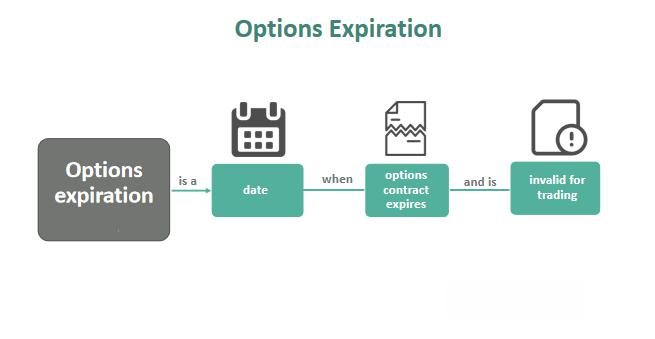

Options trading constitutes a significant part of the financial derivatives market, providing traders and investors with opportunities to hedge risks, speculate on future price movements, and enhance portfolio returns. A fundamental aspect of options trading involves the understanding of expiration dates, which are pivotal to the formulation of trading strategies, accurate pricing, and the management of associated risks.

An option's expiration date determines the final day on which the holder can exercise their right to buy or sell the underlying asset. This timeline affects the time value component of an option's premium, impacting both its valuation and the strategic decisions traders make regarding entering or exiting positions.



Expiration dates in options trading have far-reaching effects on the financial derivatives market. They are essential in designing strategies tailored to diverse market conditions, affecting decisions related to whether to exercise an option or let it expire. These decisions become particularly nuanced when considering different types of options, such as American options, which can be exercised any time before or on the expiration date, and European options, which can only be exercised at expiration.

Algorithmic trading has transformed the approach to managing expiration dates, utilizing advanced algorithms to evaluate market conditions and make informed decisions automatically. These systems are crafted to optimize transaction timing, minimize risks associated with time decay, and adjust positions as expiration dates approach. This integration of technology facilitates more efficient handling of the unique challenges presented by expiration dates, providing traders with a refined toolkit for enhancing their trading outcomes.

By understanding the multifaceted roles of expiration dates in options trading, participants can optimize their strategies and manage trades more effectively. This article aims to equip readers with insights into the mechanisms of expiration dates, their implications for the derivatives market, and the strategic advantages of leveraging algorithmic trading solutions in navigating these complexities.

## Table of Contents

## Basics of Expiration Dates in Options Trading

Expiration dates are fundamental to understanding options trading as they define the last day when the contract remains valid. For traders, comprehending these dates is essential because they directly impact the option's overall value and determine the strategic approaches taken.

Options are primarily categorized into two types based on their exercise features: American and European options. American options provide the flexibility to be exercised at any point up to and including the expiration date, offering increased strategic maneuverability to traders. On the other hand, European options can only be exercised strictly on the expiration date. This distinction significantly influences the timing of exercising rights and thereby affects the investor's approach to managing options.

Expiration dates affect the value of the option through components such as intrinsic value and time value. The intrinsic value is the tangible gain that could be realized if the option were to be exercised immediately. Meanwhile, the time value is related to the potential for further gain before expiration, which diminishes as the expiration date approaches.

The duration of the expiration date also correlates to the option's premium. Typically, options with longer expiration dates [carry](/wiki/carry-trading) higher premiums. This is due to the additional time value incorporated into the option, providing greater potential for the underlying asset's price to move favorably. For instance, if an option's price is represented by $C = IV + TV$, where $C$ is the option premium, $IV$ is the intrinsic value, and $TV$ is the time value, longer timelines generally increase $TV$, elevating $C$.

Consider a Python example to calculate the time value of an option:

```python
def time_value(option_price, intrinsic_value):
    return option_price - intrinsic_value

# Example data
option_price = 10  # premium
intrinsic_value = 5

tv = time_value(option_price, intrinsic_value)
print("Time Value:", tv)
```

Understanding the interplay between expiration dates and these valuation aspects enables traders to anticipate how their strategies might unfold over time. Hence, the choice of expiration date is a critical [factor](/wiki/factor-investing) in managing option trading strategies effectively, as it impacts both the financial outcome and risk management practices.

## Types of Options Based on Expiration

Options can be classified based on their expiration timelines into daily, weekly, monthly, or long-term options, each serving different trading and investment objectives.

Daily options, often referred to as 0DTE (zero days to expiration), expire at the end of the trading day. They present immediate trading opportunities and are frequently utilized by day traders who seek to capitalize on short-term market movements. The daily expiration provides high [liquidity](/wiki/liquidity-risk-premium) and the potential for rapid gains, albeit with increased risk due to their brief lifespan.

Weekly options, which expire at the end of each trading week, offer more flexibility compared to daily options. They allow traders to manage short-term positions while still providing some degree of temporal maneuverability. Weekly expirations have gained popularity as they enable targeted trading strategies around specific events or market conditions within the week.

Monthly options are considered traditional avenues for options trading, providing longer timeframes for investors to formulate and execute their strategies. These options expire on the third Friday of each month, offering a balance between time decay considerations and strategic planning. Monthly options are favored by traders who wish to align their positions with broader market trends or corporate announcements.

Long-term Equity Anticipation Securities (LEAPS) are options with expiration dates extending up to two or more years from the date of issuance. LEAPS are ideal for investors engaging in long-term hedging or speculative strategies, as they provide extended time horizons to benefit from substantial market movements. The long-term nature of these options allows investors to ride out market fluctuations, potentially accruing significant value.

The distinct timelines for each type of option cater to diverse trader profiles, ranging from risk-seeking day traders to strategic long-term investors, offering tailored opportunities across different market conditions.

## How Expiration Dates Affect Options Valuation

The expiration date is a pivotal aspect in options valuation, influencing both the intrinsic and time values. An option's intrinsic value is determined by the difference between the current price of the underlying asset and the option's strike price. For a call option, the intrinsic value is calculated as:

$$
\text{Intrinsic Value}_{\text{Call}} = \max(0, S - K)
$$

where $S$ is the current stock price, and $K$ is the strike price. For a put option, the formula is:

$$
\text{Intrinsic Value}_{\text{Put}} = \max(0, K - S)
$$

Time value, on the other hand, diminishes as the expiration date approaches, a concept known as time decay. This decay accelerates as the option nears its expiration. The time value is a crucial part of the option's premium, representing the potential of further favorable movements in the underlying asset's price. Options pricing models, such as the Black-Scholes model, incorporate time decay by using the variable $t$, which denotes the time to expiration in years. The general representation of an option's time value can be expressed as:

$$
\text{Total Value} = \text{Intrinsic Value} + \text{Time Value}
$$

As expiration looms, the time value approaches zero, making intrinsic value the primary component of the option's price.

Moneyness is another key factor affected by expiration. It classifies options into in-the-money (ITM), at-the-money (ATM), and out-of-the-money (OTM). At expiration, ITM options, where the intrinsic value is greater than zero, are typically exercised. Conversely, OTM and ATM options, having no intrinsic value, expire worthless. 

Understanding these valuation principles is imperative for anticipating potential outcomes in options trading. For instance, an option highly OTM with little time remaining is likely to expire worthless unless the underlying asset's price changes dramatically. Thus, analyzing intrinsic value, time decay, and moneyness enables traders to project profit/loss scenarios effectively, optimizing their strategies accordingly.

## Role of Expiration Dates in Algorithmic Trading

Algorithmic trading leverages computer algorithms to execute trades based on pre-defined criteria, including expiration dates in options trading. Expiration dates impact algorithmic strategies significantly due to their influence on option pricing, risk management, and trading dynamics.

Algorithms are frequently designed to automatically adjust positions as expiration dates approach. Time decay, which is the reduction in an option's value as it nears its expiration, is a major risk factor that algorithms aim to mitigate. By incorporating mathematical models such as the Black-Scholes or the Binomial Options Pricing Model, algorithms can anticipate changes in option value, known as the Greeks. The time decay, represented by the Greek letter Theta (Θ), is at its highest near expiration. Algorithms typically factor in Theta to optimize the timing and magnitude of trades, ensuring that the adverse effects of time decay are minimized.

Moreover, the expiration date of options can lead to significant market reactions due to shifts in liquidity and trading volumes. As options near expiry, liquidity may increase due to heightened activity, as traders adjust their positions. This can cause price fluctuations that algorithms need to manage. For instance, large options expiries can lead to liquidity imbalances, creating opportunities for algorithms to exploit [arbitrage](/wiki/arbitrage) or hedging strategies.

Algorithmic strategies often monitor option Greeks, such as Delta, Gamma, and Vega, which measure sensitivity to different market factors. Adjustments based on these Greeks help in maintaining the delta neutrality of a portfolio, especially as expiration approaches. Below is a Python snippet illustrating a simplified approach to adjust positions based on Theta:

```python
def calculate_time_decay(option_premium, theta, days_to_expiry):
    # Calculates the time decay of an option
    decay = theta * days_to_expiry
    new_premium = option_premium - decay
    return new_premium

# Example usage
option_premium = 100  # Current premium
theta = 0.5          # Daily Theta
days_to_expiry = 5   # Days left to expiry

adjusted_premium = calculate_time_decay(option_premium, theta, days_to_expiry)
print(f"New Option Premium after Time Decay: {adjusted_premium}")
```

In summary, the strategic consideration of expiration dates in options trading can bolster [algorithmic trading](/wiki/algorithmic-trading) effectiveness. By preemptively managing risks related to time decay and liquidity variations, algorithms can optimize trading outcomes, providing a robust framework for modern financial markets.

## Selecting the Optimal Expiration Date

Choosing an expiration date is a critical decision in options trading, as it largely determines the effectiveness of a trader’s strategy, aligns with market conditions, and matches risk tolerance levels. Traders with different time horizons face distinct challenges and opportunities when selecting expiration dates.

Short-term traders might opt for weekly or daily expirations, called daily expiration or "zero days to expiration (0DTE)" options, due to their benefits of immediacy and the potential for quick profits. These shorter-term options allow traders to capitalize on rapid market movements and exploit short-lived price patterns. Conversely, long-term investors often select LEAPS (Long-term Equity Anticipation Securities) due to their extended expiration periods, which are beneficial for hedging large positions or implementing long-term speculative strategies.

Several factors influence the optimal choice of expiration date, including market [volatility](/wiki/volatility-trading-strategies), option premiums, and the trader's specific goals. Volatility, a measure of how much the price of the underlying security is expected to fluctuate, plays a pivotal role. In volatile markets, shorter expiration dates can lead to higher premiums, reflecting the increased uncertainty and potential for significant price swings. However, these higher premiums can also inflate the cost of entering positions, impacting the risk/reward balance.

Using the Greeks, a set of risk measures in options trading, provides additional insights for expiration date selection. Delta, for instance, measures the option price's sensitivity to movements in the underlying asset’s price. Gamma indicates the rate of change in Delta. Theta, which reflects time decay, becomes essential when considering expiration. As expiration approaches, Theta increases, indicating that the option's time value diminishes rapidly. Rho measures sensitivity to [interest rate](/wiki/interest-rate-trading-strategies) changes, and Vega shows sensitivity to volatility changes. By analyzing these Greeks, traders can gain a clearer understanding of how different expiration dates might impact their positions.

Python can aid in performing such analyses programmatically. For instance, the following Python snippet demonstrates how to compute the Greeks for a given option:

```python
from scipy.stats import norm
import numpy as np

def calculate_greeks(S, K, T, r, sigma, option_type="call"):
    # S: current stock price
    # K: strike price
    # T: time to expiration (in years)
    # r: risk-free interest rate
    # sigma: volatility of the underlying asset
    # option_type: 'call' or 'put'

    d1 = (np.log(S / K) + (r + 0.5 * sigma**2) * T) / (sigma * np.sqrt(T))
    d2 = d1 - sigma * np.sqrt(T)

    delta = norm.cdf(d1) if option_type == "call" else norm.cdf(d1) - 1
    gamma = norm.pdf(d1) / (S * sigma * np.sqrt(T))
    theta = -(S * norm.pdf(d1) * sigma) / (2 * np.sqrt(T)) - r * K * np.exp(-r * T) * norm.cdf(d2)
    theta = theta / 365  # per day
    vega = S * norm.pdf(d1) * np.sqrt(T)
    rho = K * T * np.exp(-r * T) * norm.cdf(d2)

    return delta, gamma, theta, vega, rho

# Example usage
current_price = 100
strike_price = 100
time_to_expiration = 30 / 365  # 30 days
risk_free_rate = 0.01
volatility = 0.2

greeks = calculate_greeks(current_price, strike_price, time_to_expiration, risk_free_rate, volatility)
print("Delta:", greeks[0])
print("Gamma:", greeks[1])
print("Theta (per day):", greeks[2])
print("Vega:", greeks[3])
print("Rho:", greeks[4])
```

Selecting the optimal expiration date involves a balance between individual trading preferences and the dynamics of the market environment. By aligning expiration choices with a coherent strategy, informed by market analysis tools like the Greeks, traders can enhance their potential for success in options trading.

## Conclusion

Understanding expiration dates and their implications is essential for effective trading in financial derivatives. Expiration dates are a cornerstone in options trading, significantly influencing the intrinsic and time values of options, which in turn affects pricing and strategy. Recognizing how these factors interact allows traders to develop strategies that maximize returns while minimizing risk.

Incorporating expiration dates within algorithmic trading frameworks further enhances risk management and strategic planning. Algorithmic trading enables traders to automate decision-making processes, accounting for the complexities associated with expiration dates. By deploying algorithms that automatically adjust trading positions as expiration approaches, traders can mitigate risks associated with time decay and fluctuations in volatility. This automation not only improves efficiency but also ensures that traders can react swiftly to market changes, leveraging expiration-driven opportunities.

Mastering the intersection of options expiration, valuation, and algorithmic trading equips traders with the tools needed to make informed decisions. This comprehensive understanding allows for a strategic approach, where decisions are driven by data and prediction models, thus enhancing the potential for profitable outcomes. Employing advanced tools like the Greeks and valuation models further refines this decision-making process, providing a quantitative basis for evaluating potential scenarios and outcomes.

As the financial markets continually evolve, being adept in navigating expiration dates and their implications becomes a vital skill. This knowledge empowers traders to adapt to the complexities of the market, ensuring they remain competitive and effective in their trading endeavors. By integrating a robust understanding of expiration dates with algorithmic strategies, traders are positioned to exploit market inefficiencies and optimize their trading performance.

## References & Further Reading

[1]: CBOE. ["Understanding Weekly Options."](https://www.cboe.com/available_weeklys/)

[2]: Black, F., & Scholes, M. (1973). ["The Pricing of Options and Corporate Liabilities."](https://www.cs.princeton.edu/courses/archive/fall09/cos323/papers/black_scholes73.pdf) The Journal of Political Economy.

[3]: Hull, J. C. (2018). ["Options, Futures, and Other Derivatives."](https://www.semanticscholar.org/paper/Options%2C-Futures%2C-and-Other-Derivatives-Hull/89bdee500c8623864fc9eb7a471546aa713acc44) Pearson Education.

[4]: Gatheral, J. (2006). ["The Volatility Surface: A Practitioner's Guide."](https://github.com/PlamenStilyianov/Quant/blob/master/Gatheral%20J.%20The%20volatility%20surface..%20A%20practitioner%27s%20guide%20(Wiley%2C%202006)(ISBN%200471792519)(210s)_FD_.pdf) Wiley Finance.

[5]: Taleb, N. N. (1997). ["Dynamic Hedging: Managing Vanilla and Exotic Options."](https://www.amazon.com/Dynamic-Hedging-Managing-Vanilla-Options/dp/0471152803) Wiley Finance.