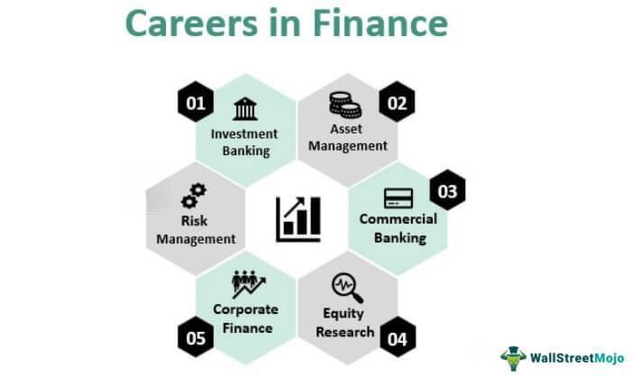

Options trading is an intricate and dynamic segment of the financial markets designed to provide investors with unique opportunities for hedging, speculation, and enhancing income. It involves the use of contracts, known as options, which grant the investor the right, but not the obligation, to buy or sell an underlying asset at a specified price before a certain expiration date. This flexibility allows investors to tailor their market positions to align with specific financial goals, risk appetites, and market expectations.

By mastering the principles of options trading, investors can enhance their ability to make informed decisions, thus empowering themselves to benefit from market volatility, hedge against potential losses, or generate additional income. The strategic nature of options trading means that it requires a comprehensive understanding of various market forces and financial instruments, positioning it as both a powerful and complex tool within the investment landscape.

This article aims to highlight the significant contribution of the Options Industry Council (OIC) to the ecosystem of financial education. Founded in 1992, the OIC plays a pivotal role in demystifying the world of options for both seasoned and novice investors. By providing extensive educational resources such as online courses, seminars, and interactive tools, the OIC equips investors with the knowledge required to navigate this intricate field successfully.

Additionally, in today’s rapidly evolving markets, the integration of algorithmic trading into options trading has become increasingly significant. Algorithmic trading leverages technology to enhance the speed and efficiency of trade execution, representing a major technological shift in how options are traded. For investors, understanding the impact of these algorithms and how they interact with traditional trading methods is of utmost importance.

In the discussions that follow, we will address the strategies and resources made available by the OIC aimed at enhancing options trading knowledge and proficiency, while also considering the implications of the rise of algorithmic trading. Informative, knowledgeable investors are better equipped to achieve success in the multifaceted world of options trading.

## Table of Contents

## Understanding Options Trading

Options trading is a significant component of financial markets, allowing investors to engage in speculative activities or hedge against potential risks through the acquisition and disposition of contracts known as options. An option is a derivative financial instrument that derives its value from an underlying asset, such as stocks, bonds, indices, or commodities. It provides the holder with the right, but not the obligation, to buy (call option) or sell (put option) the underlying asset at a predetermined price, known as the strike price, before or at a specified expiration date.

Understanding options trading involves grasping the intricate interplay of market forces and the diverse mechanisms that influence options pricing. Factors such as the price of the underlying asset, [volatility](/wiki/volatility-trading-strategies), time to expiration, and interest rates contribute to the valuation of an option, typically modeled by the Black-Scholes formula or binomial pricing models.

Options serve diverse strategic purposes in financial portfolios. They are instrumental in hedging, allowing investors to mitigate risk exposures in existing positions. For example, purchasing a put option can provide insurance against a decline in the price of a stock an investor already owns. Alternatively, options can be a tool for speculation, enabling traders to capitalize on market movements with potentially higher leverage. Additionally, options can generate income through strategies such as writing covered calls, where an investor sells call options on stocks they own to receive premiums.

Effectively utilizing options necessitates a deep understanding of various strategies and pricing models. Investors must be adept at interpreting market signals, assessing implied volatility, and recognizing the premium's intrinsic and extrinsic components. This knowledge empowers investors to craft strategies that align with their market outlook, whether bullish, bearish, or neutral, thereby optimizing their risk-return profiles.

In conclusion, options trading is a sophisticated market activity that combines elements of financial theory and practical strategy. For investors willing to master the underlying principles and market dynamics, it offers substantial opportunities for risk management and profit generation.

## The Options Industry Council (OIC)

The Options Industry Council (OIC) was established in 1992 as a collective effort by key financial exchanges and trading entities with the fundamental goal of improving the education of investors regarding the complexities of options trading. The OIC operates as a pivotal institution offering a comprehensive suite of educational resources aimed at both individuals with little prior exposure to options trading and those looking to refine advanced trading strategies.

Among the myriad of resources provided by the OIC are online classes that cater to diverse learning preferences, aligning with various skill levels and pace requirements. These classes often contain in-depth modules and interactive content, allowing participants to build a structured understanding of how options function within different market environments. Additionally, the OIC conducts seminars that bring together industry experts and learners to explore cutting-edge trends and practical insights in options trading. These seminars are designed not only to impart knowledge but also to foster networking opportunities among participants.

Webcasts and podcasts further expand the educational spectrum offered by the OIC. Through these mediums, learners can access expert discussions, case studies, and analyses of current market conditions, which they can consume flexibly according to their schedules. This digital content is frequently updated to reflect the dynamism and current challenges faced in the options market, ensuring that investors remain well-informed.

The accessibility of these resources underscores the OIC's commitment to broadening the reach of options education. Whether catering to institutional investors managing significant portfolios, financial advisors seeking to enhance their competencies, or individual investors diving into personal finance, the OIC customizes its offerings to fit diverse needs. The inclusion of straightforward beginner content alongside intricate, strategy-centric material makes the OIC an essential resource for fostering both foundational and advanced knowledge in options trading.

## Educational Resources and Benefits

The Options Industry Council (OIC) is known for its extensive educational resources aimed at enhancing understanding and proficiency in options trading. Its Learning Center serves as a pivotal platform for disseminating knowledge ranging from the fundamentals to complex strategies. This comprehensive approach ensures that individuals at varying levels of proficiency—beginners, intermediate, and expert—can effectively enhance their skill set.

At the core of the OIC's educational offerings are topics that cover essential concepts such as the mechanics of options, associated risks, complex strategies, and the use of options in hedging and income generation. For beginners, resources might include basic definitions and an introduction to options. More advanced learners can access in-depth material on strategy implementation and market dynamics.

An integral part of the Learning Center's toolkit includes options calculators and market quotes, essential tools for traders. These tools assist investors in calculating potential gains, losses, and breakeven points, aiding in informed decision-making. An options calculator, for instance, can be utilized to delineate the potential outcomes of a trade by providing profit and loss estimates based on variable inputs like strike price, expiration date, and volatility.

Additionally, these resources are not static; they are frequently updated to reflect the latest trends and techniques in options trading. The OIC also offers interactive content such as webinars and seminars where traders can learn directly from industry experts. This active engagement helps reinforce theoretical knowledge with practical insights.

In summary, OIC's Learning Center is an invaluable asset for anyone looking to deepen their understanding of options trading. By providing tailored educational resources, the OIC ensures that investors can confidently navigate and capitalize on the opportunities within the options market, regardless of their initial level of knowledge.

## Options Trading Strategies

Options trading strategies are integral to capitalizing on market movements, whether they signal an upward, downward, or stagnant trend. A fundamental aspect of these strategies is their alignment with an investor's market outlook, categorized broadly into bullish, bearish, or neutral perspectives. Understanding these strategies is crucial for investors seeking to optimize returns, manage risks, and leverage the unique characteristics of options contracts.

### Bullish Strategies

Bullish strategies are formulated when an investor anticipates a rise in the market. Common approaches include:

1. **Long Call**: Purchasing a call option gives the investor the right to buy an asset at a specified strike price. This strategy benefits from an increase in the asset's price beyond the strike price plus the premium paid.

   Profit = max[(S - K) - P, 0]

   where $S$ is the stock price, $K$ is the strike price, and $P$ is the premium paid.

2. **Bull Call Spread**: This strategy involves buying a call option at a lower strike price while selling another at a higher strike price, thereby limiting potential gains but also reducing the cost of the initial call.

   $\text{Max Profit} = K_2 - K_1 - \text{Net Premium Paid}$

   $\text{Max Loss} = \text{Net Premium Paid}$

   where $K_1$ and $K_2$ are the lower and higher strike prices, respectively.

### Bearish Strategies

Bearish strategies come into play when an investor expects a market downturn:

1. **Long Put**: This involves purchasing a put option, which allows selling an asset at a predetermined price. It is beneficial when the asset's price drops below the strike price.

   Profit = max[(K - S) - P, 0]

2. **Bear Put Spread**: This includes buying a put at a higher strike price and selling another at a lower strike price. It limits both maximum profit and risk exposure.

   $\text{Max Profit} = K_1 - K_2 - \text{Net Premium Paid}$

   $\text{Max Loss} = \text{Net Premium Paid}$

### Neutral Strategies

Neutral strategies are designed to capitalize on markets expected to remain range-bound:

1. **Iron Condor**: This involves four options: buying a lower strike put, selling a lower-middle strike put, selling a higher-middle strike call, and buying a higher strike call. This strategy profits from low volatility.

   $\text{Max Profit} = \text{Net Premiums Received}$

   $\text{Max Loss} = K_3 - K_2 - \text{Net Premiums Received}$

2. **Straddle**: Buying both a call and put option at the same strike price and expiration date. It is beneficial when anticipating significant price movement in either direction.

   It profits if the stock price deviates significantly from the strike price, either upwards or downwards, by more than the total premiums paid.

### Guidance from the Options Industry Council (OIC)

The OIC provides extensive resources and guidance on selecting appropriate strategies and comprehending the nuances in options pricing. Their educational materials encompass insights into strategies that aim to produce income, manage risk, and exploit market dynamics. By emphasizing tools like options calculators and interactive platforms, the OIC aids investors in applying these strategies effectively and prudently.

## Algorithmic Trading in Options

Algorithmic trading in options has revolutionized how trades are executed in financial markets. This trading method employs pre-programmed instructions—algorithms—to assess variables like price, timing, and [volume](/wiki/volume-trading-strategy), enabling faster and more precise transactions than human traders can achieve. The fundamental advantage of [algorithmic trading](/wiki/algorithmic-trading) lies in its ability to process large volumes of data quickly, allowing investors to capitalize on fleeting opportunities. For instance, algorithms can identify favorable trades based on criteria such as specific price points and market conditions, executing these trades with minimal delay.

Algorithmic trading offers the advantage of precision, crucial in the fast-paced options markets. By using mathematical models and statistical analyses, algorithms can predict stock price movements and optimize trading strategies. This capability enhances the execution of complex strategies, such as straddles, strangles, and butterfly spreads, which involve multiple options contracts. Additionally, algorithms are designed to minimize the market impact by executing trades in smaller, more discreet increments, thus avoiding sudden price shifts that can disadvantage traders.

However, algorithmic trading also introduces new risks. The reliance on technology means that system failures or errors in code could lead to significant financial losses. Furthermore, the use of similar algorithms across different firms can increase the risk of market abnormalities, such as flash crashes, when many algorithms react to a particular market condition simultaneously. This phenomenon underscores the importance of robust risk management systems that include real-time monitoring and fail-safes to mitigate potential adverse effects.

For modern investors, understanding how technology integrates with traditional trading methods is crucial. Successful algorithmic trading requires not only advanced technological infrastructure and expertise in data analysis but also a strong grasp of market dynamics and regulatory developments. Knowledge in this domain allows traders to harness the efficiency of algorithmic systems while minimizing potential downsides. As algorithmic trading continues to evolve, staying informed about technical and strategic innovations is essential for navigating the complexities of options markets effectively.

## Conclusion

The Options Industry Council (OIC) continues to serve as a fundamental resource in the education of options traders. As financial markets become increasingly complex due to advancements like algorithmic trading, the need for ongoing learning and adaptation is more critical than ever. Algorithmic trading, with its reliance on complex algorithms to execute options trades with high speed and precision, introduces both opportunities and challenges. This necessitates a robust understanding of options strategies and technologies to navigate effectively.

For investors, the OIC's comprehensive educational tools are invaluable in comprehending the intricacies of options trading. The materials offered by OIC, ranging from basic concepts to advanced strategies involving algorithms, equip traders with the knowledge required to make informed decisions. By leveraging these resources, investors can develop a deeper understanding of the markets, effectively manage risks, and capitalize on opportunities, thereby enhancing their trading performance.

The continuously evolving nature of financial markets underscores the importance of resources like the OIC. As algorithmic trading and other innovations reshape how trades are executed, traders must integrate this technological knowledge with traditional trading principles. This ensures they remain competitive and capable of navigating the complexities inherent in options trading. Therefore, embracing educational resources provided by the OIC is not just beneficial but essential for anyone looking to thrive in today's dynamic trading environment.

## References & Further Reading

[1]: ["Option Volatility and Pricing: Advanced Trading Strategies and Techniques"](https://www.amazon.com/Option-Volatility-Pricing-Strategies-Techniques/dp/0071818774) by Sheldon Natenberg

[2]: Black, F., & Scholes, M. (1973). ["The Pricing of Options and Corporate Liabilities."](https://www.cs.princeton.edu/courses/archive/fall09/cos323/papers/black_scholes73.pdf) Journal of Political Economy, 81(3), 637-654.

[3]: Boyle, P. P. (1977). ["Options: A Monte Carlo Approach."](https://www.sciencedirect.com/science/article/pii/0304405X77900058) Journal of Financial Economics, 4(3), 323-338.

[4]: ["Options, Futures, and Other Derivatives"](https://www.amazon.com/Options-Futures-Other-Derivatives-10th/dp/013447208X) by John C. Hull

[5]: Harris, L. (2003). ["Trading and Exchanges: Market Microstructure for Practitioners."](https://academic.oup.com/book/52292) Oxford University Press.