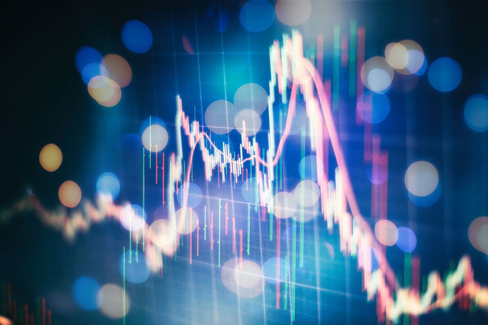

Financial derivatives are vital instruments in today's finance landscape, with options trading being one of the most influential sectors. Derivatives derive their value from the performance of underlying assets, such as stocks or commodities, making them essential tools for both risk management and speculation. In particular, options trading provides market participants with unique strategies to optimize their portfolio's risk-reward profile, allowing for strategic maneuvers in both bullish and bearish market conditions.

The integration of algorithmic trading with options has revolutionized the derivatives arena, enhancing the speed, accuracy, and quality of trading decisions. Algorithmic trading employs computer algorithms to execute trades based on pre-defined criteria, thus offering a level of precision and efficiency unattainable by traditional means. This technological synergy empowers traders to optimize their options strategies, enabling them to respond adeptly to ever-changing market dynamics.



Understanding how financial derivatives, particularly options, interact with algorithmic trading technologies is critical for any participant aiming to navigate the complexities of modern markets successfully. The evolution of this synergy represents a paradigm shift, offering new avenues for education and development within the financial sector. This article aims to provide a comprehensive overview of options trading, the broader derivatives market, and the significance of algorithmic trading in financial education, setting the stage for informed investment strategies and enhanced market participation.

## Table of Contents

## Understanding Financial Derivatives

Financial derivatives are financial instruments whose value is contingent upon that of an underlying asset, which can include stocks, bonds, commodities, currencies, or indices. These instruments are integral to modern financial markets, serving critical roles in risk management, speculative investments, and [arbitrage](/wiki/arbitrage) opportunities.

### Fundamental Types of Derivatives

Three primary types of financial derivatives are options, futures, and swaps:

1. **Options**: An option grants the holder the right, but not the obligation, to buy (call option) or sell (put option) an underlying asset at a predetermined price on or before a specified date. Options provide flexibility and are utilized for hedging risks or speculating on asset price movements without the need to hold the underlying asset directly.

2. **Futures**: A futures contract obligates the buyer to purchase, and the seller to sell, an underlying asset at a predetermined future date and price. Futures are standardized contracts and are typically traded on exchanges. They are prominently used for hedging and mitigating risks associated with commodity price fluctuations, interest rates, and currency exchange rates.

3. **Swaps**: Swaps are over-the-counter contracts in which two parties exchange cash flows or liabilities from two different financial instruments. The most common types are interest rate swaps and currency swaps, serving to manage risk in fluctuating interest rates or currency exchange rates.

### Market Efficiency and Derivatives

Financial derivatives are pivotal in enhancing market efficiency. They allow participants to:

- **Manage Risk**: By using derivatives, investors can hedge against potential losses in their investment portfolios. For example, a farmer might use futures contracts to lock in prices for their crops, ensuring financial predictability irrespective of market conditions at the time of sale.

- **Speculate**: Investors can speculate on the future price movement of an asset without the need to own it outright. This can lead to significant gains or losses, contingent upon market predictions.

- **Leverage Opportunities**: Derivatives provide opportunities to gain exposure to an asset's price movements with a minimal upfront investment compared to the actual purchase of the asset. This leverage amplifies both potential returns and risks.

### Trends and Regulatory Demands

Recent trends in the financial derivatives market indicate a rising demand for technologically advanced products, such as those incorporating [algorithmic trading](/wiki/algorithmic-trading) and [machine learning](/wiki/machine-learning) to forecast market movements. Additionally, regulation-compliant products are gaining traction as global regulatory bodies strive to enhance transparency and reduce systemic risks following financial crises.

In response to these regulatory demands, there is an ongoing development of derivatives that are easier to monitor and report. Enhanced regulatory frameworks are designed to limit excessive risk-taking and ensure that derivative-related transactions are conducted in a sound and transparent manner.

Understanding these fundamental aspects of financial derivatives equips market participants with the necessary knowledge to effectively navigate and capitalize on the opportunities present within global financial markets.

## Investment Strategies with Financial Derivatives

Financial derivatives are versatile financial instruments that serve as key components in crafting sophisticated investment strategies. These instruments allow investors to hedge risks and speculate on various financial markets, broadening their investment portfolios. By offering a range of strategic options, derivatives can be optimized to take advantage of both favorable market conditions and hedge against unfavorable ones.

Covered calls, protective puts, and iron condors are three popular derivative strategies that investors employ for income generation and risk management. A covered call involves holding a long position in a stock while simultaneously selling a call option on the same stock. This strategy helps generate additional income from option premiums but caps the upside potential of owning the stock. On the other hand, a protective put involves purchasing a put option for a stock that an investor already owns, providing downside protection by allowing the investor to sell the stock at the put's strike price, thus acting as an insurance policy against a falling market.

Iron condors are more complex strategies that involve the use of four options contracts with different strike prices. An investor sells an out-of-the-money put and call, while simultaneously buying a further out-of-the-money put and call. This results in a net credit, and the strategy profits when the stock price remains within a certain range, reflecting low [volatility](/wiki/volatility-trading-strategies). Each of these strategies helps investors navigate economic landscapes by balancing potential risks and rewards.

Diversification is another crucial aspect of managing risk with financial derivatives. By spreading investments across various asset classes and derivative instruments, investors can reduce portfolio volatility and potentially enhance returns. Diversification involves allocating assets in such a way that reduces unsystematic risk, which is specific to individual investments. This allocation strategy is underpinned by Modern Portfolio Theory (MPT), which promotes optimizing a portfolio's expected return based on a given level of risk, or equivalently minimizing risk for a given level of expected return.

Market conditions play a significant role in determining the effectiveness of these derivative strategies. Factors such as interest rates, economic indicators, volatility indexes, and geopolitical events can influence the performance of specific derivatives. Consequently, investors must remain adaptive and regularly review their positions to ensure that their strategies align with current market conditions. For example, during periods of heightened market volatility, protective puts become more attractive to safeguard against substantial downturns, whereas covered calls may be more advantageous in stable, upward-trending markets.

In conclusion, derivatives enable elaborate strategies for both hedging and speculation, offering investors tools to navigate the complexities of global financial markets. By employing strategies like covered calls, protective puts, and iron condors, and leveraging the principles of diversification, investors can manage risk and potentially enhance portfolio returns. However, the success of these strategies requires a keen understanding of market conditions and the ability to adapt to their shifts and fluctuations.

## Algorithmic Trading: A Modern Approach

Algorithmic trading, commonly referred to as algo trading, employs computer-implemented algorithms to execute trading orders with enhanced speed and precision compared to traditional methods. These algorithms are pre-programmed with specific rules and criteria, enabling them to analyze vast quantities of market data to identify trading opportunities. By automating the decision-making process, algo trading reduces the impact of human emotions and errors, subsequently enhancing trading efficiency and accuracy.

Advanced algorithms are capable of processing real-time data to evaluate numerous variables affecting the market. These include price movements, [volume](/wiki/volume-trading-strategy), and time, all of which contribute to the dynamic nature of financial markets. A notable advantage of algorithmic trading is its ability to initiate trades at optimal times, thereby reducing transaction costs and improving execution quality. For instance, algorithms can break larger trades into smaller segments and execute them over a specific period to minimize market impact and slippage.

```python
import numpy as np
from scipy.optimize import minimize

# Example of a simple trading strategy using moving averages
def moving_average(prices, window):
    return np.convolve(prices, np.ones(window), 'valid') / window

def strategy(prices, short_window=40, long_window=100):
    short_ma = moving_average(prices, short_window)
    long_ma = moving_average(prices, long_window)
    return np.where(short_ma > long_ma, 1, 0)

# Simulate a trading decision
prices = np.random.rand(200)
signal = strategy(prices)

print("Trading signal:", signal)
```

Despite the numerous benefits, algorithmic trading requires a profound understanding of both finance and technology. Traders and financial institutions must possess the technical capability to develop and maintain sophisticated models, as well as the financial acumen to interpret the outputs of these models correctly. The integration of disciplines such as computer science, data analytics, and quantitative finance is essential to navigate the complexities inherent in algorithmic trading.

Overall, the emergence of algo trading has revolutionized financial markets by facilitating rapid, data-driven decision-making. However, staying abreast of technological advancements and regulatory changes remains vital for those engaged in algorithmic trading to ensure continued success and compliance in an ever-evolving landscape.

## Integrating Algo Trading with Options Trading

Algo trading, or algorithmic trading, significantly enhances options trading by increasing the speed and efficiency of trade executions. The integration of computer algorithms allows traders to implement complex strategies more precisely than traditional methods. A key advantage is the capability of analyzing large volumes of data, thus fostering improved decision-making processes within options trading.

Machine learning and [artificial intelligence](/wiki/ai-artificial-intelligence) (AI) play a pivotal role in developing predictive models that refine options strategy outcomes. These technologies can identify patterns and insights from historical and real-time market data that might elude human traders. For instance, machine learning algorithms can be constructed to assess various market conditions and predict potential price movements. A Python-based example of a simple predictive model using historical options data could be as follows:

```python
from sklearn.model_selection import train_test_split
from sklearn.linear_model import LinearRegression
import pandas as pd

# Load historical options data
data = pd.read_csv('options_data.csv')

# Features and target
X = data[['strike_price', 'time_to_maturity', 'historical_volatility']]
y = data['option_price']

# Train-test split
X_train, X_test, y_train, y_test = train_test_split(X, y, test_size=0.2, random_state=42)

# Model training
model = LinearRegression()
model.fit(X_train, y_train)

# Prediction
y_pred = model.predict(X_test)
```

Big Data further expands the potential of these models by providing vast datasets for training, enabling the creation of robust algorithms capable of accurate market movement predictions and option premium evaluations. The greater the data diversity and volume, the more refined the predictive insights these algorithms can offer.

Successful options trading strategies facilitated by algo trading often include those like delta-neutral and straddle approaches. A delta-neutral strategy, for example, involves constructing a portfolio where the overall delta is zero, mitigating the risk associated with small price changes in the underlying asset. Algorithmic precision allows for real-time adjustments to maintain this neutrality, even as market conditions fluctuate.

Straddle strategies, which involve buying a call and put option at the same strike price and expiration date, benefit from algorithmic trading by determining optimal entry and [exit](/wiki/exit-strategy) points through rapid data analysis and market condition assessment. This allows traders to capitalize on volatility without needing to predict the direction of the price movement.

In conclusion, the integration of algo trading with options trading unleashes enhanced capabilities for traders, allowing them to devise sophisticated, data-driven strategies that adapt to ever-changing market landscapes. The fusion of technological tools and financial acumen results in not only the execution of well-informed trades but also in achieving a competitive edge in the derivatives market.

## Risk Management in Derivatives and Algo Trading

Effective risk management is a cornerstone of successful derivatives and algorithmic trading. By combining techniques like position sizing, stop-loss orders, and advanced metrics, traders aim to mitigate potential losses and navigate the complexities of financial markets.

Position sizing involves determining the number of units to invest in a particular derivative to control the risk of significant losses. By calculating the trade size relative to the account size and setting a predefined risk per trade, traders can optimize their portfolios. The formula for position sizing could be expressed as:

$$
\text{Position Size} = \frac{\text{Account Risk}}{\text{Trade Risk}}
$$

where Account Risk is the percentage of the total portfolio risked per trade, and Trade Risk is the difference between the entry price and the stop-loss level.

Stop-loss orders are vital in managing risk by automatically closing a position at a predetermined price level, limiting potential losses. These orders are especially useful in volatile markets, where rapid price changes can lead to significant losses if not managed effectively.

Advanced metrics such as Value at Risk (VaR) and Conditional Value at Risk (CVaR) are essential for assessing portfolio risk. VaR estimates the potential loss in value of a portfolio over a defined period for a given confidence interval. CVaR goes a step further by providing the expected loss exceeding the VaR, offering a more comprehensive risk assessment.

Algorithmic trading incorporates these risk management practices through automated rules and adaptive strategies. By leveraging algorithms, traders can integrate real-time risk assessment and execute risk management tasks with precision, enhancing their ability to respond to volatile market conditions swiftly.

Case studies underscore the significance of robust risk management frameworks. For instance, the 2010 Flash Crash demonstrated how algorithmic trading without proper risk controls could precipitate market turmoil. On May 6, 2010, the U.S. stock market experienced a dramatic dip and recovery within minutes, largely fueled by high-frequency trading algorithms. This event highlighted the necessity of integrating circuit breakers and other control mechanisms within trading algorithms to curb such drastic events.

In conclusion, effective risk management is crucial for traders focusing on derivatives and leveraging algorithmic trading strategies. By methodically applying position sizing, utilizing stop-loss mechanisms, and employing advanced metrics, traders can better manage market risks, underscoring the importance of continuous improvement in risk management practices to safeguard against unforeseen market events.

## Future Trends in Financial Derivatives and Algo Trading

Artificial Intelligence (AI) and machine learning are profoundly reshaping the landscape of financial derivatives and algorithmic trading. These technologies enable traders to develop advanced models that can analyze vast datasets, identifying subtle patterns and correlations in market behavior that were previously undetectable. Consequently, AI-driven algorithms can generate more accurate forecasts, optimize trading strategies, and enhance decision-making processes. The integration of machine learning techniques, such as supervised and unsupervised learning, facilitates the continuous improvement of these models, allowing them to adapt to changing market conditions and improving their predictive capabilities over time.

Blockchain technology also plays a crucial role in the future of derivatives markets, offering significant improvements in transparency and efficiency. The introduction of smart contracts—self-executing contracts with the terms of the agreement directly written into code—can automate and streamline complex derivatives transactions. These digital contracts reduce the need for intermediaries, minimize counterparty risk, and ensure that trades are executed as per the agreed-upon conditions, which increases overall market trust and reliability.

Regulatory changes are another [factor](/wiki/factor-investing) influencing the derivatives market. With growing emphasis on transparency and risk management, regulators are pushing for enhanced reporting standards and more stringent oversight of derivative transactions. This evolving regulatory environment necessitates that market participants remain vigilant and adaptable, incorporating compliance measures into their trading practices while leveraging technologies capable of navigating complex regulatory landscapes.

Lastly, the advancement of adaptive trading strategies is expected to play an indispensable role in future trading ecosystems. As market conditions become increasingly volatile due to technological disruptions, economic fluctuations, and geopolitical events, traders must employ dynamic approaches to remain competitive. These strategies may involve leveraging real-time analytics, incorporating sentiment analysis from diverse data sources, and utilizing AI to adjust models in response to market signals swiftly. Continuous innovation and adaptation will be essential in capitalizing on opportunities and managing risks in a rapidly evolving financial environment.

## Conclusion

Understanding financial derivatives and options trading is essential for effectively navigating the complexities of modern financial markets. These instruments offer nuanced ways to manage risks and exploit opportunities that arise from market fluctuations. In particular, the synergy between strategic investment practices and algorithmic trading enhances the ability of market participants to maximize benefits while mitigating risks. 

Algorithmic trading enhances the execution of strategies by leveraging speed and precision, allowing traders to capitalize on real-time data and market movements. This integration with options trading not only reduces human error but also provides the ability to process large volumes of data for informed decision-making. For instance, machine learning models can improve predictive accuracy in pricing options and managing portfolios by rapidly analyzing market trends and historical data.

Continuous learning and adaptation are vital in this dynamic field. Financial markets are influenced by technological advances, regulatory changes, and global economic conditions, requiring participants to stay informed and agile. By keeping pace with these developments, traders can refine their strategies and maintain a competitive edge. Technological tools such as artificial intelligence, big data analytics, and blockchain are reshaping the derivatives landscape, offering new avenues for innovation and efficiency.

Ultimately, a thorough understanding of both the theoretical and practical aspects of derivatives and algo trading equips investors with the tools necessary to navigate financial markets successfully. Engaging with educational resources and leveraging cutting-edge technology remain critical components of a robust trading strategy.

## References & Further Reading

For those seeking to expand their understanding of financial derivatives and algorithmic trading, several resources offer comprehensive insights:

**Academic Textbooks**: Foundational works such as "Options, Futures, and Other Derivatives" by John C. Hull and "Algorithmic Trading and DMA" by Barry Johnson provide in-depth theoretical and practical knowledge on derivative markets and algorithmic trading strategies. These texts cover essential concepts, advanced strategies, and market dynamics essential for both novice and experienced participants.

**Financial News Outlets**: Keeping abreast of current market trends and developments is crucial. Publications like The Wall Street Journal, Financial Times, and Bloomberg offer regular updates and analysis on financial derivatives, market movements, and technological advancements impacting trading strategies.

**Online Trading Platforms**: Platforms such as Interactive Brokers, TD Ameritrade, and E*TRADE provide valuable resources, including tutorials, webinars, and tools designed to enhance one's trading skills. These platforms often offer paper trading features, enabling users to practice strategies without financial risk.

**Programming Communities and Online Courses**: Proficiency in programming languages, especially Python, is essential for developing and understanding algorithmic trading. Platforms like Coursera, edX, and Udacity offer courses on data science, machine learning, and financial modeling. Additionally, communities like Stack Overflow and GitHub host a wealth of shared algorithms and code snippets that can serve as practical examples.

A solid grasp of algorithmic concepts can be bolstered by engaging with educational content focused on machine learning frameworks such as TensorFlow or PyTorch. Learning how to implement predictive models in Python could involve libraries like NumPy and pandas for handling data, Scikit-learn for modeling, and Matplotlib or Seaborn for data visualization.

By utilizing these resources, traders and financial analysts can enhance their strategy formulation, risk management practices, and overall market participation. Engaging continually with educational and practical content cultivates a robust toolkit necessary for successful navigation of today's evolving financial landscape.