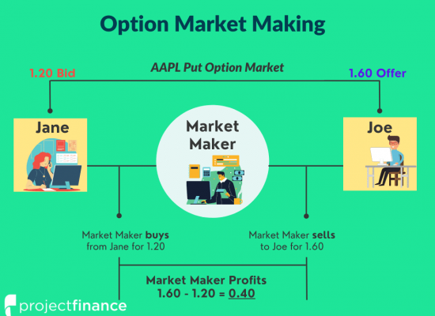

The options market-making process, facilitated by algorithmic trading, plays a pivotal role in the financial ecosystem. Advanced algorithms are employed by market makers to provide liquidity, ensuring smooth functioning of markets by continuously quoting buy and sell prices for various options. This dynamic environment allows traders to execute orders with minimal delay, contributing to a more efficient marketplace.

This article aims to explore the intricacies of options market-making through algorithmic trading, highlighting the strategies employed by market makers, the benefits of using algorithms, and the potential challenges faced in this rapidly evolving industry. By using sophisticated algorithms, market makers are able to handle considerable volumes of transactions, adjust to market movements with precision, and manage risk effectively.



The synergy between options trading and algorithmic methods significantly enhances market efficiency and creates substantial opportunities for traders to capitalize on market movements and arbitrage potential. Through algorithmic techniques, the complexities of pricing, hedging, and executing trades are streamlined, allowing market makers to maintain a competitive edge in responding to ever-changing market conditions.

Algorithmic trading in options market-making significantly reduces the latency between market fluctuations and the responses by traders. This reduction in latency enables traders to exploit brief arbitrage windows and adjust positions promptly in response to market signals. Consequently, the role of algorithmic trading is not only to improve liquidity but also to establish a competitive environment where transactions are executed with unparalleled accuracy and speed. This technological advancement has transformed option market-making, fertilizing ground for future improvements in market efficiency and trader profitability.

## Table of Contents

## Understanding Options Market-Making

Market-making in options is a fundamental activity within the financial markets, centered around the practice of simultaneously quoting buy (bid) and sell (ask) prices for options contracts. This dual quoting system is crucial as it allows market participants to participate in trading without the need to find opposing independent buyers or sellers. By facilitating transactions, market makers ensure that the market remains liquid and efficient. As market makers take on the risk of potential price fluctuations between the execution of trades, they perform a critical role in market stability.

The core objective of options market-making is to capitalize on the bid-ask spread, which is the difference between the prices quoted for buying and selling an option. The wider the spread, the greater the potential profit for market makers, provided they manage their risk exposures effectively. The process entails using sophisticated algorithmic systems that continuously compute pricing models to determine optimal bid and ask levels. These levels are reassessed rapidly to adjust to ongoing market conditions.

Automated systems, integral to modern market-making, enhance the efficiency and speed of operations. They allow trades to be executed at a pace far exceeding human capabilities, reducing the time window in which a market maker is exposed to unfavorable price movements. These systems rely on advanced computational models and real-time data analytics to assess and react to market dynamics.

The rapid execution enabled by automation can be represented by high-frequency trading ([HFT](/wiki/high-frequency-trading-strategies)) strategies. Python, a popular programming language in financial technologies, can be used to demonstrate a simple automated trading strategy that focuses on capturing the bid-ask spread:

```python
import pandas as pd
import numpy as np

# Sample pseudo-code for a simple market-making strategy
def market_making_strategy(market_data):
    # Initialize parameters
    spread = 0.02  # example bid-ask spread
    inventory = 0

    # Loop through market data
    for index, row in market_data.iterrows():
        # Hypothetical market conditions
        current_price = row['market_price']

        # Setting bid and ask prices
        bid_price = current_price - (spread / 2)
        ask_price = current_price + (spread / 2)

        # Simple conditions to simulate market-making
        if row['market_order'] == 'buy':
            # Sell to the market order
            inventory -= 1  # Sell one option
            print(f"Selling at {ask_price}")

        elif row['market_order'] == 'sell':
            # Buy from the market order
            inventory += 1  # Buy one option
            print(f"Buying at {bid_price}")

    return inventory

# Example market data
market_data = pd.DataFrame({
    'market_price': np.random.uniform(50, 60, 100),  # Random price data
    'market_order': np.random.choice(['buy', 'sell'], 100)  # Random market orders
})

# Execute the strategy
final_inventory = market_making_strategy(market_data)
print(f"Final Inventory Position: {final_inventory}")
```

Through such automated systems, market makers swiftly adjust their bid and ask quotes, contributing to tighter spreads and greater [liquidity](/wiki/liquidity-risk-premium) in the options market. The deployment of these high-speed algorithms ensures that orders are executed at optimal prices while minimizing exposure to market [volatility](/wiki/volatility-trading-strategies), thereby stabilizing the trading environment for all market participants.

## Algorithmic Trading in Options Market-Making

Algorithmic trading in options market-making involves the automation of trade orders using pre-defined computational instructions. Unlike traditional trading methods that rely on manual decision-making, [algorithmic trading](/wiki/algorithmic-trading) allows for the placement of trades at speeds and frequencies that exceed human capabilities. The rapid execution of trades is enabled by algorithms that continuously analyze and interpret market data, identifying optimal trading opportunities in real time.

The primary advantage of algorithmic trading in this context lies in its extraordinary processing power. By leveraging [machine learning](/wiki/machine-learning) and advanced statistical models, these algorithms can sift through vast datasets, gleaning insights from patterns and trends that would be imperceptible to a human observer. This ability allows for almost instant reactions to shifting market signals, ensuring that trades are executed under the most favorable conditions available.

In options market-making specifically, algorithms undertake a variety of complex tasks that are crucial for efficient trading. For instance, option pricing is significantly enhanced through algorithmic methods. By utilizing models like the Black-Scholes or Binomial option pricing models within an automated framework, market makers can swiftly calculate fair values for options, adjusting to real-time market fluctuations.

Hedging is another critical function managed by algorithms in options trading. Using dynamic hedging strategies, algorithms can evaluate and implement positions that mitigate risk exposure from market volatilities. They calculate optimal hedge ratios and execute corresponding transactions, ensuring balanced portfolios that align with predefined risk management criteria.

Moreover, setting risk levels is streamlined through algorithmic approaches. Algorithms continuously monitor market conditions and assess the risk attached to each holding. By using VaR (Value at Risk) or CVaR (Conditional Value at Risk) metrics, trading systems can maintain appropriate exposure levels, automatically recalibrating to adapt to new market information.

In essence, algorithmic trading enhances the capability and efficiency of market makers in the options domain. By integrating sophisticated mathematical models with high-frequency trading technology, algorithms not only facilitate market liquidity but also provide strategic advantages in an environment characterized by continual movement and opportunity.

## Key Strategies for Options Market-Making

In options market-making, the deployment of strategic algorithms is essential to ensuring optimal efficiency, accuracy, and profitability. A key component is the continuous monitoring of market conditions. By leveraging automation, market-makers can execute trades with minimal slippage, enhancing the precision and speed of transactions. Algorithms are designed to process real-time data feeds, evaluating vast amounts of market information to identify and act upon trading opportunities in milliseconds, something that is impossible for human traders.

A critical aspect of options market-making is risk management. Algorithms incorporate sophisticated techniques such as stop-loss mechanisms and dynamic hedging to manage market exposure effectively. Stop-loss mechanisms automatically execute sell orders once a specified price threshold is breached, thereby limiting potential losses. On the other hand, dynamic hedging adjusts the positions of derivatives to maintain a desired level of risk, adapting to changing market conditions. These techniques are programmed within the algorithm to ensure that exposure is managed with precision.

Real-time monitoring is another integral strategy for effective options market-making. Algorithms track fluctuations in both stock and options prices to maintain balanced inventories. This continuous observation allows market makers to recalibrate their strategies as required, aligning their inventory positions with market dynamics. Moreover, algorithms are designed to detect patterns or signals that may indicate market trends, enabling traders to anticipate market movements and adjust their strategies accordingly.

Through these strategies, options market-making algorithms not only facilitate smoother and more efficient trading processes but also help mitigate risks and ensure the market maker's positions remain balanced and risk-managed. The sophisticated integration of automation, risk assessment, and real-time monitoring establishes a robust framework for achieving success in options market-making.

## Risks Associated with Algorithmic Options Market-Making

Algorithmic options market-making presents significant advantages in increasing trading efficiency and liquidity, yet it also introduces several critical risks that require careful management. One of the primary concerns is technical glitches that can occur from unforeseen errors in the algorithms. These errors can arise from coding mistakes, unexpected market conditions not accounted for in the algorithm’s design, or hardware failures. Such glitches can lead to substantial financial losses, especially given the high-speed nature of algorithmic trading which can amplify the impact of errors through rapid trade execution.

Market risks are another vital consideration for algorithmic market makers. The financial markets are inherently volatile, and rapid changes in market conditions can undermine even the most sophisticated algorithmic strategies. For instance, sudden price movements or unusual trading volumes can result in slippage, where the execution price deviates from the intended trade price, potentially resulting in losses. Algorithmic trading strategies must be robust enough to adapt quickly to these market dynamics to mitigate the risks of adverse price fluctuations.

Furthermore, algorithmic traders face stringent regulatory challenges. The high-speed nature and complexity of algorithmic trading necessitate compliance with financial regulations that are continually evolving. Regulators impose strict risk management protocols to ensure market stability and protect against systemic risks. These protocols often require algorithmic traders to implement measures such as circuit breakers to halt trading under specific conditions and regular stress testing of algorithms to ensure resilience against extreme market scenarios.

Ensuring adherence to these requirements demands a robust compliance framework and regular audits of algorithmic systems. This compliance is crucial not only to maintain market integrity but also to avoid potential legal penalties and reputational damage. As algorithmic trading continues to evolve, regulatory scrutiny is expected to intensify, posing additional challenges for market participants in maintaining compliance while achieving their trading objectives.

## Conclusion

Options market-making, driven by the use of algorithmic trading, addresses the essential need for liquidity in financial markets. This liquidity is crucial in ensuring that buyers and sellers can execute trades without causing significant price moves. The integration of advanced algorithms has streamlined the process, allowing market makers to provide tighter bid-ask spreads and more efficient trade executions, which in turn enhances overall market efficiency. 

While the deployment of algorithmic systems in options market-making introduces risks such as technical failures, market volatility, and regulatory hurdles, the strategic use of sophisticated algorithms offers participants a significant competitive advantage. Algorithms optimize trading operations by rapidly processing large data volumes, timely adjusting to market conditions, and managing risk through techniques like dynamic hedging and stop-loss mechanisms. Such capabilities help market participants capitalize on [arbitrage](/wiki/arbitrage) opportunities and improve their trading strategies' overall effectiveness.

The rapidly evolving nature of technology and data processing further bolsters the potential for advancements in algorithmic trading. Innovations in machine learning and [artificial intelligence](/wiki/ai-artificial-intelligence) are likely to enhance the predictive power and decision-making capabilities of trading algorithms. Additionally, increased computational power and access to big data analytics promise to refine the precision and speed of market-making algorithms. These advancements underscore a promising trajectory for algorithmic options market-making, suggesting continued growth and adaptation in response to the ever-evolving financial markets.

## References & Further Reading

[1]: Avellaneda, M., & Stoikov, S. (2008). ["High-frequency trading in a limit order book."](https://people.orie.cornell.edu/sfs33/LimitOrderBook.pdf) Quantitative Finance, 8(3), 217-224.

[2]: Hull, J. C. (2018). ["Options, Futures, and Other Derivatives"](https://www.semanticscholar.org/paper/Options%2C-Futures%2C-and-Other-Derivatives-Hull/89bdee500c8623864fc9eb7a471546aa713acc44). Pearson.

[3]: Cartea, Á., Jaimungal, S., & Penalva, J. (2015). ["Algorithmic and High-Frequency Trading"](https://assets.cambridge.org/97811070/91146/frontmatter/9781107091146_frontmatter.pdf). Cambridge University Press.

[4]: Almgren, R., & Lorenz, J. (2006). ["Bayesian adaptive trading with a daily cycle."](https://www.semanticscholar.org/paper/Bayesian-Adaptive-Trading-with-a-Daily-Cycle-Almgren-Lorenz/fbfe96d06559a685d6acf667d364e21a12f79874) Journal of Trading, 1(4), 38-46.

[5]: Easley, D., López de Prado, M. M., & O'Hara, M. (2012). ["The volume clock: Insights into the high frequency paradigm."](https://papers.ssrn.com/sol3/papers.cfm?abstract_id=2034858) Financial Analysts Journal, 68(2), 3–23.

[6]: Lioui, A. (2019). ["Dynamic risk-based market making."](https://onlinelibrary.wiley.com/doi/abs/10.1111/irfi.12172) Journal of Banking & Finance, 99, 148-162.

[7]: Spooner, T. (2020). ["Machine Learning for Algorithmic Trading"](https://github.com/shannonasmith/Algorithm_books/blob/main/Machine%20Learning%20for%20Algorithmic%20Trading%202e%20(2020).pdf). Packt Publishing.

[8]: Kissell, R., & Malamut, R. (2006). ["Algorithmic decision-making framework."](https://guides.pm-research.com/content/iijtrading/2006/1/82) The Journal of Portfolio Management, 32(4), 86-102.