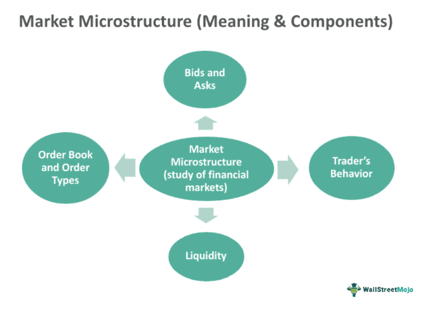

## Table of Contents

## What is the options market and how does it function?

The options market is a part of the financial market where people can buy and sell options. Options are contracts that give you the right, but not the obligation, to buy or sell a specific asset, like a stock, at a certain price before a certain date. This can be useful for investors who want to protect their investments or make money from price changes without buying the actual asset.

In the options market, there are two main types of options: call options and put options. A call option gives you the right to buy an asset at a set price, while a put option gives you the right to sell an asset at a set price. People use these options to bet on whether the price of an asset will go up or down. If the price moves in the direction they predicted, they can make money by exercising their option or selling it to someone else. If the price moves against them, they can let the option expire worthless, limiting their loss to the cost of the option itself.

## What are the basic components of an options contract?

An options contract has a few key parts that you need to know. The first part is the underlying asset. This is the thing, like a stock or a commodity, that the option gives you the right to buy or sell. The second part is the strike price. This is the set price at which you can buy or sell the underlying asset if you choose to use the option. The third part is the expiration date. This is the date by which you have to decide whether to use the option or let it expire.

The fourth part of an options contract is the option type. There are two types: call options and put options. A call option lets you buy the underlying asset at the strike price, while a put option lets you sell it at the strike price. The fifth part is the premium. This is the price you pay to buy the option. It's like the cost of the ticket to get into the game. All these parts together make up an options contract and help you understand what you're getting into when you buy one.

## How do options differ from stocks and other financial instruments?

Options are different from stocks because they give you the right, but not the obligation, to buy or sell an asset at a set price before a certain date. When you buy a stock, you own a piece of the company and can benefit from any increase in its value or suffer from any decrease. With options, you're betting on the future price of the stock without actually owning it. This means you can make money if the stock price moves in the direction you predicted, but you can also lose the money you paid for the option if it doesn't.

Options also differ from other financial instruments like bonds or futures. Bonds are loans you give to a company or government, and you get interest payments over time. Futures are contracts to buy or sell an asset at a set price on a specific future date, and you're obligated to follow through with the transaction. Options, on the other hand, give you flexibility because you can choose whether or not to use them. This makes them useful for managing risk or trying to make money from price changes without a big upfront investment.

## What is market microstructure and why is it important in the context of options?

Market microstructure is all about how trading happens in a market. It looks at things like how orders are placed, how they get matched up, and how prices are set. It's like the behind-the-scenes stuff that makes sure buying and selling can happen smoothly. In the options market, market microstructure is super important because options are a bit more complicated than regular stocks. They have expiration dates and strike prices, so the way they're traded needs to be really organized and clear.

Understanding market microstructure helps traders and investors make better decisions. For example, knowing how orders are filled can help you get a better price for your options. It also helps you understand things like the bid-ask spread, which is the difference between what someone is willing to pay for an option and what someone is willing to sell it for. This spread can affect how much money you make or lose when trading options. So, market microstructure is key to making the options market work well and helping people trade smarter.

## What are the key elements of options market microstructure?

The options market microstructure is all about the nitty-gritty details of how options are bought and sold. It includes things like how orders are placed and matched up, how prices are set, and how trades are settled. One important part is the order book, which is like a list that shows all the buy and sell orders for an option. This helps traders see what prices people are willing to pay or accept. Another key element is the bid-ask spread, which is the difference between the highest price someone is willing to pay for an option (the bid) and the lowest price someone is willing to sell it for (the ask). A smaller spread usually means the market is more liquid and easier to trade in.

Another element of options market microstructure is the role of market makers. These are people or firms that help keep the market running smoothly by always being ready to buy or sell options. They help make sure there's always someone on the other side of a trade, which is important for keeping the market liquid. The way options are traded can also affect the microstructure. For example, options can be traded on exchanges, where everyone can see the prices and orders, or over-the-counter (OTC), where trades happen directly between two parties. Each way of trading has its own rules and can impact how easy or hard it is to buy and sell options.

## How do order types and trading mechanisms affect options market microstructure?

Order types and trading mechanisms play a big role in how the options market works. Different types of orders, like market orders and limit orders, can change how quickly trades happen and what prices people get. A market order means you want to buy or sell an option right away at the best available price. This can make trading faster but might not always get you the best price. A limit order lets you set a specific price you're willing to buy or sell at, which can help you get a better deal but might take longer to fill. The type of order you use can affect the bid-ask spread and how liquid the market is, which are important parts of market microstructure.

Trading mechanisms also matter a lot. Options can be traded on exchanges, where everyone can see the prices and orders, or over-the-counter (OTC), where trades happen directly between two parties. On an exchange, there are rules and systems in place to match up buyers and sellers, which can make trading more organized and transparent. OTC trading can be more flexible but might be less liquid and harder to find a buyer or seller. Both ways of trading affect how easy or hard it is to buy and sell options, and they can impact things like the speed of trades and the prices people get. Understanding these mechanisms helps traders make better decisions and navigate the options market more effectively.

## What role do market makers play in the options market?

Market makers are really important in the options market. They are people or companies that help keep the market running smoothly. They do this by always being ready to buy or sell options. This means if you want to buy an option, a market maker will sell it to you, and if you want to sell an option, they will buy it from you. This helps make sure there's always someone on the other side of a trade, which is important for keeping the market liquid. Without market makers, it might be hard to find someone to trade with, especially for less popular options.

Market makers also help set prices in the options market. They look at things like the current price of the underlying asset, how much time is left until the option expires, and how much the price of the asset might move. Based on this, they decide what price they're willing to buy or sell the option for. This helps create the bid-ask spread, which is the difference between the price someone is willing to pay for an option and the price someone is willing to sell it for. By doing this, market makers help make the market more organized and easier for everyone to trade in.

## How does liquidity impact the options market microstructure?

Liquidity is super important in the options market because it affects how easy it is to buy and sell options. When a market is liquid, there are lots of buyers and sellers, so you can quickly trade options without moving the price too much. This makes it easier for traders to get in and out of positions. If the market isn't liquid, it can be hard to find someone to trade with, and the prices might change a lot when you do find someone. This can make trading riskier and more expensive.

Liquidity also impacts the bid-ask spread, which is the difference between the price someone is willing to pay for an option and the price someone is willing to sell it for. In a liquid market, the spread is usually smaller because there are more people trading, so it's easier to find a good price. A smaller spread means you can buy and sell options for prices that are closer together, which can save you money. In a less liquid market, the spread can be bigger, making it more costly to trade. So, liquidity is a big deal in the options market because it affects how smoothly and cheaply you can trade.

## What are the effects of transaction costs and bid-ask spreads on options trading?

Transaction costs and bid-ask spreads can make a big difference when you're trading options. Transaction costs are the fees you pay every time you buy or sell an option. These costs can add up, especially if you're trading a lot. They can eat into your profits or make your losses bigger. So, it's important to think about these costs when you're deciding whether to trade options. If the costs are too high, it might not be worth it, even if you think the option's price will move in your favor.

The bid-ask spread is another thing to watch out for. It's the difference between what someone is willing to pay for an option (the bid) and what someone is willing to sell it for (the ask). A bigger spread means you'll have to pay more to buy an option and get less when you sell it. This can make trading more expensive and riskier. If you're not careful, the spread can take a big bite out of your money. So, looking for options with smaller spreads can help you keep more of your profits and make trading easier on your wallet.

## How do information asymmetry and adverse selection influence options market dynamics?

Information asymmetry happens when some people know more about an option or its underlying asset than others. This can make the options market tricky because people with more info might make better trading decisions. For example, if someone knows a company is about to announce good news, they might buy call options and make money when the stock price goes up. But people without this info might not buy the options and miss out. This can lead to a situation where the market doesn't work as well as it could because not everyone has the same info.

Adverse selection is a problem that can come from information asymmetry. It happens when people who know more about an option are more likely to trade it. This means that the people who want to buy or sell options might be the ones who know something others don't. For example, if a lot of people are selling a certain option, it might mean they know bad news is coming. This can make other traders nervous and less likely to trade, which can make the market less liquid and the bid-ask spreads bigger. Both information asymmetry and adverse selection can make trading options riskier and more complicated.

## What advanced models are used to analyze options market microstructure?

To understand how the options market works, experts use some fancy math models. One popular model is the Black-Scholes model. It helps figure out what an option should be worth based on things like the price of the stock, how long until the option expires, and how much the stock price might move around. This model is super helpful for traders because it gives them a good idea of what to expect when they buy or sell options. Another model is the binomial options pricing model, which breaks down the life of an option into smaller steps and looks at what might happen at each step. This can be useful for options that might get paid out early or for figuring out the price of options that are a bit more complicated.

There are also models that look at how orders get filled and how prices change in the options market. The Kyle model, for example, looks at how traders with different amounts of information affect the market. It tries to figure out how much someone might know and how that affects the prices they're willing to buy or sell at. Another model, called the Glosten-Milgrom model, looks at how the bid-ask spread changes when people have different info. It helps explain why the spread might be bigger or smaller and how that affects trading. These models help traders and researchers understand the options market better and make smarter decisions.

## How have technological advancements and regulatory changes affected the microstructure of the options market?

Technological advancements have really changed how the options market works. Computers and the internet have made it easier and faster to trade options. Now, you can place orders and see prices in real time, which wasn't possible before. This has made the market more liquid because more people can trade quickly. Also, new tech like high-frequency trading uses computers to buy and sell options super fast, which can affect prices and how orders get filled. This means the market can move really quickly, and traders need to be on their toes to keep up.

Regulatory changes have also had a big impact on the options market. Governments and other groups have made rules to make sure the market is fair and safe for everyone. For example, rules about how much money you need to trade options help keep the market stable. Also, rules about how trades are reported and how prices are set help make the market more transparent. This means everyone can see what's happening and make better decisions. But these rules can also make trading more complicated and might change how easy or hard it is to buy and sell options.

## References & Further Reading

[1]: Hull, J. C. (2017). ["Options, Futures, and Other Derivatives"](https://www.semanticscholar.org/paper/Options%2C-Futures%2C-and-Other-Derivatives-Hull/89bdee500c8623864fc9eb7a471546aa713acc44). Pearson.

[2]: Harris, L. (2003). ["Trading and Exchanges: Market Microstructure for Practitioners"](https://www.amazon.com/Trading-Exchanges-Market-Microstructure-Practitioners/dp/0195144708). Oxford University Press.

[3]: Hasbrouck, J. (2007). ["Empirical Market Microstructure: The Institutions, Economics, and Econometrics of Securities Trading"](https://academic.oup.com/book/52241). Oxford University Press.

[4]: Lopez de Prado, M. (2018). ["Advances in Financial Machine Learning"](https://www.amazon.com/Advances-Financial-Machine-Learning-Marcos/dp/1119482089). Wiley.

[5]: Jarrow, R. A., & Protter, P. (2011). ["Microstructure and Ambiguity"](https://www.semanticscholar.org/paper/A-liquidity-based-model-for-asset-price-bubbles-Jarrow-Protter/513c3c83d9715624fc2d18a9cde705e9f169c88e). Journal of Economics, Dynamics, and Control, 35(9), 1431-1440.

[6]: Chan, E. (2009). ["Quantitative Trading: How to Build Your Own Algorithmic Trading Business"](https://github.com/ftvision/quant_trading_echan_book). Wiley. 

[7]: Aldridge, I. (2013). ["High-Frequency Trading: A Practical Guide to Algorithmic Strategies and Trading Systems"](https://www.amazon.com/High-Frequency-Trading-Practical-Algorithmic-Strategies/dp/1118343506). Wiley.