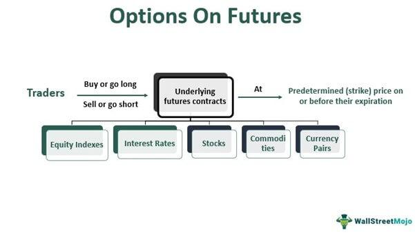

The world of financial derivatives presents a vast array of opportunities for traders and investors, who often utilize these instruments to hedge risks, speculate on price movements, or enhance portfolio performance. At the forefront of these derivatives are futures and options on futures, which serve as essential tools for managing the uncertainty in asset prices. Futures contracts obligate the parties involved to transact an asset at a predetermined price and date, allowing traders to speculate on future prices or mitigate risks associated with price volatility. Options on futures add another dimension by offering the right, without the obligation, to buy or sell a futures contract at a specified price, thus providing traders with enhanced strategic flexibility.

Alongside these derivatives, algorithmic trading has emerged as a pivotal component in modern financial markets, transforming how trades are executed. Algorithms, through the use of sophisticated mathematical models and computational power, automate trading processes, thus enhancing efficiency and precision. Algorithmic trading reduces the emotional biases that human traders might experience and allows for the deployment of complex trading strategies that respond to market conditions in real-time. As a result, market participants can potentially achieve better execution prices and optimize their investment strategies.



By developing a comprehensive understanding of futures, options on futures, and algorithmic trading, traders and investors can navigate the complexities of financial markets more effectively. This knowledge equips them to devise strategies that may optimize portfolio performance and yield substantial financial gains. As financial markets continue to evolve, the integration of these instruments and techniques is critical for traders aiming to maintain a competitive edge.

## Table of Contents

## Understanding Futures and Options on Futures

Futures contracts are financial derivatives that allow traders and investors to speculate or hedge against the future price movements of an underlying asset. These contracts obligate the holder to purchase or sell the asset at a specified price, known as the futures price, on a predetermined future date. This obligation distinguishes futures from other financial instruments and necessitates a thorough understanding of not only the trading strategies but also the risks involved.

Options on futures introduce an additional layer of flexibility to futures trading by providing the holder with the right, but not the obligation, to enter into a futures contract at a specified price known as the strike price, prior to the option's expiration. This flexibility allows traders to mitigate risk and optimize their investment strategies by choosing whether to exercise the option based on market conditions.

The primary difference between futures and options on futures lies in the obligation versus optionality [factor](/wiki/factor-investing). A futures contract commits both parties to the transaction terms specified in the contract, whereas an option on futures grants the holder discretion in exercising the right to buy or sell the futures contract. This optionality comes at a cost, referred to as the option premium, which is the price paid for the potential future opportunity.

In terms of functionality, futures contracts are standardized agreements that trade on exchanges, providing [liquidity](/wiki/liquidity-risk-premium) and ensuring counterparty performance through margin requirements. Traders must maintain a margin account to cover potential losses, and margin calls can be triggered by unfavorable price movements, requiring them to deposit additional funds.

Options on futures, on the other hand, incorporate the same general mechanics as traditional options, with key components including the expiration date, strike price, and option premium. The value of an option is influenced by factors such as the [volatility](/wiki/volatility-trading-strategies) of the underlying asset, time until expiration, and prevailing market conditions, with models like the Black-Scholes used to estimate theoretical pricing.

Both futures and options on futures offer distinct advantages and challenges. Futures contracts provide direct exposure to price movements, which can be beneficial for hedging purposes or speculative endeavors. However, they also necessitate a commitment to the terms of the contract, which can entail significant risk. Options on futures provide flexibility and limited risk exposure, given the right but not the obligation to execute the trade, but this comes with the cost of the option premium and the risk of the option expiring worthless if market conditions are unfavorable. 

By understanding these instruments' definitions, functionalities, and key differences, traders can make informed decisions that align with their financial goals and risk tolerance, ultimately enhancing their market engagement and strategy development.

## How Options on Futures Work

Options on futures function in a manner similar to traditional options, with the difference being that the underlying asset is a futures contract. These options provide traders with the right, though not the obligation, to execute a transaction involving futures contracts at a specified strike price before or on the option's expiration date. Unlike futures contracts—which obligate the parties to execute a trade at an agreed future price—options offer the holder flexibility and potential strategic advantages in market navigation.

**Mechanics of Options on Futures:**

The mechanics of how options on futures work encompass several key components:

1. **Strike Price:** This is the pre-determined price at which the futures contract can be bought (in the case of a call option) or sold (in the case of a put option). The selection of a strike price is crucial as it influences the intrinsic value of the option and, consequently, its price in the market. Options are typically classified as in-the-money, at-the-money, or out-of-the-money based on the relationship between the strike price and the current price of the underlying futures.

2. **Expiration Date:** Similar to other options, those on futures have expiration dates, after which the holder's right to execute the transaction lapses. The time until expiration impacts the time value of an option, contributing to its premium. As expiration approaches, options experience time decay, thereby reducing their value unless the underlying asset's price moves favorably.

3. **Option Premium:** This is the price paid by the option buyer to the seller for the rights conveyed by the option. The premium is influenced by various factors, such as the volatility of the underlying asset, the time until expiration, the difference between the strike price and the current market price of the futures contract, and prevailing market interest rates.

**Key Considerations:**

Several factors must be considered when evaluating and trading options on futures. 

- **Time Decay (Theta):** This represents the erosion of an option's value as time passes. Time decay accelerates as the option approaches expiry, impacting short-term options more dramatically. Traders need to factor in theta when strategizing, particularly if their position relies on holding the option for significant periods.

- **Market Conditions:** Volatility and liquidity in futures markets significantly affect options pricing. Higher volatility typically increases option premiums due to the greater potential for profitable price movements in the underlying futures contract. Conversely, illiquid markets may lead to wider bid-ask spreads, impacting the cost-effectiveness of entering and exiting positions.

Options on futures, therefore, are complex financial instruments that require a sophisticated understanding of the underlying futures contracts and market dynamics. Trading these options demands careful consideration of the aforementioned elements to optimize potential profitability while managing associated risks.

## Algorithmic Trading in Futures and Options Markets

Algorithmic trading, often abbreviated as algo-trading, is a method of executing trades using automated and pre-programmed trading instructions to account for variables such as price, timing, and [volume](/wiki/volume-trading-strategy). In the context of futures and options markets, [algorithmic trading](/wiki/algorithmic-trading) harnesses computer algorithms to identify and exploit market inefficiencies, which often occur due to temporary deviations in asset prices, thereby enhancing trading opportunities.

By leveraging algorithmic trading, traders can significantly minimize human emotions, which often lead to irrational decision-making in high-pressure scenarios. This automation ensures that trades are executed without hesitation according to predefined strategies, resulting in more disciplined trading practices. Moreover, the precision of algo-trading allows for the implementation of complex financial strategies which would be challenging to execute manually due to their speed and intricacy.

A pivotal tool in the development of algorithmic trading strategies is Python, a high-level programming language renowned for its simplicity and powerful libraries tailored for financial analysis and trading. Python's extensive libraries, such as NumPy, pandas, and SciPy, provide robust frameworks for data manipulation and quantitative analysis, key components in designing effective trading algorithms.

For instance, a basic algorithmic trading strategy might involve calculating the moving average of a commodity's price and executing trades based on crossover events. This can be implemented in Python as follows:

```python
import pandas as pd

# Sample data frame with historical price data
data = pd.DataFrame({
    'Date': pd.date_range(start='1/1/2022', periods=100),
    'Price': [100 + x for x in range(100)]  # Example price data
})

data['SMA20'] = data['Price'].rolling(window=20).mean()
data['SMA50'] = data['Price'].rolling(window=50).mean()

# Trading signals based on SMA crossover
data['Signal'] = 0
data.loc[data['SMA20'] > data['SMA50'], 'Signal'] = 1  # Buy
data.loc[data['SMA20'] < data['SMA50'], 'Signal'] = -1  # Sell
```

In this script, the algorithm generates trading signals based on the crossover of 20-day and 50-day simple moving averages (SMA). When the SMA20 crosses above the SMA50, a buy signal is generated, while the opposite condition generates a sell signal. This straightforward example demonstrates how Python can be used to automate trading strategies in the futures and options markets, allowing for timely and efficient execution of complex strategies.

Despite the advantages, algorithmic trading also presents challenges, including the necessity for high-quality data, managing latency issues, and ensuring compliance with evolving regulatory standards. Adequate risk management and thorough [backtesting](/wiki/backtesting) processes are imperative to minimize the potential risks inherent in automated trading. As financial markets continue to evolve, the ability to develop and adapt sophisticated algorithmic trading strategies remains crucial for traders aiming to achieve a competitive edge.

## Benefits and Challenges of Algo-Trading

Algorithmic trading, or algo-trading, has revolutionized the way trading is conducted in the financial markets, providing numerous advantages while presenting certain challenges that require astute management.

One of the primary benefits of algo-trading is increased trading speed. Algorithms can execute trades at speeds impossible for human traders, allowing for the capture of fleeting market opportunities. This rapid execution is crucial, especially in high-frequency trading, where the difference of a few milliseconds can significantly impact profitability.

Accuracy is another advantage, as algorithms can process and analyze vast amounts of data with precision, executing trades based on predefined conditions. This reduces the likelihood of human errors, ensuring that trades align with intended strategies.

Emotion-free decision-making is a significant boon of algo-trading. Human traders are prone to emotional biases, which can lead to irrational decisions, particularly in volatile markets. Algorithms, devoid of emotions, strictly adhere to their programming, ensuring consistency and discipline in trading decisions.

Algo-trading also provides the capability to backtest strategies. Traders can simulate trading strategies using historical data, enabling them to assess the effectiveness and refine approaches before deploying them in live markets. This mitigates potential risks and enhances strategy robustness.

However, algo-trading is not without its challenges. Data quality is a paramount concern, as algorithms are only as good as the data they process. Inaccurate or outdated data can lead to erroneous trading decisions, underscoring the need for reliable and clean datasets.

Latency, or the delay in data processing and trade execution, is another challenge. High latency can erode the edge provided by fast execution speeds, potentially leading to missed opportunities or suboptimal trade placements. Therefore, minimizing latency through advanced technology and infrastructure is critical.

Regulatory compliance is increasingly important, with regulatory bodies imposing stringent rules on trading practices. Algo-traders must ensure that their algorithms comply with all relevant regulations to avoid penalties and maintain market integrity.

Risk management remains a core challenge. Algorithms can generate substantial losses if not properly monitored or if they malfunction. Thus, implementing robust risk management protocols, such as setting stop losses and monitoring trade outcomes, is essential to mitigate potential downsides.

To maximize the benefits while minimizing the challenges of algo-trading, traders can employ several strategies. Ensuring high-quality data, optimizing technological infrastructure for low latency, and maintaining continuous monitoring of algorithms are fundamental. Additionally, staying informed about regulatory changes and consistently testing and updating algorithms can help traders remain compliant and effective.

In summary, while algorithmic trading offers significant advantages in terms of speed, accuracy, and strategic testing, it also presents challenges that necessitate diligent management and continuous adaptation. By leveraging its strengths and addressing its weaknesses, traders can enhance their capability to navigate complex financial markets successfully.

## Advanced Trading Strategies Using Algo-Trading

Statistical [arbitrage](/wiki/arbitrage) and predictive modeling are significant strategies in algorithmic trading, driven by advanced computing and mathematical modeling. Statistical arbitrage, often referred to as stat arb, involves the use of quantitative models to identify pricing inefficiencies between related financial instruments. Traders use statistical methods to evaluate price differences and execute trades designed to exploit these disparities. The strategy typically revolves around mean-reversion principles, where traders anticipate that prices, which deviate from a predicted value, will revert to their expected means. Such strategies require high-frequency trading ([HFT](/wiki/high-frequency-trading-strategies)) systems, which are only feasible through algorithmic trading due to the volume and speed needed to capitalize on these minor inefficiencies.

Predictive modeling with [machine learning](/wiki/machine-learning) allows traders to analyze extensive datasets to forecast future price movements. Machine learning algorithms, particularly those in Python's powerful libraries like Scikit-learn and TensorFlow, can process historical data to predict asset prices. Such models can include linear regression for straightforward prediction tasks, as well as more sophisticated methods like neural networks for non-linear and complex datasets. These techniques are designed to recognize patterns that human analysis might miss, providing traders with a systematic approach to analysis and execution.

Options pricing and Greek analysis play a pivotal role in understanding the risks associated with options trading. The Black-Scholes model and the Greeks—Delta, Gamma, Theta, Vega, and Rho—offer insights into how different factors such as volatility and time decay can affect options pricing. Understanding these dynamics is crucial for developing strategies that can manage risk while potentially enhancing profitability. For instance, Delta measures the sensitivity of an option's price to a $1 change in the underlying asset's price, which helps traders construct delta-neutral portfolios to hedge against price movements.

Python serves as an ideal platform for automating these strategies due to its versatility and the extensive financial libraries available. Libraries such as NumPy and Pandas facilitate data manipulation and analysis. Moreover, algorithmic trading requires integrating real-time data streams and electronic order interfaces, tasks for which Python's compatibility with APIs and robust data-handling capabilities proves beneficial. The following sample code demonstrates a simple framework for using Python in trading:

```python
import pandas as pd
import numpy as np
from sklearn.ensemble import RandomForestRegressor

# Sample data: Historical prices
data = pd.DataFrame({
    'price': [100, 102, 101, 103, 104, 102, 105],
    'volume': [230, 240, 250, 260, 270, 280, 290]
})

# Feature engineering
data['price_change'] = data['price'].pct_change()
data.dropna(inplace=True)

# Model training
X = data[['volume', 'price_change']]
y = np.sign(data['price'].shift(-1) - data['price'])[:-1]
model = RandomForestRegressor()
model.fit(X[:-1], y)

# Prediction
predicted_movement = model.predict(X[-1:])
print('Predicted Movement:', predicted_movement)
```

This code implements a simple machine learning approach to predict price movement based on historical price and volume. While algorithmic trading offers significant advantages, including the automation of intricate strategies, it also involves challenges such as overfitting, data quality, and the need for real-time execution. These elements underscore the necessity of accurate data feeds, reliable trading platforms, and a robust risk management framework to ensure successful algo-trading operations.

## Conclusion

Futures, options on futures, and algorithmic trading are integral components of the financial markets, enabling traders to access a variety of strategies that can enhance their trading performance. By employing these instruments, traders can navigate market complexities with improved efficiency and precision, potentially optimizing their investment outcomes. 

Futures contracts offer a way to speculate or hedge on the future price of various assets, providing traders both leverage and liquidity. Options on futures add another layer of flexibility by giving the right, but not the obligation, to execute futures contracts, allowing for more nuanced strategic planning. This flexibility can be particularly advantageous in managing risk and capitalizing on market opportunities.

Algorithmic trading, with its ability to automate decisions and execute trades at high speed, empowers traders to implement intricate strategies, reduce psychological biases, and exploit market inefficiencies. By harnessing programming languages like Python, traders can develop sophisticated models that utilize [statistical arbitrage](/wiki/statistical-arbitrage), predictive modeling, and other advanced techniques to optimize trading performance.

However, these advantages come with challenges. Market participants must address issues such as data quality, latency, and compliance with regulatory standards. Successful traders are those who balance these factors, continuously learning and adapting to the dynamic nature of financial markets. In doing so, they ensure their strategies remain effective and competitive amidst evolving landscapes.

Overall, the judicious use of futures, options on futures, and algorithmic trading can significantly bolster a trader's ability to achieve their financial goals. Continual education and adaptation remain crucial in maintaining a competitive edge, ensuring that traders can effectively respond to market changes and capitalize on emerging opportunities.

## References & Further Reading

[1]: ["Options, Futures, and Other Derivatives"](https://www.amazon.com/Options-Futures-Other-Derivatives-9th/dp/0133456315) by John C. Hull

[2]: Jabbour, R. & Karmarkar, K. (1994). ["Options on Futures: How to Trade and Invest with Confidence."](https://www.investopedia.com/trading/introduction-options-futures/) Business One Irwin.

[3]: Bhojraj, S., & Sengupta, P. (2003). ["Effect of Debt on the Cost of Equity."](https://www.scirp.org/reference/referencespapers?referenceid=2586801) Journal of Finance and Quantitative Analysis, 38(2), 301-326.

[4]: Narang, R. K. (2009). ["Inside the Black Box: A Simple Guide to Quantitative and High-Frequency Trading."](https://onlinelibrary.wiley.com/doi/book/10.1002/9781118267738) Wiley Finance.

[5]: McKinney, W. (2017). ["Python for Data Analysis: Data Wrangling with Pandas, NumPy, and IPython."](https://wesmckinney.com/book/) O'Reilly Media.

[6]: ["High-Frequency Trading: A Practical Guide to Algorithmic Strategies and Trading Systems"](https://www.ahmetbeyefendi.com/wp-content/uploads/2020/07/High-Frequency-Trading-Irene-Aldridge.pdf) by Irene Aldridge

[7]: ["Designing Automated Trading Systems"](https://www.researchgate.net/publication/271642537_Designing_Automated_Trading_Systems_for_Commodity_Trading_-_Practical_Aspects) by Kevin Davey