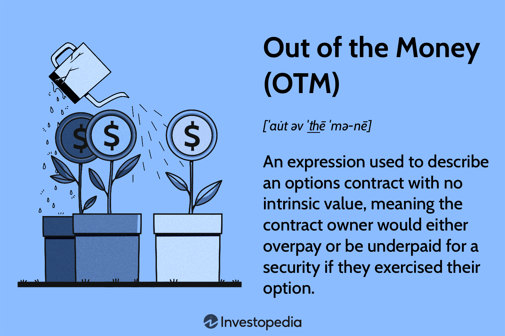

In the intricate world of financial markets, options trading plays a crucial role due to its strategic flexibility and potential to leverage investments. These financial instruments allow investors to manage risk, speculate on price movements, and enhance portfolio returns. A key aspect of options trading is understanding the concept of "Out of the Money" (OTM) options, which is critical, especially when integrated with algorithmic trading strategies.

Options are financial derivatives, meaning their value is derived from an underlying asset, such as stocks, indices, or commodities. Derivatives, in general, are contracts whose value is influenced by fluctuations in the price of the underlying. Within this context, options contracts grant the holder the right, but not the obligation, to buy or sell the underlying asset at a predefined price before a specified expiration date.



In options trading, a distinction is made between two primary types: call options, which give the holder the right to purchase the asset, and put options, which provide the right to sell. Each of these serves different strategic purposes. Understanding whether an option is OTM—meaning it holds no intrinsic value because the market price of the underlying asset does not favor its execution—is crucial. For example, a call option is OTM if the strike price is higher than the market price, while a put option is OTM if the strike price is lower.

Algorithmic trading, which involves the use of computer algorithms to automate trading decisions, can significantly enhance the way OTM options are traded. By incorporating vast datasets and sophisticated statistical methods, algorithms can efficiently identify, analyze, and capitalize on opportunities presented by OTM options. Their low cost and high potential payoff structure make them attractive in algorithmic frameworks, despite their speculative nature and risk profile.

This article explores the intricate relationships between OTM options and algorithmic trading, highlighting how these financial instruments can be optimized using advanced technologies. The potential for substantial returns, coupled with the capability of algorithmic systems to manage risks, underscores the strategic value of integrating OTM options into trading portfolios. Understanding these fundamentals is essential for market participants aiming to navigate the complexities of modern financial markets and harness the full potential of derivatives trading.

## Table of Contents

## Understanding Financial Derivatives and Options

Financial derivatives are sophisticated financial instruments whose value is dependent on another asset, known as the underlying asset. These underlying assets can include stocks, commodities, currencies, interest rates, or even market indices. Derivatives are useful for hedging risk, speculating on future price movements, and accessing assets or markets otherwise unavailable. 

Among the multitude of derivatives, options are widely recognized and utilized. Options grant the holder the right, but not the obligation, to buy or sell an underlying asset at a predetermined price, known as the strike price, before a specified expiration date. This characteristic gives options their appeal for strategic market positioning.

Options trading is typically categorized into two main types: call options and put options. 

1. **Call Options**: These provide the holder with the right to purchase the underlying asset. Traders often use call options when they anticipate an increase in the price of the asset. For instance, if a trader expects the price of a stock to rise, they might purchase a call option to secure the right to buy the stock at the current price, benefiting from any upward price movement without the need to purchase the stock outright.

2. **Put Options**: These give the holder the right to sell the underlying asset. Put options are generally employed when a decline in the asset's price is expected. If a trader holds a stock and predicts a price drop, purchasing a put option could allow them to sell the stock at the higher strike price, thereby providing a hedge against the anticipated depreciation.

The strategic purposes of call and put options vary significantly and can be fine-tuned to fit specific market views or risk management needs. For example, options can be used in combination with other financial instruments within a portfolio to implement complex trading strategies such as straddles, strangles, spreads, and collars.

Options pricing is influenced by various factors, including the current price of the underlying asset, the strike price, the time remaining until expiration, [volatility](/wiki/volatility-trading-strategies), interest rates, and dividends (in the case of stock options). The Black-Scholes model is one common mathematical approach used to estimate the fair value of options. 

In Python, one could use a library like `NumPy` combined with sophisticated mathematical models to compute these prices. Here's a simple demonstration on how you might begin calculating an option's premium using the Black-Scholes formula in Python:

```python
import numpy as np
from scipy.stats import norm

def black_scholes(call_or_put, S, K, T, r, sigma):
    """
    Calculate the Black-Scholes option price.

    :param call_or_put: 'call' for call option, 'put' for put option
    :param S: Current stock price
    :param K: Option strike price
    :param T: Time to expiration in years
    :param r: Risk-free interest rate
    :param sigma: Volatility of the underlying asset
    :return: Option price
    """
    d1 = (np.log(S / K) + (r + 0.5 * sigma ** 2) * T) / (sigma * np.sqrt(T))
    d2 = d1 - sigma * np.sqrt(T)

    if call_or_put == 'call':
        price = S * norm.cdf(d1) - K * np.exp(-r * T) * norm.cdf(d2)
    elif call_or_put == 'put':
        price = K * np.exp(-r * T) * norm.cdf(-d2) - S * norm.cdf(-d1)
    else:
        raise ValueError("Invalid option type. Use 'call' or 'put'.")

    return price

# Example use case:
option_price = black_scholes('call', 100, 100, 1, 0.05, 0.2)
print("Option Price: ", option_price)
```

In summary, understanding the mechanics and purpose of financial derivatives, especially options, is crucial for both speculative and risk management purposes in trading.

## What Does 'Out of the Money' (OTM) Mean?

'Out of the Money' (OTM) options refer to financial derivatives that, at a given moment, do not have intrinsic value. Intrinsic value is the difference between the current price of the underlying asset and the option's strike price, which is the predetermined price at which the holder can exercise the option. For an option to have intrinsic value, exercising it should be favorable compared to the prevailing market conditions.

In the case of call options, which provide the right to purchase an asset, they are considered OTM when the strike price is higher than the current market price of the underlying asset. This scenario makes exercising the option unattractive, as buying the asset directly from the market would be less expensive. Mathematically, for a call option to be OTM, the condition $S < K$ should be met, where $S$ is the stock's current market price and $K$ is the option's strike price.

Conversely, put options, which confer the right to sell the underlying asset, are deemed OTM when their strike price is lower than the asset's market price. If an investor holds a put option in this scenario, selling the asset at the current market price is preferable. The condition for a put option to be OTM is $S > K$.

Due to their lack of intrinsic value, OTM options are priced lower compared to at-the-money (ATM) or in-the-money (ITM) options. The lower cost reflects not only the speculative nature of OTM options but also their higher risk profile, as they could expire worthless if market conditions do not become favorable before expiration. This speculative characteristic attracts traders and investors looking for potentially high returns with a relatively small capital outlay, albeit with an increased probability of loss.

OTM options can be used in various strategic approaches, leveraging their low price and potential high reward. However, it is important for traders to consider the potential for these options to expire without value, necessitating a thorough risk-reward analysis as part of their strategy.

## Algorithmic Trading: An Overview

Algorithmic trading utilizes computer programs to execute trades with precision, speed, and frequency that far exceed human capabilities. This method of trading capitalizes on the unparalleled processing power of computers, facilitating the fast execution of complex trading strategies in a fraction of a second. Algorithms can be programmed to adhere to specific trading criteria such as timing, price, and quantity, thus optimizing trading decisions and enhancing market efficiency.

The core advantage of [algorithmic trading](/wiki/algorithmic-trading) is its ability to reduce the impact of human emotions, which can often lead to suboptimal trading decisions. By ensuring systematic operations, algorithms maintain consistency and discipline in executing predefined strategies, mitigating the risk of emotional bias. This approach is particularly useful in volatile markets, where the speed and precision of algorithmic trades can capitalize on rapid price fluctuations.

Algorithmic strategies typically involve various models, including statistical [arbitrage](/wiki/arbitrage), market-making, and [trend following](/wiki/trend-following). Each of these models relies on vast datasets and quantitative methods to predict market movements and identify profitable trading opportunities. For example, [statistical arbitrage](/wiki/statistical-arbitrage) utilizes mathematical models to find price inefficiencies between related financial instruments, allowing algorithms to simultaneously buy and sell these instruments to profit from small price differences.

Python has become a preferred programming language for developing algorithmic trading systems due to its simplicity, versatility, and the availability of numerous libraries designed for data analysis and [machine learning](/wiki/machine-learning). Here's a simple example of a Python script that uses a moving average crossover strategy to generate trading signals:

```python
import pandas as pd

def moving_average_crossover(data, short_window, long_window):
    signals = pd.DataFrame(index=data.index)
    signals['price'] = data['price']
    signals['short_mavg'] = data['price'].rolling(window=short_window, min_periods=1).mean()
    signals['long_mavg'] = data['price'].rolling(window=long_window, min_periods=1).mean()
    signals['signal'] = 0.0
    signals['signal'][short_window:] = \
        np.where(signals['short_mavg'][short_window:] > signals['long_mavg'][short_window:], 1.0, 0.0)   
    signals['positions'] = signals['signal'].diff()

    return signals

# Example DataFrame containing price data
data = pd.DataFrame({'price': [100, 102, 101, 105, 107, 110, 112, 115]})

signals = moving_average_crossover(data, short_window=3, long_window=5)
print(signals)
```

In this example, trading signals are generated when the short-term moving average crosses above the long-term moving average, indicating potential buy opportunities. Such strategies, when implemented on a larger scale, can systematically manage trading operations and improve the consistency of results.

While algorithmic trading offers many benefits, it is imperative for traders to remain vigilant about the risks associated with this technology. Issues such as technical failures, software bugs, and misleading data can result in unintended trading outcomes. Therefore, robust risk management techniques and continuous monitoring are crucial components of any successful algorithmic trading strategy.

## The Intersection of OTM Options and Algo Trading

In algorithmic trading, Out of the Money (OTM) options are frequently leveraged for their low upfront costs and high-risk, high-reward profiles. Sophisticated algorithms play a crucial role in analyzing the massive datasets needed to identify profitable OTM options. By processing vast amounts of market data, these algorithms can detect patterns and opportunities that would be computationally intensive and time-consuming for manual analysis.

One of the primary advantages of using algorithms with OTM options is the ability to rapidly conduct extensive statistical analysis. Algorithms can filter real-time data, evaluate historical performance metrics, and even apply machine learning techniques to predict future price movements. For instance, an algorithm might be used to scan OTM call options when the underlying asset shows a trend that historically leads to price increases.

Additionally, algorithmic trading systems are adept at managing portfolios containing OTM options to balance risk and potential returns. This strategic management involves continuously re-evaluating the position of each OTM option relative to market conditions. Mathematical models such as the Black-Scholes formula can be utilized to price options, taking into account factors like volatility, time to expiration, and current market price:

$$
C = S_0 N(d_1) - X e^{-rT} N(d_2)
$$

Where:
- $C$ is the call option price
- $S_0$ is the current price of the stock
- $X$ is the strike price
- $r$ is the risk-free interest rate
- $T$ is the time to expiration
- $N$ is the cumulative standard normal distribution
- $d_1 = \frac{\ln(S_0/X) + (r + \sigma^2/2)T}{\sigma\sqrt{T}}$
- $d_2 = d_1 - \sigma\sqrt{T}$
- $\sigma$ is the volatility of the stock's returns

Python code integrating these elements allows traders to simulate different scenarios and adjust strategies accordingly:

```python
from scipy.stats import norm
import numpy as np

def black_scholes_call_price(S, X, T, r, sigma):
    d1 = (np.log(S / X) + (r + 0.5 * sigma ** 2) * T) / (sigma * np.sqrt(T))
    d2 = d1 - sigma * np.sqrt(T)
    call_price = S * norm.cdf(d1) - X * np.exp(-r * T) * norm.cdf(d2)
    return call_price

# Example parameters
S0 = 100  # Current stock price
X = 105   # Strike price
T = 1     # Time to expiration in years
r = 0.05  # Risk-free interest rate
sigma = 0.2  # Volatility

call_price = black_scholes_call_price(S0, X, T, r, sigma)
print(f'The call option price is: {call_price:.2f}')
```

This approach also assists in mitigating the potential downsides of OTM options, such as the risk of expiration without value. By continually optimizing portfolio positions and leveraging predictive analytics, algorithm-driven trading can enhance decision-making, maintaining a balance between speculation and risk management.

## Risks and Benefits of Trading OTM Options with Algorithms

Trading "Out of the Money" (OTM) options with algorithms presents a dynamic approach that combines the potential for high returns with inherent risks. OTM options are characterized by their lack of intrinsic value at the time of purchase, making them cheaper and more speculative compared to their in-the-money counterparts. This affordability often lures traders with the promise of high potential payoffs if the market conditions shift favorably. However, because the market must move significantly for these options to become profitable, they also face a substantial risk of expiring worthless.

Algorithmic trading offers mechanisms to exploit potential advantages while mitigating some of the risks inherent in OTM options. Algorithms can be designed to execute trades at optimal times by analyzing large datasets to identify patterns and potential market shifts. These algorithms leverage statistical models and historical data to predict price movements, thus positioning traders advantageously in a volatile market landscape.

For example, a simple Python script using libraries such as `numpy` and `pandas` can analyze historical price data to calculate the probabilities of certain market movements, thereby informing the decisions to trade specific OTM options. Here’s a rudimentary example of a [backtesting](/wiki/backtesting) approach:

```python
import numpy as np
import pandas as pd

def analyze_market_conditions(price_data):
    # Calculate returns
    returns = price_data.pct_change().dropna()

    # Determine moving averages
    short_window = 40
    long_window = 100
    signals = pd.DataFrame(index=price_data.index)
    signals['price'] = price_data
    signals['short_mavg'] = price_data.rolling(window=short_window, min_periods=1).mean()
    signals['long_mavg'] = price_data.rolling(window=long_window, min_periods=1).mean()

    # Generate signals
    signals['signal'] = 0.0
    signals['signal'][short_window:] = \
        np.where(signals['short_mavg'][short_window:] > signals['long_mavg'][short_window:], 1.0, 0.0)

    signals['positions'] = signals['signal'].diff()

    return signals

# Example usage with hypothetical price data
price_data = pd.Series([100, 101, 102, 103, 102, 100, 98, 99, 101, 102, 104, 105])
signals = analyze_market_conditions(price_data)
print(signals.head())
```

This code sets up a basic framework to simulate trading signals, which could guide decision-making around buying or selling OTM options. By leveraging statistical analyses, such algorithms attempt to increase the likelihood of profitable trades.

However, reliance on algorithmic trading brings its own set of challenges. Technological failures, such as system crashes or data feed disruptions, pose significant risks, potentially leading to missed opportunities or unexecuted trades. Furthermore, the accuracy of the data and the robustness of the models are critical—as flawed data inputs or incorrect model assumptions can lead to erroneous conclusions and trade decisions.

Additionally, algorithms operate within the constraints of their initial programming. They can fail to adapt to unforeseen market conditions or anomalies, underscoring the importance of continuous monitoring and adjustment by human traders. The interplay of strategic human oversight and algorithmic precision is essential to navigate the complex nuances of trading OTM options effectively. 

By understanding both the potential rewards and the associated risks, traders can harness algorithmic strategies to pursue opportunities in trading OTM options while managing the intricate balance of factors involved.

## Conclusion

The use of algorithmic trading to manage Out of the Money (OTM) options offers a sophisticated approach that has the potential to significantly enhance trading portfolios. This strategy leverages the capabilities of computer algorithms to swiftly and efficiently examine market conditions, identify patterns, and execute trades. The integration of algorithmic trading in managing OTM options is particularly valuable due to the unique characteristics of these options — low upfront costs coupled with high payoff potential. 

However, success in this domain requires a solid understanding of both options trading and algorithmic technologies. Mastery of the foundational principles, such as the differences between call and put options and the specific conditions that render options OTM, is crucial. In addition, familiarity with the fundamentals of algorithmic trading, which include the development and implementation of algorithms that can handle vast datasets and execute trades with precision, is equally important. 

Investors and traders must also remain vigilant, continuously monitoring and adapting their strategies in response to evolving market dynamics. The nature of financial markets is changeable, with new data and trends emerging constantly. Algorithmic strategies need periodic evaluation and adjustment to ensure that opportunities are fully exploited and risks are effectively managed. Successful trading in OTM options, therefore, lies in the ability to synthesize deep financial knowledge with advanced technological tools, enabling dynamic and data-driven decision-making processes in a complex financial landscape.

## References & Further Reading

Hull, J.C. "Options, Futures, and Other Derivatives." This text is a comprehensive guide that covers the intricate mechanisms of financial derivatives, with a strong emphasis on options and futures. It is essential for understanding the foundational concepts of market behaviors, options pricing models, and risk management strategies. Hull’s work is widely regarded as a key resource for both students and practitioners in the field of financial derivatives.

Lopez de Prado, M. "Advances in Financial Machine Learning." This book provides an in-depth understanding of how machine learning can be applied to finance, particularly in algorithmic trading. It addresses practical applications of machine learning techniques to enhance the decision-making processes, providing insights into building and refining trading strategies. This resource is valuable for those looking to integrate modern computational techniques into algorithmic trading systems.

Chan, E. "Quantitative Trading: How to Build Your Own Algorithmic Trading Business." Chan offers practical advice on constructing and deploying algorithmic trading strategies. The book guides readers through the process of developing trading algorithms, backtesting strategies, and managing a trading business. It provides real-world examples and includes programming insights, making it an essential resource for aspiring quantitative traders interested in building their own algorithmic infrastructure.

Das, S.R. "Derivatives: Principles and Practice." This text investigates into the principles and applications of derivative instruments across various financial markets. It explains the theoretical underpinnings of derivatives, including options, and discusses their practical applications in hedging, speculation, and risk management. Das’s work is crucial for gaining a holistic understanding of the derivative markets and the role of various derivative instruments.