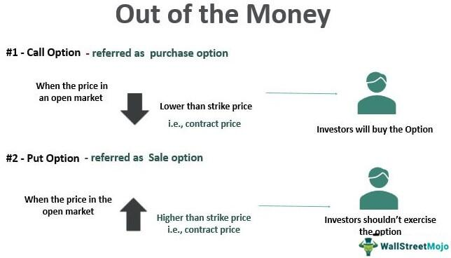

## Table of Contents

## What does 'out of the money' mean in options trading?

In options trading, 'out of the money' (OTM) is a term used to describe an option that has no intrinsic value. This means that if the option were to be exercised immediately, it would result in a loss. For a call option, it is out of the money if the current market price of the underlying asset is below the strike price. Conversely, for a put option, it is out of the money if the current market price is above the strike price. OTM options are cheaper to buy because they do not have any immediate value, but they also have a lower probability of becoming profitable.

Traders often buy OTM options because they are less expensive, hoping that the market will move in their favor before the option expires. However, the likelihood of an OTM option becoming profitable is lower compared to an in-the-money or at-the-money option. As the expiration date approaches, the time value of the option decreases, making it even less likely for an OTM option to become profitable. This is why OTM options are often used for speculative trades where the trader is willing to take on more risk for the possibility of a higher reward.

## How is an option determined to be out of the money for call options?

A call option is out of the money when the current price of the stock or asset is lower than the strike price of the option. The strike price is the price at which the option holder can buy the stock if they choose to exercise the option. If the stock price is below the strike price, it wouldn't make sense to use the option to buy the stock because you could buy it for less on the open market.

For example, if you have a call option with a strike price of $50, and the stock is currently trading at $45, the option is out of the money. You wouldn't exercise the option because buying the stock at $50 through the option would cost more than buying it directly at $45. Out of the money call options have no intrinsic value, but they might still have some time value if there's time left before they expire.

## How is an option determined to be out of the money for put options?

A put option is out of the money when the current price of the stock or asset is higher than the strike price of the option. The strike price is the price at which the option holder can sell the stock if they choose to exercise the option. If the stock price is above the strike price, it wouldn't make sense to use the option to sell the stock because you could sell it for more on the open market.

For example, if you have a put option with a strike price of $50, and the stock is currently trading at $55, the option is out of the money. You wouldn't exercise the option because selling the stock at $50 through the option would give you less money than selling it directly at $55. Out of the money put options have no intrinsic value, but they might still have some time value if there's time left before they expire.

## What are the financial implications of holding an out-of-the-money option?

Holding an out-of-the-money option means you have an option that currently has no real value. If you were to use the option right now, you would lose money because the stock price is not in your favor. For example, if you have a call option and the stock price is lower than your strike price, or if you have a put option and the stock price is higher than your strike price, exercising the option would not make sense. You would be better off buying or selling the stock directly in the market.

The main financial implication of holding an out-of-the-money option is that it might become worthless if the stock price doesn't move in your favor before the option expires. Options have a time limit, and as that time runs out, the option loses its time value. If the stock price doesn't change enough to make your option profitable before it expires, you will lose the money you paid for the option. However, because out-of-the-money options are cheaper to buy, some traders are willing to take the risk, hoping that the stock price will move significantly in their favor before the option expires.

## Can you explain the concept of intrinsic value in relation to out-of-the-money options?

Intrinsic value is the real value of an option if you were to use it right now. For an option to have intrinsic value, it needs to be in a position where using it would be better than just buying or selling the stock directly. If you have a call option and the stock price is higher than your strike price, or if you have a put option and the stock price is lower than your strike price, then your option has intrinsic value. But if your option is out of the money, it doesn't have any intrinsic value.

Out-of-the-money options have no intrinsic value because exercising them right now would lead to a loss. For example, if you have a call option with a strike price of $50 and the stock is trading at $45, using the option to buy the stock at $50 would be worse than buying it at $45 on the market. The same goes for a put option with a strike price of $50 if the stock is at $55; selling it at $50 through the option would be less than selling it at $55 directly. So, out-of-the-money options only have time value, which decreases as the option gets closer to expiring, and if the stock price doesn't move in your favor, the option could end up being worth nothing.

## What role does time value play in out-of-the-money options?

Time value is like the hope that an out-of-the-money option has. Even though the option isn't worth anything right now because it's out of the money, it might still have some value because there's still time left before it expires. This time value is what you pay for when you buy an out-of-the-money option. It's the chance that the stock price might move in your favor before the option runs out of time.

As the expiration date gets closer, the time value of the option goes down. If the stock price doesn't move to make the option profitable before it expires, the time value will go to zero, and the option will be worthless. So, when you hold an out-of-the-money option, you're betting that the stock will move enough in your favor before time runs out. If it doesn't, you'll lose the money you paid for the option.

## How does the expiration date affect the value of out-of-the-money options?

The expiration date is super important for out-of-the-money options. It's like a countdown clock. The more time there is until the option expires, the more hope there is that the stock price might move in your favor. This hope is called time value, and it's why out-of-the-money options can still have some value even though they're not worth anything right now. The longer the time until expiration, the more time value the option has, making it more expensive.

But as the expiration date gets closer, the time value starts to go down. If the stock price doesn't move enough to make the option profitable before it expires, the time value will drop to zero, and the option will be worthless. So, the closer you get to the expiration date without the stock price moving in your favor, the less likely it is that your out-of-the-money option will be worth anything. It's like a race against time, where you need the stock to move before the clock runs out.

## What strategies might traders use involving out-of-the-money options?

Traders often use out-of-the-money options for speculative bets because they're cheaper to buy. They hope that the stock price will move a lot in their favor before the option expires. For example, if a trader thinks a stock will go up a lot, they might buy an out-of-the-money call option. It's a risky move because the stock has to move a lot to make the option profitable, but if it does, the trader can make a big profit compared to what they paid for the option.

Another strategy is using out-of-the-money options for hedging. If a trader owns a stock and wants to protect against a big drop in its price, they might buy an out-of-the-money put option. This option won't cost much, but it can protect them if the stock price falls a lot. It's like buying insurance; it might not be needed, but it's there just in case. The downside is that if the stock price doesn't drop, the trader loses the money they paid for the option.

Some traders also use out-of-the-money options in strategies like selling options to collect premiums. For instance, a trader might sell an out-of-the-money call option if they think the stock won't go up to the strike price before expiration. They get to keep the premium if the option expires worthless, but they have to be ready to sell the stock at the strike price if it does go up. It's a way to make some money from the time value of the option, but it comes with the risk of having to sell the stock if things don't go as planned.

## How can market volatility impact the pricing of out-of-the-money options?

Market volatility is like how much the stock price jumps around. When the market is more volatile, out-of-the-money options can become more expensive. This is because there's a bigger chance that the stock price might move a lot and make the option worth something before it expires. Traders are willing to pay more for the hope that the stock will move in their favor, so the price of the option goes up.

On the other hand, when the market is calm and not moving much, out-of-the-money options can be cheaper. If the stock price isn't expected to change a lot, there's less chance that the option will become profitable before it expires. So, traders won't pay as much for the option because the hope of a big move in the stock price is smaller. This means the time value of the option, which is the hope that it might become valuable, goes down when the market is less volatile.

## What are the risks associated with trading out-of-the-money options?

Trading out-of-the-money options can be risky because they have no real value right now. You're betting that the stock price will move a lot in your favor before the option expires. If it doesn't, you'll lose the money you paid for the option. It's like buying a lottery ticket; it's cheap, but the chances of winning are small. Because out-of-the-money options are cheaper, you might be tempted to buy more of them, but that just means you could lose more money if things don't go your way.

Another risk is that time is against you. As the expiration date gets closer, the time value of the option goes down. If the stock price doesn't move enough to make the option profitable before it expires, the option will be worth nothing. It's like a race against time, and if the stock doesn't move fast enough, you'll lose your bet. So, trading out-of-the-money options is a high-risk, high-reward game where you need the stock to make a big move in your favor before time runs out.

## Can you provide examples of out-of-the-money options in different market scenarios?

Imagine you buy a call option for a stock that's trading at $50 per share. The strike price of your option is $55. This means you have the right to buy the stock at $55, but since the stock is currently only worth $50, your option is out of the money. You wouldn't want to use your option right now because it would be cheaper to buy the stock directly from the market at $50. Your hope is that the stock price will go up above $55 before your option expires. If it does, your option becomes valuable, but if the stock stays at $50 or goes down, your option will expire worthless, and you'll lose the money you paid for it.

Now, let's say you have a put option with a strike price of $45, and the stock is trading at $50. Your option is out of the money because you can sell the stock for more on the market than the $45 you'd get from exercising your option. You're hoping the stock price will drop below $45 before your option expires. If it does, your put option becomes valuable because you could then sell the stock at a higher price than it's worth in the market. But if the stock stays at $50 or goes up, your option will expire without any value, and you'll lose the money you spent on it.

## How do advanced traders use out-of-the-money options to hedge or speculate?

Advanced traders use out-of-the-money options for hedging to protect their investments from big price swings. For example, if a trader owns a stock and is worried about a big drop in its price, they might buy an out-of-the-money put option. This option gives them the right to sell the stock at a set price, which can be lower than the current market price. It's like buying insurance; it might cost a bit of money upfront, but it can save them from big losses if the stock price falls a lot. The downside is that if the stock price stays the same or goes up, the trader will lose the money they paid for the option, but they're okay with that because they're more worried about protecting their investment.

On the other hand, advanced traders also use out-of-the-money options for speculation, hoping to make big profits if the market moves a lot in their favor. For instance, if a trader thinks a stock is going to go up a lot, they might buy an out-of-the-money call option. This option lets them buy the stock at a price higher than where it's trading now, but if the stock price jumps above that level, the option can become very valuable. It's a risky bet because the stock has to move a lot to make the option profitable, but if it does, the trader can make a lot more money than they paid for the option. The risk is that if the stock doesn't move enough before the option expires, the trader loses the money they spent on the option.

## What is the Intersection of OTM Options and Algo Trading?

In algorithmic trading, Out of the Money (OTM) options are frequently leveraged for their low upfront costs and high-risk, high-reward profiles. Sophisticated algorithms play a crucial role in analyzing the massive datasets needed to identify profitable OTM options. By processing vast amounts of market data, these algorithms can detect patterns and opportunities that would be computationally intensive and time-consuming for manual analysis.

One of the primary advantages of using algorithms with OTM options is the ability to rapidly conduct extensive statistical analysis. Algorithms can filter real-time data, evaluate historical performance metrics, and even apply machine learning techniques to predict future price movements. For instance, an algorithm might be used to scan OTM call options when the underlying asset shows a trend that historically leads to price increases.

Additionally, algorithmic trading systems are adept at managing portfolios containing OTM options to balance risk and potential returns. This strategic management involves continuously re-evaluating the position of each OTM option relative to market conditions. Mathematical models such as the Black-Scholes formula can be utilized to price options, taking into account factors like volatility, time to expiration, and current market price:

$$
C = S_0 N(d_1) - X e^{-rT} N(d_2)
$$

Where:
- $C$ is the call option price
- $S_0$ is the current price of the stock
- $X$ is the strike price
- $r$ is the risk-free interest rate
- $T$ is the time to expiration
- $N$ is the cumulative standard normal distribution
- $d_1 = \frac{\ln(S_0/X) + (r + \sigma^2/2)T}{\sigma\sqrt{T}}$
- $d_2 = d_1 - \sigma\sqrt{T}$
- $\sigma$ is the volatility of the stock's returns

Python code integrating these elements allows traders to simulate different scenarios and adjust strategies accordingly:

```python
from scipy.stats import norm
import numpy as np

def black_scholes_call_price(S, X, T, r, sigma):
    d1 = (np.log(S / X) + (r + 0.5 * sigma ** 2) * T) / (sigma * np.sqrt(T))
    d2 = d1 - sigma * np.sqrt(T)
    call_price = S * norm.cdf(d1) - X * np.exp(-r * T) * norm.cdf(d2)
    return call_price

# Example parameters
S0 = 100  # Current stock price
X = 105   # Strike price
T = 1     # Time to expiration in years
r = 0.05  # Risk-free interest rate
sigma = 0.2  # Volatility

call_price = black_scholes_call_price(S0, X, T, r, sigma)
print(f'The call option price is: {call_price:.2f}')
```

This approach also assists in mitigating the potential downsides of OTM options, such as the risk of expiration without value. By continually optimizing portfolio positions and leveraging predictive analytics, algorithm-driven trading can enhance decision-making, maintaining a balance between speculation and risk management.

## References & Further Reading

Hull, J.C. "Options, Futures, and Other Derivatives." This text is a comprehensive guide that covers the intricate mechanisms of financial derivatives, with a strong emphasis on options and futures. It is essential for understanding the foundational concepts of market behaviors, options pricing models, and risk management strategies. Hull’s work is widely regarded as a key resource for both students and practitioners in the field of financial derivatives.

Lopez de Prado, M. "Advances in Financial Machine Learning." This book provides an in-depth understanding of how machine learning can be applied to finance, particularly in algorithmic trading. It addresses practical applications of machine learning techniques to enhance the decision-making processes, providing insights into building and refining trading strategies. This resource is valuable for those looking to integrate modern computational techniques into algorithmic trading systems.

Chan, E. "Quantitative Trading: How to Build Your Own Algorithmic Trading Business." Chan offers practical advice on constructing and deploying algorithmic trading strategies. The book guides readers through the process of developing trading algorithms, backtesting strategies, and managing a trading business. It provides real-world examples and includes programming insights, making it an essential resource for aspiring quantitative traders interested in building their own algorithmic infrastructure.

Das, S.R. "Derivatives: Principles and Practice." This text investigates into the principles and applications of derivative instruments across various financial markets. It explains the theoretical underpinnings of derivatives, including options, and discusses their practical applications in hedging, speculation, and risk management. Das’s work is crucial for gaining a holistic understanding of the derivative markets and the role of various derivative instruments.

