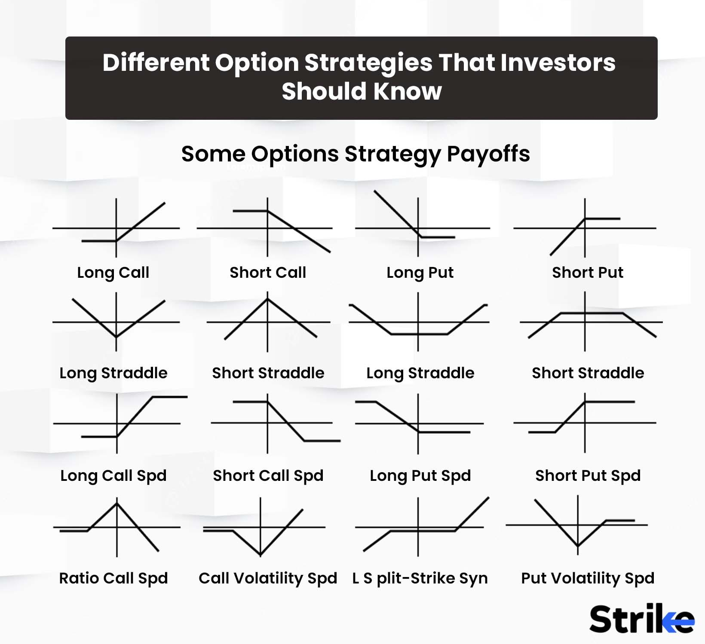

Options trading is an area of financial markets that offers traders the potential for high returns due to its leverage capabilities. Unlike traditional stock trading, where the loss is generally limited to the amount invested, options trading can pose significantly greater risks, particularly if traders are not fully aware of or prepared for the liabilities involved. At the core of these risks is the concept of unlimited liability, which is a critical factor that any options trader must understand and manage carefully to protect their investments.

Unlimited liability in options trading arises when traders undertake certain positions, such as selling naked options, without covering their obligations. This means they are at risk of incurring losses far beyond their initial investment, as there is no underlying asset to offset the detrimental effects of market shifts. This exposure necessitates advanced risk management strategies to safeguard investments and sustain profitability over time.



In exploring options trading and the concept of unlimited liability, this article will address various strategies employed by traders to minimize potential losses. Strategies such as setting stop-loss orders, diversifying portfolios, and using algorithmic trading to enhance decision-making and efficiency will be examined. Algorithmic trading, in particular, has revolutionized the trading landscape, offering sophisticated tools to manage risks and increase potential returns through automated and data-driven approaches.

Understanding these complexities is critical not only to harness the opportunities within options trading but also to mitigate the inherent risks. As trading platforms continue to evolve, so too must the strategies deployed by traders in ensuring sound investment choices that align with their financial goals.

## Table of Contents

## Understanding Unlimited Liability in Options Trading

Unlimited liability in options trading refers to the potential for incurring infinite losses under specific conditions, primarily associated with certain types of options positions known as "naked options." In options trading, a "naked" option is where the seller, also known as the writer, does not own the underlying asset. This exposure creates a scenario where a trader might face enormous financial risks without possessing the asset to cover their obligations.

The two main types of naked options that expose traders to unlimited liability are naked call options and naked put options. A naked call option occurs when a trader sells a call option without owning the underlying asset. If the asset’s price increases significantly, the trader must purchase it at the elevated market price to fulfill the obligation, leading to substantial losses. Specifically, the risk with a naked call option stems from the theoretically limitless increase in the asset’s price, which directly translates to potentially infinite losses for the writer. Mathematically, the loss from a naked call can be expressed as:

$$
\text{Loss} = (\text{Market Price} - \text{Strike Price}) \times \text{Number of Contracts}
$$

where the market price can rise indefinitely.

Conversely, a naked put option entails selling a put option without shorting or owning the equivalent amount of the underlying asset. Here, the risk arises if the underlying asset’s price plummets to zero, forcing the trader to buy the worthless asset at the original strike price. This scenario results in a loss equivalent to the strike price, multiplied by the number of contracts and the number of assets per contract. Although the maximum loss is theoretically caped as the full value of the underlying asset, the losses can still be considerable depending on the asset’s price at the time of the trade. The formula for calculating the loss from a naked put option is as follows:

$$
\text{Loss} = (\text{Strike Price} - \text{Market Price}) \times \text{Number of Contracts}
$$

The primary risk [factor](/wiki/factor-investing) here is the absence of the underlying asset to hedge potential losses. When market conditions shift unfavorably, the writer's lack of coverage can lead to massive financial liabilities. Traders embarking on such strategies must maintain stringent risk management protocols and possess a comprehensive understanding of the associated dangers to mitigate these risks effectively.

## Examples of Positions with Unlimited Liability

In options trading, positions with unlimited liability, such as naked call options and naked put options, pose significant risks due to the potential for substantial financial losses.

### Naked Call Options

A naked call option involves selling call options without owning the underlying asset. This position exposes the trader to the risk of unlimited loss if the price of the underlying asset rises significantly. For example, if a trader sells a call option on stock XYZ with a strike price of $50 and the stock price climbs to $100, the trader must potentially provide the stock at a much higher price than initially anticipated. The mathematical risk for a naked call can be described as:

$$
\text{Loss} = (\text{Market Price} - \text{Strike Price} - \text{Premium Received}) \times \#\text{Of Contracts} \times 100
$$

Given this scenario, as long as the underlying stock's price continues to rise, the trader's potential losses are theoretically unlimited, as there is no cap on the price increase.

### Naked Put Options

Naked put options present a different but equally daunting risk scenario. In this case, the trader sells put options without holding the corresponding short position in the stock or other hedging instruments. If the stock price falls to zero, the trader may face a significant financial burden, having to purchase the worthless stock at the strike price. The loss calculation here can be represented as:

$$
\text{Loss} = (\text{Strike Price} - \text{Market Price} + \text{Premium Received}) \times \#\text{Of Contracts} \times 100
$$

This formula highlights that the maximum potential loss occurs when the stock price plunges to zero, requiring the trader to compensate entirely for the downward movement.

### Analyzing Scenarios

To understand the financial implications of these positions, consider the following example:

- Suppose a trader sells a naked call option and a naked put option on the same stock at different strike prices. If unexpected market events cause the stock price to surge or collapse dramatically, the trader might face overwhelming financial responsibilities either from the necessity to buy back the stock at a high market price (naked call) or buy and acquire it at an inflated strike price (naked put). Such adverse events not only result in significant financial losses but can also wipe out a trader's entire portfolio if proper risk mitigation measures are not employed.

These examples underscore the importance of recognizing the inherent risks associated with unlimited liability in options trading. Traders must be acutely aware of these dynamics to navigate the volatile waters of the options market prudently.

## Risk Management Strategies in Options Trading

In options trading, managing risk effectively is critical to safeguarding investments against potential adverse market movements. One of the fundamental techniques in risk management is the use of stop-loss and take-profit orders. A stop-loss order is designed to limit an investor's loss on a position by triggering a sale when the asset's price falls to a predetermined level. For instance, if an option is purchased at $50, a stop-loss order might be set at $45, thereby capping losses at $5 per option. Conversely, a take-profit order allows traders to lock in gains once an asset reaches a specified price, automatically selling when the asset's price hits that target.

Diversification is another pivotal strategy in risk mitigation. By spreading investments across a range of asset classes—such as equities, bonds, commodities, and other market instruments—traders can reduce the impact of a poor performance in any single area. When returns on different assets are not perfectly correlated, diversification can potentially lower the overall risk profile of a portfolio. According to Modern Portfolio Theory, the overall portfolio risk is minimized when assets with low correlation are combined.

Hedging is an additional approach used to protect against undesirable price movements. This involves taking a position in a related security to offset potential losses in another. Common hedging strategies include the use of options, futures, or other derivatives. For instance, a trader holding a stock may purchase put options on the same stock as insurance against a decline in its price. If the stock's price falls, the gains from the put options can offset some or all of the losses from the stock.

Together, these strategies form a robust framework for managing risk in options trading, offering traders multiple avenues to safeguard their capital and enhance the stability of their investments.

## Algorithmic Trading and Risk Management

Algorithmic trading, which employs computer algorithms to automate trading decisions, has gained substantial popularity among modern traders due to its ability to process vast amounts of data quickly and execute trades at speeds unmatched by human traders. By leveraging mathematical models and sophisticated algorithms, traders can identify optimal entry and [exit](/wiki/exit-strategy) points in the market, thereby minimizing risks while aiming to maximize returns.

One of the key strategies in [algorithmic trading](/wiki/algorithmic-trading) involves the use of quantitative models to predict market movements. These models often rely on statistical techniques such as regression analysis, moving averages, and [machine learning](/wiki/machine-learning) algorithms to forecast price trends. By continuously analyzing historical price data, these algorithms can identify patterns and execute trades based on pre-defined criteria. For risk management, traders might implement strategies like mean reversion, which bets on the statistical tendency of a market to revert to its mean price, or [arbitrage](/wiki/arbitrage), which exploits price discrepancies across different markets or securities.

Automation plays a crucial role in enhancing trade efficiency in algorithmic trading. Automated systems can execute trades with precision in milliseconds, significantly reducing the latency compared to manual trading. This rapid execution is particularly important in high-frequency trading ([HFT](/wiki/high-frequency-trading-strategies)), where algorithms make thousands of trades in a fraction of a second to capitalize on minute price movements. Moreover, automation allows for consistent adherence to trading plans and risk management protocols, minimizing the impact of human emotions and errors that can lead to losses.

Risk management in algorithmic trading is achieved through the implementation of stop-loss and take-profit orders, which automatically trigger the buying or selling of assets when they reach a certain price level. These pre-programmed instructions help traders limit potential losses and secure profits without the need for constant market monitoring. Diversification is another critical risk management strategy, where algorithms manage a portfolio of assets across different markets and sectors, reducing exposure to any single source of risk.

Additionally, algorithmic trading systems incorporate hedging techniques to protect against adverse market fluctuations. For example, algorithms can simultaneously execute long and short positions in correlated assets to offset potential losses in one position with gains in another.

Ultimately, algorithmic trading and its associated risk management strategies facilitate more informed, efficient, and effective trading decisions, enabling traders to navigate the complexities of modern financial markets with greater confidence.

## Risk Elements Specific to Algorithmic Trading

Algorithmic trading has become increasingly popular due to its ability to execute trades at high speed and efficiency. However, it also introduces specific risk elements that traders must manage carefully. One of the main concerns associated with algorithmic trading is market instability. Algorithms can cause rapid price changes as they execute a large number of trades in seconds, potentially leading to increased market [volatility](/wiki/volatility-trading-strategies). This volatility can exacerbate rollover risks, which occur when positions are moved from one trading period to the next, often resulting in unexpected price discrepancies.

Managing drawdowns is another critical aspect of algorithmic trading. A drawdown is the reduction in equity from a peak to a trough in a trading account. Algorithmically driven strategies must incorporate robust risk management techniques to handle drawdowns effectively, limiting the potential financial loss. Traders can employ risk management metrics such as the maximum drawdown percentage, which quantifies the peak-to-trough decline during a specific period and helps determine a strategy's resilience.

Leverage, while offering the potential for high returns, can also amplify risks. In algorithmic trading, leveraging positions without proper oversight can lead to significant financial exposure. Traders need to implement leverage limits within their algorithms to avoid excessive risk-taking. For example, using the Python programming language, traders can set leverage caps in their trading bot scripts:

```python
leveraged_positions = [position for position in open_positions if position['leverage'] <= max_leverage]
```

Execution risk is another concern in algorithmic trading, as it refers to the potential failure or delay in order execution. High-frequency trading systems need to ensure that their algorithms are optimized for fast and reliable execution. Strategies that incorporate algorithms designed with latency-sensitive architectures can help minimize this risk.

Regulatory requirements and compliance are essential in algorithmic trading to minimize legal risks. Various regulatory bodies, including the U.S. Securities and Exchange Commission (SEC) and the European Securities and Markets Authority (ESMA), mandate specific guidelines for algorithmic trading. These regulations often require traders to implement systems ensuring that algorithms function as intended and are tested rigorously for compliance with market standards. Failure to adhere to these guidelines can result in legal penalties and jeopardize a trader’s ability to operate in the market.

To address these risk elements, traders should continuously monitor and refine their algorithms, ensuring that they adapt to changing market conditions and comply with evolving regulatory standards. Effective management of these risks not only helps in protecting investments but also enhances the long-term viability of algorithmic trading strategies.

## Conclusion

Options trading with unlimited liability inherently carries a balance between high reward and substantial risk, requiring traders to navigate this financial landscape with keen awareness and strategic precision. The potential for significant gains is tempered by the reality of incurring severe losses, particularly when dealing with naked options that expose traders to unrestricted financial obligations. This underscores the paramount importance of robust risk management practices.

Effective risk management is not just advisable but essential in mitigating the inherent risks associated with options trading. Techniques such as setting stop-loss and take-profit orders serve to cap potential losses, ensuring that traders can quickly respond to adverse market shifts. Furthermore, diversification across various asset classes can help alleviate the concentration of risk, distributing exposure and reducing the impact of adverse movements in a single asset or market sector.

Algorithmic trading emerges as a powerful tool in augmenting risk management strategies. By leveraging computational power, traders can implement sophisticated algorithms that execute trades with precision and speed, often outpacing human capability. These algorithms can be informed by complex models that consider a multitude of variables, optimizing trades for both risk reduction and return maximization. The automation inherent in algorithmic strategies serves as a double-edged sword: enhancing trade efficiency while posing risks such as market instability and execution fallibility that must be diligently managed.

As traders navigate the complex dynamics of options trading, maintaining a well-informed and cautious approach is crucial. Constant education, awareness of market conditions, and adherence to regulatory requirements are vital to safeguarding investments. Employing a combination of traditional risk management techniques and cutting-edge algorithmic strategies can significantly mitigate the risks associated with unlimited liability. In doing so, traders can protect their portfolios, ensuring sustainability and resilience in a volatile financial environment.

## References & Further Reading

[1]: CBOE. ["Understanding Index Options"](https://cdn.cboe.com/resources/options/Undestanding_Index_Options_Placing_a_Trade.pdf). Chicago Board Options Exchange.

[2]: Hull, J. C. (2018). ["Options, Futures, and Other Derivatives"](https://www.semanticscholar.org/paper/Options%2C-Futures%2C-and-Other-Derivatives-Hull/89bdee500c8623864fc9eb7a471546aa713acc44). Pearson Education.

[3]: MacKenzie, D. (2006). ["An Engine, Not a Camera: How Financial Models Shape Markets"](https://academic.oup.com/mit-press-scholarship-online/book/20588). The MIT Press.

[4]: Taleb, N. N. (2010). ["The Black Swan: The Impact of the Highly Improbable"](https://www.jstor.org/stable/23045073). Random House Trade Paperbacks.

[5]: Hasbrouck, Joel. (2007). ["Empirical Market Microstructure: The Institutions, Economics, and Econometrics of Securities Trading"](https://archive.org/details/empiricalmarketm0000hasb). Oxford University Press.

[6]: Kissell, R. L. (2003). ["Portfolio Risk Analysis"](https://www.kissellresearch.com/about-us). Wiley.

[7]: Pardo, R. (2008). ["The Evaluation and Optimization of Trading Strategies"](https://onlinelibrary.wiley.com/doi/book/10.1002/9781119196969). Wiley Trading.