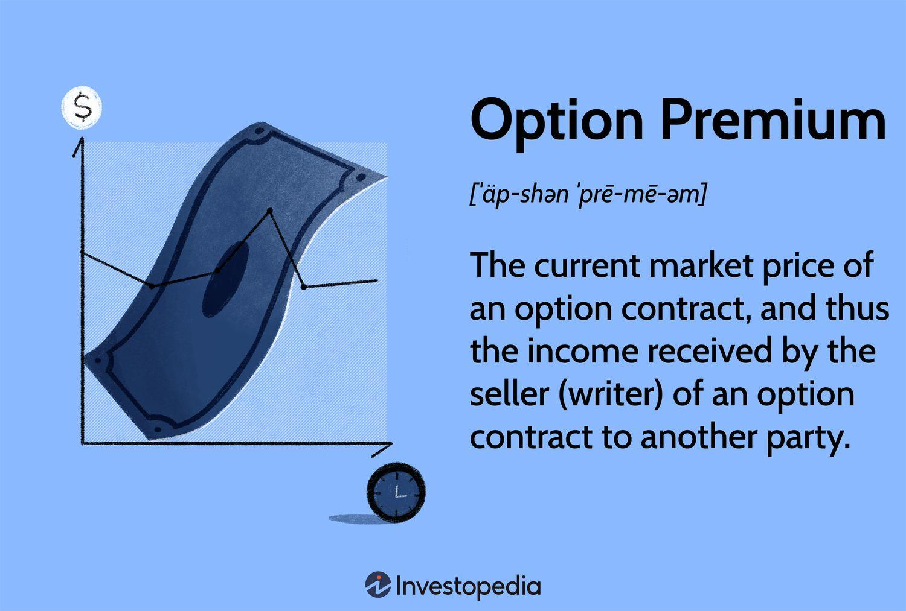

## Table of Contents

## What is an options premium?

An options premium is the price that you pay to buy an options contract. It's like a fee you pay for the right, but not the obligation, to buy or sell an asset at a specific price before a certain date. This price is influenced by many things, like how likely it is that the option will be profitable, how long until the option expires, and how much the price of the asset moves around.

Think of the options premium as the cost of a ticket to a potential future event. If you think the event (like a stock price going up or down) will happen, you might be willing to pay more for the ticket. But if you're not sure, you might not want to spend as much. The premium is set by what people are willing to pay and what sellers are willing to accept, based on their guesses about the future.

## How is the options premium determined?

The options premium is figured out by looking at a few key things. First, there's the intrinsic value, which is how much the option is worth if you used it right now. If the option lets you buy a stock for less than it's currently worth, that difference is the intrinsic value. Then, there's the time value, which is what you pay for the chance that the stock price might change in your favor before the option expires. The longer you have until the option expires, the more time value it has because there's more time for the stock price to move.

Another big piece is how much the stock price might swing around, which we call [volatility](/wiki/volatility-trading-strategies). If a stock's price jumps around a lot, the option's premium will be higher because there's a bigger chance it could end up being worth a lot. Also, interest rates and dividends can affect the premium. If interest rates go up, the premium might go up too, especially for call options. And if a stock pays dividends, that can make the premium for call options go down and put options go up. All these pieces come together in something called an options pricing model, like the Black-Scholes model, which helps figure out what the premium should be based on what people think might happen in the future.

## What factors affect the price of an options premium?

The price of an options premium is influenced by several key factors. One big [factor](/wiki/factor-investing) is the intrinsic value, which is how much money you would make if you used the option right now. If you have a call option to buy a stock at $50 and the stock is currently worth $60, the intrinsic value is $10. Another factor is the time value, which is what you pay for the possibility that the stock price might move in your favor before the option expires. The more time left until the option expires, the higher the time value because there's more time for the stock price to change.

Volatility also plays a big role in the options premium. If the stock price moves around a lot, the premium will be higher because there's a bigger chance the option could end up being worth a lot. Interest rates and dividends can also affect the premium. When interest rates go up, the premium for call options might go up too. If a stock pays dividends, it can lower the premium for call options and raise it for put options. All these factors are put into models, like the Black-Scholes model, to help figure out what the premium should be based on what people think might happen in the future.

## What is the difference between intrinsic value and time value in an options premium?

Intrinsic value is like the real, immediate value of an option if you were to use it right now. For a call option, it's how much the stock price is above the price you can buy it at with the option. If you can buy a stock at $50 with your option and it's now worth $60, the intrinsic value is $10. For a put option, it's the opposite; it's how much the stock price is below the price you can sell it at with the option. If you can sell a stock at $50 with your option and it's now worth $40, the intrinsic value is $10. If an option has no intrinsic value, it's called "out of the money."

Time value is what you pay for the possibility that the stock price might move in your favor before the option expires. It's like paying for extra time to see if your guess about the stock's future price will come true. The more time left until the option expires, the higher the time value because there's more chance for the stock price to change. Even if an option has no intrinsic value, it can still have time value if there's time left for the stock price to move in the right direction. As the expiration date gets closer, the time value goes down, making the option's premium decrease if the intrinsic value stays the same.

## How does the expiration date impact the options premium?

The expiration date of an option plays a big role in how much you pay for it, which is called the options premium. The longer you have until the option expires, the more you'll pay for it. This is because there's more time for the stock price to move in your favor. If you have a call option that lets you buy a stock at $50 and the stock is currently at $45, you might still want to buy the option if it doesn't expire for a while. You're hoping the stock price will go above $50 before the option expires. The extra time gives you a better chance, so you pay more for that chance.

As the expiration date gets closer, the time value part of the options premium goes down. This means if the stock price hasn't moved in your favor yet, the option becomes less valuable because there's less time left for it to do so. For example, if you have a call option that expires in a week and the stock is still at $45, you might not want to pay as much for the option because there's less time for the stock to go above $50. So, the premium drops as the expiration date approaches, unless the stock price moves to make the option worth more right away.

## What role does volatility play in determining the options premium?

Volatility is a big deal when it comes to figuring out how much an options premium should be. It's all about how much the price of the stock might jump around. If a stock's price moves a lot, the option's premium will be higher. That's because there's a bigger chance the option could end up being worth a lot of money. Imagine you're betting on a horse race. If one horse is known for sometimes running really fast and sometimes really slow, you might be willing to bet more on it because there's a bigger chance it could win big.

This is why options on stocks that are more unpredictable usually cost more. The more the stock price swings, the more people are willing to pay for the option because they think there's a better chance it could pay off. This is called the "vega" of an option, which shows how much the premium changes with changes in volatility. So, if you're looking at options, keep an eye on how much the stock's price moves around, because that can really affect what you'll pay for the option.

## How can an investor use options premiums in trading strategies?

An investor can use options premiums in many different ways to make money or protect their investments. One common way is to buy options when they think the price of a stock will go up or down a lot. They pay the premium hoping that the stock moves in the direction they expect before the option expires. If it does, they can make a lot of money. For example, if an investor thinks a stock will go up, they might buy a call option. If the stock price goes above the option's strike price, they can buy the stock at a lower price and then sell it for a profit.

Another strategy is selling options to collect the premium. This can be a way to make money if an investor thinks a stock won't move much. They can sell call options if they think the stock won't go up much, or sell put options if they think it won't go down much. If the stock stays where it is, the options expire worthless, and the investor keeps the premium as profit. This is called writing options. It's like getting paid to take a bet that the stock won't move much, but it can be risky if the stock does move a lot.

Investors can also use options premiums to protect their investments, which is called hedging. If an investor owns a stock and is worried it might go down, they can buy a put option. This gives them the right to sell the stock at a certain price, even if the market price drops lower. The premium they pay for the put option is like insurance. If the stock price falls, the put option can help limit their losses. If the stock price stays the same or goes up, they just lose the premium they paid, but their stock is still worth more.

## What are the risks associated with buying and selling options premiums?

Buying and selling options premiums can be risky. When you buy an option, you pay the premium upfront, which is like the cost of a ticket. If the stock doesn't move the way you hope before the option expires, you lose all the money you paid for the option. It's like buying a lottery ticket and not winning. The risk is that you can lose the entire premium, which can be a lot of money if you're buying many options. Also, if the stock moves against you quickly, you might not have time to sell the option for any value, making your loss even bigger.

Selling options, or writing options, has different risks. When you sell an option, you get the premium right away, which is like being paid to take a bet. But if the stock moves a lot in the wrong direction, you could lose a lot more money than the premium you received. For example, if you sell a call option and the stock price goes way up, you might have to sell the stock at a much lower price than it's worth, losing money on the difference. This is called unlimited risk because there's no limit to how high a stock price can go. Selling options can be especially risky if you don't own the stock (naked options), because you could end up owing a lot of money if things go wrong.

## How do market conditions influence options premiums?

Market conditions can really change how much you pay for an options premium. When the market is going up and down a lot, people might think there's a bigger chance for the stock to move in a big way. This makes the options more valuable, so the premium goes up. Also, if everyone is worried about the market, like during a big economic news event, they might pay more for options to protect their investments. This fear can drive up the premiums, even if the stock itself isn't moving much.

On the other hand, when the market is calm and not moving much, the options premiums might go down. If people think the stock prices will stay steady, they won't pay as much for options because there's less chance for a big move. Interest rates and how much companies are paying out in dividends can also affect the premiums. If interest rates go up, the cost of call options might go up too. And if a company starts paying bigger dividends, it can change how much people are willing to pay for options on that stock.

## What advanced techniques can be used to forecast options premiums?

To forecast options premiums, investors often use advanced techniques like options pricing models. One popular model is the Black-Scholes model, which helps figure out what an option should be worth based on things like the stock's current price, how much it might move around (volatility), how long until the option expires, and the interest rates. By putting these numbers into the model, investors can get a good guess on what the premium should be. But remember, this is just a guess, and real market prices can be different because of what people are feeling and thinking about the market.

Another technique is to look at the implied volatility, which is a guess about how much the stock price might move in the future. It's figured out by looking at the current options premiums and working backward through the pricing model. If the implied volatility is high, it means people think the stock might move a lot, so the options premiums will be higher. Investors can compare the implied volatility to the actual past volatility of the stock to see if the options are priced too high or too low. This can help them decide if it's a good time to buy or sell options.

Some investors also use historical data to predict options premiums. They look at how the premiums have changed in the past under similar market conditions and use that information to make guesses about the future. By studying patterns and trends, they can get a better idea of what might happen next. But the market can be unpredictable, so even with all these techniques, forecasting options premiums is never a sure thing.

## How do options premiums differ across various asset classes?

Options premiums can be different depending on what kind of asset they're for, like stocks, commodities, or currencies. Stocks usually have more options available, and their premiums can be affected by things like how well the company is doing, news about the company, or how much people think the stock will move around. For example, if a company is about to release a new product, the stock's options premiums might go up because people think the stock price could change a lot.

Commodities, like oil or gold, have options premiums that can be influenced by things like supply and demand, geopolitical events, or changes in the economy. If there's a big event that could change how much of a commodity is available, like a hurricane affecting oil production, the options premiums for that commodity might go up because people expect the price to move a lot. Currencies also have options, and their premiums can be affected by interest rates, economic reports, or political events. If a country's central bank is about to change interest rates, the options premiums for that currency might go up because people expect the currency's value to change.

## What are the tax implications of trading options premiums?

When you trade options premiums, you need to think about taxes. If you make money from buying and selling options, you'll have to pay taxes on your profits. The tax rate depends on how long you held the option before selling it. If you held it for less than a year, your profit is taxed as short-term capital gains, which is the same as your regular income tax rate. If you held it for more than a year, it's taxed as long-term capital gains, which is usually lower.

If you lose money on options, you can use those losses to lower your taxes. You can subtract your losses from your gains to figure out your net gain or loss. If you have more losses than gains, you can use up to $3,000 of those losses to reduce your taxable income for the year. Any extra losses can be carried over to future years to lower your taxes then. It's always a good idea to talk to a tax professional to make sure you're doing everything right and taking advantage of all the tax rules that apply to you.

## References & Further Reading

[1]: Bergstra, J., Bardenet, R., Bengio, Y., & Kégl, B. (2011). ["Algorithms for Hyper-Parameter Optimization."](https://papers.nips.cc/paper/4443-algorithms-for-hyper-parameter-optimization) Advances in Neural Information Processing Systems 24.

[2]: ["Advances in Financial Machine Learning"](https://www.amazon.com/Advances-Financial-Machine-Learning-Marcos/dp/1119482089) by Marcos Lopez de Prado

[3]: ["Evidence-Based Technical Analysis: Applying the Scientific Method and Statistical Inference to Trading Signals"](https://www.amazon.com/Evidence-Based-Technical-Analysis-Scientific-Statistical/dp/0470008741) by David Aronson

[4]: ["Machine Learning for Algorithmic Trading"](https://github.com/stefan-jansen/machine-learning-for-trading) by Stefan Jansen

[5]: ["Quantitative Trading: How to Build Your Own Algorithmic Trading Business"](https://www.amazon.com/Quantitative-Trading-Build-Algorithmic-Business/dp/1119800064) by Ernest P. Chan