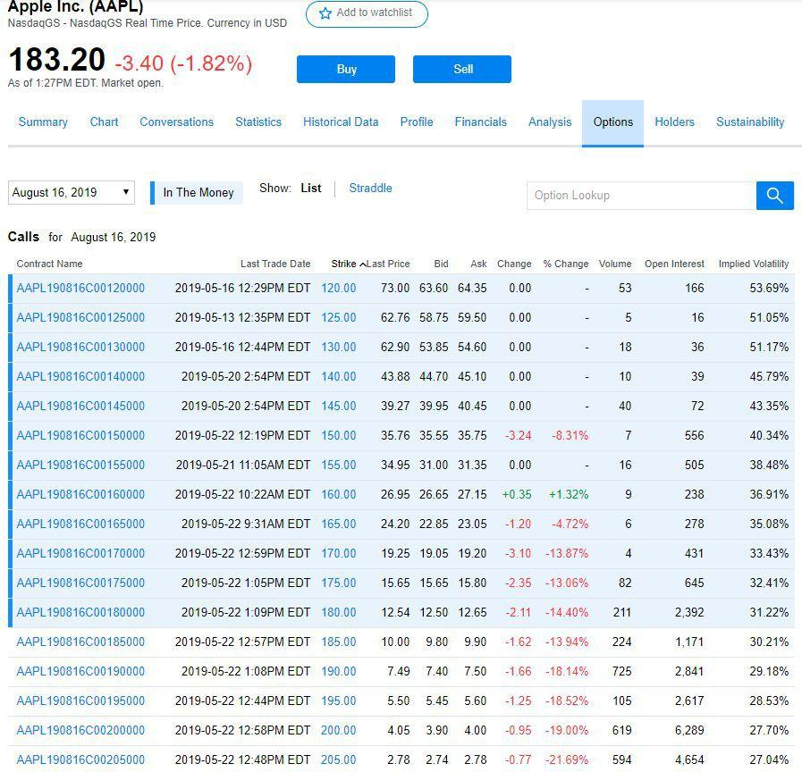

## Table of Contents

## What is the Options Price Reporting Authority (OPRA)?

The Options Price Reporting Authority, or OPRA, is a group that helps share information about the prices of options. Options are contracts that give people the right to buy or sell stocks at a certain price. OPRA collects all the price data from different places where options are traded and sends it to people who need it, like traders and investors.

This service is important because it makes sure everyone has the same information at the same time. This helps keep the market fair and transparent. Without OPRA, it would be hard for everyone to know the current prices of options, which could lead to confusion and unfair trading.

## What is the primary function of OPRA?

The main job of the Options Price Reporting Authority, or OPRA, is to gather and share information about the prices of options. Options are special contracts that let people buy or sell stocks at a set price. OPRA gets all this price data from different places where options are traded and then sends it out to people who need it, like traders and investors.

This service is really important because it makes sure everyone has the same information at the same time. This helps keep the market fair and open. Without OPRA, it would be hard for everyone to know the current prices of options, which could cause confusion and unfair trading.

## How does OPRA collect and disseminate options price data?

OPRA collects options price data from all the places where options are traded. These places are called exchanges. When someone buys or sells an option, the exchange sends the information about the trade to OPRA. This includes details like the price, the time of the trade, and what kind of option it was. OPRA takes all this information and puts it together in one big pool of data.

Once OPRA has all the data, it sends it out to people who need it. These people can be traders, investors, or other businesses that use the information to make decisions. OPRA sends the data through special computer networks so that everyone gets the information at the same time. This way, everyone in the market has the same up-to-date information, which helps keep things fair and open.

## Who are the members of OPRA?

The members of OPRA are the different exchanges where options are traded. These exchanges are like big markets where people can buy and sell options. Some of the main members are the Chicago Board Options Exchange (CBOE), the New York Stock Exchange (NYSE), and the NASDAQ OMX PHLX.

These exchanges work together to make sure that all the price information about options is collected and shared fairly. By being part of OPRA, they help make the options market transparent and fair for everyone. This means that traders and investors can trust the information they get and make better decisions.

## What types of options data does OPRA report?

OPRA reports a lot of different information about options. This includes the price at which options are bought or sold, the time when the trade happened, and the type of option involved. They also report the size of the trade, which means how many options were bought or sold at once. This helps people know how active the market is for that option.

Another important piece of information OPRA reports is the last sale price of an option. This is the most recent price at which the option was traded. They also share the bid and ask prices, which are the prices people are willing to pay to buy or sell the option. All this information together gives a clear picture of what's happening in the options market, helping traders and investors make smart choices.

## How is the data from OPRA used by traders and investors?

Traders and investors use the data from OPRA to make smart choices about buying and selling options. They look at the prices and see how much options are trading for right now. This helps them decide if an option is a good deal or if it's too expensive. They also check the bid and ask prices to see what other people are willing to pay or sell for, which can tell them if the market thinks the option is valuable.

The data also shows how active the market is for a certain option. If lots of options are being traded, it might mean that something important is happening with the stock or the market. Traders and investors use this information to guess where prices might go next. By having all this information, they can make better decisions and try to make money from their trades.

## What are the technological systems OPRA uses for data dissemination?

OPRA uses a special computer network to send out options price data quickly and fairly. This network is called the Securities Information Processor (SIP). The SIP takes all the data from the different exchanges and sends it to everyone who needs it at the same time. This way, all traders and investors get the same information without any delays, which helps keep the market fair.

The data is sent out through a system that can handle a lot of information very fast. This is important because the options market is always moving and prices can change in just a few seconds. By using this high-speed system, OPRA makes sure that everyone has the latest prices and can make their trading decisions based on the most current information.

## How does OPRA ensure the accuracy and timeliness of the data it provides?

OPRA works hard to make sure the data it gives out is correct and up-to-date. They do this by collecting information from all the different exchanges where options are traded. Each exchange sends its trade data to OPRA as soon as a trade happens. OPRA then checks this data to make sure it's right before sending it out to everyone. This way, they can catch any mistakes or problems before the information goes to traders and investors.

To make sure the data gets to everyone quickly, OPRA uses a special computer system called the Securities Information Processor (SIP). This system can handle a lot of information very fast, which is important because the options market changes quickly. The SIP sends out the data to all the people who need it at the same time, so no one gets the information late. This helps keep the market fair and makes sure everyone has the same information to make their trading decisions.

## What are the regulatory requirements that OPRA must comply with?

OPRA has to follow rules set by the U.S. Securities and Exchange Commission (SEC). These rules are there to make sure that everyone in the market gets the same information at the same time. OPRA must make sure the data it shares is correct and up-to-date. They also have to keep the information safe and private, so only the right people can see it.

Another important rule OPRA follows is about how fast they send out the data. They use a special computer system called the Securities Information Processor (SIP) to make sure the data gets to everyone quickly. This helps keep the market fair and stops some people from getting information before others. By following these rules, OPRA helps make the options market work smoothly and fairly for everyone.

## How has OPRA evolved since its inception?

Since it started, OPRA has changed a lot to keep up with the options market. When it first began, options trading was not as big as it is now. OPRA's job was to collect and share price information from just a few exchanges. But as more people started trading options and more exchanges opened, OPRA had to grow. They started using better technology to handle more data and make sure it gets to everyone faster.

Over the years, OPRA has also had to follow new rules set by the SEC to make sure the market stays fair. They've added new ways to check the data for mistakes and keep it safe. Now, OPRA uses a special computer system called the Securities Information Processor (SIP) to send out information to traders and investors all at the same time. This helps keep the market fair and makes sure everyone has the latest prices to make their trading decisions.

## What challenges does OPRA face in today's high-frequency trading environment?

In today's high-frequency trading environment, OPRA faces big challenges. High-frequency trading means that trades happen very fast, sometimes in just a few milliseconds. This makes it hard for OPRA to keep up with all the data coming in from different exchanges. They need to make sure the information they send out is correct and up-to-date, but with so many trades happening so quickly, it can be tough to do this without any delays.

Another challenge is keeping the market fair. In high-frequency trading, even a tiny delay in getting the data can make a big difference. OPRA has to use very fast and reliable technology to send out the data to everyone at the same time. If they don't, some traders might get information before others, which could lead to unfair trading. OPRA works hard to keep improving their systems to meet these challenges and keep the options market fair for everyone.

## How does OPRA plan to adapt to future market developments and technological advancements?

OPRA knows that the options market keeps changing and new technology is always coming out. To keep up, they plan to use even faster and better computer systems. This will help them handle more data without any delays, even as trading gets faster. They also want to keep working with the exchanges to make sure they can collect and send out all the new types of data that might come up in the future.

Another important part of their plan is to keep following the rules set by the SEC. As the market grows and changes, the rules might change too. OPRA will make sure they can adapt to these new rules and keep the market fair for everyone. By doing all this, OPRA hopes to stay ahead of the game and keep providing the best service to traders and investors.

## What is Options Pricing and what does OPRA stand for?

Options pricing requires accurate and timely data, a service that OPRA excels in providing through its consolidated feeds. The precision of these prices is critical for traders and [algorithmic trading](/wiki/algorithmic-trading) systems, which rely on exact data to execute trades effectively. Options are financial derivatives that give the holder the right, but not the obligation, to buy or sell an underlying asset at a predetermined price within a specific timeframe. The pricing of options involves complex mathematical models, such as the Black-Scholes model, which consider several variables including the price of the underlying asset, the option's strike price, time to expiration, interest rates, and the asset's [volatility](/wiki/volatility-trading-strategies).

Given this complexity, the accuracy and immediacy of market data become undeniably essential. OPRA provides last-sale options quotations and the national best bid and offer quotes, which inform the pricing models used by traders and financial institutions. The Black-Scholes formula, for instance, can be denoted as:

$$
C = S_0 N(d_1) - X e^{-rT} N(d_2)
$$

where:

- $C$ is the call option price,
- $S_0$ is the price of the underlying asset,
- $X$ is the strike price,
- $r$ is the risk-free interest rate,
- $T$ is the time to expiration,
- $N$ is the cumulative distribution function of the standard normal distribution,
- $d_1$ and $d_2$ are intermediate calculations.

The comprehensive data feeds offered by OPRA ensure that traders utilize the most current and precise data for these calculations. Through real-time data dissemination, OPRA supports transparency and fairness in the market, allowing all participants—from retail investors to institutional traders—to have equitable access to crucial market information. This transparency facilitates an environment where pricing is driven by real-time market dynamics rather than asymmetries in information, thereby promoting fair trading practices. Such equitable access is a cornerstone of well-functioning financial markets, enabling confident participation and fostering robust market activity.

## What is Algorithmic Trading and how does it relate to OPRA?

Algorithmic trading, which involves the use of computer algorithms to automate trading decisions, has become increasingly prevalent in today's financial markets. This strategy relies extensively on high-speed and accurate data systems such as the Options Price Reporting Authority (OPRA) to function effectively. OPRA's real-time data feeds are a critical resource for algorithmic traders seeking to develop and execute high-frequency trading ([HFT](/wiki/high-frequency-trading-strategies)) strategies.

Algorithmic traders depend on precise and timely options data to identify trading opportunities and execute transactions within fractions of a second. The comprehensive data provided by OPRA includes last-sale data and national best bid and offer quotes for exchange-listed options. This information is essential for traders to assess market conditions accurately and make informed decisions quickly. 

For instance, an algorithm might be designed to exploit [arbitrage](/wiki/arbitrage) opportunities by identifying price discrepancies across various options and executing trades automatically to capitalize on those differences. The formula for calculating potential arbitrage profits might look like:

$$
\text{Arbitrage Profit} = (\text{Sell Price} - \text{Buy Price}) \times \text{Quantity}
$$

To perform such tasks, the algorithm would require OPRA's continuous data stream to monitor fluctuations in option prices and execute trades with minimal latency, which is an essential aspect of HFT strategies.

Moreover, OPRA's data aids in the sophisticated analysis necessary for developing algorithms. Traders may employ statistical models and [machine learning](/wiki/machine-learning) techniques to scrutinize patterns and trends in historical options data to predict future price movements. Python is a popular programming language used for such tasks due to its rich ecosystem of libraries like NumPy for numerical calculations and pandas for data manipulation.

```python
import pandas as pd
import numpy as np

# Load historical OPRA data
data = pd.read_csv('opra_data.csv')

# Calculate moving average to identify trends
data['MA50'] = data['OptionPrice'].rolling(window=50).mean()

# Determine potential buy and sell signals
data['Signal'] = np.where(data['OptionPrice'] > data['MA50'], 'Buy', 'Sell')
```

The rise of algorithmic trading has led to innovations that demand rapid and reliable access to options market data. OPRA’s robust infrastructure ensures that traders can perform complex analyses and execute trades efficiently, maintaining a competitive edge in the fast-paced world of financial markets.

## References & Further Reading

[1]: ["Options Markets"](https://www.nyse.com/options) by John C. Cox and Mark Rubinstein

[2]: ["Options, Futures, and Other Derivatives"](https://www.amazon.com/Options-Futures-Other-Derivatives-9th/dp/0133456315) by John C. Hull

[3]: ["The Complete Guide to Option Pricing Formulas"](https://www.amazon.com/Complete-Guide-Option-Pricing-Formulas/dp/0786312408) by Espen Gaarder Haug

[4]: Battalio, R., Hatch, B., & Jennings, R. (2004). ["All else equal? A multiperiod analysis of execution quality at NASDAQ and the NYSE."](https://onlinelibrary.wiley.com/doi/abs/10.1111/j.1540-6261.2004.00682.x) The Journal of Finance, 59(6), 3077-3100.

[5]: Hasbrouck, J. & Saar, G. (2013). ["Low-Latency Trading."](https://www.sciencedirect.com/science/article/abs/pii/S1386418113000165) Journal of Financial Markets, 16(4), 646-679.