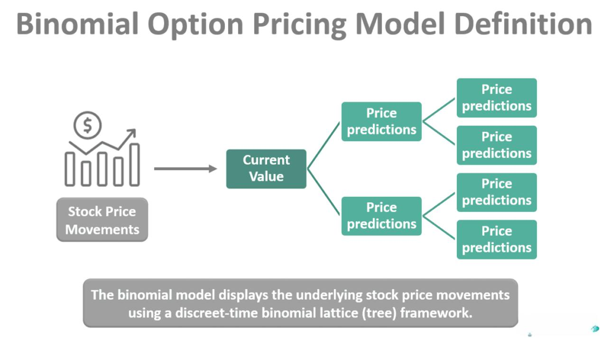

Options pricing is a critical element of financial derivatives trading, serving as an indispensable tool for both traders and financial analysts. Correctly assessing options pricing is essential for making sound investment decisions, hedging risks, and optimizing portfolios. This process involves evaluating the fair market value of options contracts, which are financial instruments that grant buyers the right, but not the obligation, to buy or sell an underlying asset at a predetermined price within a set timeframe.

Financial markets are inherently complex, and determining the fair value of options is no simple task. Various models, such as the Black-Scholes formula, the Binomial model, and the Trinomial model, offer different methodologies for options valuation. Each model operates under specific assumptions and employs distinct calculations to derive options prices, aiming to reflect real-time market conditions and predict future price movements accurately.



Furthermore, the rapid advancement of technology and the integration of algorithmic trading have significantly influenced options valuation. Automated trading systems can process vast amounts of data in real time, utilizing sophisticated algorithms to facilitate more efficient and rapid trading. These systems enhance market liquidity and ensure smoother transaction executions, while also influencing how options are valued and traded.

Understanding options pricing provides a foundation for various applications within the financial market, from simple speculative bets to complex hedging strategies. As the landscape of financial markets continues to evolve with technological advancements and new financial instruments, comprehending the intricacies of options pricing remains as vital as ever. This article will outline the essential models, calculations, and real-world applications in the options market, and examine how automated trading impacts options valuation.

## Table of Contents

## What is an Options Contract?

Options contracts are a form of financial derivatives that provide the holder with the right, but not the obligation, to buy or sell an underlying asset at a predetermined price within a specified timeframe. This flexibility is what distinguishes options from other investment vehicles and makes them an essential tool in financial markets for hedging, speculation, and portfolio diversification.

An options contract typically involves two parties: a buyer and a seller. The buyer pays a premium to acquire the rights conferred by the option, while the seller, also known as the writer, assumes the obligation to fulfill the contract's terms if the buyer chooses to exercise the option. This creates a structured financial agreement whereby risk and potential reward are exchanged for the premium paid.

Options are broadly categorized into two types: call options and put options. A call option gives the holder the right to purchase the underlying asset at the strike price before the expiration date. Conversely, a put option grants the holder the right to sell the underlying asset at the agreed-upon strike price within the contract's duration. These definitions highlight the flexibility options offer, enabling investors to capitalize on or protect against market movements.

For example, consider a call option for a stock priced at $50 with a strike price of $55, expiring in three months. If the stock price rises above $55 before expiration, the option holder can exercise the option, purchasing the stock at the strike price and potentially profiting from the difference between the market price and the strike price. If the market price does not exceed the strike price, the holder may choose not to exercise the option, losing only the premium paid.

Conversely, a put option allows the holder to sell an asset at the strike price, potentially profiting from a decrease in the asset's market value. It is important to note that while options provide significant upside potential and risk management opportunities, they also [carry](/wiki/carry-trading) risks, primarily limited to the premium paid.

The mechanics and strategies surrounding options contracts are a sophisticated aspect of financial trading that requires careful analysis and understanding, particularly due to their potential impact on portfolios and market dynamics.

## Understanding Option Pricing Models

Option pricing models are essential tools in assessing the fair market value of options. These models are used extensively by traders and financial analysts to make informed trading decisions. The primary goal of these models is to estimate the option's price, considering various dynamic factors influencing the financial market.

The Black-Scholes model, developed by Fischer Black, Myron Scholes, and Robert Merton, is one of the most widely used to price European options. This model is based on the assumption that the markets are efficient, and it relies on variables such as current stock price, exercise price (strike price), risk-free [interest rate](/wiki/interest-rate-trading-strategies), time to expiration, and [volatility](/wiki/volatility-trading-strategies). The Black-Scholes model formula for a call option is:

$$
C = S_t N(d_1) - X e^{-r(T-t)} N(d_2)
$$

Where:
- $C$ is the call option price
- $S_t$ is the current stock price
- $X$ is the strike price
- $r$ is the risk-free interest rate
- $T-t$ is the time to expiration
- $N(d_1)$ and $N(d_2)$ are the cumulative distribution functions of the standard normal distribution
- $d_1 = \frac{\ln(S_t/X) + (r + \frac{\sigma^2}{2})(T-t)}{\sigma \sqrt{T-t}}$
- $d_2 = d_1 - \sigma \sqrt{T-t}$
- $\sigma$ is the volatility of the stock's returns

Despite its widespread use, the Black-Scholes model operates on the assumption of constant volatility, which may not reflect reality for American options or options on assets with stochastic volatility.

For options with early exercise features, such as American options, the Binomial and Trinomial pricing models offer more flexibility. The Binomial model, introduced by Cox, Ross, and Rubinstein, structures the timeframe between the present and the expiration into discrete intervals, allowing for multiple possible price paths for the underlying asset. This approach calculates an option's value at each node by moving backward from expiration to the present, considering the possibility of early exercise.

The Trinomial model is an extension that allows for three possible paths for the underlying asset price in each interval: up, down, or unchanged. This additional path provides a more precise approximation in complex option structures. Both the Binomial and Trinomial models can handle varying volatility over the life of the option, providing a clear computational method to determine the intrinsic and extrinsic value components at each point.

Each of these models has distinct assumptions and complexities, targeting different types of options and market conditions. While the Black-Scholes model is suitable for European options with constant volatility, the Binomial and Trinomial models are more tailored for options that can be exercised at any point before expiration. Employing these models requires a deep understanding of their underlying assumptions and limitations to accurately reflect the option pricing in varying market conditions.

## The Black-Scholes Formula

The Black-Scholes formula is a cornerstone of modern financial theory and provides an analytical framework for pricing European options. Developed by Fischer Black, Myron Scholes, and Robert Merton in the early 1970s, the model transformed the way financial markets understood derivatives, [earning](/wiki/earning-announcement) a Nobel Prize in Economic Sciences for its creators.

At its core, the Black-Scholes model quantifies the theoretical value of European call and put options based on several critical variables: the current stock price (S), the option's strike price (K), the time to expiration (T), the risk-free interest rate (r), and the stock's volatility ($\sigma$). The model's prominence lies in its ability to present a closed-form solution—meaning it provides an exact price without the need for iterative methods or simulations.

The Black-Scholes formula for calculating the price of a European call option is:

$$
C = S N(d_1) - K e^{-rT} N(d_2)
$$

And for a European put option:

$$
P = K e^{-rT} N(-d_2) - S N(-d_1)
$$

Where:
- $N(\cdot)$ is the cumulative distribution function of the standard normal distribution.
- $d_1 = \frac{\ln(S/K) + (r + \sigma^2/2)T}{\sigma \sqrt{T}}$
- $d_2 = d_1 - \sigma \sqrt{T}$

The assumptions underlying the Black-Scholes model are critical to its functionality. It assumes constant volatility and interest rates over the option's life, and that the stock follows a geometric Brownian motion without jumps. Importantly, it presumes that no [arbitrage](/wiki/arbitrage) opportunities exist—meaning the market prices do not allow for riskless profit.

Despite its assumptions, the Black-Scholes model set the standard in options pricing and remains widely used due to its simplicity and the insight it provides into market dynamics. However, to address its limitations in handling varying volatility and dynamic market conditions, modifications and alternative models have been developed. Nonetheless, the Black-Scholes formula continues to be a fundamental tool for traders and financial analysts, allowing for more informed decision-making and strategic planning in options markets.

## Intrinsic and Time Value

An option's price consists of two fundamental components: intrinsic value and time value. These elements are crucial in assessing the overall worth of an option and make up the entirety of an option's premium.

Intrinsic value is the straightforward component of an option's price, representing the profit that could be realized if the option were exercised immediately. For call options, it is determined by subtracting the strike price (K) from the current market price of the underlying asset (S). If the difference is positive, that is the intrinsic value; otherwise, it is zero, as a negative intrinsic value suggests that exercising the option would result in a loss. Mathematically, the intrinsic value $IV$ for a call option can be expressed as:

$$
IV_{\text{call}} = \max(0, S - K)
$$

For put options, the intrinsic value is calculated by subtracting the market price of the underlying asset from the strike price. This accounts for the profit realizable if the option holder exercises the option, compelling the option writer to buy the asset at the strike price. The intrinsic value $IV$ for a put option is:

$$
IV_{\text{put}} = \max(0, K - S)
$$

Time value reflects the potential for future profit and the risk associated with the time left until the option's expiration. This component is more intricate, considering various factors such as volatility, interest rate, and the remaining time to expiry. Essentially, time value is the premium that buyers are willing to pay for the possibility that the option will become profitable before it expires. The time value is derived by subtracting the intrinsic value from the option's total price (premium):

$$
\text{Time Value} = \text{Option Price} - \text{Intrinsic Value}
$$

Time value is influenced by the volatility of the underlying asset. Higher volatility increases the probability that the option will finish in-the-money, thereby enhancing the time value. Additionally, the longer the time until expiration, the greater the time value, as there is more opportunity for the underlying asset's price to move favorably. As expiration approaches, time value decreases, a phenomenon known as time decay or "theta."

In summary, understanding intrinsic and time value is essential in option pricing, as these components drive the premium an investor is willing to pay, embodying both existing benefits and future potential of the option contract.

## The Role of Volatility in Options Pricing

Volatility is a critical [factor](/wiki/factor-investing) in determining the price of options, significantly impacting both their intrinsic and time value components. 

Intrinsic value is influenced by volatility as it increases the likelihood of an option ending up in-the-money, meaning that it would lead to a profit if exercised. For instance, a call option benefits from higher volatility because this increases the chance of the underlying asset's market price exceeding the strike price, thereby enhancing its intrinsic value. Similarly, for a put option, higher volatility boosts the probability that the market price falls below the strike price, making it more valuable.

Time value, on the other hand, is the portion of an option's price that extends beyond its intrinsic value, representing the potential for future profit before expiration. Volatility plays a pivotal role here as well: higher volatility suggests a greater spread of potential future prices for the underlying asset. This uncertainty regarding future price movements enhances the option's time value because there's a chance of significant price movements that could lead to substantial profits.

Models tasked with pricing options utilize both historical and implied volatility. Historical volatility measures the past price fluctuations of an asset over a specific period, providing a retrospective view. Conversely, implied volatility is derived from the market prices of options themselves, reflecting the market's expectations of future volatility. This forward-looking measure is often more pertinent for traders, as it encapsulates collective market sentiment and anticipations.

Mathematically, the Black-Scholes model, a cornerstone in option pricing, incorporates volatility as a key variable. The model's formula is:

$$
C = S_0 N(d_1) - X e^{-rT} N(d_2)
$$

Where:
- $C$ is the call option price.
- $S_0$ is the current price of the asset.
- $X$ is the strike price.
- $T$ is the time to expiration.
- $r$ is the risk-free interest rate.
- $N$ represents the cumulative distribution function of the standard normal distribution.
- $d_1 = \frac{\ln(\frac{S_0}{X}) + (r + \frac{\sigma^2}{2})T}{\sigma\sqrt{T}}$
- $d_2 = d_1 - \sigma \sqrt{T}$
- $\sigma$ is the standard deviation of the asset's returns (volatility).

Python code to calculate the Black-Scholes call option price might look like this:

```python
import math
from scipy.stats import norm

def black_scholes_call(S, X, T, r, sigma):
    d1 = (math.log(S / X) + (r + 0.5 * sigma ** 2) * T) / (sigma * math.sqrt(T))
    d2 = d1 - sigma * math.sqrt(T)
    call_price = S * norm.cdf(d1) - X * math.exp(-r * T) * norm.cdf(d2)
    return call_price

# Example values
S0 = 100  # Current stock price
X = 95    # Strike price
T = 1     # Time to expiration in years
r = 0.05  # Risk-free interest rate
sigma = 0.2  # Volatility

# Calculate the call option price
call_option_price = black_scholes_call(S0, X, T, r, sigma)
print(f"Call Option Price: {call_option_price:.2f}")
```

In the context of financial markets, understanding and analyzing volatility is vital for precise option pricing and risk assessment. Enhanced models and computational tools continue to evolve, providing traders and analysts with refined insights into how volatility shapes option valuations.

## Algorithmic Trading and Options

Algorithmic trading in the context of options is a sophisticated method that employs automated systems to execute trades based on predefined strategies and mathematical models. These systems are designed to react to market conditions in real-time, which allows traders to make rapid decisions that might be impossible for humans to compute manually due to the complexity and speed required.

Algorithms play a crucial role in evaluating and making real-time trading decisions by utilizing various pricing models and strategies. They incorporate a range of financial metrics, including option Greeks—which measure sensitivities to underlying variables—and volatility indicators. Algorithms can thus assess the fair value of options contracts, determine optimal entry and [exit](/wiki/exit-strategy) points, and execute trades with minimal delay. This contributes to more efficient pricing and execution in the markets, ultimately increasing [liquidity](/wiki/liquidity-risk-premium).

The employment of [algorithmic trading](/wiki/algorithmic-trading) systems in options markets can enhance market efficiency. These systems reduce human errors, provide operational capacity around the clock, and ensure that arbitrage opportunities are swiftly exploited, which helps maintain balanced pricing. Furthermore, algorithmic trading supports large volumes of trades, contributing to tighter bid-ask spreads and reduced costs for traders.

Algorithmic strategies are implemented using programming languages such as Python, which offers robust libraries for financial data analysis and trading (e.g., NumPy for numerical computation, pandas for data manipulation, and specialized libraries like QuantLib for modeling derivatives). Below is a basic example in Python illustrating how an algorithm might be configured to make trading decisions based on the Black-Scholes model to identify potentially undervalued options.

```python
import numpy as np
from scipy.stats import norm

def black_scholes(S, K, T, r, sigma, option_type='call'):
    """
    Calculate the Black-Scholes option price.

    S: current stock price
    K: option strike price
    T: time to expiration in years
    r: risk-free interest rate
    sigma: volatility of the underlying stock
    option_type: 'call' or 'put'
    """
    d1 = (np.log(S / K) + (r + 0.5 * sigma**2) * T) / (sigma * np.sqrt(T))
    d2 = d1 - sigma * np.sqrt(T)

    if option_type == 'call':
        option_price = S * norm.cdf(d1) - K * np.exp(-r * T) * norm.cdf(d2)
    elif option_type == 'put':
        option_price = K * np.exp(-r * T) * norm.cdf(-d2) - S * norm.cdf(-d1)
    else:
        raise ValueError("Invalid option type. Use 'call' or 'put'.")

    return option_price

# Example of calculating a call option price
current_stock_price = 100
strike_price = 105
time_to_expiration = 0.5  # 6 months
risk_free_rate = 0.01  # 1% annual risk-free rate
volatility = 0.2  # 20% annualized volatility

call_price = black_scholes(current_stock_price, strike_price, time_to_expiration, risk_free_rate, volatility)
print(f"Call Option Price: {call_price:.2f}")
```

Algorithmic trading strategies in options are diverse, including [statistical arbitrage](/wiki/statistical-arbitrage), volatility arbitrage, and delta-neutral trading strategies. These setups often rely on deviations from theoretical prices or asymmetric information derived from the speed of algorithmic data processing.

In conclusion, algorithmic trading significantly enhances the capability and efficiency of options trading. By automating complex calculations and swiftly executing orders, algorithmic systems play a pivotal role in modern financial markets, ensuring higher liquidity and market efficiency. This integration aligns with the continued evolution of the financial sector, where technology and finance intersect to foster innovation and efficacy.

## Real-World Applications of Options Valuation

Options valuation plays a vital role in the financial landscape, offering diverse applications across various sectors. Financial institutions employ options for both hedging and speculative purposes, enabling them to manage risk and enhance returns effectively.

### Hedging and Risk Management

Hedging is a primary application of options valuation, allowing institutions to mitigate potential losses from underlying asset price movements. For instance, a large exporter exposed to foreign currency risk might purchase put options on the currency to protect against unfavorable exchange rate fluctuations. This strategy provides a safety net, as it allows the institution to sell the currency at the predetermined strike price, minimizing potential losses.

A practical example is the delta-hedging technique, which relies on options to create a position that is relatively insensitive to small price movements in the underlying asset. Delta ($\Delta$) represents the sensitivity of an option's price to a $1 change in the price of the underlying asset. By combining a long position in the underlying asset with a short position in options (or vice versa), traders can achieve a delta-neutral portfolio, thereby reducing risk.

### Speculative Purposes

Traders and investors often use options for speculative purposes, seeking to capitalize on market movements for profit. Options provide the leverage required to amplify potential returns, enabling traders to benefit from price movements without committing significant capital. For example, a trader anticipating a rise in the stock price of a technology company might buy call options. If the stock price exceeds the strike price, the trader stands to gain a profit, potentially many times the premium paid for the options.

### Complex Financial Instruments and Strategies

Options are indispensable in constructing complex financial instruments and strategies. One common use is in the creation of structured products, which often combine options with other financial instruments to offer customized risk-return profiles tailored to investor needs. Such products can provide capital protection, enhanced yields, or exposure to specific asset classes.

Additionally, options are central to various advanced trading strategies, such as the "Iron Condor" and "Butterfly Spread." These strategies utilize multiple options with different strike prices and expiration dates to manage risk and generate profits based on anticipated market volatility. For instance, the Iron Condor strategy involves simultaneously selling an out-of-the-money call and put while buying further out-of-the-money call and put options. This setup allows traders to profit from minimal price movements in a stock, assuming the market remains relatively stable.

#### Illustration using Python

Here's a simplified Python code to calculate potential profits from an Iron Condor strategy using theoretical option prices:

```python
def iron_condor_profit(call_sell, call_buy, put_sell, put_buy, stock_price, premium_received):
    # Calculate profit or loss based on stock price at expiration
    max_profit = premium_received
    # Breakevens
    upper_breakeven = call_sell + premium_received
    lower_breakeven = put_sell - premium_received

    if stock_price <= put_buy or stock_price >= call_buy:
        # Maximum loss scenario
        return max_profit - (abs(call_buy - call_sell) - premium_received)
    elif put_buy < stock_price < put_sell or call_sell < stock_price < call_buy:
        # In between sell strikes = max profit
        return max_profit
    elif stock_price < lower_breakeven:
        # Loss on downside
        return stock_price - lower_breakeven
    elif stock_price > upper_breakeven:
        # Loss on upside
        return upper_breakeven - stock_price
    else:
        return max_profit

# Example usage
premium_received = 2
call_sell = 105
call_buy = 110
put_sell = 95
put_buy = 90
stock_price = 100

profit = iron_condor_profit(call_sell, call_buy, put_sell, put_buy, stock_price, premium_received)
print(f'Profit or Loss: {profit}')
```

This basic example assumes theoretical prices and does not account for transaction costs or tax implications, which are critical factors in real-world trading.

In summary, options valuation is integral to a broad spectrum of financial strategies, providing tools for effective risk management and opportunities for speculation. Its applications are essential for constructing both basic and sophisticated financial instruments, underscoring its significance in the global financial markets.

## Conclusion

Understanding options pricing is essential within the financial derivatives market, offering a sophisticated framework for valuing complex financial instruments. Several models serve as powerful tools for estimating the intrinsic and time value of options, famously including the Black-Scholes model among others. Each model introduces different assumptions regarding factors like market volatility, interest rates, and the absence of arbitrage opportunities. The Black-Scholes formula, in particular, has been pivotal for pricing European options, utilizing a blend of current stock prices, strike prices, risk-free interest rates, and market volatility. 

The complexity and precision of these models contribute significantly to the finance industry by enabling traders and financial analysts to estimate the fair value of options accurately. An accurate valuation is crucial, as it directs trading strategies, risk management, and the structuring of financial portfolios.

Further revolutionizing the options market is algorithmic trading. This approach, characterized by the deployment of automated and sophisticated software algorithms, allows for rapid and data-driven trading decisions. Algorithms can enhance market efficiency by increasing trading liquidity and enabling large-scale, complex transactions that would otherwise be time-consuming. These systems utilize real-time statistical models and can promptly react to market changes, offering a competitive edge in pricing and trading options. As technology continues to advance, the integration of [machine learning](/wiki/machine-learning) and big data analytics into algorithmic trading is likely to further transform the options market landscape. 

In summary, a robust understanding of options pricing, fueled by model insights and algorithmic trading, continues to be a cornerstone in the evolution and efficiency of financial derivative markets.

## References & Further Reading

[1]: Black, F., & Scholes, M. (1973). ["The Pricing of Options and Corporate Liabilities."](https://www.cs.princeton.edu/courses/archive/fall09/cos323/papers/black_scholes73.pdf) Journal of Political Economy, 81(3), 637-654.

[2]: Cox, J. C., Ross, S. A., & Rubinstein, M. (1979). ["Option Pricing: A Simplified Approach."](https://www.sciencedirect.com/science/article/pii/0304405X79900151) Journal of Financial Economics, 7(3), 229-263.

[3]: Hull, J. C. (2009). ["Options, Futures, and Other Derivatives."](https://www.semanticscholar.org/paper/Options%2C-Futures%2C-and-Other-Derivatives-Hull/89bdee500c8623864fc9eb7a471546aa713acc44) Prentice Hall.

[4]: Merton, R. C. (1973). ["Theory of Rational Option Pricing."](https://www.jstor.org/stable/3003143) The Bell Journal of Economics and Management Science, 4(1), 141-183.

[5]: Wilmott, P., Howison, S., & Dewynne, J. (1995). ["The Mathematics of Financial Derivatives: A Student Introduction."](https://www.cambridge.org/core/books/mathematics-of-financial-derivatives/7121345D07C5BCE4FBEC91A8A7E6F267) Cambridge University Press.