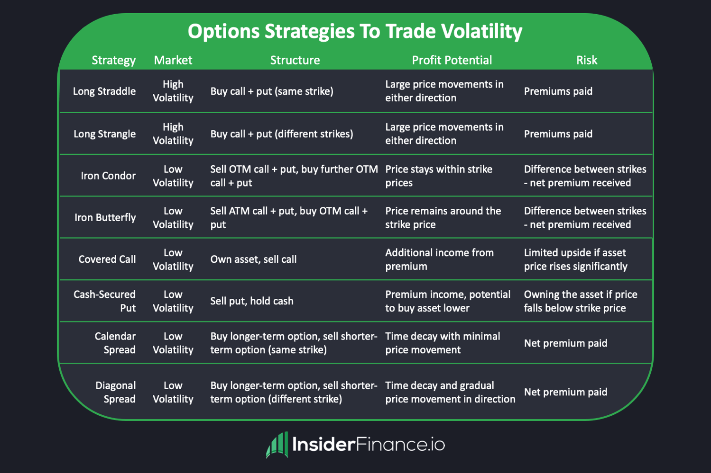

Economic downturns are periods characterized by declining economic activity, typically identified by falling GDP, rising unemployment, and decreased consumer spending. These downturns can have profound effects on financial markets, often leading to heightened volatility, reduced asset prices, and diminished investor confidence. Recognizing the potential for financial instability during such times underscores the importance of robust strategic financial planning.

Strategic financial planning becomes especially crucial during economic downturns to safeguard and potentially enhance financial positions. This involves evaluating one’s financial health, setting realistic goals, and adjusting investment strategies to suit the economic climate. Building an emergency fund, managing debts, and maintaining a diversified investment portfolio are essential components of a sound financial strategy that can help mitigate risks associated with economic contractions.



Options strategies and algorithmic trading have emerged as potential tools to navigate turbulent markets effectively. Options trading allows investors to hedge against market declines using various strategies such as puts, calls, and spreads. These provide flexibility and leverage, offering opportunities to profit even in falling markets. Algorithmic trading introduces automation and efficiency, utilizing sophisticated algorithms to execute trades with speed and precision, minimizing emotional biases, and potentially improving returns.

The purpose of this article is to equip investors and traders with the knowledge and strategies needed to successfully manage their investments during economic downturns. By understanding economic downturns, the importance of financial planning, and leveraging advanced trading techniques such as options strategies and algorithmic trading, individuals can better shield their investments and seize opportunities for growth even in adverse economic conditions.

The following sections will cover a comprehensive understanding of economic downturns, the necessity of financial planning, detailed exploration of options strategies, the role and benefits of algorithmic trading, and methods to integrate these strategies to create a cohesive and effective investment framework. Together, these insights aim to empower readers to navigate future economic challenges with greater confidence and preparedness.

## Table of Contents

## Understanding Economic Downturns

Economic downturns, often referred to as recessions, are periods where the economy experiences negative growth or contraction. These downturns are characterized by a decline in several economic indicators such as GDP, employment, investment spending, capacity utilization, household incomes, and business profits. Typically, a recession occurs when there is a noticeable decline in economic activity across the economy lasting more than a few months, as defined by the National Bureau of Economic Research (NBER).

Historically, economic downturns have had profound impacts on global economies. For instance, the Great Depression of the 1930s led to widespread unemployment and severe deflation, altering economic policies worldwide. More recently, the 2008 Global Financial Crisis resulted in a significant economic slowdown, with far-reaching effects such as the collapse of major financial institutions and the implementation of austerity measures in several countries.

Key indicators that signal an economic downturn include a decrease in consumer and business confidence, a drop in industrial production, an increase in unemployment rates, and declining retail sales. The yield curve, which plots the interest rates of bonds having equal credit quality but differing maturity dates, is another critical indicator. An inverted yield curve, where short-term interest rates exceed long-term ones, is often viewed as a predictor of recession. 

Governments and central banks play a crucial role during economic downturns. They employ fiscal policies, such as adjusting tax rates and government spending, and monetary policies, like altering interest rates and open market operations, to stabilize the economy. During the 2008 crisis, for instance, many governments implemented stimulus packages, while central banks employed quantitative easing to inject [liquidity](/wiki/liquidity-risk-premium) into the economy.

The effects of economic downturns can vary in duration and severity, impacting individual financial stability both in the short-term and long-term. Short-term effects often include job losses and reduced income, leading to decreased consumer spending and challenges in meeting financial obligations. Long-term consequences might involve diminished retirement savings due to volatile stock markets, prolonged periods of unemployment, and changes in career trajectories. Individuals who were financially unprepared before a recession may experience greater difficulty achieving long-term financial goals, necessitating a reevaluation of budgeting, savings, and investment strategies.

## The Importance of Financial Planning

Economic uncertainty often amplifies the necessity for strategic financial planning, serving as a stabilizing force amidst [volatility](/wiki/volatility-trading-strategies). Proactive financial planning enables individuals and businesses to make informed decisions, ensuring financial resilience in adverse conditions. It can mitigate risks, safeguard assets, and capitalize on opportunities that may arise during downturns, ultimately contributing to both short-term security and long-term growth.

### Assessing Financial Health

Assessing one's financial health is the first step towards effective planning. Individuals should begin by evaluating their net worth, which is calculated as:

$$
\text{Net Worth} = \text{Total Assets} - \text{Total Liabilities}
$$

Understanding this value provides a clear picture of existing resources and financial obligations. An accurate assessment also involves reviewing cash flow, including income sources and expenditures, to identify areas for potential improvement. By creating a comprehensive financial statement, individuals can better understand their spending patterns and set realistic priorities.

### Setting Realistic Financial Goals

During economic downturns, financial goals may need recalibrating to reflect new realities. It's crucial to prioritize essential expenses and set achievable objectives. For instance, maintaining liquidity might become more critical than investing in long-term assets due to increased uncertainty. A useful approach is to classify goals in terms of urgency and importance, which helps in allocating resources efficiently. Methods like the SMART criteria (Specific, Measurable, Achievable, Relevant, Time-bound) are often employed for setting and evaluating these goals.

### Building an Emergency Fund and Managing Debts

One key aspect of financial planning is establishing an emergency fund. This fund should cover three to six months' worth of living expenses, acting as a financial cushion against unforeseen events such as job loss or health emergencies. The size of the emergency fund should be tailored to individual circumstances, risk tolerance, and employment stability.

Debt management becomes increasingly vital during a downturn. Strategies might include prioritizing high-interest debt repayment to minimize financial strain. For example, the snowball method, where debts are paid starting from the smallest to the largest, can provide psychological motivation, albeit the avalanche method—focusing on high-interest debt—can optimize financial outcomes.

### Diversified Investment Portfolio

A diversified investment portfolio can mitigate risks and enhance returns, especially in turbulent times. This strategy involves spreading investments across multiple asset classes—such as stocks, bonds, and real estate—to reduce the impact of market volatility on the overall portfolio. Asset allocation should align with individual risk tolerance and investment horizon, requiring periodic rebalancing to maintain desired exposure levels.

Modern portfolio theory (MPT) suggests that an optimal portfolio can be achieved by maximizing expected return for a given level of risk, or equivalently, minimizing risk for a specified return level. Investors can use tools such as optimization algorithms to find the best asset mix. Below is a simple Python code example to demonstrate portfolio optimization with random returns and risks:

```python
import numpy as np

# Simulating portfolio returns and risks
returns = np.random.rand(5)
risks = np.random.rand(5)
weights = np.random.rand(5)
weights = weights / np.sum(weights)

# Calculating expected portfolio return and risk
portfolio_return = np.sum(weights * returns)
portfolio_risk = np.sqrt(np.dot(weights.T, np.dot(np.cov(np.array([returns, risks])), weights)))

print("Expected Portfolio Return:", portfolio_return)
print("Portfolio Risk:", portfolio_risk)
```

In conclusion, proactive financial planning is an indispensable tool amidst economic uncertainty. By assessing financial health, setting realistic goals, building an emergency fund, managing debts, and ensuring portfolio diversification, individuals can fortify their financial stability and potentially capitalize on market opportunities, even during challenging times.

## Options Strategies in an Economic Downturn

Options trading is a financial strategy that offers unique benefits, particularly during periods of market volatility such as economic downturns. By leveraging options, investors can potentially mitigate risks and even profit from declining markets. Options are derivative instruments that derive their value from an underlying asset, such as a stock or an index, and can be classified into different types, including puts, calls, and spreads.

# to Options Trading

Options provide the right, but not the obligation, to buy (call option) or sell (put option) an underlying asset at a predetermined price, known as the strike price, within a specified timeframe. The flexibility of options allows investors to design strategies that align with their market outlook, whether bullish, bearish, or neutral.

### Popular Options Strategies

1. **Put Options**: These are contracts that give the holder the right to sell an asset at a specified price before expiration. During economic downturns, investors might use put options to hedge against declining stock prices. For instance, purchasing a put option on a stock allows an investor to sell the stock at the strike price, even if the market price falls below it.

2. **Call Options**: These allow the holder to buy an asset at a predetermined price. while they are typically utilized in optimistic market scenarios, call options can also be part of strategies that benefit from high volatility.

3. **Spreads**: Option spreads involve taking simultaneous positions in different options to limit losses and offset costs. A popular spread strategy during downturns is the "bear put spread," which involves buying a put option and selling another put option with a lower strike price. This strategy profits from a decline in the underlying asset's price while capping potential losses.

### Options as a Hedge

Options serve as a hedge by enabling investors to insure their portfolios against potential losses. By strategically using put options, investors can establish a safety net that activates when asset values decline significantly, thus reducing overall portfolio risk.

### Risk vs. Reward Analysis

In options trading, the risk-reward dynamic is pivotal. Options can significantly amplify potential returns due to their leveraged nature. However, they can also lead to substantial losses, particularly during economic contractions when the market behaves unpredictably. For instance, options can expire worthless, leading to a 100% loss of the premium paid.

To assess the risk and reward, investors often use the concept of "Greeks," which quantify the sensitivity of an option's price to various factors:
- **Delta**: Sensitivity of the option price to changes in the price of the underlying asset.
- **Gamma**: Rate of change in delta relative to the underlying asset's price.
- **Theta**: Sensitivity of the option price to the passage of time.
- **Vega**: Sensitivity of the option price to volatility changes.

Understanding these metrics is crucial for managing exposure and optimizing strategies.

### Case Studies of Successful Options Strategies

Historical analyses showcase how options strategies can be effectively deployed during downturns. For example, during the 2008 financial crisis, some investors successfully used put options to protect their portfolios from substantial losses. By anticipating significant declines, these investors locked in prices that exceeded market levels at expiration, thus minimizing their financial impact.

In another instance, the COVID-19 pandemic-induced market downturn of 2020 illustrated how volatility can be harnessed through options. Investors who incorporated options spreads, such as strangles or straddles, benefited from capturing profits from sizable price oscillations.

### Conclusion

Options trading provides versatile strategies for navigating economic downturns. By employing puts, calls, and spreads, investors can hedge against adverse market conditions, manage risk-reward dynamics efficiently, and potentially capitalize on volatility-driven opportunities. While challenges such as complex risk management and potential losses exist, a well-informed approach to options trading can serve as an effective component of a broader financial strategy aimed at stability and growth during uncertain times.

## The Role of Algorithmic Trading

Algorithmic trading, often referred to as "algo trading," involves the use of computer programs to execute trading strategies at speeds and frequencies that are impossible for human traders to match. This form of trading leverages the power of automation to analyze markets, execute orders, and even manage post-trade activities. The primary benefit of [algorithmic trading](/wiki/algorithmic-trading) is its ability to increase efficiency and precision while decreasing costs and human error.

Algorithms can optimize trading efficiency by executing trades in milliseconds, capitalizing on market opportunities that might be missed by manual trading. They are programmed to follow defined instructions or rules that consider factors such as timing, price, quantity, and market conditions. By doing so, algorithms can reduce emotional biases that human traders might face, such as fear and greed, which often lead to irrational trading decisions.

Various types of algorithms are employed during economic downturns, each designed to execute different trading strategies. Among these are:

1. **Trend-Following Algorithms:** These algorithms are programmed to follow market trends and can be useful in both rising and falling markets. They identify patterns and execute trades based on the assumption that prices will move in the direction of the established trend.

2. **Mean-Reversion Algorithms:** Based on the assumption that prices will revert to their mean or average value over time, these algorithms are particularly useful in volatile markets where prices experience large swings.

3. **Arbitrage Algorithms:** These algorithms exploit price discrepancies of the same asset in different markets. In times of high volatility, such discrepancies may become more pronounced, offering opportunities for profit.

4. **Market Making Algorithms:** These involve placing both buy and sell limit orders to capture the spread between bid and ask prices. Market making algorithms can provide liquidity in downturns when investors might struggle to sell assets.

5. **Execution Algorithms:** These algorithms are designed to carry out large trades over a period to minimize market impact and slippage. This is crucial during downturns when market liquidity might be reduced.

Despite their advantages, algorithmic trading is not without risks and challenges. One major risk is the possibility of technical failures and errors in the code, which can lead to significant financial losses. Additionally, market conditions may change rapidly, rendering an algorithm's strategy obsolete. There is also the risk of being caught in a feedback loop, where rapid fluctuations caused by algo trading can lead to more algos reacting to those changes, amplifying market volatility.

Looking ahead, algorithmic trading is expected to play an increasingly vital role in financial markets, especially during turbulent periods. Advances in [artificial intelligence](/wiki/ai-artificial-intelligence) (AI) and [machine learning](/wiki/machine-learning) are driving the next generation of algos, which are capable of adapting to changing market conditions and learning from new data. This evolution in algo trading technology could further enhance the ability of traders and investors to navigate economic downturns effectively.

The integration of AI and machine learning in algorithmic trading systems promises not only increased adaptability but also the potential for these systems to develop insights and strategies autonomously. As a result, algo trading is likely to become even more important as markets become more complex and data-driven.

## Integrating Options and Algo Trading in Your Strategy

Integrating both options strategies and algorithmic trading into a cohesive investment strategy can provide enhanced flexibility and responsiveness in volatile markets. Here, we explore the critical methods and resources necessary for successfully merging these modern techniques with traditional investment approaches.

### Steps to Incorporate Options and Algo Trading

1. **Understanding the Fundamentals**: A thorough comprehension of options trading requires familiarity with its foundational elements, including calls, puts, and various spreads. Algorithmic trading demands a robust understanding of programming languages like Python, statistical methods, and financial markets. These skills form the bedrock upon which complex strategies are built.

2. **Developing a Strategy Framework**: Begin by outlining investment goals, risk tolerance, and time horizon. Options strategies such as protective puts or covered calls can be matched with algorithmic trading models for risk management and potential returns. 

3. **Backtesting and Paper Trading**: Utilize historical data to backtest both options strategies and algorithmic models. Platforms like QuantConnect or Interactive Brokers offer environments for simulating trades without financial risk. This step is crucial for validating performance and understanding potential pitfalls.

4. **Iterative Optimization**: Refine strategies based on backtest results and market conditions. Algorithms should be updated to factor in changing volatilities, while options strategies should be adapted to align with current market outlooks and strategic objectives.

### Balancing Traditional and Modern Techniques

A successful strategy often combines long-term investment principles with innovative methods. Traditional portfolios benefit from diversification and capital preservation, while options and algorithms can enhance returns and provide additional hedging opportunities. A balanced approach involves assessing asset allocations regularly and dynamically adjusting exposure based on market conditions and strategy performance.

### Tools and Resources for Implementation

Numerous tools exist to aid in the integration of options and algorithmic trading:

- **Trading Platforms**: TD Ameritrade's thinkorswim and Interactive Brokers offer comprehensive options analytics and algo trading capabilities.

- **Algorithmic Trading Software**: Python libraries like Pandas and Zipline are instrumental in developing and testing algorithmic strategies.

- **Educational Resources**: Online courses from Coursera and platforms like Udacity offer structured learning paths for both options trading and algorithmic development, catering to varying levels of expertise.

### Role of Financial Advisors

Financial advisors play a crucial role in shaping a cohesive strategy that incorporates both options and algorithmic trading. Advisors can provide customized guidance concerning the appropriateness of specific strategies based on an investor's financial goals and risk profile. Moreover, their insights can help bridge the gap between traditional and advanced strategies, ensuring a well-rounded approach.

### Success Stories and Testimonials

Investors have successfully integrated options and algorithmic trading to achieve significant market outperformance:

- **Hedging Strategies**: During recent market downturns, several investors reported effectively using protective puts to safeguard against losses, while employing algorithms to identify market inefficiencies and capitalize on arbitrage opportunities.

- **Algorithmic Decision Making**: Testimonials highlight cases where algorithmic trading systems helped in maintaining disciplined strategies devoid of emotional biases, resulting in improved decision-making and consistent returns even amidst volatility.

In conclusion, the integration of options and algorithmic trading into an investment strategy offers a powerful combination of traditional wisdom and modern technology. By leveraging the right tools, resources, and expert advice, investors can construct a strategy that is resilient, adaptive, and well-suited to navigating complex economic landscapes.

## Concluding Thoughts

Understanding the nuances of financial markets during economic downturns is essential for investors and traders aiming to safeguard their portfolios while seeking potential gains. Throughout this article, we have examined the intricacies of economic slowdowns, highlighting the importance of proactive financial planning and using advanced trading methodologies like options strategies and algorithmic trading.

Financial planning requires foresight, particularly in volatile times. Building a robust emergency fund, managing debts, and maintaining a diversified investment portfolio are critical steps toward achieving financial resilience. These strategies not only cushion against immediate financial impacts but also set the groundwork for seizing opportunities that may arise as markets stabilize.

Options strategies play a vital role in managing market uncertainty. By leveraging puts, calls, and spreads, investors can effectively hedge against potential downturns while maintaining flexibility to adapt as situations evolve. Historical case studies demonstrate the efficacy of options trading in mitigating risk while ensuring potential rewards align with strategic financial objectives.

Algorithmic trading further complements traditional methods by introducing automated precision and reducing emotional biases in trading decisions. Utilizing different algorithmic strategies can enhance trading efficiency, enabling investors to react swiftly to market changes. Despite potential risks, the continued evolution and growth of algorithmic trading underscore its crucial role in navigating turbulent markets.

Integrating options strategies with algorithmic trading presents an innovative approach, allowing investors to blend tried-and-true methods with cutting-edge technologies. This fusion facilitates a balanced investment strategy that leverages the strengths of both traditional and modern techniques. Access to educational resources and professional financial advice can significantly aid in the successful adoption of these strategies, as evidenced by various investor testimonials.

As we conclude, it is paramount to reiterate the importance of remaining informed and flexible. Economic downturns require adaptive strategies and a readiness to respond to changing market conditions. By staying educated and reassessing financial plans regularly, investors are better positioned to mitigate risks and capitalize on emergent opportunities.

We encourage you to take the initiative in financial planning and trading, leveraging the insights discussed to enhance your strategies. Consider consulting with financial advisors to tailor your approach further and optimize outcomes. Engaging with expert content and professional advice ensures a comprehensive understanding and strategic preparedness for future economic challenges.

## References & Further Reading

[1]: Bergstra, J., Bardenet, R., Bengio, Y., & Kégl, B. (2011). ["Algorithms for Hyper-Parameter Optimization."](https://dl.acm.org/doi/10.5555/2986459.2986743) Advances in Neural Information Processing Systems 24.

[2]: ["Advances in Financial Machine Learning"](https://www.amazon.com/Advances-Financial-Machine-Learning-Marcos/dp/1119482089) by Marcos Lopez de Prado

[3]: ["Evidence-Based Technical Analysis: Applying the Scientific Method and Statistical Inference to Trading Signals"](https://www.amazon.com/Evidence-Based-Technical-Analysis-Scientific-Statistical/dp/0470008741) by David Aronson

[4]: ["Machine Learning for Algorithmic Trading"](https://github.com/stefan-jansen/machine-learning-for-trading) by Stefan Jansen

[5]: ["Quantitative Trading: How to Build Your Own Algorithmic Trading Business"](https://www.amazon.com/Quantitative-Trading-Build-Algorithmic-Business/dp/1119800064) by Ernest P. Chan