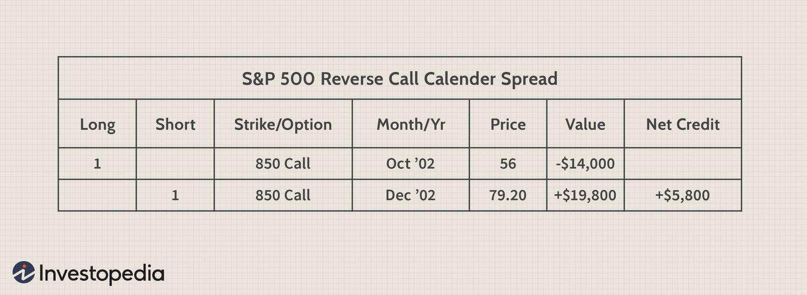

The world of financial trading is vast and complex, with various strategies tailored to accommodate different market conditions. One notable strategy in this landscape is options trading, which offers investors a unique pathway to capitalize on market movements, particularly during bear markets or near market bottoms. Options trading involves contracts that provide the right, but not the obligation, to buy or sell an underlying asset at a specified price before a set expiration date. This framework allows for a level of strategic flexibility, enabling investors to hedge risks or speculate on asset price changes.

In recent years, the integration of algorithmic trading has further bolstered the field of options trading, enhancing the ability to execute intricate strategies with precision and speed. Algorithmic trading, which leverages computer programs to execute trades based on predetermined criteria, minimizes human error and increases efficiency. This integration allows traders to navigate the complexities of options strategies more effectively, especially in volatile market conditions.



This article explores the interplay between options trading, investment strategies, market bottoms, and algorithmic trading. A detailed understanding of these concepts reveals how they can collectively maximize investment potential. Readers will gain insights into specific strategies like reverse calendar spreads and understand how algorithmic tools can be utilized to address market volatility. By embracing these advancements, investors can refine their approaches and position themselves more advantageously within the dynamic landscape of financial trading.

## Table of Contents

## Understanding Options Trading

Options trading involves financial contracts, known as derivatives, that provide the holder with the right—but not the obligation—to buy or sell an underlying asset, such as stocks, at a predetermined price before a specified expiration date. This mechanism introduces a level of flexibility in trading that allows investors to capitalize on varying market conditions while managing risk. These contracts are divided into two primary types: calls and puts. A call option gives the holder the right to purchase the underlying asset, while a put option allows the holder to sell it.

The versatility of options contracts gives rise to a wide array of trading strategies, each catering to different financial objectives and risk appetites. At the most basic level, investors can engage in buying calls if they anticipate an upward movement in an asset's price or purchasing puts if a decline is expected. These strategies are often used either to speculate on price movements or to hedge against potential losses in other investments.

Additionally, other basic strategies include selling covered calls and employing protective puts. Selling covered calls involves holding an underlying asset and selling call options on that same asset. This strategy generates additional income through the option premium and can provide limited downside protection. Conversely, protective puts involve holding a long position in an asset while purchasing put options on that asset as a hedge against possible price declines, thus offering insurance akin to a floor price for the holdings.

Beyond these foundational strategies, options trading can extend into more sophisticated techniques that can be valuable in complex market environments. Advanced strategies such as the straddle, strangle, or butterfly spread are employed by traders to exploit various market scenarios, including high [volatility](/wiki/volatility-trading-strategies) or price neutrality situations. These tactics aim to eithercapitalize on expected volatility or minimize potential losses through careful balancing of multiple option contracts.

For instance, a straddle involves purchasing both a call and a put option with the same strike price and expiration date. This strategy benefits from significant price movements in either direction, reflecting the expectation of volatility. Alternatively, a butterfly spread involves using multiple strike prices in options trading to establish a range-bound strategy that profits when the underlying asset remains close to a particular price.

In summary, options trading offers a dynamic toolset for investors, enabling them to tailor their financial strategies to distinct market conditions and personal risk preferences. From basic hedging techniques to more intricate trading systems, options provide a spectrum of possibilities for achieving various investment goals.

## Market Bottoms: Timing and Strategy

A market bottom represents a phase when stock prices reach their lowest point before rebounding. Detecting these bottoms is a complex challenge that typically involves a combination of technical, fundamental, and sentiment analysis.

Technical analysis plays a pivotal role, using indicators like Relative Strength Index (RSI) to identify oversold conditions that suggest a potential reversal. A RSI below 30, for example, often signals that a stock is oversold, possibly indicating a market bottom. Additionally, Moving Averages (MAs) and Bollinger Bands can help detect price deviations that may precede a reversal.

Fundamental analysis considers economic indicators and company performance metrics to assess whether market valuations are justified or undervalued. For instance, a Price-to-Earnings (P/E) ratio significantly lower than historical averages may suggest undervaluation, hinting at a market bottom.

Sentiment analysis evaluates investor behavior, such as levels of fear and greed, to anticipate market turns. Metrics like the CBOE Volatility Index (VIX), often referred to as the "fear index," can provide insights into investor sentiment, with elevated levels frequently coinciding with market bottoms.

One effective strategy to exploit market bottoms is the reverse calendar spread, which involves purchasing a near-term option and selling a longer-term option of the same strike. This strategy benefits from a market rebound as volatility tends to contract, minimizing exposure to adverse price movements.

Mathematically, the profit potential of a reverse calendar spread can be visualized through:

$$
\text{Profit} = \text{Premium received from short option} - \text{Premium paid for long option} 
$$

This approach reduces downside risk while positioning traders for potential gains if the market rebounds swiftly. By applying a mix of technical, fundamental, and sentiment analysis, traders can more accurately time their strategies to capitalize on market bottoms.

## Leveraging Algorithmic Trading in Options

Algorithmic trading, commonly referred to as algo trading, utilizes sophisticated computer programs to execute trade orders based on pre-defined criteria, ensuring minimal human intervention and maximizing efficiency. This method has gained prevalence in options trading due to its ability to manage complex strategies with precision and speed.

In the diverse landscape of options trading, algorithmic tools are instrumental in executing intricate strategies. These strategies include spread trading, volatility [arbitrage](/wiki/arbitrage), and directional plays—all of which require precise timing and rapid execution, capabilities that are well-suited to algorithmic systems. For instance, spread trading involves simultaneous buying and selling of related options, which can quickly become convoluted for manual trading. Algorithmic programs can seamlessly manage such transactions, reducing the risk of human error and optimizing entry and [exit](/wiki/exit-strategy) points.

Moreover, the key benefits of algo trading in the options market include enhanced speed, accuracy, and risk management. Algorithms can process vast amounts of data in milliseconds, identifying trading opportunities that might be missed by the human eye. They also bring a high level of precision, executing trades instantly at predetermined criteria, thereby minimizing slippage. In terms of risk management, algorithms can adjust to market conditions dynamically, executing stop-loss orders and other risk mitigation measures automatically.

One significant advantage of [algorithmic trading](/wiki/algorithmic-trading) is the capability to backtest strategies using historical data. This function allows traders to simulate the performance of a strategy over past market conditions to gauge its effectiveness before deploying it live. By testing these strategies with historical data, traders can refine their approaches, improving the reliability and profitability of their trades. Here's a simple Python example using a [backtesting](/wiki/backtesting) library to showcase how one might backtest a basic options trading strategy:

```python
import pandas as pd
import numpy as np
from backtesting import Backtest, Strategy
from backtesting.lib import crossover

class AlgoStrategy(Strategy):
    def init(self):
        price = self.data.Close
        self.short_ma = self.I(pd.Series.rolling, price, 5).mean()
        self.long_ma = self.I(pd.Series.rolling, price, 20).mean()

    def next(self):
        if crossover(self.short_ma, self.long_ma):
            self.buy()
        elif crossover(self.long_ma, self.short_ma):
            self.sell()

data = pd.read_csv('options_data.csv', parse_dates=True, index_col='Date')
bt = Backtest(data, AlgoStrategy, cash=10000, commission=.002)
stats = bt.run()
bt.plot()
```

Additionally, algo trading platforms provide advanced analytics capabilities, empowering traders to continuously refine their strategies. These platforms offer features like volatility analysis and probability assessments, enabling traders to make informed decisions based on quantitative data rather than intuition alone.

Overall, the integration of algorithmic trading in the options market presents traders with powerful tools to execute sophisticated strategies efficiently. By leveraging these tools, traders can enhance their ability to capitalize on market opportunities while maintaining controlled risk, thus optimizing their trading performance.

## Reverse Calendar Spread: A Case Study

At market bottoms, traditional options strategies can falter due to heightened volatility and poor timing. Elevated volatility inflates options premiums, making the cost of straightforward strategies like buying calls or puts prohibitive and potentially less profitable. This environment is where the reverse calendar spread strategy shines, offering a more tactically sound approach to benefit from anticipated market recoveries.

The reverse calendar spread involves purchasing a near-term option while simultaneously selling a longer-term option on the same underlying asset with the same strike price. This tactic aims to profit from an expected decrease in volatility as the market starts to recover. The strategic advantage lies in capturing the decay of the options’ time value—often referred to as theta—where the short-term option bought loses its time value slower than the long-term option sold, particularly as volatility contracts.

This setup can mitigate downside risk and reap substantial profits if the market rebounds quickly. The near-term option provides a hedge against further depreciation, limiting potential losses, while the long-term option sold generates premium income, offsetting costs.

During the 2007–2009 financial crisis, traders proficiently utilized the reverse calendar spread to capitalize on extreme market conditions. As volatility peaked, many traditional investment strategies faltered. However, the reverse calendar spread excelled by seizing the opportunity presented by high implied volatility levels and the subsequent market corrections. This strategy effectively balanced the risk of continuous downturns with the advantages of premium decay, positioning traders to harness profits from the ensuing market recovery.

The case of the 2007–2009 crisis exemplifies the reverse calendar spread's value during turbulent times, providing a strategic advantage by leveraging volatility shifts and time decay. This not only underscores the importance of strategic adaptability in trading but also reflects the nuanced mastery required to navigate complex market landscapes effectively.

## Advancing with Algo Trading Platforms

Several platforms offer robust tools for developing and testing algorithmic trading strategies in options trading, streamlining the process for both novice and experienced traders. Among the popular platforms, AlgoTest and UltraAlgo stand out due to their comprehensive features and user-friendly interfaces, offering traders a significant advantage in the competitive financial markets.

AlgoTest provides a suite of features tailored for options traders, including backtesting capabilities, which allow traders to simulate their trading strategies using historical data. This feature is essential for assessing the viability of a strategy before committing real capital. Moreover, AlgoTest includes forward testing and real-time data analysis, helping traders adapt quickly to current market conditions. The platform also offers customizable algorithms, enabling users to tailor their strategies to specific market scenarios, which can be crucial for navigating the complexities of options trading.

UltraAlgo, another leading platform, excels in integrating advanced algorithms that facilitate efficient and effective options trading. This platform supports a seamless trading experience by offering features such as automated trade execution and real-time alerts, ensuring that traders can capitalize on fleeting market opportunities. UltraAlgo's user interface is designed to minimize the learning curve, making it accessible for traders at various skill levels.

When selecting an algorithmic trading platform, it is crucial to choose one that aligns with your trading goals. The platform should provide access to comprehensive market data, which is vital for making informed decisions. Additionally, it should support the complexity of the strategies you intend to deploy, ensuring that your trading system can handle intricate operations without compromising performance.

Ultimately, the right platform will empower traders to implement sophisticated options strategies with precision, enhancing their potential for profitability in the volatile options market. By leveraging these advanced tools, traders can maintain a competitive edge, adapt swiftly to market changes, and optimize their trading outcomes.

## Conclusion: A Strategic Symbiosis

Options trading and algorithmic tools work together effectively, especially during market bottoms, creating a strategic advantage for investors. Strategies such as reverse calendar spreads are instrumental in these scenarios. By purchasing a near-term option while selling a long-term one, traders position themselves to profit when the market rebounds, taking advantage of contracting volatility to mitigate risk.

Algorithmic trading enhances this approach by providing tools to automate and refine strategy execution. Algorithms can analyze vast datasets swiftly, enabling traders to make informed decisions with higher precision. For instance, executing trades at optimal times to capitalize on fleeting market opportunities minimizes human error. The ability to backtest strategies using historical market data further helps traders fine-tune their approach, ensuring robustness in various market conditions.

The financial landscape is inherently volatile and fast-paced, requiring traders to constantly adapt. Continuous education and embracing technological advancements in algorithmic systems are crucial for maintaining a competitive edge. Platforms offering real-time data analysis and execution facilitate this need, ensuring traders remain agile and well-equipped to navigate complex market environments.

In conclusion, the integration of options trading strategies with algorithmic tools fosters a powerful symbiotic relationship, allowing traders to effectively manage risks and capitalize on market dynamics. As technology evolves, staying informed and utilizing these advanced tools will play a pivotal role in successful options trading.

## References & Further Reading

[1]: Natenberg, S. (1994). ["Option Volatility and Pricing: Advanced Trading Strategies and Techniques."](https://www.amazon.com/Option-Volatility-Pricing-Strategies-Techniques/dp/0071818774) McGraw-Hill.

[2]: Chan, E. P. (2009). ["Quantitative Trading: How to Build Your Own Algorithmic Trading Business."](https://github.com/ftvision/quant_trading_echan_book) Wiley.

[3]: Lopez de Prado, M. (2018). ["Advances in Financial Machine Learning."](https://www.amazon.com/Advances-Financial-Machine-Learning-Marcos/dp/1119482089) Wiley.

[4]: Jansen, S. (2020). ["Machine Learning for Algorithmic Trading."](https://github.com/stefan-jansen/machine-learning-for-trading) Packt Publishing.

[5]: Aronson, D. R. (2007). ["Evidence-Based Technical Analysis: Applying the Scientific Method and Statistical Inference to Trading Signals."](https://onlinelibrary.wiley.com/doi/book/10.1002/9781118268315) Wiley.

[6]: Hull, J. C. (2018). ["Options, Futures, and Other Derivatives."](https://www.semanticscholar.org/paper/Options%2C-Futures%2C-and-Other-Derivatives-Hull/89bdee500c8623864fc9eb7a471546aa713acc44) Pearson.

[7]: Harris, L. (2003). ["Trading and Exchanges: Market Microstructure for Practitioners."](https://books.google.com/books/about/Trading_and_Exchanges.html?id=Rd9hDRR1Yx4C) Oxford University Press.