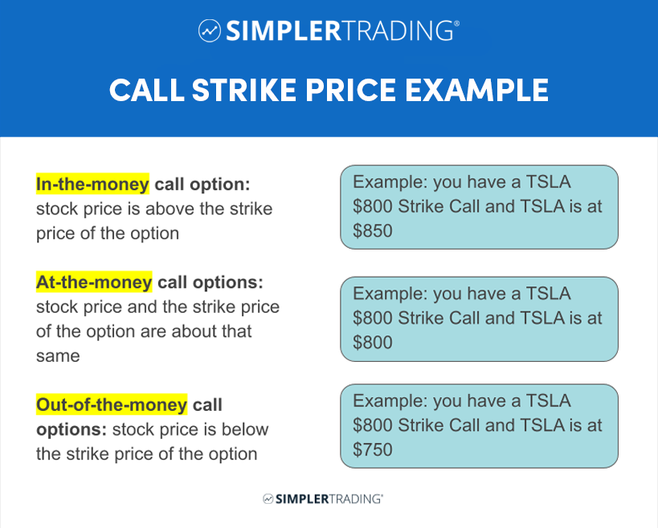

## Table of Contents

## What is an options strike price?

An options strike price is the price at which a stock can be bought or sold when an options contract is exercised. It's like a fixed point that both the buyer and seller of the option agree on when they make the deal. If you have a call option, the strike price is the amount you can buy the stock for. If you have a put option, it's the price at which you can sell the stock.

Think of the strike price as a target. If the actual price of the stock goes above the strike price for a call option, or below it for a put option, the option becomes valuable because you can make a profit by exercising it. If the stock price doesn't reach the strike price, the option might not be worth using, and it could expire without being used.

## How does the strike price affect the value of an option?

The strike price is a big deal when it comes to how much an option is worth. For a call option, if the stock price is higher than the strike price, the option becomes more valuable. This is because you can buy the stock at the lower strike price and then sell it at the higher market price, making a profit. But if the stock price is lower than the strike price, the call option isn't worth much because you wouldn't want to buy the stock at a higher price than what it's selling for in the market.

For a put option, it's the opposite. If the stock price falls below the strike price, the put option becomes more valuable. This is because you can sell the stock at the higher strike price even though the market price is lower, which lets you make money. If the stock price stays above the strike price, the put option loses value because there's no point in selling the stock for less than what you could get in the market. So, the strike price is like a benchmark that helps decide if exercising the option will make you money or not.

## What is the difference between in-the-money, at-the-money, and out-of-the-money options?

An option is in-the-money when it's already worth something if you use it right now. For a call option, this means the stock price is higher than the strike price. You can buy the stock cheaper than what it's selling for. For a put option, it's when the stock price is lower than the strike price, so you can sell the stock for more than what it's worth right now. In-the-money options have some value because they let you make money right away.

An at-the-money option is when the stock price is the same as the strike price. It's like being right on the edge. For both call and put options, at-the-money means there's no immediate profit or loss if you exercise the option. These options can still be valuable because the stock price might move in a way that makes them in-the-money later.

An out-of-the-money option doesn't have any value if you use it right now. For a call option, this happens when the stock price is lower than the strike price. You wouldn't want to buy the stock for more than it's worth. For a put option, it's when the stock price is higher than the strike price, so there's no point in selling the stock for less than its market value. Out-of-the-money options might still become valuable if the stock price moves in the right direction before the option expires.

## How are strike prices determined?

Strike prices are set by the options exchange where the options are traded. They decide on a range of strike prices for each stock, usually in set intervals like $1, $2.50, or $5, depending on how much the stock costs. The goal is to give traders a bunch of choices so they can pick the strike price that fits their plan. The exchange looks at things like how much the stock is trading for right now, how much it might go up or down, and what traders have been interested in before.

When new options are made, the exchange might add new strike prices if the stock's price changes a lot. For example, if a stock that used to be around $50 goes up to $75, they might add higher strike prices to keep up with where the stock is now. They also keep some strike prices that are way above or below the current stock price, because the stock might move a lot in the future. This way, traders have options no matter what happens to the stock price.

## Can you explain the concept of moneyness in relation to strike prices?

Moneyness is a way to describe how valuable an option is based on where the stock price is compared to the strike price. It's like a measure that tells you if exercising the option right now would make you money, lose you money, or break even. For a call option, if the stock price is higher than the strike price, the option is in-the-money because you can buy the stock for less than it's worth and sell it for a profit. If the stock price is lower than the strike price, the call option is out-of-the-money because you'd be buying the stock for more than it's worth. If the stock price and the strike price are the same, the option is at-the-money, meaning you wouldn't make or lose money right away if you used it.

For a put option, it works the other way around. If the stock price is lower than the strike price, the put option is in-the-money because you can sell the stock for more than it's worth right now. If the stock price is higher than the strike price, the put option is out-of-the-money because selling the stock at the strike price would lose you money. And just like with call options, if the stock price and the strike price are the same, the put option is at-the-money, meaning you wouldn't gain or lose money right away by exercising it. Moneyness helps traders figure out how likely it is that they'll make money with their options.

## What role do strike prices play in options trading strategies?

Strike prices are super important in options trading because they help traders pick the right options to match their goals. When you're choosing a strike price, you're deciding how much you think the stock will go up or down. If you think the stock will go way up, you might pick a higher strike price for a call option, hoping to make a big profit if it hits that price. But if you think the stock won't move much, you might pick a strike price that's close to where the stock is now, so you can still make some money even if the stock doesn't change a lot.

Different strike prices also change how much the option costs. An in-the-money option, where the stock price is already better than the strike price, costs more because it's already worth something. An out-of-the-money option, where the stock price isn't there yet, costs less because it might not be worth anything if the stock doesn't move. By picking different strike prices, traders can control how much they spend on options and how much risk they're willing to take. It's all about balancing the cost with the chance of making money, and strike prices are the key to making those choices.

## How do strike prices influence the risk and reward of options?

Strike prices play a big role in deciding how much risk and reward you can get from options trading. When you pick a strike price, you're betting on where you think the stock price will go. If you choose a strike price that's far from where the stock is now, you're taking a bigger risk. That's because the stock has to move a lot for your option to be worth something. But if it does move that far, you could make a bigger profit. It's like betting on a long shot in a race; it's riskier, but the payoff can be huge if you're right.

On the other hand, if you pick a strike price that's close to the current stock price, you're playing it safer. The option might not cost as much, and it's more likely to end up being worth something because the stock doesn't have to move as far. But the reward won't be as big because the difference between the strike price and the stock price won't be as large. It's like betting on a favorite in a race; it's less risky, but the winnings are smaller. So, the strike price you choose helps you balance how much risk you're willing to take with how much reward you're hoping to get.

## What are the common intervals for strike prices in different types of options?

Strike prices usually come in set steps, and how big those steps are depends on what the stock costs. For stocks that are cheap, like under $20, strike prices might be set every $1. If the stock is a bit more expensive, between $20 and $100, the steps might be $2.50 or $5 apart. For really pricey stocks, over $100, the steps could be $5 or even $10. These steps are called intervals, and they help traders have a lot of choices no matter what the stock price is.

Options on stock indexes and ETFs can have different intervals too. For example, with the S&P 500 index options, the intervals might be $5 or $10, depending on where the index is trading. For ETFs, if they're based on stocks, they might follow the same rules as stock options, with intervals like $1, $2.50, or $5. The main thing is that the intervals are set up to give traders plenty of choices, no matter what they're trading.

## How do changes in the underlying asset's price affect the strike price selection?

When the price of the stock or asset you're trading changes, it can make you think differently about which strike price to pick for your options. If the stock price goes up a lot, you might want to choose a higher strike price for a call option because you think the stock will keep going up. On the other hand, if the stock price drops, you might pick a lower strike price for a put option, hoping to sell the stock at a better price than it's worth now. The key is to match your strike price choice with where you think the stock is headed.

Changes in the stock price also affect how much you're willing to spend on an option. If the stock price moves a lot, the options that are in-the-money or close to the money might get more expensive. This means you might have to pay more for the option you want. But if the stock price stays the same or doesn't move much, you might be able to buy options with strike prices that are further away from the current price for less money. So, keeping an eye on the stock price helps you decide not just which strike price to pick, but also how much you're willing to spend on your options.

## What are the tax implications of choosing different strike prices?

When you pick different strike prices for your options, it can change how much tax you have to pay. If you buy a call option with a strike price that's lower than the stock price and you exercise it, you'll have to pay capital gains tax on the profit you make when you sell the stock. The same goes for put options if you sell the stock at a higher strike price than what it's worth now. The tax rate depends on how long you hold the stock after exercising the option. If you hold it for less than a year, it's a short-term capital gain, and you'll pay your regular income tax rate. If you hold it for more than a year, it's a long-term capital gain, and the tax rate is usually lower.

Choosing strike prices that are far from the current stock price can also affect your taxes. If you buy an out-of-the-money option and it expires worthless, you can claim that loss on your taxes, which might help lower your tax bill. But if you pick an in-the-money option and it's worth a lot when you sell it, you'll have to pay taxes on that gain. So, thinking about taxes when you pick your strike prices can help you plan better and maybe save some money on taxes.

## How do implied volatility and strike price interact in option pricing models?

Implied volatility and strike price are both important pieces of the puzzle when it comes to figuring out how much an option is worth. Implied volatility is like a guess about how much the stock price might move around in the future. When implied volatility is high, it means people think the stock could jump a lot, so options cost more because they're riskier. The strike price, on the other hand, is the set price at which you can buy or sell the stock if you use the option. The difference between the strike price and the current stock price, along with the time until the option expires, helps decide if the option is worth something right now.

In option pricing models, like the Black-Scholes model, implied volatility and strike price work together to set the price of the option. If the strike price is far from the current stock price, the option might not be worth much now, but high implied volatility can make it more expensive because there's a bigger chance the stock could move enough to make the option valuable. On the flip side, if the strike price is close to the stock price, the option might already be worth something, but high implied volatility can still push the price up because there's still a risk the stock could swing a lot. So, both implied volatility and the strike price are key to understanding and predicting how much an option will cost.

## Can you provide examples of how strike prices are used in advanced options strategies like spreads and straddles?

In a spread strategy, traders use different strike prices to make a plan that can limit how much they might lose while still giving them a chance to make money. For example, in a bull call spread, you buy a call option with a lower strike price and sell another call option with a higher strike price on the same stock. If you think the stock will go up but not too much, you pick the lower strike price close to where the stock is now and the higher strike price a bit above that. This way, if the stock goes up just a little, you make money on the first option, but the second option you sold helps pay for the first one, so you don't lose as much if the stock doesn't move enough.

In a straddle strategy, you're betting on the stock moving a lot, but you're not sure which way it will go. You buy both a call option and a put option with the same strike price and expiration date. The strike price you pick is usually close to where the stock is trading now. If the stock moves a lot in either direction, one of your options will become valuable. For example, if the stock jumps up, the call option will be worth something, and if it drops down, the put option will be worth something. This way, you can make money no matter which way the stock goes, as long as it moves enough to cover the cost of both options.

## What are Options and Strike Prices and How Can They Be Understood?

Options are financial derivatives granting the right, but not the obligation, to buy or sell an underlying asset at a predefined price, called the strike price. This aspect distinguishes options from other financial instruments, as it offers flexibility concerning the future direction of market movements. The strike price is critical in options trading since it affects the intrinsic value and moneyness status—key elements in determining an option’s potential profitability and risk.

Options are primarily classified into two types: call options and put options. A call option gives the holder the right to purchase the underlying asset at the strike price before the option expires. Conversely, a put option provides the holder the right to sell the underlying asset at the predetermined strike price within the option’s validity period.

The interplay between the market price of the underlying asset, the strike price, and the expiration date significantly influences an option's valuation. This interaction is encapsulated in terms such as 'in-the-money' (ITM) and 'out-of-the-money' (OTM). An option is considered 'in-the-money' if exercising it would result in a profitable transaction. For instance, a call option is ITM when the market price exceeds the strike price, while a put option is ITM when the market price is below the strike price. Conversely, an 'out-of-the-money' option is one that would not yield a profit if exercised under current market conditions—for a call option, when the strike price exceeds the market price, and for a put option, when the market price exceeds the strike price.

The intrinsic value of an option is the difference between the current market price of the underlying asset and the strike price, for ITM options, reflecting the immediate exercise profit. In mathematical terms, the intrinsic value $V$ for a call option can be expressed as:

$$
V_{\text{call}} = \max(0, P_{\text{market}} - P_{\text{strike}})
$$

and for a put option as:

$$
V_{\text{put}} = \max(0, P_{\text{strike}} - P_{\text{market}})
$$

where $P_{\text{market}}$ is the current market price, and $P_{\text{strike}}$ is the strike price. Thus, understanding the relationship between market prices, strike prices, and expiration dates helps traders navigate options trading strategies effectively.

## What is the role of strike prices in options trading?

Strike prices play a pivotal role in determining the potential profitability of an options contract. They are the predefined prices at which the holder of an option can buy or sell the underlying asset, significantly influencing the option's intrinsic value and moneyness status. Intrinsic value refers to the difference between the option's strike price and the current market price of the underlying asset. An option is considered "in-the-money" if exercising it would be profitable.

Options trading strategies are often built around selecting strike prices that align with traders' market expectations and risk tolerance. For example, a trader anticipating significant market movement might employ a strategy like a straddle, which involves purchasing both a call and a put option with the same strike price and expiration date. This allows the trader to profit from substantial movements in either direction. Conversely, a strangle strategy also involves buying a call and a put option but with different strike prices, providing a wider range of profitability if substantial price movements occur.

More sophisticated strategies, such as condors, incorporate multiple strike prices to benefit from stable markets. A condor comprises four options with different strike prices but the same expiration, designed to capitalize when the underlying asset price remains within a specific range. These strategies illustrate the crucial role strike prices play in formulating options trading strategies, as traders adjust their positions based on perceived market [volatility](/wiki/volatility-trading-strategies) and price movements.

The choice of strike price also directly affects the option's delta, which measures the sensitivity of the option's price to a change in the price of the underlying asset. Delta values range from 0 to 1 for call options and from 0 to -1 for put options. A high delta indicates that the option's price is more responsive to changes in the underlying asset's price. For instance, options that are deep in-the-money typically have higher delta values, suggesting greater sensitivity to price changes. Conversely, out-of-the-money options tend to have lower delta values, reflecting less sensitivity.

Mathematically, the delta ($\Delta$) can be computed using the Black-Scholes model, which is expressed as:

$$
\Delta_{\text{call}} = N(d_1)
$$
$$
\Delta_{\text{put}} = N(d_1) - 1
$$

where $N(d_1)$ is the cumulative distribution function of the standard normal distribution for the calculated variable $d_1$.

In conclusion, the effective selection and management of strike prices are fundamental to options trading. By strategically choosing strike prices, traders can tailor their strategies to align with market conditions and personal risk preferences, thereby enhancing the potential profitability of their options contracts.

## References & Further Reading

[1]: Gatheral, J., & Taleb, N. N. (2010). ["The Volatility Surface: A Practitioner's Guide"](https://books.google.com/books/about/The_Volatility_Surface.html?id=P7ASlvLRsKMC). John Wiley & Sons.

[2]: Jabbour, C. E. (2020). ["Options Trading: QuickStart Guide - The Simplified Beginner's Guide to Options Trading"](https://www.amazon.com/Options-Trading-QuickStart-Guide-Simplified-ebook/dp/B01DSKA0E4). ClydeBank Finance.

[3]: Hull, J. C. (2017). ["Options, Futures, and Other Derivatives"](https://www.semanticscholar.org/paper/Options%2C-Futures%2C-and-Other-Derivatives-Hull/89bdee500c8623864fc9eb7a471546aa713acc44). Pearson Education.

[4]: Chan, Ernest P. (2008). ["Quantitative Trading: How to Build Your Own Algorithmic Trading Business"](https://github.com/ftvision/quant_trading_echan_book). John Wiley & Sons.

[5]: Lopez de Prado, M. (2018). ["Advances in Financial Machine Learning"](https://www.amazon.com/Advances-Financial-Machine-Learning-Marcos/dp/1119482089). Wiley Finance.

[6]: Narang, R. K. (2009). ["Inside the Black Box: The Simple Truth About Quantitative Trading"](https://onlinelibrary.wiley.com/doi/book/10.1002/9781118267738). John Wiley & Sons.