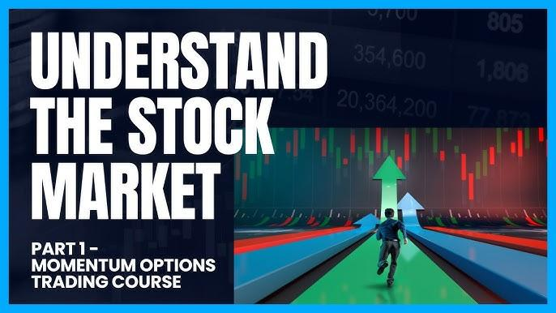

## Table of Contents

## What are the basic concepts of options trading for beginners?

Options trading involves buying and selling contracts that give you the right, but not the obligation, to buy or sell an asset at a specific price before a certain date. These contracts are called options, and they can be used to speculate on the future price movements of stocks, commodities, or other financial instruments. There are two types of options: calls and puts. A call option gives you the right to buy an asset, while a put option gives you the right to sell an asset. The price at which you can buy or sell the asset is called the strike price, and the date by which you must exercise your option is known as the expiration date.

When you buy an option, you pay a premium, which is the cost of the contract. This premium is influenced by factors such as the current price of the underlying asset, the strike price, the time until expiration, and the expected volatility of the asset's price. If you think the price of the asset will go up, you might buy a call option. If you think the price will go down, you might buy a put option. On the other hand, if you sell an option, you receive the premium, but you take on the obligation to sell or buy the asset if the buyer decides to exercise the option. Options trading can be risky, so it's important to understand these basics before you start.

## How can beginners start with options trading courses in 2024?

To start with options trading courses in 2024, beginners should first look for educational platforms that offer beginner-friendly courses. Websites like Coursera, Udemy, and Khan Academy often have courses specifically designed for those new to options trading. These courses usually cover the basics of options, including what they are, how they work, and the different strategies you can use. It's important to choose a course that matches your learning style, whether you prefer video lectures, interactive quizzes, or reading materials.

Once you've selected a [course](/wiki/best-algorithmic-trading-courses), make sure to take your time to understand the concepts thoroughly. Many courses offer a mix of theory and practical examples, which can help you see how options trading works in real life. After completing a course, consider joining online communities or forums where you can ask questions and learn from more experienced traders. This can provide valuable insights and help you feel more confident as you start trading options.

## What are the top options trading courses recommended for beginners in 2024?

For beginners looking to dive into options trading in 2024, one top recommended course is "Options Trading for Beginners" on Udemy. This course is designed to teach the basics of options, including what they are, how they work, and the different strategies you can use. It's great for people who are new to trading because it uses simple language and real-life examples to help you understand the concepts. The course also includes quizzes and assignments to help you practice what you've learned.

Another excellent option is the "Introduction to Options Trading" course on Coursera, offered by a well-known university. This course covers the fundamentals of options trading and is taught by experienced professors who break down complex ideas into easy-to-understand lessons. It's perfect for beginners because it not only teaches you the theory but also gives you practical exercises to apply what you've learned. Both of these courses are highly recommended for anyone starting out in options trading in 2024.

## What are the key strategies intermediate traders should learn from options trading courses?

Intermediate traders should learn about strategies like covered calls and protective puts from options trading courses. A covered call involves owning the stock and selling a call option on that stock. This strategy can generate extra income from the premiums received, but it also limits the potential profit if the stock price rises a lot. A protective put, on the other hand, involves buying a put option for a stock you already own. This acts like insurance, protecting your investment if the stock price falls, but it costs money to buy the put option.

Another important strategy is the straddle, which involves buying both a call and a put option at the same strike price and expiration date. This strategy is useful if you think the stock will move a lot but you're not sure which direction it will go. If the stock price moves significantly in either direction, you can make a profit. However, if the stock price stays the same, you could lose the money you spent on the options. These strategies help intermediate traders manage risk and potentially increase their returns, but they require a good understanding of how options work and the risks involved.

## How do options trading courses in 2024 cater to different learning styles?

Options trading courses in 2024 are designed to fit different ways people learn. Some people like watching videos, so courses have lots of video lessons where teachers explain things step by step. Others prefer reading, so there are text-based lessons and articles that break down the concepts in simple words. For those who learn by doing, many courses include interactive quizzes and practice exercises where you can try out what you've learned in a safe environment. This variety helps make sure that everyone, no matter how they learn best, can understand options trading.

In addition to these methods, some courses also offer live webinars and Q&A sessions where you can ask questions directly to the instructors. This is great for people who like to learn through discussion and real-time interaction. Many platforms also have community forums where you can talk with other learners, share tips, and get advice. By offering these different ways to learn, options trading courses in 2024 make it easier for everyone to grasp the concepts and feel confident in their trading skills.

## What are the advanced options trading strategies covered in expert-level courses?

Expert-level options trading courses in 2024 cover advanced strategies like the iron condor and the butterfly spread. An iron condor involves selling an out-of-the-money call and put while also buying a further out-of-the-money call and put. This creates a range where the stock can move without losing money. It's a good strategy if you think the stock will stay within a certain price range. A butterfly spread uses three different strike prices to create a position that profits if the stock price stays close to the middle strike price at expiration. Both strategies are complex and require a deep understanding of options pricing and market movements.

Another advanced strategy taught in these courses is the calendar spread, also known as a time spread. This involves selling a short-term option and buying a longer-term option at the same strike price. The idea is to profit from the difference in time decay between the two options. If the stock price stays close to the strike price, the short-term option will lose value faster than the long-term option, leading to a profit. These strategies are for experienced traders who understand the risks and can manage their positions carefully.

## How can options trading courses help in risk management for intermediate traders?

Options trading courses help intermediate traders manage risk by teaching them strategies like covered calls and protective puts. With a covered call, you own the stock and sell a call option on it. This can bring in extra money from the option's premium, but it also limits how much you can make if the stock goes up a lot. On the other hand, a protective put is like buying insurance for your stock. You buy a put option to protect against the stock price dropping. While it costs money to buy the put, it can save you from big losses if the stock price falls.

These courses also explain how to use different strategies to manage risk better. For example, they teach you about setting stop-loss orders, which automatically sell your options if they reach a certain loss level. This helps limit how much money you can lose. By understanding these strategies and practicing them in the courses, intermediate traders can feel more confident in managing their risks and making smarter trading decisions.

## What are the latest trends in options trading education for 2024?

In 2024, one of the biggest trends in options trading education is the use of technology to make learning easier and more interactive. Many courses now use virtual trading platforms where you can practice trading options without risking real money. These platforms often have real-time data and simulations that help you see how different strategies work in different market conditions. Another trend is the focus on personalized learning paths. Courses are using AI to figure out what you know and what you need to learn, so they can give you lessons that are just right for your skill level. This makes it easier for everyone to learn at their own pace.

Another trend is the emphasis on community learning. Many courses now have online forums and groups where you can talk to other traders, ask questions, and share tips. This can be really helpful because you can learn from people who have more experience and get advice on how to handle different situations. Also, there's a growing focus on teaching risk management and emotional control. Courses are spending more time on how to manage your emotions and make smart decisions, which is really important for success in options trading.

## How do expert-level courses in 2024 incorporate real-world trading scenarios?

Expert-level courses in 2024 use real-world trading scenarios to help traders learn in a way that feels like the real market. They do this by using virtual trading platforms where you can practice trading options with real-time data. These platforms let you see how different strategies work when the market goes up, down, or stays the same. By using these simulations, you can try out advanced strategies like iron condors and butterfly spreads without risking your own money. This hands-on practice helps you understand how to apply what you've learned in real situations.

In addition to virtual trading, these courses often include case studies of actual trades made by experienced traders. These case studies show you how experts think about the market, how they choose their strategies, and how they manage risk. By going through these real-world examples, you can learn from their successes and mistakes. This kind of learning helps you get ready for the ups and downs of real options trading and makes you feel more confident when you start trading with your own money.

## What are the criteria for selecting the best options trading courses in 2024?

When choosing the best options trading courses in 2024, it's important to think about what you need and how you like to learn. Look for courses that cover the basics if you're new to trading, or advanced strategies if you're more experienced. Make sure the course matches your learning style. Some people like watching videos, while others prefer reading or doing hands-on exercises. Also, check if the course offers practice trading platforms where you can try out what you've learned without risking real money. This can help you feel more confident when you start trading for real.

Another thing to consider is the reputation of the course and the instructor. Look for courses taught by experienced traders who have a good track record. It's also helpful if the course has a community or forum where you can ask questions and learn from other traders. Lastly, think about the cost and whether the course offers good value for money. Some courses might be free or low-cost, while others might be more expensive but offer more in-depth learning and support. By considering these factors, you can find a course that will help you become a better options trader.

## How do options trading courses in 2024 utilize technology for enhanced learning?

Options trading courses in 2024 use technology to make learning easier and more fun. They have virtual trading platforms where you can practice trading options without using real money. These platforms show real-time data and let you try out different strategies to see how they work in different market situations. This hands-on practice helps you understand the concepts better and feel more confident when you start trading for real. Also, many courses use AI to create personalized learning paths. This means the course figures out what you know and what you need to learn, so you get lessons that are just right for your skill level. This makes it easier for everyone to learn at their own pace.

Another way technology helps is through online forums and communities. These are places where you can talk to other traders, ask questions, and share tips. Learning from people who have more experience can be really helpful. Courses also use videos, interactive quizzes, and live webinars to teach in different ways. This means you can choose the way that works best for you. By using technology like this, options trading courses in 2024 make learning more interactive and tailored to your needs, helping you become a better trader.

## What are the success stories or testimonials from participants of top options trading courses in 2024?

Participants of top options trading courses in 2024 have shared many success stories. One learner, Sarah, said that after taking the "Options Trading for Beginners" course on Udemy, she felt much more confident in her trading skills. She started with small trades and slowly increased her investments. Within a year, she was able to make enough money to quit her day job and trade full-time. Sarah credits the course for teaching her the basics in a way that was easy to understand and apply.

Another success story comes from John, who took the "Introduction to Options Trading" course on Coursera. He was already an intermediate trader but wanted to learn more advanced strategies. After completing the course, John started using strategies like iron condors and butterfly spreads. He found that these strategies helped him manage risk better and increase his profits. John now runs a small trading group where he shares what he learned with others, helping them succeed in options trading too.

## References & Further Reading

[1]: Bergstra, J., Bardenet, R., Bengio, Y., & Kégl, B. (2011). ["Algorithms for Hyper-Parameter Optimization."](https://papers.nips.cc/paper/4443-algorithms-for-hyper-parameter-optimization) Advances in Neural Information Processing Systems 24.

[2]: ["Advances in Financial Machine Learning"](https://www.amazon.com/Advances-Financial-Machine-Learning-Marcos/dp/1119482089) by Marcos Lopez de Prado

[3]: ["Evidence-Based Technical Analysis: Applying the Scientific Method and Statistical Inference to Trading Signals"](https://www.amazon.com/Evidence-Based-Technical-Analysis-Scientific-Statistical/dp/0470008741) by David Aronson

[4]: ["Machine Learning for Algorithmic Trading"](https://github.com/PacktPublishing/Machine-Learning-for-Algorithmic-Trading-Second-Edition) by Stefan Jansen

[5]: ["Quantitative Trading: How to Build Your Own Algorithmic Trading Business"](https://www.amazon.com/Quantitative-Trading-Build-Algorithmic-Business/dp/0470284889) by Ernest P. Chan