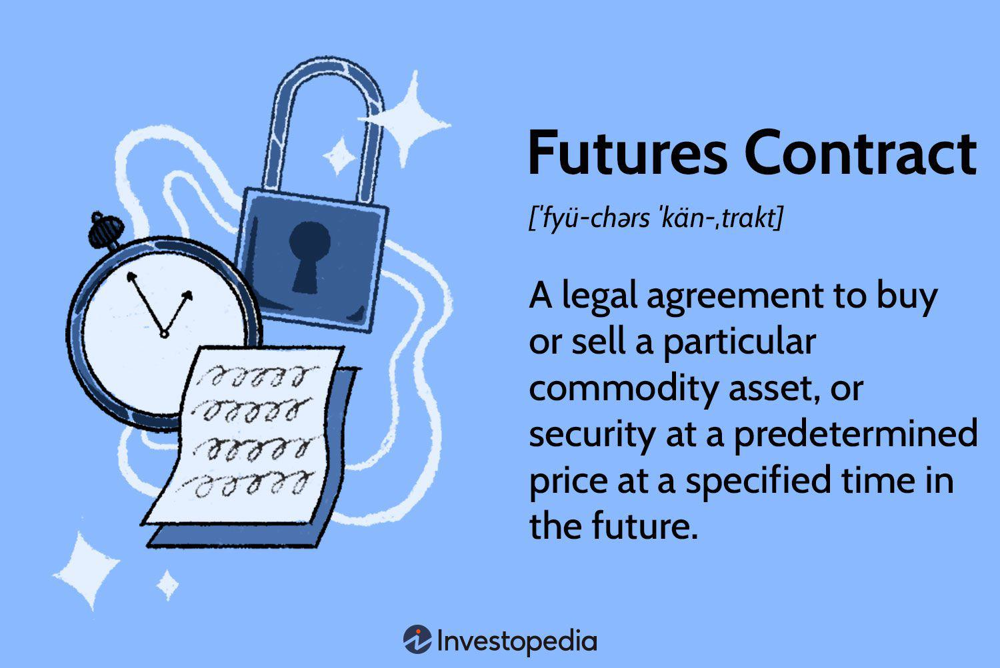

In the world of finance, the landscape is constantly evolving with innovative instruments designed to optimize trading strategies and manage risk. Among these instruments, financial derivatives take center stage, offering a wealth of opportunities through options trading, futures contracts, and algorithmic trading. A financial derivative is a contract whose value depends on the performance of an underlying asset, such as commodities, stocks, currencies, interest rates, or market indices. These instruments play a vital role in the financial markets by enabling traders to hedge against potential losses, speculate on future price movements, and enhance portfolio diversification.

Financial derivatives, by their nature, are versatile and complex. They allow for the creation of tailor-made strategies that can cater to various investment goals and risk appetites. Options, for example, provide the holder the right, but not the obligation, to buy or sell an asset at a specified price before a set expiration date. Futures contracts, on the other hand, obligate the buyer to purchase, and the seller to sell, an asset at a predetermined price at a future date. Algorithmic trading leverages computer algorithms to execute trades at speeds and frequencies far beyond human capabilities, thus optimizing trading precision and efficiency.



This article aims to provide a comprehensive overview of these derivative instruments and their significance in the current financial markets. Understanding these concepts can empower both seasoned traders and beginners to effectively navigate and leverage the extensive opportunities available. By exploring the intricacies, benefits, and potential risks associated with these financial tools, traders can make informed decisions and better manage their investments. Such understanding is crucial not only for maximizing returns but also for mitigating inherent risks, ensuring long-term success in the dynamic financial markets.

## Table of Contents

## Understanding Financial Derivatives

Financial derivatives are financial instruments whose value is contingent upon the value of other underlying financial assets, indices, or interest rates. These instruments are critical tools in financial markets, serving functions such as hedging risk, speculation, and leveraging positions. The primary categories of financial derivatives include futures, options, swaps, and forwards, each of which offers distinct advantages and presents its own set of challenges.

The fundamental characteristic of financial derivatives is the dependency of their value on the underlying asset's performance. This attribute is the cornerstone that defines the nature and valuation of these instruments. Given their flexibility, derivatives are extensively used by market participants to manage potential risks associated with price fluctuations of the underlying assets. For instance, a futures contract allows traders to lock in the price of an asset today for a transaction that will occur at a future date, thereby mitigating the risk of adverse price movements.

Futures and forwards are similar in that both involve agreements to trade an asset at a specified price on a future date. The primary difference is that futures are standardized and traded on exchanges, while forwards are customizable and typically traded over-the-counter (OTC). Options provide the holder with the right, but not the obligation, to buy or sell an asset at a preset price before the expiration date. This feature introduces strategic flexibility, allowing traders to speculate on market directions or hedge existing exposures with defined risk.

Swaps are another class of derivatives used predominantly to exchange cash flows between parties, often to manage [interest rate](/wiki/interest-rate-trading-strategies) or currency exposure. For example, an interest rate swap might involve exchanging a fixed interest rate for a floating rate, which can help in stabilizing the cost of borrowing for organizations with variable rate loans.

Understanding financial derivatives and their application in financial markets is critical for developing effective trading strategies. Derivatives allow for the implementation of complex strategies that can optimize returns, provide downside protection, and enhance portfolio returns through leverage. However, the complex nature of these financial instruments demands a thorough comprehension of their mechanisms and potential implications on financial markets. The role of derivatives is indispensable due to their capacity to stabilize risk exposure, providing [liquidity](/wiki/liquidity-risk-premium), and facilitating price discovery in financial markets.

## Options Trading: Strategies and Benefits

Options trading offers market participants the flexibility to navigate various financial scenarios by granting them the right, but not the obligation, to buy or sell assets at a predetermined price before a specific expiry date. This flexibility comes through two primary types of options: call options and put options. A call option gives the holder the right to purchase an asset, while a put option grants the ability to sell the asset. Each type can be leveraged for distinct strategic objectives, such as hedging, income generation, or speculation.

Options can be employed as effective hedging tools against unfavorable price movements. For instance, an investor holding a portfolio of tech stocks may buy put options to protect against potential downturns in the tech sector. This strategy ensures that the investor can sell the tech stocks at a predetermined price, minimizing potential losses should the market decline.

Income generation through options is another appealing strategy. A common approach is the covered call, where an investor holding a long position in a stock sells call options for the same stock. This strategy allows the investor to earn premium income from the sale of call options, while still holding the underlying stock.

Options traders also use combinations of options to speculate or manage risk around price [volatility](/wiki/volatility-trading-strategies). Strategies such as straddles and strangles involve buying both call and put options simultaneously, providing the trader with opportunities to profit from significant price movements, regardless of the direction.

1. **Straddle Strategy**: This involves buying both a call and a put option with the same strike price and expiration date. It is a bet on significant price movement and profits from volatility. The formula for payoff at expiration $P$ for a straddle is:
$$
   P = \max(S - K, 0) + \max(K - S, 0) - C - P

$$

   where $S$ is the spot price, $K$ is the strike price, $C$ is the cost of the call option, and $P$ is the cost of the put option.

2. **Strangle Strategy**: This involves buying a call and a put with different strike prices but the same expiration date. It is typically cheaper than a straddle and profits from high volatility. It can be executed as follows:

   ```python
   def strangle_payoff(S, K1, K2, C, P):
       payoff = max(S - K2, 0) + max(K1 - S, 0) - C - P
       return payoff
   ```
   Where $K1$ is the strike price for the put and $K2$ is the strike price for the call.

Options trading's appeal lies in its potential for high returns and versatile application, enabling traders to tailor strategies to specific market conditions or personal risk appetites. However, the complexity and associated risks require a thorough understanding and a disciplined approach to capitalize effectively on these financial instruments.

## Futures Contracts: Mechanisms and Applications

Futures contracts are financial instruments that serve as agreements to buy or sell an asset at a predetermined price at a specified time in the future. These contracts play a significant role in financial markets, particularly in commodities, indices, and currencies. By enabling traders to agree on a price today for transactions in the future, futures contracts provide a mechanism for hedging against adverse price movements and speculating on price changes.

The standardized nature of futures contracts ensures that all terms, except for the price, are fixed, facilitating smooth and efficient trading. This standardization typically involves the contract size, the expiration date, the tick size (minimum price movement), and the settlement terms. For example, a futures contract for [crude oil](/wiki/crude-oil) might specify a contract size of 1,000 barrels, with monthly expirations, and a tick size of $0.01 per barrel.

A key aspect of futures trading is the use of margin, which allows traders to take larger positions than they could with the capital they have on hand. When a futures position is opened, traders are required to deposit an initial margin, which is a fraction of the contract's total value. The maintenance margin is the minimum equity that must be maintained in the account to hold the position. If the account balance falls below this level, a margin call occurs, requiring the trader to deposit additional funds. This use of leverage can amplify both gains and losses, making it a powerful yet risky tool.

In futures contracts, leverage can be expressed as follows:

$$
\text{Leverage} = \frac{\text{Notional Value of the Contract}}{\text{Initial Margin}}
$$

For instance, if the notional value of a futures contract is $100,000 and the initial margin requirement is $5,000, the leverage ratio is 20:1. This means that with $5,000, a trader can control a $100,000 position, magnifying both potential gains and losses.

Strategically, futures contracts are used in various ways. Hedgers, such as farmers or oil producers, utilize futures to lock in prices for their products to protect against unfavorable price fluctuations. Speculators, on the other hand, aim to profit from price movements by predicting market trends and taking positions accordingly. Speculation adds liquidity and depth to the futures markets, although it also introduces an element of volatility.

In conclusion, futures contracts are indispensable tools in modern financial markets, playing a crucial role in price discovery and risk management. Their ability to offer leverage magnifies market dynamics, making them attractive to both hedgers and speculators. Understanding the mechanics, applications, and risks associated with futures is critical for informed trading. As the financial landscape evolves, the strategic application of futures contracts will continue to be of paramount importance for market participants.

## Algorithmic Trading: The Role of Technology

Algorithmic trading employs computer programs and algorithms to execute trades at high speeds and frequencies, revolutionizing financial trading by enhancing efficiency and precision in complex strategies. This automated form of trading is engineered to capitalize on very small price movements across various asset classes, leading to numerous transactions that would be unfeasible manually.

The automation and speed offered by [algorithmic trading](/wiki/algorithmic-trading) significantly reduce emotional bias often encountered in trading. Human traders may struggle with emotional reactions or inconsistent decision-making, whereas algorithms adhere strictly to predefined rules and execute trades based on quantitative criteria. By removing the psychological aspect, algorithmic trading allows for a more disciplined approach, which can lead to more consistent outcomes.

One of the significant advantages of algorithmic trading is the capacity for back-testing strategies against historical data to assess their viability before deployment in live markets. By simulating how a strategy would have performed in the past, traders can refine and optimize their algorithms, ensuring they are both robust and profitable under various market conditions. This testing helps in fine-tuning the parameters and identifying potential weaknesses without risking actual capital.

Despite its advantages, algorithmic trading carries certain risks. Systemic errors can arise from coding mistakes or bugs, potentially leading to unintended trades that might affect market prices dramatically. For instance, the "Flash Crash" of May 6, 2010, serves as a notable example where an algorithmic trading error contributed to a rapid and significant market drop. Furthermore, the potential for increased market volatility is another concern, as high-frequency trading strategies can amplify price movements, particularly during times of low liquidity.

The design and implementation of trading algorithms involve a deep understanding of both programming and financial markets. Typically, such algorithms are crafted using complex mathematical models and are implemented in programming languages like Python, C++, or Java. A simple Python-based example for a moving average crossover strategy might involve the following code:

```python
import pandas as pd

# Fetch historical price data
data = pd.read_csv('historical_prices.csv')
data['short_moving_avg'] = data['Price'].rolling(window=20).mean()
data['long_moving_avg'] = data['Price'].rolling(window=50).mean()

# Trading signals
data['signal'] = 0
data['signal'][20:] = np.where(data['short_moving_avg'][20:] > data['long_moving_avg'][20:], 1, 0)

# Entry/Exit points
data['positions'] = data['signal'].diff()

# Display the dataframe
print(data)
```

This example demonstrates how to compute short-term and long-term moving averages to generate trading signals based on their crossover points. In practice, however, professional trading firms employ much more sophisticated models that consider numerous market factors.

Algorithmic trading continuously reshapes modern financial markets by enhancing liquidity, reducing transaction costs, and enabling more efficient price discovery. Yet, the sophistication of these systems necessitates rigorous monitoring and risk management to mitigate potential impacts from technical failures or extraordinary market conditions. As technology advances, the influence and complexity of algorithmic trading are poised to increase, presenting both unprecedented opportunities and challenges in financial markets.

## Risks and Considerations in Derivatives Trading

Financial derivatives, while providing substantial benefits and opportunities for traders, also [carry](/wiki/carry-trading) significant risks that must be understood and managed effectively. The key risks associated with derivatives trading include market risk, counterparty risk, and liquidity risk. 

**Market Risk** involves the possibility of losing money due to unfavorable movements in the price of the underlying asset. Derivatives are particularly sensitive to market fluctuations, and unexpected changes can lead to substantial losses. Traders need to monitor the market conditions closely and employ strategies such as stop-loss orders to mitigate this risk.

**Counterparty Risk** refers to the risk that the other party in a derivatives contract might default on their obligations. This is particularly relevant in over-the-counter (OTC) markets where the lack of a centralized exchange increases the risk of default. To mitigate counterparty risk, traders can use collateral arrangements or trade through clearinghouses, which assume the responsibility of ensuring contract fulfillment.

**Liquidity Risk** arises when it becomes difficult to enter or exit a position due to insufficient trading volume. This can happen when markets are less active, and it can lead to wider bid-ask spreads and increased transaction costs. One strategy to combat liquidity risk is to trade in more liquid markets or instruments, thereby ensuring that positions can be closed without significant price impact.

**Diversification** is a key technique in managing the risks associated with derivatives trading. By spreading investments across different asset classes and instruments, traders can reduce the impact of a poor performance in any single area. A diversified portfolio is less likely to be severely affected by specific market events, thus balancing risk exposure.

**Risk Management Strategies** are critical to navigating the complexities of derivatives trading. These can include quantitative methods, such as Value at Risk (VaR), which estimates the maximum potential loss over a given time frame with a specified confidence level. Additionally, traders can implement various hedging strategies, such as using options to protect against adverse price movements.

Staying informed about market developments and continuously adapting strategies in response to new data and trends are essential practices for traders. The dynamic nature of financial markets requires a vigilant approach to risk management, ensuring that trading decisions are grounded in a thorough understanding of potential exposures and protective measures.

In conclusion, while financial derivatives provide opportunities for enhanced returns and strategic positioning, they also demand careful risk management considerations. By comprehensively understanding and strategically managing the associated risks, traders can better secure their investments and optimize their trading outcomes.

## Conclusion

Financial derivatives, encompassing options trading, futures contracts, and algorithmic trading, are integral to modern financial markets. These instruments equip traders with diverse strategies to optimize returns and manage risk effectively. By engaging in options trading, traders can employ calls and puts to hedge against adverse price movements or speculate on future price trends. Futures contracts allow for price locking and speculation on commodities, indices, and currencies, providing a structured approach to mitigate volatility.

Algorithmic trading, leveraging advanced computational algorithms, enhances execution speed and precision, enabling traders to navigate complex market environments with reduced emotional bias. Despite these advantages, derivatives trading is not devoid of risks. Market, counterparty, and liquidity risks must be carefully analyzed and managed to ensure successful trading outcomes. Diversification and robust risk management strategies are essential for minimizing exposure to potential losses.

As technological innovation progresses, the sophistication of derivative instruments is expected to increase, presenting both new opportunities and challenges. The continuous evolution of technology demands ongoing education and adaptability from market participants. By increasing their understanding of these financial tools and their inherent risks, traders can position themselves strategically in the ever-changing financial landscape, poised to capitalize on emerging opportunities.

## References & Further Reading

[1]: Hull, J. C. (2017). ["Options, Futures, and Other Derivatives"](https://www.semanticscholar.org/paper/Options%2C-Futures%2C-and-Other-Derivatives-Hull/89bdee500c8623864fc9eb7a471546aa713acc44) (9th ed.). Pearson.

[2]: Black, F., & Scholes, M. (1973). ["The Pricing of Options and Corporate Liabilities,"](https://www.cs.princeton.edu/courses/archive/fall09/cos323/papers/black_scholes73.pdf) Journal of Political Economy, 81(3), 637-654.

[3]: Fabozzi, F. J., & G. Focardi, S. M. (2008). ["Analysis of Financial Data,"](https://onlinelibrary.wiley.com/doi/book/10.1002/9781118856406) John Wiley & Sons.

[4]: Chan, E. (2009). ["Quantitative Trading: How to Build Your Own Algorithmic Trading Business,"](https://github.com/ftvision/quant_trading_echan_book) John Wiley & Sons.

[5]: Aldridge, I. (2013). ["High-Frequency Trading: A Practical Guide to Algorithmic Strategies and Trading Systems,"](https://www.amazon.com/High-Frequency-Trading-Practical-Algorithmic-Strategies/dp/1118343506) John Wiley & Sons.

[6]: Hull, J. C. (2014). ["Risk Management and Financial Institutions"](https://www.amazon.com/Management-Financial-Institutions-Wiley-Finance/dp/1119932483) (4th ed.). Wiley.