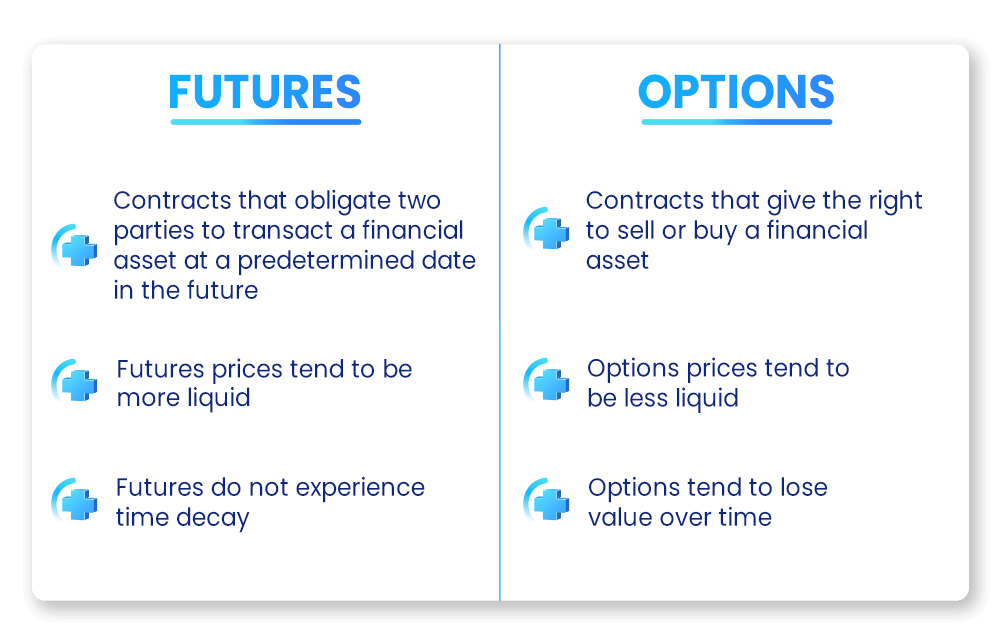

## Table of Contents

## What are futures contracts and how do they work?

Futures contracts are agreements to buy or sell an asset at a future date for a price that is agreed upon today. These assets can be anything from commodities like oil or wheat, to financial instruments like stock indexes or currencies. The main purpose of futures is to help people manage the risk of price changes. For example, a farmer might use a futures contract to lock in a price for their crops, so they know how much money they will get even if the market price drops before they sell.

When you enter into a futures contract, you don't have to pay the full amount right away. Instead, you put down a smaller amount called the initial margin. This acts like a deposit, showing that you are serious about the contract. As the price of the asset changes, the value of your futures contract will also change. If the price goes in your favor, you'll see a gain in your account. If it goes against you, you might need to add more money to your margin account to keep the contract active. At the end of the contract, you can either take delivery of the asset or settle the contract in cash, depending on what the contract specifies.

## What is options trading and how does it relate to futures contracts?

Options trading involves buying and selling contracts that give you the right, but not the obligation, to buy or sell an asset at a set price before a certain date. These assets can be stocks, commodities, or other financial instruments. When you buy an option, you pay a fee called a premium. If the price of the asset moves in your favor, you can use the option to make a profit. If it doesn't, you can let the option expire and only lose the premium you paid.

Options and futures are similar because they are both used to bet on future price movements of assets. However, they work differently. With a futures contract, you are obligated to buy or sell the asset at the agreed-upon price when the contract expires. This means you could face bigger losses if the price moves against you. With options, you have more flexibility because you can choose not to exercise the option if it's not profitable. This limits your risk to the premium you paid, but it also means your potential profit might be less compared to futures.

## What are the basic types of options (calls and puts) and how are they used in futures trading?

There are two basic types of options: calls and puts. A call option gives you the right to buy an asset at a set price before the option expires. People buy call options when they think the price of the asset will go up. If they're right, they can buy the asset at the lower price set in the option and then sell it at the higher market price to make a profit. A put option, on the other hand, gives you the right to sell an asset at a set price before the option expires. People buy put options when they think the price of the asset will go down. If they're right, they can buy the asset at the lower market price and then sell it at the higher price set in the option to make a profit.

Options can be used with futures contracts to create different trading strategies. For example, you can buy a call option on a futures contract if you think the price of the underlying asset will go up. This gives you the right to enter into the futures contract at a set price if it becomes profitable. Similarly, you can buy a put option on a futures contract if you think the price will go down. This gives you the right to sell the futures contract at a set price if it becomes profitable. Using options with futures can help you manage risk and potentially increase your profits, but it also adds complexity to your trading strategy.

## How can beginners start trading options on futures contracts?

If you're new to trading and want to start with options on futures contracts, the first step is to learn the basics. Options on futures are contracts that give you the right to buy or sell a futures contract at a set price before a certain date. It's important to understand the difference between calls and puts, and how they work with futures. You can find a lot of free resources online, like tutorials and webinars, that explain these concepts in simple terms. It's also a good idea to practice with a demo account before you start trading with real money. This way, you can get a feel for how options and futures work without risking any money.

Once you feel ready, you'll need to open an account with a broker that offers options on futures trading. Make sure to choose a reputable broker that has good customer support and educational resources. When you start trading, begin with small amounts of money so you can learn without big risks. Remember, trading options on futures can be complex and risky, so it's important to keep learning and stay updated on market trends. As you gain more experience, you can start trying different trading strategies and gradually increase your investment.

## What are the key differences between trading options on futures versus trading options on stocks?

Trading options on futures and trading options on stocks are similar in some ways, but they also have important differences. Options on futures are contracts that give you the right to buy or sell a futures contract at a set price before a certain date. Futures contracts themselves are agreements to buy or sell an asset like oil or wheat at a future date. On the other hand, options on stocks give you the right to buy or sell shares of a company at a set price before a certain date. So, the main difference is the underlying asset: futures contracts for options on futures, and shares of stock for options on stocks.

Another key difference is how they are used and the risks involved. Options on futures are often used by people who want to hedge against price changes in commodities or other assets. They can also be used for speculation. Because futures markets can be very volatile, trading options on futures can be riskier. Options on stocks are more commonly used for investing in individual companies or for income strategies like selling covered calls. The risk with options on stocks is usually limited to the premium you pay for the option, unless you're selling options, which can have unlimited risk. So, while both types of options trading can be profitable, they require different strategies and have different levels of risk.

## What are the risks associated with options trading on futures contracts?

Trading options on futures contracts can be risky because the markets for futures can be very volatile. This means that the prices of the underlying assets, like oil or wheat, can change a lot and quickly. When you buy an option, you pay a fee called a premium. If the price of the asset doesn't move in the direction you expected, you could lose all of the money you paid for the option. This is the maximum risk when you buy options, but it can still be a lot of money if you're not careful.

If you're selling options on futures, the risk can be even bigger. When you sell an option, you get the premium, but you could lose a lot more if the price of the asset moves against you. This is because you might have to buy or sell the futures contract at a price that's very different from the market price, which could lead to big losses. So, it's important to understand these risks and maybe start with small amounts of money until you get more experience.

## How do leverage and margin work in options trading on futures?

Leverage and margin are important parts of trading options on futures. Leverage means you can control a big amount of an asset with just a little bit of your own money. This can make your profits bigger if the price goes the way you want, but it can also make your losses bigger if the price goes the other way. When you trade options on futures, you use leverage because the options let you bet on the price of the futures contract without having to buy the whole contract.

Margin is the money you need to put down to start trading options on futures. It's like a deposit that shows you're serious about the trade. When you buy options, you pay the premium, which is like the margin. But if you're selling options, you need to have enough money in your account to cover potential losses. This is called the margin requirement. If the price moves against you, you might need to add more money to your account to keep the trade going. So, understanding how leverage and margin work can help you manage your risks better when trading options on futures.

## What strategies can be used to manage risk when trading options on futures?

When trading options on futures, one key strategy to manage risk is to use stop-loss orders. A stop-loss order is an instruction to your broker to sell your option if the price drops to a certain level. This can help limit your losses if the market moves against you. Another strategy is to diversify your trades. Instead of putting all your money into one option, you can spread it out over different options on different futures. This way, if one trade goes bad, you won't lose everything.

Another important strategy is to always know how much you can afford to lose. Before you start trading, set a limit on how much money you're willing to risk. This can help you avoid making big bets that could lead to big losses. You can also use options strategies like buying both calls and puts on the same futures contract. This is called a straddle, and it can help you make money whether the price goes up or down. By using these strategies, you can manage your risks better and trade more safely.

## How can advanced traders use options on futures for hedging purposes?

Advanced traders can use options on futures for hedging to protect themselves from price changes in the market. For example, if a trader owns a futures contract and they think the price might go down, they can buy a put option on that futures contract. This gives them the right to sell the futures at a set price, even if the market price drops. By doing this, they can limit their losses if the market goes against them. It's like buying insurance for their futures position.

Another way advanced traders use options on futures for hedging is to protect against price increases. If a trader has agreed to sell a commodity in the future but they're worried the price might go up before then, they can buy a call option on the futures contract for that commodity. This gives them the right to buy the futures at a set price, even if the market price rises. This way, they can lock in a lower price and avoid paying more if the market goes up. Using options like this helps traders manage their risks and keep their profits more stable.

## What are some advanced options strategies (e.g., spreads, straddles) applicable to futures contracts?

Advanced traders can use options strategies like spreads and straddles to make money or protect their investments when trading futures contracts. A spread involves buying and selling different options on the same futures contract. For example, a bull call spread is when you buy a call option at a lower price and sell another call option at a higher price on the same futures contract. This can limit your risk because the money you get from selling the higher-priced option helps pay for the lower-priced option. If the price of the futures goes up a little, you can still make a profit, but if it goes down, your loss is limited.

Another strategy is a straddle, which is when you buy both a call option and a put option on the same futures contract at the same time. This strategy is useful if you think the price of the futures will move a lot, but you're not sure which way. If the price goes up a lot, you can use the call option to make money. If it goes down a lot, you can use the put option. The risk with a straddle is that if the price doesn't move much, you could lose the money you paid for both options. But if the price does move a lot in either direction, you could make a big profit.

## How do market conditions and volatility affect options trading on futures?

Market conditions and volatility play a big role in options trading on futures. When the market is very volatile, it means the prices of the futures can change a lot and quickly. This can be good for options traders because it can make their options more valuable. For example, if you bought a call option and the price of the futures goes up a lot, you can make a big profit. But if the price goes down a lot, you could lose the money you paid for the option. So, volatility can make options trading more exciting but also riskier.

Volatility also affects how much you pay for options. When the market is more volatile, the price of options, or the premium, goes up because there's a bigger chance the option will be worth something at the end. Traders need to think about this when they decide to buy or sell options. If the market is calm and not moving much, options might be cheaper, but there's also less chance of making a big profit. So, understanding market conditions and volatility can help traders make better choices and manage their risks when trading options on futures.

## What are the tax implications of trading options on futures contracts?

Trading options on futures contracts has some special tax rules you need to know about. In the United States, profits from trading options on futures are usually treated as 60% long-term capital gains and 40% short-term capital gains, no matter how long you held the options. This is called the 60/40 rule. Long-term capital gains are taxed at a lower rate than short-term gains, so this can save you money on taxes. But, if you're trading a lot and making a living from it, the IRS might consider you a professional trader, and your profits could be taxed as regular income instead.

You also need to keep good records of your trades because you'll need to report them on your tax return. Losses from trading options on futures can be used to offset gains, which can help lower your tax bill. But there are limits on how much you can deduct, so it's a good idea to talk to a tax professional to make sure you're doing everything right. They can help you understand all the rules and make sure you're not paying more taxes than you need to.

## What are the strategies and benefits of options trading?

Options trading offers market participants the flexibility to navigate various financial scenarios by granting them the right, but not the obligation, to buy or sell assets at a predetermined price before a specific expiry date. This flexibility comes through two primary types of options: call options and put options. A call option gives the holder the right to purchase an asset, while a put option grants the ability to sell the asset. Each type can be leveraged for distinct strategic objectives, such as hedging, income generation, or speculation.

Options can be employed as effective hedging tools against unfavorable price movements. For instance, an investor holding a portfolio of tech stocks may buy put options to protect against potential downturns in the tech sector. This strategy ensures that the investor can sell the tech stocks at a predetermined price, minimizing potential losses should the market decline.

Income generation through options is another appealing strategy. A common approach is the covered call, where an investor holding a long position in a stock sells call options for the same stock. This strategy allows the investor to earn premium income from the sale of call options, while still holding the underlying stock.

Options traders also use combinations of options to speculate or manage risk around price [volatility](/wiki/volatility-trading-strategies). Strategies such as straddles and strangles involve buying both call and put options simultaneously, providing the trader with opportunities to profit from significant price movements, regardless of the direction.

1. **Straddle Strategy**: This involves buying both a call and a put option with the same strike price and expiration date. It is a bet on significant price movement and profits from volatility. The formula for payoff at expiration $P$ for a straddle is:
$$
   P = \max(S - K, 0) + \max(K - S, 0) - C - P

$$

   where $S$ is the spot price, $K$ is the strike price, $C$ is the cost of the call option, and $P$ is the cost of the put option.

2. **Strangle Strategy**: This involves buying a call and a put with different strike prices but the same expiration date. It is typically cheaper than a straddle and profits from high volatility. It can be executed as follows:

   ```python
   def strangle_payoff(S, K1, K2, C, P):
       payoff = max(S - K2, 0) + max(K1 - S, 0) - C - P
       return payoff
   ```
   Where $K1$ is the strike price for the put and $K2$ is the strike price for the call.

Options trading's appeal lies in its potential for high returns and versatile application, enabling traders to tailor strategies to specific market conditions or personal risk appetites. However, the complexity and associated risks require a thorough understanding and a disciplined approach to capitalize effectively on these financial instruments.

## What are the mechanisms and applications of futures contracts?

Futures contracts are financial instruments that serve as agreements to buy or sell an asset at a predetermined price at a specified time in the future. These contracts play a significant role in financial markets, particularly in commodities, indices, and currencies. By enabling traders to agree on a price today for transactions in the future, futures contracts provide a mechanism for hedging against adverse price movements and speculating on price changes.

The standardized nature of futures contracts ensures that all terms, except for the price, are fixed, facilitating smooth and efficient trading. This standardization typically involves the contract size, the expiration date, the tick size (minimum price movement), and the settlement terms. For example, a futures contract for [crude oil](/wiki/crude-oil) might specify a contract size of 1,000 barrels, with monthly expirations, and a tick size of $0.01 per barrel.

A key aspect of futures trading is the use of margin, which allows traders to take larger positions than they could with the capital they have on hand. When a futures position is opened, traders are required to deposit an initial margin, which is a fraction of the contract's total value. The maintenance margin is the minimum equity that must be maintained in the account to hold the position. If the account balance falls below this level, a margin call occurs, requiring the trader to deposit additional funds. This use of leverage can amplify both gains and losses, making it a powerful yet risky tool.

In futures contracts, leverage can be expressed as follows:

$$
\text{Leverage} = \frac{\text{Notional Value of the Contract}}{\text{Initial Margin}}
$$

For instance, if the notional value of a futures contract is $100,000 and the initial margin requirement is $5,000, the leverage ratio is 20:1. This means that with $5,000, a trader can control a $100,000 position, magnifying both potential gains and losses.

Strategically, futures contracts are used in various ways. Hedgers, such as farmers or oil producers, utilize futures to lock in prices for their products to protect against unfavorable price fluctuations. Speculators, on the other hand, aim to profit from price movements by predicting market trends and taking positions accordingly. Speculation adds [liquidity](/wiki/liquidity-risk-premium) and depth to the futures markets, although it also introduces an element of volatility.

In conclusion, futures contracts are indispensable tools in modern financial markets, playing a crucial role in price discovery and risk management. Their ability to offer leverage magnifies market dynamics, making them attractive to both hedgers and speculators. Understanding the mechanics, applications, and risks associated with futures is critical for informed trading. As the financial landscape evolves, the strategic application of futures contracts will continue to be of paramount importance for market participants.

## References & Further Reading

[1]: Hull, J. C. (2017). ["Options, Futures, and Other Derivatives"](https://www.semanticscholar.org/paper/Options%2C-Futures%2C-and-Other-Derivatives-Hull/89bdee500c8623864fc9eb7a471546aa713acc44) (9th ed.). Pearson.

[2]: Black, F., & Scholes, M. (1973). ["The Pricing of Options and Corporate Liabilities,"](https://www.cs.princeton.edu/courses/archive/fall09/cos323/papers/black_scholes73.pdf) Journal of Political Economy, 81(3), 637-654.

[3]: Fabozzi, F. J., & G. Focardi, S. M. (2008). ["Analysis of Financial Data,"](https://onlinelibrary.wiley.com/doi/book/10.1002/9781118856406) John Wiley & Sons.

[4]: Chan, E. (2009). ["Quantitative Trading: How to Build Your Own Algorithmic Trading Business,"](https://github.com/ftvision/quant_trading_echan_book) John Wiley & Sons.

[5]: Aldridge, I. (2013). ["High-Frequency Trading: A Practical Guide to Algorithmic Strategies and Trading Systems,"](https://www.amazon.com/High-Frequency-Trading-Practical-Algorithmic-Strategies/dp/1118343506) John Wiley & Sons.

[6]: Hull, J. C. (2014). ["Risk Management and Financial Institutions"](https://www.amazon.com/Management-Financial-Institutions-Wiley-Finance/dp/1119932483) (4th ed.). Wiley.