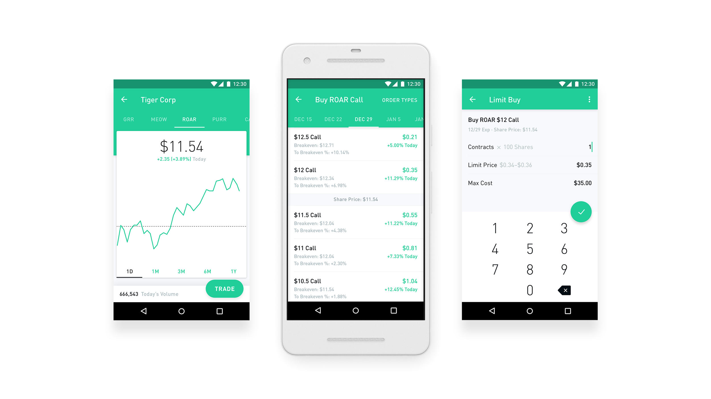

Options trading has transformed significantly with the proliferation of technology, making it more accessible than ever before. Platforms like Robinhood have played a crucial role in bringing options trading to the broader public. Traditionally, options trading was primarily accessible to institutional investors or those who had the means to engage in complex financial strategies. However, with technological advancements and the emergence of user-friendly apps, individual investors can now participate in options trading without substantial barriers.

This article will explore the intricacies of options trading within the stock market, the process of using Robinhood for executing trades, and the impact of algorithmic trading. Options are financial derivatives that offer the buyer the right, but not the obligation, to buy or sell an asset at a predetermined price. These financial instruments can be utilized for hedging against risks or for speculative purposes, allowing investors to capitalize on stock price movements. With the introduction of platforms like Robinhood, beginner traders find themselves with increased access to financial markets through a streamlined and simplified interface.



Furthermore, algorithmic trading has become an integral component of modern trading strategies. By utilizing computer algorithms to automate trading based on predefined criteria, traders can enhance their decision-making processes and potentially gain a competitive advantage. Platforms that support algorithmic trading offer powerful tools but require users to have a strong understanding of market dynamics and risk management.

Throughout this discussion, we will examine the advantages and challenges associated with options trading on Robinhood. The platform's commission-free model has attracted a significant influx of new investors, yet it also presents certain limitations in features and educational resources, which can be critical for informed trading decisions. As we consider the potential pitfalls associated with options trading, it is crucial to recognize the importance of knowledge and strategy in navigating these financial markets.

Finally, we will discuss the anticipated future of options trading as technological innovations continue to shape the financial landscape. With ongoing developments, traders are encouraged to stay abreast of these changes to maximize their potential in the evolving market environment.

## Table of Contents

## Understanding Options Trading

Options trading involves financial derivatives known as options, which provide buyers with the right, but not the obligation, to purchase or sell an underlying asset at a predetermined price, referred to as the strike price. This agreement to exercise the option must occur within a specified time frame, known as the expiration date.

There are two primary types of options: calls and puts. A call option gives the buyer the right to purchase an asset, while a put option grants the right to sell it. The seller, in exchange for this obligation, receives a fee called the premium, which serves as compensation for assuming the risk associated with the contract.

### Key Components of Options

1. **Strike Price**: This is the specified price at which the option holder can buy (in the case of a call option) or sell (in the case of a put option) the underlying asset. The difference between this price and the current market price is a crucial determinant of an option's intrinsic value.

2. **Expiration Date**: Options have a limited lifespan. The expiration date is when the option becomes void, and the holder can no longer exercise it. The time remaining until expiration is a significant factor in determining the option’s time value.

3. **Premium**: This is the price paid by the buyer to the seller for the rights conveyed by the option. The premium is influenced by several factors, including the underlying asset's price, volatility, time until expiration, and prevailing interest rates.

### Uses of Options

Options are versatile financial instruments used for various strategic purposes:

- **Hedging**: Investors use options to mitigate potential losses in their portfolios. For instance, an investor holding a stock can purchase a put option to protect against potential price declines.

- **Speculation**: Traders often speculate on stock price movements using options. They leverage the ability to control a large position with a relatively small investment, aiming to profit from anticipated changes in the underlying asset’s price.

Given the complexity involved, a comprehensive understanding of these elements is essential for anyone considering engaging in options trading. This foundation helps traders make informed decisions and manage the risks associated with market [volatility](/wiki/volatility-trading-strategies).

## Trading Options on Robinhood

Robinhood provides a user-friendly platform for options trading, greatly attracting novice traders eager to engage in the stock market without the complexities traditionally associated with such investments. The first step to trading options on Robinhood involves setting up a user account. This process is designed to be uncomplicated, requiring users to provide basic personal information and undergo a quick verification process. Once registered, users have access to an intuitive interface that simplifies the mechanics of options trading.

A significant [factor](/wiki/factor-investing) contributing to Robinhood's popularity is its commission-free trading model. Traditional brokerage services often impose hefty fees on options transactions, which can be a deterrent for small-scale or beginner investors. By eliminating these charges, Robinhood has democratized access to options trading, encouraging a broader demographic of investors to explore this domain.

Despite its strengths, Robinhood has limitations that more experienced traders may find restrictive. The platform's simplicity, while advantageous for beginners, comes at the expense of certain advanced trading features. For instance, Robinhood lacks the depth of educational resources and analytical tools that are often integral for seasoned traders who require comprehensive insights and customization in their trading strategies. Options traders who depend on technical analysis or require complex order types might find the platform's offerings insufficient for their needs.

In summary, while Robinhood has effectively lowered the barriers to entering the options trading market, it may not fully cater to the demands of experienced investors seeking more sophisticated trading functionalities.

## Algorithmic Trading in Options

Algorithmic trading has become a crucial component in the financial markets, leveraging the power of computing to execute trades based on pre-established criteria. This approach is particularly significant in options trading, where timing and precision are vital due to the derivative nature of options contracts. Algorithmic trading systems can efficiently analyze vast datasets, identify opportunities, and execute trades at speeds unattainable by human traders, thus providing a competitive advantage.

Platforms such as the Robinhood API empower traders to incorporate algorithmic strategies into their options trading portfolios. By offering an interface to automate trading processes, these platforms enhance efficiency and enable traders to execute complex strategies without manual intervention. A common algorithmic strategy in options trading is statistical [arbitrage](/wiki/arbitrage), which exploits price discrepancies between options and their underlying assets. Another popular method is volatility trading, focusing on strategies like gamma [scalping](/wiki/gamma-scalping) or vega neutral, where traders try to profit from fluctuations in an option’s implied volatility.

However, successful [algorithmic trading](/wiki/algorithmic-trading) extends beyond mere execution speed and computational power. It requires a comprehensive understanding of market dynamics and a profound ability to develop, test, and refine trading models. A basic economic formula frequently used in options trading algorithms is the Black-Scholes model, which calculates the theoretical price of options. Python, a popular programming language in algorithmic trading, can be used to implement this model as follows:

```python
from math import exp, sqrt, log
from scipy.stats import norm

def black_scholes(S, K, T, r, sigma, option_type='call'):
    d1 = (log(S / K) + (r + 0.5 * sigma ** 2) * T) / (sigma * sqrt(T))
    d2 = d1 - sigma * sqrt(T)
    if option_type == 'call':
        return S * norm.cdf(d1) - K * exp(-r * T) * norm.cdf(d2)
    elif option_type == 'put':
        return K * exp(-r * T) * norm.cdf(-d2) - S * norm.cdf(-d1)
```

Despite its potential, algorithmic trading is not without challenges. The complexity of financial markets necessitates a robust risk management framework, as poorly designed strategies can lead to significant losses. Model risk, execution risk, and technical failures are some issues traders must address. Continuous monitoring and adaptation of strategies are critical, given the dynamic nature of financial markets.

In summary, algorithmic trading offers significant advantages in the options market by augmenting speed and precision. Yet, traders must develop a thorough understanding of both algorithms and market behavior to harness these benefits effectively, ensuring their strategies are both resilient and adaptable to changing conditions.

## Advantages and Challenges of Using Robinhood for Options

Robinhood has transformed the landscape of options trading by offering a user-friendly platform that eliminates traditional barriers such as account minimums and trading commissions. This simplicity appeals particularly to new and inexperienced investors who seek to explore options trading without the financial burden of fees. By removing commissions, Robinhood has democratized access to options, allowing more people to engage in the buying and selling of options contracts.

However, Robinhood's platform is not without its challenges. One significant limitation is the lack of educational resources. Options trading, involving concepts like strike prices, premiums, and expiration dates, requires a solid understanding and strategic approach. The absence of comprehensive educational materials can leave novice traders ill-equipped to make informed decisions, potentially increasing the risk of financial loss.

Additionally, the platform does not offer demo accounts, which are valuable for traders to practice and hone their skills without risking real money. This absence may deter beginners from experimenting with options strategies or gaining the confidence necessary to trade successfully.

Furthermore, Robinhood provides limited order types, which can restrict trading strategies. Advanced traders often rely on various order options to customize and optimize their trades. The platform's constraints might lead to dissatisfaction among experienced traders seeking more flexibility and comprehensive tools for analysis and decision-making.

Ultimately, while Robinhood facilitates entry into the options market with its accessible and cost-effective platform, traders must consider these limitations and seek additional resources or platforms that offer the educational and functional depth required for advanced trading activities.

## Conclusion

Options trading through Robinhood has provided retail investors with unprecedented access to complex trading strategies, previously reserved for institutional investors and professional traders. This platform's user-friendly interface and commission-free trades have democratized the financial markets, allowing a broader audience to engage in options trading. However, while these benefits are substantial, it is crucial for investors to possess a solid understanding of the intricacies and risks associated with options trading.

Investors must educate themselves about the fundamental concepts, such as the implications of leverage and the rapid changes in options value. The risks are significant; without proper knowledge, traders can face substantial losses. It is vital to comprehend the variables affecting options pricing, like implied volatility, and to be aware of market conditions that can influence these factors.

Technological advancements are likely to continue to redefine options trading. Algorithmic trading, [artificial intelligence](/wiki/ai-artificial-intelligence), and [machine learning](/wiki/machine-learning) are on the forefront of these developments, providing new tools for analyzing data and executing trades with precision. Traders who adapt to these technologies can potentially enhance their strategies and improve their outcomes. However, the rapid evolution of these technologies also necessitates continuous learning and adaptation.

In conclusion, while Robinhood has made options trading accessible, it remains imperative for traders to remain informed and prepared to navigate both the opportunities and challenges presented by this dynamic landscape. By staying updated with technological advancements and refining their strategies accordingly, traders can capitalize on future opportunities in options trading.

## References & Further Reading

[1]: Hull, J. C. (2018). ["Options, Futures, and Other Derivatives."](https://www.semanticscholar.org/paper/Options%2C-Futures%2C-and-Other-Derivatives-Hull/89bdee500c8623864fc9eb7a471546aa713acc44) Pearson Education.

[2]: Lopez de Prado, M. (2018). ["Advances in Financial Machine Learning."](https://www.amazon.com/Advances-Financial-Machine-Learning-Marcos/dp/1119482089) Wiley.

[3]: Chan, E. P. (2008). ["Quantitative Trading: How to Build Your Own Algorithmic Trading Business."](https://github.com/ftvision/quant_trading_echan_book) Wiley.

[4]: Jansen, S. (2020). ["Machine Learning for Algorithmic Trading."](https://github.com/stefan-jansen/machine-learning-for-trading) Packt Publishing.

[5]: Aronson, D. (2006). ["Evidence-Based Technical Analysis: Applying the Scientific Method and Statistical Inference to Trading Signals."](https://www.amazon.com/Evidence-Based-Technical-Analysis-Scientific-Statistical/dp/0470008741) Wiley.

[6]: Black, F., & Scholes, M. (1973). ["The Pricing of Options and Corporate Liabilities."](https://www.cs.princeton.edu/courses/archive/fall09/cos323/papers/black_scholes73.pdf) Journal of Political Economy, 81(3), 637-654.