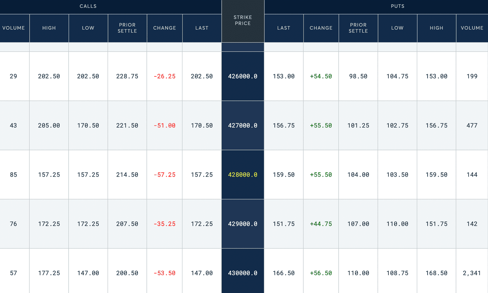

## Table of Contents

## What is options trading and how does it relate to S&P 500 futures?

Options trading is a way to buy and sell contracts that give you the right, but not the obligation, to buy or sell an asset at a specific price before a certain date. These contracts are called options. There are two types of options: calls and puts. A call option lets you buy the asset, while a put option lets you sell it. People use options to make money from the price movements of stocks, commodities, or other financial products without actually owning them. It's like betting on whether the price will go up or down.

The S&P 500 is a stock market index that measures the performance of 500 large companies in the U.S. S&P 500 futures are contracts that allow investors to bet on where they think the S&P 500 index will be in the future. Options on S&P 500 futures work similarly to regular options but are based on the future value of the S&P 500 index instead of individual stocks. So, if you think the S&P 500 will go up, you might buy a call option on S&P 500 futures. If you think it will go down, you might buy a put option. This way, options on S&P 500 futures let investors make money from their predictions about the overall market's direction.

## What are the basic types of options available for trading on S&P 500 futures?

When you trade options on S&P 500 futures, you have two basic types to choose from: call options and put options. A call option gives you the right to buy the S&P 500 futures contract at a set price before a certain date. If you think the S&P 500 index will go up, you might buy a call option. This way, if the index does go up, you can buy the futures at the lower set price and then sell them at the higher market price to make a profit.

On the other hand, a put option gives you the right to sell the S&P 500 futures contract at a set price before a certain date. If you believe the S&P 500 index will go down, you might buy a put option. With a put option, if the index does drop, you can sell the futures at the higher set price and then buy them back at the lower market price, making a profit from the difference. Both call and put options on S&P 500 futures allow traders to make money based on their predictions about the market's direction.

## How can beginners start trading options on S&P 500 futures?

If you're a beginner looking to trade options on S&P 500 futures, the first step is to open a brokerage account that allows futures and options trading. Many online brokers offer this service, so choose one that fits your needs and has good educational resources. Once your account is set up, you'll need to get approved for trading options, which usually involves filling out a form about your experience and risk tolerance. After you're approved, you can start learning about how options work and practice with a demo account if your broker offers one.

Next, you'll want to learn about the basics of options on S&P 500 futures, like call and put options. A call option gives you the right to buy the futures at a set price, while a put option gives you the right to sell them at a set price. As a beginner, it's wise to start small and not risk too much money. You can begin by trading options with a small amount of capital and gradually increase as you become more comfortable. Keep learning and stay updated on market trends, and consider using tools like charts and analysis software to help make your trading decisions.

## What are the key risks associated with options trading on S&P 500 futures?

Options trading on S&P 500 futures can be risky, mainly because the market can be unpredictable. If you guess wrong about where the market is going, you could lose all the money you put into the option. This is because options have an expiration date, and if the S&P 500 doesn't move the way you thought it would by that date, the option becomes worthless. Also, trading options on futures involves leverage, which means you can control a big position with a small amount of money. While this can lead to big profits, it can also lead to big losses if the market moves against you.

Another risk is the complexity of options trading. It takes time to learn how options work and how to use them effectively. If you don't understand the strategies and the math behind them, you might make bad decisions. Plus, the fees and commissions for trading options can add up, eating into your profits or making your losses even worse. So, it's important to be careful and maybe start with small trades until you feel more confident.

## How does leverage work in options trading on S&P 500 futures?

Leverage in options trading on S&P 500 futures means you can control a big position with just a small amount of money. It's like using a lever to lift something heavy with less effort. When you buy an option, you only need to pay a small amount called the premium, but that option gives you the right to buy or sell a much larger futures contract. This can make your potential profits bigger if the market moves the way you expect.

However, leverage can also make your losses bigger if the market moves against you. Since you're controlling a large position with a small amount of money, even a small move in the wrong direction can wipe out your investment. So, while leverage can be a powerful tool for making money, it also increases the risk, and you need to be careful when using it.

## What are the common strategies used in options trading on S&P 500 futures?

One common strategy in options trading on S&P 500 futures is called the long call. This is when you buy a call option because you think the S&P 500 index will go up. If it does go up, you can make money by buying the futures at a lower price and then selling them at the higher market price. It's a way to bet on the market going up without having to buy the actual futures.

Another strategy is the long put, where you buy a put option because you think the S&P 500 index will go down. If it does drop, you can make money by selling the futures at a higher price and then buying them back at the lower market price. This is a way to bet on the market going down without having to sell the actual futures. Both of these strategies use options to make money from the market's direction, but they come with risks because if the market doesn't move the way you expect, you could lose the money you spent on the options.

## How do market conditions affect options trading on S&P 500 futures?

Market conditions can really change how options trading on S&P 500 futures works. If the market is going up a lot, like during a bull market, buying call options can be a good idea because they let you make money from the rising prices. But if the market is going down, like in a bear market, buying put options might be better because they let you make money from the falling prices. Also, if the market is moving around a lot, which we call volatility, the prices of options can go up because they become more valuable when there's a bigger chance the market will move a lot.

But if the market isn't moving much, which means it's less volatile, options might not be as valuable because there's less chance for big moves. So, when you're trading options on S&P 500 futures, you need to think about what's happening in the market and how that might affect the prices of the options you're looking at. It's all about trying to guess what the market will do next and [picking](/wiki/asset-class-picking) the right options to match those guesses.

## What advanced techniques can be used to enhance profitability in options trading on S&P 500 futures?

One advanced technique to boost your profits in options trading on S&P 500 futures is called a straddle. This is when you buy both a call option and a put option at the same time, with the same expiration date and the same price. You do this when you think the market is going to move a lot, but you're not sure if it will go up or down. If the market does move a lot in either direction, one of your options will make money, hopefully more than enough to cover the cost of both options. This way, you can make a profit no matter which way the market goes, as long as it moves enough.

Another technique is called a spread. With this, you buy and sell options at the same time, but they have different prices or expiration dates. For example, you might buy a call option at a lower price and sell a call option at a higher price. This can help you make money if the market goes up, but it also limits how much you can lose if the market goes down. Spreads can be a bit tricky to understand, but they let you fine-tune your trading strategy and manage your risk better. Both straddles and spreads need a good understanding of the market and how options work, but they can help you make more money if you use them the right way.

## How can one manage and mitigate risks in options trading on S&P 500 futures?

Managing and mitigating risks in options trading on S&P 500 futures starts with understanding that you can lose money if the market doesn't go the way you expect. One way to reduce this risk is by not putting all your money into one trade. Instead, spread your money across different trades, so if one doesn't work out, you won't lose everything. It's also smart to use stop-loss orders, which automatically sell your options if they drop to a certain price, helping to limit your losses.

Another way to manage risk is by using strategies like spreads, where you buy and sell options at the same time to limit how much you can lose. Also, always keep learning about the market and how options work. The more you know, the better you can predict what might happen and make smarter trades. Remember, options trading can be risky, but by being careful and using these techniques, you can try to make it less so.

## What role do market volatility and the VIX index play in options trading on S&P 500 futures?

Market volatility is how much the market moves up and down, and it's really important for options trading on S&P 500 futures. When the market is more volatile, the prices of options go up because there's a bigger chance the market will move a lot. This means options become more valuable because they give you the right to buy or sell at a set price, which could be a good deal if the market moves a lot. If you think the market will be volatile, you might buy options to make money from the big moves, even if you're not sure which way the market will go.

The VIX index, also called the "fear gauge," measures how much people expect the market to move around in the next 30 days. It's based on the prices of options on the S&P 500 index. When the VIX is high, it means people think the market will be more volatile, and this can make options on S&P 500 futures more expensive. Traders watch the VIX to help them decide when to buy or sell options. If the VIX is low, options might be cheaper, but there's less chance for big moves in the market. So, understanding the VIX can help you make better decisions about trading options on S&P 500 futures.

## How do expiration dates and time decay impact options trading on S&P 500 futures?

Expiration dates are a big deal in options trading on S&P 500 futures. Every option has a date when it stops working, and if you don't use it by then, it becomes worthless. So, if you buy an option and the S&P 500 doesn't move the way you thought it would by the expiration date, you lose the money you spent on the option. This means you need to think about how long you want to wait for the market to move when you pick an expiration date. If you think the market will move soon, you might pick a closer expiration date, but if you think it will take longer, you might pick a date further away.

Time decay is another thing to watch out for. It means that the value of your option goes down as it gets closer to the expiration date. The closer you get to the end, the faster the value drops, especially in the last few weeks or days. This can make it harder to make money from options if the market doesn't move quickly enough. So, when you're trading options on S&P 500 futures, you need to think about how time decay might affect your trades and try to pick options with enough time left to give the market a chance to move in your favor.

## What are the tax implications of profits and losses from options trading on S&P 500 futures?

When you make money or lose money from trading options on S&P 500 futures, it can affect your taxes. In the United States, profits from options trading are usually taxed as capital gains. If you hold the option for less than a year before selling it, the profit is considered a short-term capital gain, which is taxed at the same rate as your regular income. If you hold it for more than a year, it's a long-term capital gain, which is taxed at a lower rate, usually between 0% and 20%, depending on your income.

On the other hand, if you lose money on your options trades, you can use those losses to reduce your taxes. You can deduct up to $3,000 of your net capital losses from your regular income each year. If your losses are more than $3,000, you can [carry](/wiki/carry-trading) the extra over to future years to keep lowering your taxes. It's important to keep good records of all your trades, because you'll need them when you do your taxes. Talking to a tax professional can also help make sure you're doing everything right and taking advantage of all the tax benefits you can.

## What are S&P 500 Futures Options and how can they be understood?

Options on S&P 500 futures are a form of derivative that grants the holder the right, though not the obligation, to buy or sell an underlying S&P 500 futures contract at a specified price, known as the strike price, on or before a specified date. This contrasts with stock options, which are based on individual company shares, highlighting a key difference in their underlying assets.

The discontinuation of standard-sized S&P futures has led to an increased emphasis on E-mini and Micro E-mini S&P 500 futures. These smaller contracts offer a scalable approach to futures trading, accommodating both large and small-scale traders. They allow precise exposure adjustments to the S&P 500 Index, making options on these futures attractive for a broad range of trading strategies.

Traders can use call options on S&P 500 futures when anticipating upward movement in the index. A call option gives the holder the right to purchase the underlying futures contract at the strike price, which becomes profitable if the index's market price exceeds this price before expiration. Conversely, put options are utilized when a trader expects the index to decline, granting the holder the right to sell the underlying futures contract at the strike price. The payoff structure for these options can be expressed in basic terms as follows:

$$
\text{Call Option Payoff} = \max(0, S_t - K)
$$

$$
\text{Put Option Payoff} = \max(0, K - S_t)
$$

where $S_t$ represents the spot price of the underlying futures at expiration, and $K$ is the strike price.

These options leverage the price dynamics of futures contracts, providing traders with enhanced flexibility. They allow for strategic maneuvers such as hedging against potential losses in diversified portfolios or speculating based on anticipated market movements. The inherently leveraged nature of futures options amplifies both potential returns and risks, necessitating a calibrated approach to risk management and strategic planning.

Overall, options on S&P 500 futures serve as versatile instruments in traders' toolkits, enabling various strategies ranging from straightforward directional plays to complex hedging operations. These characteristics make them a vital component of modern financial markets, continually adapted within evolving trading paradigms.

## What are the benefits and risks of trading S&P 500 futures options?

Trading options on S&P 500 futures offers distinct advantages and risks that traders must evaluate to make informed decisions. One of the primary benefits is leveraging positions to enhance capital efficiency. This leverage allows traders to control a larger position with a smaller amount of capital, potentially leading to higher returns on investment compared to trading the underlying futures outright. The mathematical leverage ratio can be expressed as:

$$
\text{Leverage Ratio} = \frac{\text{Notional Value of Contract}}{\text{Initial Margin}}
$$

Where the notional value is the total value of the contract, and the initial margin is the upfront capital required to enter the trade.

Options also provide a powerful mechanism for hedging against market [volatility](/wiki/volatility-trading-strategies). By holding options positions, traders can protect their portfolios from adverse price movements. For example, purchasing put options on S&P 500 futures can act as an insurance policy against a significant downturn in the index, effectively capping potential losses.

The S&P 500 futures market is highly liquid, which is advantageous for traders utilizing [algorithmic trading](/wiki/algorithmic-trading). This [liquidity](/wiki/liquidity-risk-premium) facilitates efficient trade execution and narrows bid-ask spreads, reducing transaction costs and minimizing slippage. Algorithmic trading systems can exploit this liquidity to optimize entry and [exit](/wiki/exit-strategy) points based on real-time data analysis.

However, while leverage magnifies potential gains, it also increases the risk of significant losses. Traders must implement robust risk management strategies to mitigate this risk, such as setting stop-loss orders and maintaining appropriate position sizes. The use of the Kelly Criterion, a mathematical formula used to determine optimal betting size, can be adapted to options trading to help manage risk:

$$
f^* = \frac{bp - q}{b}
$$

Where $f^*$ is the fraction of capital to be wagered, $b$ is the odds received on the wager (in case of trading, the expected return), $p$ is the probability of a win (correct prediction), and $q$ is the probability of a loss (1-p).

Another significant challenge in options trading is time decay, denoted by the Greek letter theta (θ). Time decay represents the erosion of an option's value as it approaches expiration. This [factor](/wiki/factor-investing) requires traders to accurately forecast time frames alongside price movements, complicating valuation strategies.

Additionally, the complexity of derivative pricing models can obscure true option values. Traders must understand models like the Black-Scholes or binomial options pricing to make accurate valuations. Mispricing due to faulty assumptions or market inefficiencies can lead to suboptimal trading decisions.

In conclusion, options on S&P 500 futures offer leverage and hedging capabilities, enhanced by market liquidity and algorithmic trading techniques. Nevertheless, these benefits come with risks such as potential losses due to leverage, time decay, and pricing complexities, necessitating thorough risk management and valuation strategies.

## References & Further Reading

[1]: Bergstra, J., Bardenet, R., Bengio, Y., & Kégl, B. (2011). ["Algorithms for Hyper-Parameter Optimization."](https://papers.nips.cc/paper/4443-algorithms-for-hyper-parameter-optimization) Advances in Neural Information Processing Systems 24.

[2]: ["Advances in Financial Machine Learning"](https://www.amazon.com/Advances-Financial-Machine-Learning-Marcos/dp/1119482089) by Marcos Lopez de Prado

[3]: ["Evidence-Based Technical Analysis: Applying the Scientific Method and Statistical Inference to Trading Signals"](https://www.amazon.com/Evidence-Based-Technical-Analysis-Scientific-Statistical/dp/0470008741) by David Aronson

[4]: ["Machine Learning for Algorithmic Trading"](https://github.com/stefan-jansen/machine-learning-for-trading) by Stefan Jansen

[5]: ["Quantitative Trading: How to Build Your Own Algorithmic Trading Business"](https://www.amazon.com/Quantitative-Trading-Build-Algorithmic-Business/dp/1119800064) by Ernest P. Chan