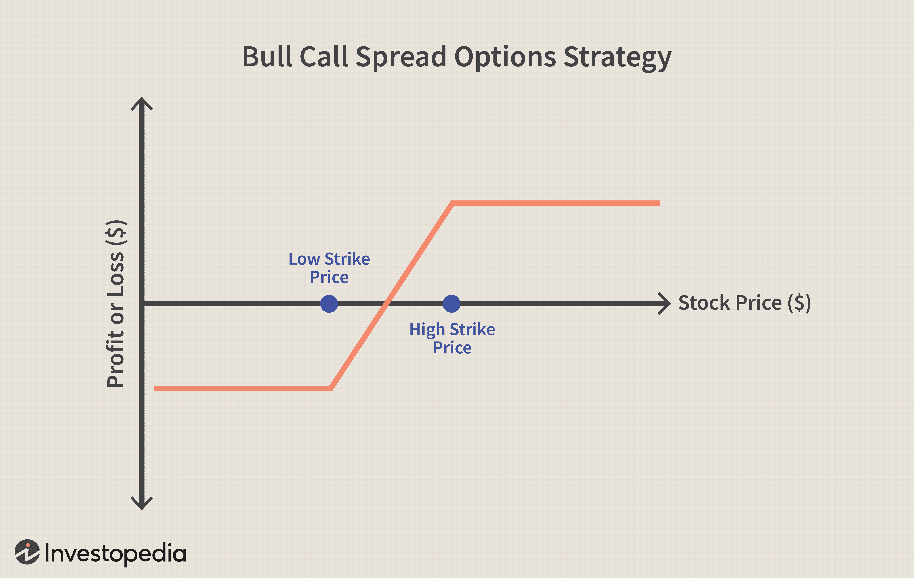

Algorithmic trading, commonly referred to as algo trading, has significantly altered the financial markets by allowing traders to execute orders with remarkable speed and accuracy. This trading method employs complex algorithms that process a vast array of data points, facilitating the development and execution of dynamic strategies. The utilization of algorithms enables traders to mitigate the human elements of error and emotion, leading to more disciplined trading actions.

Within this context, options trading emerges as a critical strategy, offering distinctive advantages such as hedging against market volatility, opportunities for speculation, and potential income generation. Options are financial derivatives that provide the purchaser with the right, but not the obligation, to buy or sell an underlying asset at a predetermined price before a specified expiration date. This intrinsic flexibility allows traders to construct diverse risk-reward profiles, depending on market conditions and strategic objectives.



Options trading, when integrated into algorithmic systems, enables the exploitation of price inefficiencies and the execution of complex strategies at scales unachievable by manual trading. The combination of options with algorithmic strategies introduces a multitude of tactics aimed at performance optimization, such as exploiting momentary price shifts, reverting to price means, and capitalizing on price discrepancies for arbitrage opportunities.

The article delves into the nuances of these strategies, providing insights into their development and execution within an algorithmic framework. By examining various approaches and advanced methodologies, it aims to highlight the optimal strategies for maximizing trading outcomes in today's highly competitive markets.

## Table of Contents

## Understanding Options Trading in Algo Trading

Options trading consists of financial instruments known as contracts that provide the holder with the right, but not the obligation, to buy or sell an underlying asset at a specified price, before or at the expiration date. These underlying assets can include stocks, indices, commodities, and more. Furthermore, options are utilized for various purposes, including hedging against market volatility, speculating on future price movements, and generating income through strategies like covered calls.

Integrating options trading into algorithmic systems leverages the power of technology and advanced data analytics to execute trades with increased precision and speed. Algorithmic trading, also known as algo trading, deploys automated and pre-programmed trading instructions to account for variables such as timing, price, and [volume](/wiki/volume-trading-strategy). This technology-driven approach is beneficial in options trading as algorithms can process large datasets, identify patterns or anomalies, and execute trades far faster than a human trader.

The preference for options trading among algorithmic traders is rooted in several factors:

1. **Enhanced Analytical Capabilities**: Algorithms can employ quantitative models to scrutinize vast historical and real-time data, recognizing patterns that might not be visible to the naked eye. This robust analysis allows for the identification of profitable trading opportunities and informed decision-making.

2. **Speed and Efficiency**: The automated nature of algorithmic trading enables the rapid execution of trading strategies. This is crucial in options trading where market conditions can evolve quickly, affecting the pricing and potential profitability of trades.

3. **Risk Management**: Options provide traders with tools to hedge against potential adverse market movements. Algorithmic trading further enhances risk management by deploying complex strategies swiftly and by ensuring that trades adhere strictly to predefined risk parameters.

4. **Strategy Diversity**: Algorithmic trading facilitates the implementation of various trading strategies, from straightforward call and put options to more sophisticated strategies like spreads, straddles, and butterflies. This variety enables traders to customize their approach based on market conditions, personal risk appetite, and investment goals.

Overall, the confluence of options trading and algorithmic systems synergizes to capitalize on market opportunities with greater efficiency and precision, making it a favored approach for modern traders looking to enhance their trading proficiency.

## Top Algorithmic Options Trading Strategies

Algorithmic options trading strategies have gained prominence due to their ability to leverage computational power and data analytics for enhanced decision-making. Three of the most commonly employed strategies in this regard are [momentum](/wiki/momentum) trading, mean reversion, and [arbitrage](/wiki/arbitrage).

**Momentum Trading**: This strategy is built on the premise that assets which display a certain trend will likely continue along that trajectory. Traders implementing momentum trading utilize recent price movements and trading volumes as indicators to predict future price directions. The foundation of this strategy rests on the belief that once a price trend is established, it is more probable to persist than reverse. Utilizing algorithms, traders can analyze large datasets to swiftly identify bullish or bearish momentum and execute trades. This method often involves technical indicators like moving averages and the Relative Strength Index (RSI).

**Mean Reversion**: Mean reversion relies on the historical tendency of asset prices to move back to their average or mean levels over time. In the context of options, this might involve volatility mean reversion where the implied volatility is expected to revert to historical averages. Traders capitalize on deviations from the mean by entering positions that profit as prices move back to their historical averages. Algorithms facilitate this by continuously monitoring price deviations and executing trades when assets are overbought or oversold. The mean reversion approach assumes market corrections and utilizes statistical measures such as standard deviations and Bollinger Bands.

**Arbitrage Strategy**: This strategy aims to exploit price discrepancies between similar or related assets, thereby securing risk-free profits. In the context of options trading, arbitrage opportunities may arise between options and their underlying assets or between options with different expiry dates or strike prices. Algorithms play a crucial role in identifying these price differentials swiftly before the market corrects the inefficiency. Common types of arbitrage in options trading include convertible arbitrage and put-call parity arbitrage. 

By leveraging these strategies, traders enhance their ability to predict market movements and capitalize on opportunities, which is particularly advantageous in the high-frequency domain of [algorithmic trading](/wiki/algorithmic-trading).

## Implementing Spreads and Butterflies in Algo Trading

Spreads and butterflies are integral components of options trading strategies that can greatly benefit from algorithmic optimization. These strategies enable traders to manage risk and capitalize on market conditions with precision.

Vertical spreads, which consist of buying and selling options of the same class and expiration date but different strike prices, are designed to limit risk and improve efficiency across various market conditions. There are two primary types of vertical spreads: the bull call spread and the bear put spread. In a bull call spread, a trader purchases a call option at a lower strike price while simultaneously selling another call option at a higher strike price. This strategy is implemented when the trader expects a moderate rise in the underlying asset's price. Conversely, in a bear put spread, a trader buys a put option at a higher strike price and sells another put at a lower strike price, anticipating a moderate decline in the underlying asset's price. Algorithmically, vertical spreads can be optimized for execution by employing historical data analysis and programming logic to dynamically adjust strike prices and expiration dates based on market conditions.

Butterfly spreads, particularly iron butterflies, offer a balanced approach with defined risk and reward. An iron butterfly consists of four options contracts: buying a lower strike put, selling a middle strike put, selling a middle strike call, and buying a higher strike call. This setup creates a position with limited risk and limited profit potential, best used when a trader expects low [volatility](/wiki/volatility-trading-strategies) in the market. The defined nature of payouts in an iron butterfly makes it suitable for algorithmic trading, as algorithms can precisely calculate the potential returns and risks involved, allowing real-time adjustments to the strategy based on market movements.

The implementation of these strategies in algorithmic trading can involve programming solutions that look for specific market signals and automatically execute trades when predetermined conditions are met. Python, a popular language in this domain, can be used to code such strategies. For instance, using Python libraries like NumPy and Pandas, traders can create scripts to analyze option chains, identify optimal spreads, and execute trades via API with brokers supporting algorithmic trading.

By optimizing these strategies with algorithms, traders can enhance precision, mitigate human errors, and improve overall trading performance.

## Risk Management in Algorithmic Options Trading

Risk management is a fundamental component of algorithmic options trading due to the inherent volatility and complexity associated with options contracts. Effective risk management involves implementing several key practices aimed at mitigating potential losses while maximizing opportunities for gains. 

One of the primary techniques is setting stop-loss points. A stop-loss is a predetermined price level at which a position is automatically sold, limiting the potential loss from adverse price movements. This practice helps in preserving capital and preventing emotional decision-making during market fluctuations. An example of a simple stop-loss implementation in Python could be:

```python
def apply_stop_loss(current_price, stop_loss_price, position):
    if current_price <= stop_loss_price:
        position = 0
        print("Stop-loss triggered. Position closed.")
    return position

# Example usage
current_price = 95
stop_loss_price = 100
position = 10  # Number of options contracts

position = apply_stop_loss(current_price, stop_loss_price, position)
```

Maintaining appropriate position sizes is another critical risk management strategy. This involves defining the number of contracts or the dollar amount that one is comfortable risking in each trade. Position sizing should be derived from the trader's risk tolerance and overall capital, ensuring that no single trade can significantly impact the portfolio. A popular rule is to risk only a small percentage of the total account value on any given trade.

Portfolio diversification is essential to reduce exposure to any single asset or market event. By holding a variety of positions across different options, sectors, or asset classes, traders can spread out risk and mitigate the impact of adverse movements in any specific area. Diversification helps in achieving more stable returns over time.

Integrating these risk management techniques into an algorithmic options trading strategy is crucial for optimal trading performance. Algorithms can be programmed to automatically enforce these practices, which ensures that they are consistently applied without interference from human emotions. Moreover, [backtesting](/wiki/backtesting) these strategies on historical data can provide insights into their effectiveness and highlight potential adjustments before live trading. This proactive approach enables traders to navigate market complexities more effectively and improve their trading outcomes. 

Incorporating stop-loss mechanisms, position sizing rules, and diversification within your trading algorithms will ensure that risk is managed systematically, thereby safeguarding your investments while taking advantage of market opportunities.

## Benefits of Automated Options Trading

Automated options trading, a subset of algorithmic trading, provides a sophisticated approach to executing trades through the use of software algorithms. One of the primary advantages of automation in options trading is the elimination of human errors and emotional biases. This results in a more disciplined execution of trading strategies, which is critical in volatile markets where split-second decisions can significantly impact profitability.

The algorithms employed in automated trading are capable of processing vast quantities of data at a speed that far surpasses human capabilities. This capacity allows for the analysis of multiple data streams concurrently, including price movements, market trends, and historical data. Such comprehensive processing facilitates timely decisions, as the algorithms can swiftly identify and capitalize on opportunities that may arise in the markets. For example, algorithms employ statistical models such as Black-Scholes or Binomial trees to calculate option prices and derive trading signals.

Moreover, automation enables traders to scale their operations efficiently. Within an automated framework, a single trader can manage multiple trading strategies and execute numerous trades simultaneously. This is made possible through robust computing platforms that can monitor, analyze, and execute trades without the limitations of human fatigue or the necessity for constant supervision. As a result, traders can optimize their portfolios by engaging in more trading opportunities than would be feasible manually.

Furthermore, automated systems offer the advantage of backtesting strategies on historical data, aiding in the refinement and optimization of trading algorithms before actual deployment in the market. Platforms like Python's QuantLib library are often used for such purposes, providing a rich set of tools for modeling, trading strategy development, and validation.

Overall, the integration of automation in options trading enhances the precision and efficiency of trading operations, empowering traders to leverage advanced analytical capabilities and maintain a competitive edge in the markets.

## Tools and Platforms for Algo Options Trading

In algorithmic options trading, selecting the appropriate platform can significantly influence the trading experience and overall success. Various platforms offer distinct features and tools designed to facilitate backtesting algorithms and executing trades. Among the most popular are TradeStation, Amibroker, MetaTrader, and [Interactive Brokers](/wiki/interactive-brokers-api), each providing unique advantages and limitations.

### TradeStation

TradeStation is renowned for its robust trading platform and comprehensive suite of tools. It offers extensive charting capabilities, a wide range of technical indicators, and a proprietary programming language, EasyLanguage, which simplifies strategy development.

**Pros:**
- **Comprehensive Analytics**: TradeStation's analytics capabilities support sophisticated strategies with diverse technical indicators.
- **Backtesting Efficiency**: Users can backtest strategies over extensive historical data, ensuring robust performance analysis.
- **Integrated Brokerage**: Its seamless integration with TradeStation's brokerage allows for efficient execution of trades.

**Cons:**
- **Cost**: It can be expensive for retail traders due to its subscription fees.
- **Complexity**: The comprehensive features may overwhelm beginners, requiring a steep learning curve.

### Amibroker

Amibroker is favored for its speed and flexibility, especially in backtesting and optimization processes. It supports custom scripting through the Amibroker Formula Language (AFL), allowing for precise strategy development.

**Pros:**
- **Speed and Performance**: Amibroker is optimized for speed, enabling rapid backtesting and real-time updates.
- **Customizable**: Users can create complex custom indicators and explore extensive trading systems with AFL.
- **Cost-Effective**: Offers a one-time purchase option, making it more affordable in the long term.

**Cons:**
- **Steeper Learning Curve**: AFL requires detailed programming knowledge, challenging for new traders.
- **Limited Brokerage Integrations**: While efficient, its direct brokerage integrations are less extensive compared to other platforms.

### MetaTrader

A widely used platform, especially in [forex](/wiki/forex-system) trading, MetaTrader provides accessible algo trading features through its MQL5 programming environment.

**Pros:**
- **User-Friendly**: Its interface is considered beginner-friendly, suitable for those new to algorithmic trading.
- **Community Support**: A large user base offers extensive online resources and community-driven insights.
- **Cost-Effective**: Generally free to use, aligning with various online brokers.

**Cons:**
- **Limited to Forex and CFDs**: Primarily tailored for forex and CFD trading, with limited support for options trading.
- **Fewer Advanced Features**: Compared to specialized platforms, it offers fewer advanced analytics and customization capabilities.

### Interactive Brokers

Interactive Brokers provides APIs and a flexible trading environment, supporting a wide range of trading activity.

**Pros:**
- **Versatile API**: Supports multiple programming languages (Python, Java, C++), allowing for extensive custom algorithm development.
- **Global Market Access**: Offers access to numerous markets worldwide, increasing trading opportunities.
- **Advanced Risk Management**: Integrated tools for comprehensive risk management and portfolio analysis.

**Cons:**
- **Technical Challenges**: Setting up and navigating the IB API can be complex for beginners.
- **Additional Costs**: While competitive in pricing, additional fees for certain data feeds and services may apply.

### Choosing the Right Platform

Choosing the right platform depends on a trader's specific needs, experience, and trading objectives. For those seeking comprehensive analytics and tight brokerage integration, TradeStation may be ideal. Amibroker is preferred for rapid backtesting and customization. MetaTrader suits beginners with its user-friendly interface, while Interactive Brokers appeals to those needing extensive market access and a flexible programming environment.

By carefully evaluating the features and limitations of these platforms, traders can optimize their algorithmic options trading endeavors, leading to more effective strategy execution and improved trading outcomes.

## Conclusion

Algorithmic options trading offers significant opportunities by leveraging speed, efficiency, and robust analytical capabilities. By automating trading processes, traders are equipped to respond rapidly to market changes, minimizing the latency associated with manual interventions. This acceleration in decision-making lets traders exploit fleeting market inefficiencies and price discrepancies.

Incorporating strategies such as momentum trading and spreads further enhances the potential for optimized trading outcomes. Momentum trading allows algorithms to identify and capitalize on sustained price movements, while spreads, including vertical and butterfly spreads, afford a structured risk framework with defined upside and downside. These strategies are crucial in capturing profits while managing risk effectively.

Selecting the right strategies and platforms is imperative for traders aiming to enhance their competitive edge. Robust platforms, offering comprehensive tools for backtesting and deployment, enable traders to refine their algorithms and ensure they perform effectively under various market conditions. This meticulous selection process empowers traders to not only improve execution efficiency but also broaden their market engagement through strategic diversification.

In today's fast-paced financial markets, algorithmic options trading stands as a pivotal approach that marries technical precision with strategic ingenuity, positioning traders favorably amidst global competition.

## References & Further Reading

[1]: Bergstra, J., Bardenet, R., Bengio, Y., & Kégl, B. (2011). ["Algorithms for Hyper-Parameter Optimization."](https://papers.nips.cc/paper/4443-algorithms-for-hyper-parameter-optimization) Advances in Neural Information Processing Systems 24.

[2]: ["Advances in Financial Machine Learning"](https://www.amazon.com/Advances-Financial-Machine-Learning-Marcos/dp/1119482089) by Marcos Lopez de Prado

[3]: ["Evidence-Based Technical Analysis: Applying the Scientific Method and Statistical Inference to Trading Signals"](https://www.amazon.com/Evidence-Based-Technical-Analysis-Scientific-Statistical/dp/0470008741) by David Aronson

[4]: ["Machine Learning for Algorithmic Trading"](https://github.com/stefan-jansen/machine-learning-for-trading) by Stefan Jansen

[5]: ["Quantitative Trading: How to Build Your Own Algorithmic Trading Business"](https://www.amazon.com/Quantitative-Trading-Build-Algorithmic-Business/dp/1119800064) by Ernest P. Chan