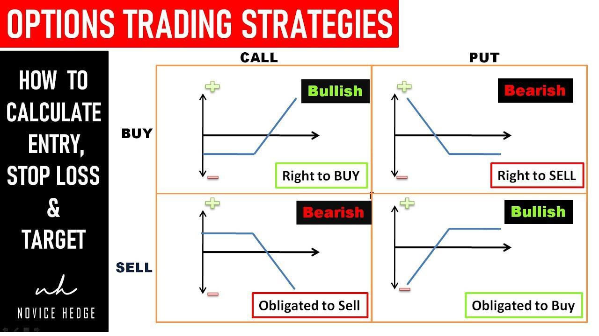

## Table of Contents

## What is options trading and how does it work?

Options trading is a way to buy or sell a stock at a certain price before a specific date. It's like making a bet on whether a stock's price will go up or down. When you buy an option, you're not buying the stock itself, but the right to buy or sell it later. There are two types of options: calls and puts. A call option gives you the right to buy a stock, while a put option gives you the right to sell it.

Options can be used in different ways. Some people use them to make money by guessing if a stock's price will go up or down. Others use options to protect their investments. For example, if you own a stock and you're worried its price might drop, you can buy a put option to sell it at a set price, even if the market price falls lower. Options trading can be risky because prices can change quickly, but it can also offer big rewards if you guess right.

## What are the basic types of options: calls and puts?

A call option is like a ticket that lets you buy a stock at a certain price before a specific date. If you think the price of a stock will go up, you can buy a call option. This gives you the right, but not the obligation, to buy the stock at the price set in the option, no matter how high the stock's price goes. If the stock's price does go up, you can buy it at the lower price and then sell it at the higher market price to make a profit.

A put option is the opposite. It's like a ticket that lets you sell a stock at a certain price before a specific date. If you think the price of a stock will go down, you can buy a put option. This gives you the right, but not the obligation, to sell the stock at the price set in the option, even if the market price drops lower. If the stock's price does go down, you can buy the stock at the lower market price and then use your put option to sell it at the higher price set in the option, making a profit.

## How can beginners start with options trading safely?

For beginners looking to start with options trading safely, it's important to first learn the basics. Options can be confusing, so taking a [course](/wiki/best-algorithmic-trading-courses) or reading a good book about options trading can help. Also, many online brokers offer educational resources and practice accounts where you can try trading without risking real money. This is a great way to get a feel for how options work before you start trading with your own money.

Once you feel comfortable with the basics, start small. Only use money that you can afford to lose, because options trading can be risky. Begin by trading options on stocks you know well and understand. It's also a good idea to start with simple strategies, like buying call or put options, rather than trying more complex trades right away. As you gain experience and confidence, you can slowly start to explore more advanced strategies.

## What are the key terms and concepts every options trader should know?

Options trading has some special words and ideas that everyone who wants to trade options should know. First, there's the "strike price." This is the price at which you can buy or sell the stock if you use your option. Then, there's the "expiration date," which is the last day you can use your option. If you don't use it by then, it becomes worthless. "Premium" is what you pay to buy an option, and it's like the cost of your ticket. "In-the-money" means an option has value because the stock price is better than the strike price. "Out-of-the-money" means the option has no value because the stock price is worse than the strike price.

Another important concept is "[volatility](/wiki/volatility-trading-strategies)," which measures how much a stock's price moves up and down. High volatility can mean bigger profits or losses. "Delta" tells you how much the option's price will change if the stock's price changes by one dollar. "Theta" shows how much the option's value decreases as time passes, which is important because options lose value as they get closer to their expiration date. Lastly, "assignment" happens when you have to buy or sell the stock if you're on the wrong side of an option that gets used. Knowing these terms and ideas can help you understand and trade options better.

## What are the most common options trading strategies for beginners?

For beginners, one of the simplest and most common options trading strategies is buying call options. This strategy is used when you think the price of a stock will go up. You buy a call option, which gives you the right to buy the stock at a set price before a certain date. If the stock's price goes up, you can buy it at the lower strike price and then sell it at the higher market price, making a profit. This strategy is straightforward and can be a good way to start because it's easy to understand and you know exactly how much you can lose, which is just the cost of the option.

Another common strategy for beginners is buying put options. This is used when you think the price of a stock will go down. You buy a put option, which gives you the right to sell the stock at a set price before a certain date. If the stock's price goes down, you can buy the stock at the lower market price and then use your put option to sell it at the higher strike price, making a profit. This strategy can also be a good way to start because it's simple and you know your maximum loss upfront, which is the cost of the option.

A third strategy that beginners might find useful is the covered call. This involves owning the stock and then selling call options on that stock. You get paid for selling the call option, which is called the premium. If the stock's price stays the same or goes down, you keep the premium as profit. If the stock's price goes up and the option is used, you have to sell your stock at the strike price, but you still keep the premium. This strategy can be a bit more complex, but it's a good way to earn extra income from stocks you already own.

## How do you calculate the risk and reward in options trading?

Calculating risk and reward in options trading involves understanding the potential profit and loss for each trade. When you buy an option, your maximum risk is the amount you paid for the option, known as the premium. If the option expires worthless, you lose the entire premium. On the other hand, the potential reward can be unlimited for call options if the stock's price soars, but it's limited to the strike price minus the premium for put options. To calculate the potential reward, you subtract the premium from the difference between the stock's market price and the strike price at expiration.

When you sell an option, the risk and reward calculations change. If you sell a call option, your maximum reward is the premium you receive, but your risk can be unlimited if the stock's price skyrockets. If you sell a put option, your maximum reward is still the premium, but your risk is limited to the strike price minus the premium if the stock's price drops to zero. To understand your risk, you need to consider the worst-case scenario, which is the stock moving against your position. By knowing these basics, you can better manage your trades and make more informed decisions.

## What are advanced options trading strategies and when should they be used?

Advanced options trading strategies are used by experienced traders to manage risk and potentially increase their profits. One common advanced strategy is the "straddle," where you buy both a call and a put option on the same stock with the same strike price and expiration date. This strategy is used when you think a stock's price will move a lot but you're not sure which way. If the stock's price moves significantly in either direction, you can make money from one of the options while the other expires worthless. Another strategy is the "strangle," which is similar to a straddle but uses different strike prices for the call and put options. This can be cheaper but requires a bigger move in the stock's price to be profitable.

Another advanced strategy is the "iron condor," which involves selling an out-of-the-money call and put option while also buying a further out-of-the-money call and put option. This creates a range where the stock can move without losing money, and you earn the premium from the options you sold. Iron condors are used when you think a stock will stay within a certain price range. "Butterfly spreads" are another strategy where you use three different strike prices to create a position that profits if the stock stays near the middle strike price at expiration. These strategies are more complex and should only be used by traders who understand options well and are comfortable with the risks involved.

## How does volatility affect options trading and how can it be managed?

Volatility is like how much a stock's price jumps around. In options trading, it's really important because it can change how much an option is worth. When a stock's price moves a lot, the option's price goes up because there's a bigger chance the option will be worth something at the end. This is called "implied volatility." If a stock is calm and doesn't move much, the option's price goes down because there's less chance it will be worth something. So, if you think a stock will start moving a lot, you might want to buy options. But if you think it will stay calm, selling options could be a good idea.

Managing volatility in options trading can be tricky, but there are ways to do it. One way is to use strategies like "straddles" or "strangles" that can make money no matter which way the stock moves, as long as it moves a lot. Another way is to look at the "implied volatility" of options and compare it to the "historical volatility" of the stock. If the implied volatility is high compared to the historical volatility, it might be a good time to sell options because they might be overpriced. If it's low, buying options could be a good move. Also, using "stop-loss orders" can help limit your losses if the stock moves against you more than you expected.

## What are the tax implications of options trading?

When you make money from options trading, you have to pay taxes on your profits. The tax rate depends on how long you held the option before selling it or letting it expire. If you hold an option for less than a year, any profit you make is considered a short-term capital gain. This is taxed at the same rate as your regular income, which can be as high as 37% depending on your income level. If you hold an option for more than a year, any profit is a long-term capital gain, which is taxed at a lower rate, usually between 0% and 20%.

It's also important to know that you can use losses from options trading to reduce your taxes. If you lose money on an option trade, you can use that loss to offset other gains you made during the year. If your losses are more than your gains, you can deduct up to $3,000 of those losses from your regular income. Any losses over $3,000 can be carried over to future years to offset gains or income then. Keeping good records of all your trades is really important because it helps you figure out your taxes correctly and can save you money.

## How can options be used for hedging and portfolio protection?

Options can be used to protect your investments by acting like insurance for your portfolio. If you own a stock and you're worried its price might go down, you can buy a put option. This gives you the right to sell the stock at a set price, even if the market price drops lower. So, if the stock's price does fall, you can use the put option to sell it at the higher price you set, which helps limit your losses. This is called hedging, and it's like having a safety net for your investments.

Another way to use options for protection is by using them to lock in profits. If you own a stock that has gone up in value, you can sell a call option against it. This is called a covered call. By doing this, you get paid a premium, which is extra money. If the stock's price stays the same or goes down, you keep the premium as profit. If the stock's price goes up a lot and the option is used, you have to sell your stock at the strike price, but you still keep the premium. This way, you can make some extra money while also protecting your gains.

## What are the psychological aspects of options trading and how can traders manage stress?

Options trading can be really exciting but also stressful because the prices can change a lot and fast. This can make traders feel nervous or worried, especially if they're losing money. It's easy to let emotions like fear and greed take over, which can lead to making bad choices. For example, if a trade is going badly, a trader might feel scared and sell too soon, missing out on a chance to make money later. Or, if a trade is going well, greed might make them hold on too long, hoping for even more profit, only to lose it all if the price suddenly drops.

To manage stress and keep emotions in check, traders can use a few simple strategies. First, it's important to have a clear plan before starting to trade. This means knowing when to buy and sell options, and sticking to that plan no matter what. Taking breaks and not watching the market all the time can also help reduce stress. It's good to have other interests and activities outside of trading to keep a healthy balance. Talking to other traders or joining a trading community can provide support and help you learn from others' experiences. By staying calm and following a plan, traders can make better decisions and enjoy options trading more.

## What are the latest trends and tools in options trading for expert traders?

Expert traders are always looking for new ways to make their options trading better. One big trend is using more advanced computer programs and algorithms to help make trading decisions. These programs can look at a lot of data really fast and find patterns that might be hard for a person to see. They can also help traders do things like "[backtesting](/wiki/backtesting)," which means trying out trading ideas on past data to see if they would have worked. Another trend is using "options analytics platforms" that give detailed information about options, like how much they might be worth in the future or how much risk they [carry](/wiki/carry-trading). These tools help traders make smarter choices and manage their trades better.

Another important tool for expert traders is "options screeners." These are programs that help traders find the best options to trade by looking at things like the stock's price, how much the option costs, and how long it lasts. Screeners can save a lot of time and help traders find good opportunities quickly. Also, many traders are using "mobile trading apps" more often because they can trade from anywhere and keep an eye on their investments on the go. These apps often have real-time data and alerts, which can help traders react fast to changes in the market. By using these new trends and tools, expert traders can stay ahead and make the most of their options trading.

## References & Further Reading

[1]: Bergstra, J., Bardenet, R., Bengio, Y., & Kégl, B. (2011). ["Algorithms for Hyper-Parameter Optimization."](https://papers.nips.cc/paper/4443-algorithms-for-hyper-parameter-optimization) Advances in Neural Information Processing Systems 24.

[2]: ["Advances in Financial Machine Learning"](https://www.amazon.com/Advances-Financial-Machine-Learning-Marcos/dp/1119482089) by Marcos Lopez de Prado

[3]: ["Evidence-Based Technical Analysis: Applying the Scientific Method and Statistical Inference to Trading Signals"](https://www.amazon.com/Evidence-Based-Technical-Analysis-Scientific-Statistical/dp/0470008741) by David Aronson

[4]: ["Machine Learning for Algorithmic Trading"](https://github.com/stefan-jansen/machine-learning-for-trading) by Stefan Jansen

[5]: ["Quantitative Trading: How to Build Your Own Algorithmic Trading Business"](https://www.amazon.com/Quantitative-Trading-Build-Algorithmic-Business/dp/1119800064) by Ernest P. Chan