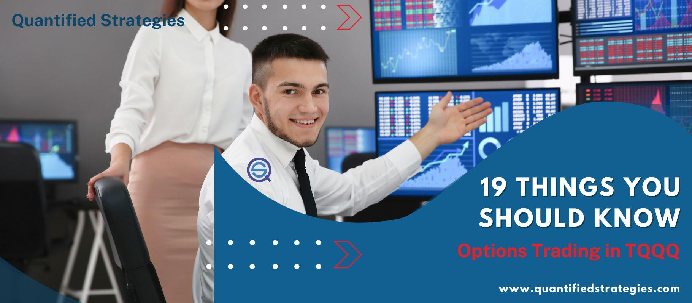

The ProShares UltraPro QQQ (TQQQ) is a popular leveraged exchange-traded fund (ETF) designed to provide three times the daily performance of the Nasdaq-100 Index. It is a tool often employed by traders looking to capitalize on daily market fluctuations, especially within a tech-heavy index. TQQQ is relevant in trading due to its high volatility and potential for rapid gains or losses, making it appealing to short-term and risk-tolerant investors seeking to amplify returns.

Algorithmic trading involves using pre-programmed software to execute trades based on defined criteria, eliminating human emotions from the decision-making process. The primary benefits of algorithmic trading include enhanced execution speed, the ability to process large volumes of data efficiently, and the elimination of manual errors. Additionally, it allows traders to simultaneously execute multiple strategies across different markets, maximizing the chances of capturing profitable opportunities. Algorithmic trading has become increasingly significant with the rise of big data and computational advancements, enabling complex strategies that adapt to changing market dynamics.



The purpose of this article is to explore effective trading strategies for TQQQ using algorithmic trading methods. Given TQQQ's distinctive characteristics as a leveraged ETF, it presents both unique opportunities and challenges for algorithmic traders. By understanding these elements and employing systematic trading strategies, traders can potentially enhance their trading performance.

## Table of Contents

## Understanding TQQQ and Its Mechanisms

ProShares UltraPro QQQ (TQQQ) is an exchange-traded fund (ETF) that aims to deliver triple the daily performance of the Nasdaq-100 Index, a stock market index encompassing 100 of the largest non-financial companies listed on the Nasdaq Stock Market. The Nasdaq-100 is widely recognized as a barometer for the technology sector, although it includes companies from other sectors as well. The TQQQ allows traders to gain leveraged exposure to this index, amplifying both potential returns and risks.

The leveraged nature of TQQQ means that it uses financial derivatives and debt to achieve its investment objective of delivering 300% of the daily returns of the Nasdaq-100. In mathematical terms, if the Nasdaq-100 increases by 1% in a day, TQQQ aims to increase by 3%. Conversely, if the Nasdaq-100 decreases by 1%, TQQQ would decrease by 3%. This leverage is achieved through the use of swaps, futures contracts, and other financial instruments that can magnify the fund's exposure to the underlying assets.

The implications of leveraging are significant for traders. While the potential for higher returns is attractive, the risks are equally magnified. The compounding effect over multiple trading days can result in returns that differ significantly from three times the cumulative return of the Nasdaq-100 index due to the resetting of leverage each day. This is because of the compounding effect, where gains or losses on one day are subject to the leveraged factor on the next day.

The rewards of trading TQQQ include the possibility of realizing substantial gains within a short period, especially during bullish market conditions when the technology and growth sectors, which heavily influence the Nasdaq-100, are performing well. TQQQ thus can be part of an aggressive trading strategy for those bullish on technology and capable of withstanding the potential [volatility](/wiki/volatility-trading-strategies).

However, TQQQ carries considerable risks. The daily reset of leverage means that in volatile markets, substantial losses can accumulate quickly. Additionally, the fund's performance over longer periods might not be intuitively predictable based on the performance of the Nasdaq-100 due to the effects of volatility and leverage resetting daily. This daily rebalancing aspect is crucial and means that TQQQ is primarily suitable for short-term trading rather than a long-term holding strategy.

Traders must exercise caution and thorough analysis when dealing with leveraged products like TQQQ. Understanding the underlying index, market conditions, and volatility trends is essential to making informed trading decisions and strategically leveraging the product to achieve desired outcomes.

## Fundamentals of Algorithmic Trading

Algorithmic trading, often referred to as algo trading, is the use of computer algorithms to automate trading decisions. This trading methodology utilizes a computer program that follows a defined set of instructions or rules to place a trade in order to generate profits at a speed and frequency that is impossible for a human trader. The components of [algorithmic trading](/wiki/algorithmic-trading) include execution speed, data analysis, and automation.

### Execution Speed, Data Analysis, and Automation

**Execution Speed:** In algorithmic trading, execution speed is a critical factor as it allows traders to execute orders at the optimal time. High-frequency trading (HFT) is a subset of algorithmic trading that relies extensively on ultra-fast order execution. The high speed leads to efficient markets as prices quickly reflect all available information, reducing arbitrage opportunities.

**Data Analysis:** Algorithmic trading also heavily relies on data analysis. Large sets of financial data are analyzed to identify trading signals and patterns, which are then used to make informed trading decisions. This analysis can include price history, trading volumes, and even text mining of financial news.

**Automation:** The automation of trading processes minimizes human intervention, reducing the risk of human error and emotional decision-making in trading activities. This allows strategies to be executed consistently and without fatigue.

### Evolution and Impact on the Stock Market

Algorithmic trading has evolved significantly over the past few decades. Initially, it started with simple rule-based systems; however, with advancements in technology, it has become more sophisticated, incorporating complex strategies and [machine learning](/wiki/machine-learning) techniques. 

The impact on the stock market is substantial. Algorithmic trading has increased [liquidity](/wiki/liquidity-risk-premium) and market efficiency as it facilitates the rapid trading of large volumes of securities. However, it has also contributed to incidents of market volatility, such as the Flash Crash of 2010, where the Dow Jones Industrial Average dropped 1,000 points within minutes.

### Role of Backtesting and Automated Systems

Backtesting plays a critical role in the development of trading strategies. It allows traders to simulate a trading strategy on historical data to estimate its potential effectiveness and reliability. Proper [backtesting](/wiki/backtesting) ensures that a trading strategy is capable of producing positive returns across different market conditions.

Automated systems are essential for executing trading strategies in real-time based on the rules defined during backtesting. These systems continuously analyze market conditions and adapt their trading actions in milliseconds, optimizing entry and [exit](/wiki/exit-strategy) positions based on predefined criteria.

Example of a basic backtesting framework in Python:

```python
import pandas as pd
import numpy as np

def backtest_strategy(data, strategy_func, *args):
    capital = 100000  # initial capital
    positions = 0
    for index, row in data.iterrows():
        signal = strategy_func(row, *args)
        if signal == 'buy':
            positions += capital // row['Price']
            capital -= positions * row['Price']
        elif signal == 'sell' and positions > 0:
            capital += positions * row['Price']
            positions = 0
    return capital

# Example strategy function
def simple_moving_average(row, short_window, long_window):
    if row[f'SMA{short_window}'] > row[f'SMA{long_window}']:
        return 'buy'
    elif row[f'SMA{short_window}'] < row[f'SMA{long_window}']:
        return 'sell'
    else:
        return 'hold' 
```

In summary, algorithmic trading involves executing orders using a set of predefined rules, offering advantages like speed, precision, and data-driven decision-making. Its evolution and the adoption of advanced technologies like AI have transformed the financial markets, necessitating careful strategy development and backtesting.

## Developing a TQQQ Trading Strategy

When developing a TQQQ algorithmic trading strategy, several key considerations must be addressed to enhance efficacy and align with individual investment goals. One of the primary considerations is risk tolerance, as TQQQ, a leveraged [ETF](/wiki/etf-trading-strategies), is inherently riskier due to its amplification of the Nasdaq-100 index movements. Traders must evaluate how much risk they are willing to take on, ensuring that the potential for higher gains does not overshadow the possibility of substantial losses.

Market conditions also play a critical role, as different strategies may perform variably depending on the economic environment. Volatile markets may benefit strategies like mean reversion, while stable growth periods might favor trend-following approaches.

One popular strategy is [trend following](/wiki/trend-following), which leverages the principle that assets in motion will continue in the same direction. This approach often involves moving averages, where buy or sell signals are triggered when short-term averages cross long-term averages. For example, a simple moving average crossover system might be coded in Python like this:

```python
import pandas as pd
import numpy as np

# Assuming 'data' is a DataFrame with a 'Close' column for TQQQ prices
short_window = 40
long_window = 100

# Generate signals DataFrame
signals = pd.DataFrame(index=data.index)
signals['signal'] = 0.0

# Create short simple moving average
signals['short_mavg'] = data['Close'].rolling(window=short_window, min_periods=1, center=False).mean()

# Create long simple moving average
signals['long_mavg'] = data['Close'].rolling(window=long_window, min_periods=1, center=False).mean()

# Create signals
signals['signal'][short_window:] = np.where(signals['short_mavg'][short_window:] > signals['long_mavg'][short_window:], 1.0, 0.0)

# Generate trading orders
signals['positions'] = signals['signal'].diff()
```

Mean reversion strategies, on the other hand, rely on the concept that prices eventually revert to their mean. This involves identifying overbought or oversold conditions and anticipating price reversals. Indicators such as the Relative Strength Index (RSI) can be utilized for this purpose, helping identify entry and exit points.

Statistical [arbitrage](/wiki/arbitrage) takes advantage of statistical mispricings between related financial instruments, employing complex mathematical models. Strategies like [pair trading](/wiki/pair-trading) can be implemented, where two correlated assets are traded against each other, betting one will outperform the other in the short term.

A crucial aspect of developing these strategies is backtesting, which involves simulating a strategy using historical data to evaluate its potential effectiveness. Backtesting allows traders to analyze performance metrics such as the Sharpe ratio, maximum drawdown, and overall return to fine-tune strategies before deploying them in live markets.

In summary, constructing a robust TQQQ algorithmic trading strategy requires balancing risk and market condition assessments with informed strategy selection, rigorous backtesting, and continual optimization to ensure alignment with evolving market dynamics.

## Backtesting and Optimizing TQQQ Strategies

Backtesting is an essential component of developing robust trading strategies for TQQQ, providing traders with a method to evaluate how a strategy might perform based on historical data. The process involves simulating a trading strategy's buy and sell signals on past price data to assess potential profitability and risk exposure. The fundamental goal of backtesting is to ensure that a trading strategy is viable before deploying it in live markets, thus minimizing the likelihood of financial loss.

In the context of TQQQ trading strategies, backtesting helps in understanding how these strategies perform under different market conditions by analyzing historical data specific to the leveraged nature of TQQQ. Given the 3x leverage of TQQQ relative to the Nasdaq-100 index, backtesting also allows traders to evaluate the amplified risks and returns inherent in trading this product.

The significance of optimizing trading strategies based on historical performance lies in the ability to refine parameters and improve outcomes. Optimization involves adjusting various parameters within the trading strategy to enhance performance metrics such as Sharpe ratio, drawdowns, and overall returns. This iterative process ensures that the strategy can capitalize on the strengths presented in historical data while minimizing weaknesses.

Common tools and platforms offer extensive capabilities for strategy backtesting and optimization. Among these, software such as MetaTrader, QuantConnect, and TradingView are popular due to their comprehensive data access, script-writing capabilities, and user-friendly interfaces. QuantConnect, for instance, allows traders to use Python to develop and backtest strategies in a cloud-based environment, leveraging extensive historical datasets and computational resources.

```python
import quantconnect as qc

# Sample code to create a basic backtest for a TQQQ strategy
class BasicTQQQStrategy(qc.Algorithm):
    def initialize(self):
        self.SetStartDate(2015, 1, 1)
        self.SetEndDate(2023, 1, 1)
        self.SetCash(10000)
        self.AddEquity("TQQQ", leverage=3)

    def OnData(self, data):
        if not self.Portfolio.Invested:
            self.SetHoldings("TQQQ", 1)

# Run the backtest
qc.AlgorithmManager().Run(BasicTQQQStrategy)
```

Such platforms often provide optimization utilities where parameters can be fine-tuned over multiple iterations to find the best-performing configurations. Through effective backtesting and optimization, traders can gain valuable insights, build confidence in their strategies, and ultimately enhance their algo trading outcomes with TQQQ.

## Risk Management in TQQQ Algo Trading

Leveraged exchange-traded funds (ETFs) like the ProShares UltraPro QQQ (TQQQ) present unique risks to traders due to their nature of using financial derivatives and debt to amplify the returns of an underlying index—in this case, the Nasdaq-100. While these instruments can potentially provide significant gains, they also expose investors to pronounced volatility and risk of substantial losses. Understanding and managing these risks is crucial for anyone engaged in TQQQ algo trading.

One of the main risks associated with leveraged ETFs such as TQQQ is the magnification of daily movements of the Nasdaq-100 index. If the index moves by 1%, TQQQ aims to move by 3% in the same direction. This means that both gains and losses are significantly amplified, creating a high-risk environment, especially during volatile market periods. Additionally, due to something called "beta slippage" or "volatility decay," these ETFs may not perfectly track the 3× performance of their index over longer periods, leading to a divergence from expected returns.

To mitigate these risks, traders can employ several key risk management techniques. Stop-loss orders are an essential tool that automatically sell a security when it reaches a certain price threshold, limiting the potential downside. For instance, setting a stop-loss at a predetermined percentage below the purchase price can prevent a small loss from turning into a catastrophic one. 

Position sizing is another critical aspect of risk management. By calculating the appropriate size of each trade relative to the total portfolio size and risk tolerance, traders can limit exposure. A common formula used for position sizing is:

$$
\text{Position Size} = \frac{\text{Risk Capital per Trade}}{\text{Trade Risk}}
$$

where "Risk Capital per Trade" is the amount a trader is willing to lose on a single trade, and "Trade Risk" is the difference between the entry and the stop-loss price.

Diversification further mitigates risk by spreading investments across various financial instruments or asset classes, rather than concentrating capital in a single leveraged ETF like TQQQ. This helps in reducing the impact of adverse price movements in any one asset.

Algorithmic systems inherently offer several advantages in managing risks associated with TQQQ. By executing trades at optimal speeds, algorithms can respond to market conditions faster than a human trader, ensuring timely execution of stop-losses and limit orders, thereby minimizing slippage. Additionally, algorithms can be programmed to continuously evaluate market conditions and automatically adjust position sizes and allocations in real-time, reducing human error and emotional trading decisions.

Moreover, leveraging machine learning and [artificial intelligence](/wiki/ai-artificial-intelligence) within algorithmic systems can enhance the capability of identifying patterns or anomalies, allowing for proactive adjustments to trading strategies. This adaptability is particularly useful for ETFs like TQQQ, where market conditions can change rapidly and unpredictably.

In conclusion, while trading leveraged ETFs like TQQQ involves unique risks due to their amplified exposure, employing a robust risk management strategy—utilizing stop-loss orders, proper position sizing, and diversification—combined with the precision and efficiency of algorithmic trading, can significantly mitigate potential downsides.

## Monitoring and Adjusting Algo Trading Strategies

Continuous monitoring and adjustment are critical components of successful algorithmic trading strategies, particularly for volatile instruments like TQQQ. The dynamic nature of financial markets necessitates an adaptive approach, allowing traders to capitalize on emerging opportunities and mitigate potential risks. 

### The Role of AI and Machine Learning

Artificial intelligence (AI) and machine learning are pivotal in enhancing the efficiency and accuracy of trading algorithms. These technologies can process vast amounts of market data swiftly, identifying patterns and trends that may not be evident to human traders. AI models can be trained to adapt to new market conditions, providing a robust framework for decision-making. Machine learning algorithms, such as [reinforcement learning](/wiki/reinforcement-learning), allow systems to learn from historical data, improving their predictions and strategic decisions over time.

For instance, a common approach involves using supervised learning techniques to predict price movements based on historical price data and various technical indicators. Models like support vector machines (SVM) or random forests can classify market conditions, which can inform strategy adjustments.

```python
import numpy as np
from sklearn.ensemble import RandomForestClassifier

# Sample data: features include historical price changes and technical indicators
X_train = np.array([[0.02, -0.01, 0.03, 0.2], [0.01, 0.04, -0.02, 0.25], ...])
y_train = np.array([1, 0, ...])  # 1 for upward movement, 0 for downward

# Train a random forest classifier
clf = RandomForestClassifier(n_estimators=100)
clf.fit(X_train, y_train)
```

### Effective Management and Maintenance of Trading Systems

Managing a trading system requires regular performance assessments and recalibrations to align strategies with evolving market conditions. This involves setting up a routine to review algorithm performance metrics, such as return on investment (ROI), Sharpe ratio, and maximum drawdown. Traders should adjust parameters and strategies to optimize these metrics continuously.

1. **Set Performance Benchmarks:** Establish clear, quantifiable benchmarks for success. Regularly compare performance against these benchmarks to identify underperforming algorithms.

2. **Incorporate Feedback Loops:** Introduce mechanisms for algorithms to learn from their mistakes. Evaluate system decisions and outcomes, using these insights to refine the trading logic.

3. **Leverage Automation for Routine Tasks:** Use automated scripts to handle routine tasks such as data collection, order execution, and reporting. This frees up more time for strategic analysis and decision-making.

4. **Maintain Flexibility:** Be ready to pivot strategies swiftly in response to market volatility or shifts. This might involve iterating on models or experimenting with different asset classes.

5. **Utilize Robust Infrastructure:** Ensure that the underlying technological infrastructure is capable of handling high-frequency data and executing trades with minimal delay. 

By integrating AI and machine learning into the monitoring process, traders can significantly enhance their strategies, ensuring they remain competitive and effective in dynamic markets. Continuous adaptation is key to maintaining a trading edge and achieving sustained profitability.

## Tools and Resources for TQQQ Algo Trading

Algorithmic trading relies heavily on the right tools and resources to ensure efficiency, accuracy, and performance in executing trading strategies, particularly for leveraged ETFs like TQQQ. Here are some of the most popular platforms and software tools, along with resources and guidance, that can assist traders in developing and executing algorithmic trading strategies.

### Popular Platforms and Software

1. **MetaTrader 5 (MT5)**: Known for forex trading, MT5 also supports algorithmic trading in stocks and commodities. It offers a scripting language, MQL5, for developing custom trading strategies and indicators. The platform provides robust backtesting capabilities, allowing traders to test their strategies against historical data.

2. **QuantConnect**: A cloud-based algorithmic trading platform supporting multiple asset classes, including equities and ETFs. QuantConnect uses the Lean Algorithm Framework, which is open-source, and supports C# and Python for strategy development. It provides data, backtesting, and live trading functionalities, making it a comprehensive tool for traders.

3. **Interactive Brokers API**: Offers a powerful suite of APIs that enable traders to build and deploy trading systems using languages such as Python, Java, and C++. The platform provides extensive market data and execution tools, suitable for advanced traders who wish to customize their trading environment.

4. **AlgoTrader**: A professional algorithmic trading software for quantitative research, trading strategy development, backtesting, and automated trading. It supports multiple types of trading strategies and is compatible with a wide range of data feeds and brokers.

### Resources and Communities

1. **Quantitative Finance Forums**: Websites such as Quantitative Finance Stack Exchange and Elite Trader host active communities where traders share knowledge on algorithmic trading, strategies, and tools.

2. **Online Courses**: Platforms like Coursera, Udemy, and edX offer courses on algorithmic trading, often covering data analysis, backtesting, and trading strategy development using Python and R.

3. **Research Papers and Journals**: Keeping abreast of the latest research in quantitative finance and algorithmic trading can offer innovative strategies and insights. Resources include the Journal of Computational Finance and SSRN.

### Selecting Tools

Selecting the right tools depends on several factors:

- **Skill Level**: Novice traders might prefer platforms with user-friendly interfaces and minimal coding requirements, such as TradingView or MT5. In contrast, experienced traders may select environments like QuantConnect or custom solutions via Interactive Brokers API for greater control.

- **Trading Goals**: The choice of tools should align with the specific trading objectives. For instance, high-frequency trading strategies require platforms with low-latency execution, while long-term strategies might focus more on robust backtesting capabilities.

- **Budget**: Costs can vary significantly across platforms. Traders must weigh subscription fees against potential returns and the value offered by advanced features.

- **Community and Support**: A robust community and strong customer support can significantly enhance the user experience, particularly for beginners or those utilizing complex strategies.

By leveraging these platforms and resources effectively, traders can enhance their ability to execute profitable trading strategies within the TQQQ market.

## Conclusion

Throughout this article, we have explored the fundamental aspects and complexities of trading TQQQ, particularly through the lens of algorithmic trading. ProShares UltraPro QQQ (TQQQ) is a leveraged exchange-traded fund (ETF) that amplifies the performance of the Nasdaq-100 index by a [factor](/wiki/factor-investing) of three. Understanding its mechanics and recognizing the inherent risks and rewards is crucial for traders who want to take advantage of its potential high returns.

Algorithmic trading, which leverages automation, data analysis, and execution speed, has significantly transformed modern trading. By employing various algorithms, traders can analyze vast datasets and execute trades optimally. This approach increases the efficiency of trading strategies, offering benefits over traditional manual trading, such as reduced emotional errors and the ability to quickly adapt to changing market conditions.

Developing a robust trading strategy for TQQQ requires consideration of multiple factors, including risk tolerance and market conditions. Popular strategies such as trend following, mean reversion, and [statistical arbitrage](/wiki/statistical-arbitrage) provide frameworks that can be adapted to TQQQ's volatility. Crucially, backtesting allows traders to simulate these strategies using historical data to evaluate their potential success and refine them as necessary.

The success of a trading strategy largely depends on effective backtesting and optimization, facilitated by various tools and platforms specifically designed for this purpose. Equally important is managing risk appropriately when trading leveraged ETFs like TQQQ. Incorporating risk management techniques—such as stop-loss orders, position sizing, and diversification—can help protect capital during adverse market movements. Additionally, algorithmic trading systems inherently aid in managing risk by offering systematic trade execution and monitoring.

Continuous monitoring and adjustment of trading strategies to adapt to market changes is essential. Utilizing advances in artificial intelligence and machine learning can enhance algorithmic trading by refining strategies over time. Furthermore, utilizing the correct tools and resources ensures efficiency in developing, executing, and managing trades.

In conclusion, algorithmic trading presents an attractive option for those interested in trading TQQQ, aligning with specific investment goals, particularly for those who wish to capitalize on the leverage and volatility of the ETF. However, it requires diligent research, thorough backtesting, and stringent risk management. By adhering to these principles, traders can potentially enhance their trading performance and achieve their financial objectives responsibly.

## References & Further Reading

[1]: Bergstra, J., Bardenet, R., Bengio, Y., & Kégl, B. (2011). ["Algorithms for Hyper-Parameter Optimization."](https://papers.nips.cc/paper/4443-algorithms-for-hyper-parameter-optimization) Advances in Neural Information Processing Systems 24.

[2]: ["Advances in Financial Machine Learning"](https://www.amazon.com/Advances-Financial-Machine-Learning-Marcos/dp/1119482089) by Marcos Lopez de Prado

[3]: ["Evidence-Based Technical Analysis: Applying the Scientific Method and Statistical Inference to Trading Signals"](https://www.amazon.com/Evidence-Based-Technical-Analysis-Scientific-Statistical/dp/0470008741) by David Aronson

[4]: ["Machine Learning for Algorithmic Trading"](https://github.com/stefan-jansen/machine-learning-for-trading) by Stefan Jansen

[5]: ["Quantitative Trading: How to Build Your Own Algorithmic Trading Business"](https://books.google.com/books/about/Quantitative_Trading.html?id=j70yEAAAQBAJ) by Ernest P. Chan