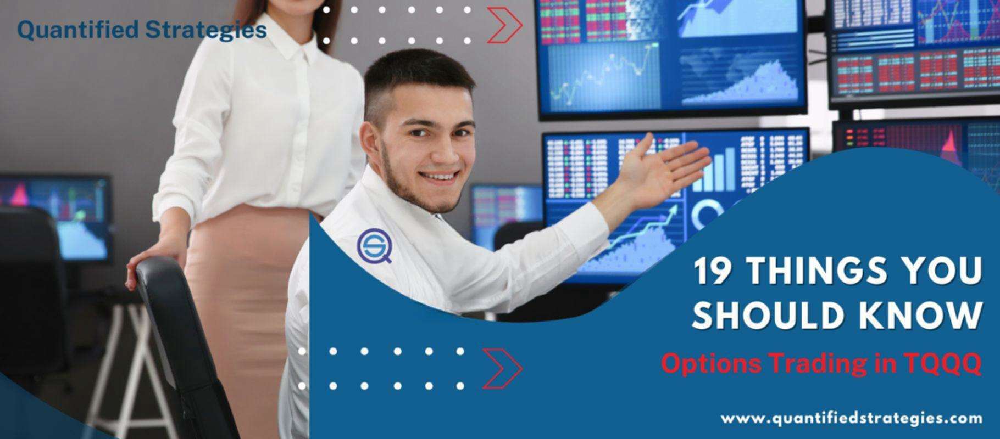

## Table of Contents

## What is TQQQ and how does it work?

TQQQ is a type of investment product called an ETF, which stands for Exchange Traded Fund. Specifically, TQQQ is known as a leveraged ETF. It is designed to give investors three times the daily return of the Nasdaq-100 Index, which is a group of the 100 largest and most actively traded non-financial companies listed on the Nasdaq stock exchange. This means if the Nasdaq-100 goes up by 1% in a day, TQQQ aims to go up by 3%. However, if the Nasdaq-100 goes down by 1% in a day, TQQQ will go down by 3%.

Because TQQQ is a leveraged ETF, it can be very risky. The goal of trying to get three times the daily return can lead to big gains, but also big losses. It's important for investors to understand that TQQQ is meant for short-term trading, not for long-term investing. Over time, the effects of daily rebalancing and the compounding of returns can cause the performance of TQQQ to differ significantly from three times the performance of the Nasdaq-100. Therefore, it's crucial for anyone considering TQQQ to be aware of these risks and to have a good understanding of how leveraged ETFs work.

## What are the basics of options trading?

Options trading is a way to buy or sell a stock at a certain price before a certain date. When you buy an option, you're not buying the stock itself, but the right to buy or sell it. There are two main types of options: calls and puts. A call option gives you the right to buy a stock at a set price, called the strike price, before the option expires. A put option gives you the right to sell a stock at the strike price before it expires. You pay a fee, called a premium, to buy an option.

Options can be used in different ways. Some people use them to bet on whether a stock's price will go up or down. For example, if you think a stock's price will go up, you might buy a call option. If you're wrong and the price doesn't go up, you only lose the premium you paid. Others use options to protect their investments. If you own a stock and are worried its price might fall, you could buy a put option to sell it at a set price, limiting your loss. Options trading can be risky, so it's important to understand it well before you start.

## How can options be used with TQQQ?

Options can be used with TQQQ to either make bets on its price movements or to protect against potential losses. Since TQQQ is a leveraged ETF that aims to give three times the daily return of the Nasdaq-100, it can be very volatile. If you think TQQQ's price will go up, you can buy a call option. This gives you the right to buy TQQQ at a set price before the option expires. If TQQQ's price does go up, you can make a profit by exercising your option or selling it for more than you paid. But if TQQQ's price doesn't go up, you only lose the premium you paid for the option.

On the other hand, if you own TQQQ and are worried its price might fall, you can buy a put option. This gives you the right to sell TQQQ at a set price before the option expires. If TQQQ's price does fall, you can limit your losses by exercising your put option. This way, you can sell TQQQ at the higher strike price even if its market price is lower. However, if TQQQ's price stays the same or goes up, you'll lose the premium you paid for the put option. Using options with TQQQ can be a way to manage risk, but it's important to understand the risks involved with both TQQQ and options trading.

## What are the risks associated with trading TQQQ options?

Trading TQQQ options can be very risky. TQQQ is a leveraged ETF, which means it tries to give three times the daily return of the Nasdaq-100. This can make TQQQ's price move a lot in a short time, which makes options on TQQQ even more risky. If you buy a call option on TQQQ and its price goes down instead of up, you can lose the whole premium you paid. The same goes for put options; if TQQQ's price goes up instead of down, you lose the premium. Because TQQQ is so volatile, the chances of losing money on your options can be higher than with less risky investments.

Another risk is that options have an expiration date. If the price of TQQQ doesn't move in the direction you expected before your option expires, the option becomes worthless, and you lose the premium you paid. Also, because TQQQ aims for three times the daily return, it can be hard to predict its price over longer periods. This makes it even riskier to hold TQQQ options for a long time. If you're not careful and don't understand how both TQQQ and options work, you could lose a lot of money.

## What strategies can beginners use when trading TQQQ options?

For beginners, one strategy to consider when trading TQQQ options is to start small. Instead of jumping into big trades right away, begin with small amounts of money. This way, you can learn how TQQQ and options work without risking too much. You might also want to focus on short-term options, like those that expire in a week or two. TQQQ can be very volatile, so short-term options can help you react quickly to price changes.

Another strategy is to use options to protect your investments. If you own TQQQ and are worried its price might fall, you can buy a put option. This gives you the right to sell TQQQ at a set price, which can limit your losses if the price does drop. It's like buying insurance for your investment. Remember, though, that options have a cost, so you'll need to weigh the cost of the option against the potential loss you're trying to avoid.

Lastly, it's important to keep learning and stay informed. TQQQ and options trading can be complex, so take the time to understand the basics. Read up on how TQQQ works, how options work, and how they interact. Use online resources, books, and maybe even take a course. The more you know, the better you'll be at making smart decisions when trading TQQQ options.

## How does leverage affect TQQQ options trading?

Leverage makes TQQQ options trading more exciting but also riskier. TQQQ is a special kind of investment that tries to give you three times the daily return of the Nasdaq-100. This means if the Nasdaq-100 goes up a little bit, TQQQ can go up a lot more. But if the Nasdaq-100 goes down, TQQQ can go down a lot more too. When you trade options on TQQQ, this leverage can make your profits bigger if you guess right about which way the price will go. But it also means your losses can be much bigger if you guess wrong.

Because TQQQ is so volatile due to its leverage, the options on TQQQ can change in value very quickly. This can be good if you're looking to make quick money, but it's also very risky. If you buy a call option hoping TQQQ's price will go up and it doesn't, you can lose all the money you spent on the option. The same goes for put options; if you think TQQQ's price will go down and it goes up instead, you lose your investment. So, when trading TQQQ options, you need to be careful and understand that the leverage can make things move fast in both good and bad ways.

## What are the key differences between trading TQQQ options and trading options on other ETFs?

Trading TQQQ options is different from trading options on other ETFs mainly because of the leverage. TQQQ is designed to give three times the daily return of the Nasdaq-100, which makes it a lot more volatile than most other ETFs. When you trade options on TQQQ, this extra volatility can make your options change in value much faster than options on less risky ETFs. This means you could make bigger profits if you guess right about the price movement, but you could also lose more money if you guess wrong. So, trading TQQQ options is riskier and can be more exciting, but it needs more careful watching and quick decisions.

Another difference is that TQQQ is meant for short-term trading, not long-term investing. Because of the way TQQQ works, its performance over time can be different from what you might expect from a regular ETF. This makes it harder to predict how TQQQ options will do over longer periods. With other ETFs, you might feel more comfortable holding onto options for a while, but with TQQQ, it's usually better to stick to short-term options. This means you need to be more active and ready to act fast when trading TQQQ options compared to trading options on other, less leveraged ETFs.

## How can advanced traders use TQQQ options to hedge their portfolios?

Advanced traders can use TQQQ options to hedge their portfolios by buying put options on TQQQ. If they own stocks or other investments that move with the Nasdaq-100, they might worry about a big drop in the market. By buying a put option on TQQQ, they can protect against this risk. If the market and TQQQ's price fall, the put option will gain value, which can help offset losses in their other investments. This is like buying insurance for their portfolio, but they have to remember that options cost money, so they need to think about if the protection is worth the price.

Another way advanced traders can use TQQQ options to hedge is by selling call options on TQQQ. This strategy can bring in extra money, which they can use to buy more protection or invest in other ways. If TQQQ's price stays the same or goes down, the call options they sold will lose value, and they get to keep the money they were paid for selling the options. But this strategy is riskier because if TQQQ's price goes up a lot, they might have to sell TQQQ at a lower price than the market, which could lead to losses. So, traders need to be careful and understand the risks when using TQQQ options to hedge their portfolios.

## What are some advanced options strategies that can be applied to TQQQ?

One advanced strategy that can be used with TQQQ options is called a straddle. In a straddle, you buy both a call option and a put option on TQQQ at the same strike price and expiration date. This strategy can make money if TQQQ's price moves a lot in either direction. If TQQQ's price goes up a lot, the call option will gain value and make up for the loss on the put option. If TQQQ's price goes down a lot, the put option will gain value and make up for the loss on the call option. But if TQQQ's price doesn't move much, you can lose the money you spent on both options. Straddles are good for when you think TQQQ will be very volatile but you're not sure which way it will go.

Another advanced strategy is called a strangle. In a strangle, you buy a call option with a higher strike price and a put option with a lower strike price, both with the same expiration date. This strategy is similar to a straddle but costs less because the options are less likely to be in the money at expiration. A strangle can make money if TQQQ's price moves a lot in either direction, just like a straddle. But it needs a bigger price move to be profitable because the options are further away from the current price. If TQQQ's price stays in between the two strike prices, you can lose the money you spent on the options. Strangles are good when you expect a big move in TQQQ but want to spend less money upfront.

## How does market volatility impact TQQQ options trading?

Market volatility can make TQQQ options trading more exciting but also riskier. TQQQ is a special kind of investment that tries to give you three times the daily return of the Nasdaq-100. When the market is very volatile, the Nasdaq-100 can go up and down a lot, which means TQQQ can move even more because of its leverage. If you have options on TQQQ, this can make their value change very quickly. If you think TQQQ's price will go up and it does, your call options can become worth a lot more. But if you're wrong and TQQQ's price goes down, you can lose a lot of money fast.

Because TQQQ is so sensitive to market volatility, you need to be ready to make quick decisions when trading its options. If the market is calm and not moving much, TQQQ options might not change in value as much, and you might not make as much money. But when the market is very volatile, TQQQ options can be a good way to bet on big price moves. Just remember, the bigger the potential reward, the bigger the risk. So, if you're trading TQQQ options during times of high market volatility, you need to be careful and watch the market closely.

## What are the tax implications of trading TQQQ options?

Trading TQQQ options can have different tax effects depending on how long you hold them and how you make money from them. If you buy and sell TQQQ options within a year, any profits you make are considered short-term capital gains. These gains are taxed at your regular income tax rate, which can be pretty high depending on how much money you make. But if you hold onto your TQQQ options for more than a year before selling them, any profits are considered long-term capital gains. These gains are usually taxed at a lower rate, which can be good if you're trying to keep more of your money.

Another thing to think about is if you use TQQQ options to make money in other ways, like selling options you don't own or using them to hedge other investments. The tax rules can get more complicated in these cases. For example, if you sell options you don't own, you might have to report the money you get as ordinary income, which is taxed at your regular rate. Also, if you use TQQQ options to hedge and you lose money, you might be able to use those losses to lower your taxes. It's a good idea to talk to a tax professional to make sure you understand all the tax rules and how they apply to your TQQQ options trading.

## How can traders use technical analysis to improve their TQQQ options trading?

Traders can use technical analysis to help them make better decisions when trading TQQQ options. Technical analysis is all about looking at charts and patterns to guess where the price of TQQQ might go next. One way to do this is by using moving averages, which are lines on a chart that show the average price of TQQQ over a certain time. If the price of TQQQ goes above a moving average, it might be a good time to buy a call option because it could mean the price will keep going up. If the price goes below a moving average, it might be a good time to buy a put option because it could mean the price will keep going down. Traders also look at other things like support and resistance levels, which are prices where TQQQ often stops going down or up, to help them decide when to buy or sell options.

Another way technical analysis can help with TQQQ options trading is by looking at chart patterns. For example, if you see a pattern that looks like a head and shoulders, it might mean the price of TQQQ is going to go down, so you might want to buy a put option. If you see a pattern that looks like a cup and handle, it might mean the price is going to go up, so you might want to buy a call option. By studying these patterns and other technical indicators, traders can try to predict what TQQQ's price might do next and make smarter choices about which options to buy or sell. But remember, technical analysis is not perfect, and it's always a good idea to use it along with other kinds of research and to be ready for surprises in the market.

## What are the strategies for risk management in TQQQ algo trading?

Leveraged exchange-traded funds (ETFs) like the ProShares UltraPro QQQ (TQQQ) present unique risks to traders due to their nature of using financial derivatives and debt to amplify the returns of an underlying index—in this case, the Nasdaq-100. While these instruments can potentially provide significant gains, they also expose investors to pronounced volatility and risk of substantial losses. Understanding and managing these risks is crucial for anyone engaged in TQQQ algo trading.

One of the main risks associated with leveraged ETFs such as TQQQ is the magnification of daily movements of the Nasdaq-100 index. If the index moves by 1%, TQQQ aims to move by 3% in the same direction. This means that both gains and losses are significantly amplified, creating a high-risk environment, especially during volatile market periods. Additionally, due to something called "beta slippage" or "volatility decay," these ETFs may not perfectly track the 3× performance of their index over longer periods, leading to a divergence from expected returns.

To mitigate these risks, traders can employ several key risk management techniques. Stop-loss orders are an essential tool that automatically sell a security when it reaches a certain price threshold, limiting the potential downside. For instance, setting a stop-loss at a predetermined percentage below the purchase price can prevent a small loss from turning into a catastrophic one. 

Position sizing is another critical aspect of risk management. By calculating the appropriate size of each trade relative to the total portfolio size and risk tolerance, traders can limit exposure. A common formula used for position sizing is:

$$
\text{Position Size} = \frac{\text{Risk Capital per Trade}}{\text{Trade Risk}}
$$

where "Risk Capital per Trade" is the amount a trader is willing to lose on a single trade, and "Trade Risk" is the difference between the entry and the stop-loss price.

Diversification further mitigates risk by spreading investments across various financial instruments or asset classes, rather than concentrating capital in a single leveraged ETF like TQQQ. This helps in reducing the impact of adverse price movements in any one asset.

Algorithmic systems inherently offer several advantages in managing risks associated with TQQQ. By executing trades at optimal speeds, algorithms can respond to market conditions faster than a human trader, ensuring timely execution of stop-losses and limit orders, thereby minimizing slippage. Additionally, algorithms can be programmed to continuously evaluate market conditions and automatically adjust position sizes and allocations in real-time, reducing human error and emotional trading decisions.

Moreover, leveraging machine learning and [artificial intelligence](/wiki/ai-artificial-intelligence) within algorithmic systems can enhance the capability of identifying patterns or anomalies, allowing for proactive adjustments to trading strategies. This adaptability is particularly useful for ETFs like TQQQ, where market conditions can change rapidly and unpredictably.

In conclusion, while trading leveraged ETFs like TQQQ involves unique risks due to their amplified exposure, employing a robust risk management strategy—utilizing stop-loss orders, proper position sizing, and diversification—combined with the precision and efficiency of algorithmic trading, can significantly mitigate potential downsides.

## References & Further Reading

[1]: Bergstra, J., Bardenet, R., Bengio, Y., & Kégl, B. (2011). ["Algorithms for Hyper-Parameter Optimization."](https://papers.nips.cc/paper/4443-algorithms-for-hyper-parameter-optimization) Advances in Neural Information Processing Systems 24.

[2]: ["Advances in Financial Machine Learning"](https://www.amazon.com/Advances-Financial-Machine-Learning-Marcos/dp/1119482089) by Marcos Lopez de Prado

[3]: ["Evidence-Based Technical Analysis: Applying the Scientific Method and Statistical Inference to Trading Signals"](https://www.amazon.com/Evidence-Based-Technical-Analysis-Scientific-Statistical/dp/0470008741) by David Aronson

[4]: ["Machine Learning for Algorithmic Trading"](https://github.com/stefan-jansen/machine-learning-for-trading) by Stefan Jansen

[5]: ["Quantitative Trading: How to Build Your Own Algorithmic Trading Business"](https://books.google.com/books/about/Quantitative_Trading.html?id=j70yEAAAQBAJ) by Ernest P. Chan