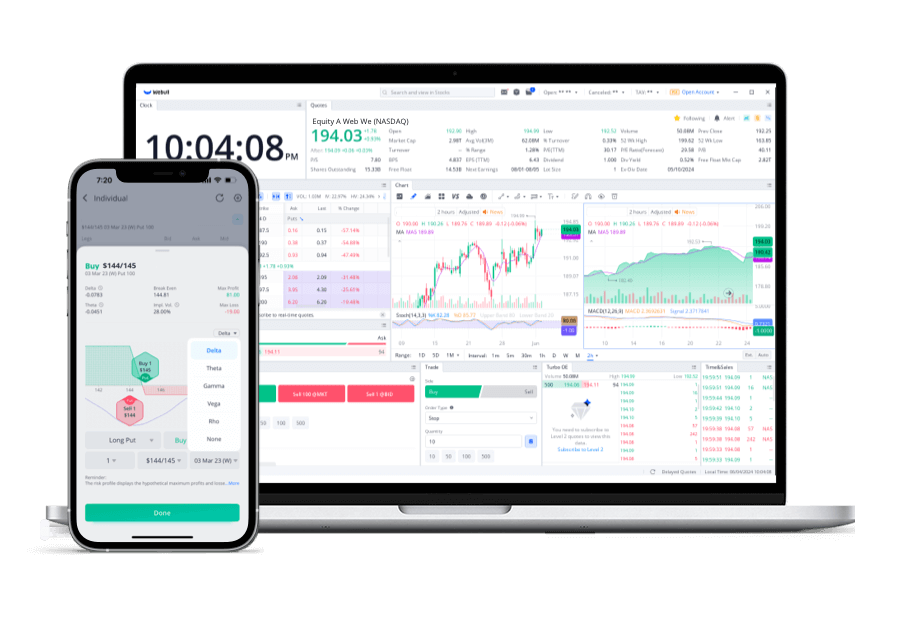

## Table of Contents

## What is options trading and how does it work on Webull?

Options trading is a way to buy or sell a stock at a certain price before a certain date. It's like making a bet on whether a stock's price will go up or down. When you buy an option, you pay a small fee called a premium. This gives you the right, but not the obligation, to buy or sell the stock at the agreed price, called the strike price, before the option expires. If the stock price moves in your favor, you can make a profit. If it doesn't, you only lose the premium you paid.

On Webull, options trading is easy to do. First, you need to open an account and get approved for options trading. Once approved, you can find the options trading section in the app. You can search for the stock you're interested in and see all the available options. You can choose to buy a call option if you think the stock price will go up, or a put option if you think it will go down. After selecting your option, you enter the number of contracts you want to buy and place your order. Webull's platform shows you all the important details like the strike price, expiration date, and the premium, making it simple to make your trade.

## How can I open an options trading account on Webull?

To open an options trading account on Webull, first download the Webull app on your phone or use their website. Once you have the app, sign up for a new account by providing your personal information like your name, email, and social security number. After signing up, you'll need to fund your account by transferring money from your bank. This can take a few days, so be patient.

After your account is funded, you need to apply for options trading approval. In the app, go to the account settings and find the options trading section. You'll need to fill out a short questionnaire about your trading experience and risk tolerance. Webull will review your application and let you know if you're approved. Once approved, you can start trading options right away.

## What are the basic types of options (calls and puts) and how are they used on Webull?

There are two basic types of options: calls and puts. A call option gives you the right to buy a stock at a certain price, called the strike price, before the option expires. You would buy a call option if you think the stock's price will go up. If the stock price goes above the strike price, you can buy the stock at the lower strike price and then sell it at the higher market price to make a profit. On Webull, you can find call options by searching for a stock and looking at the options chain. You can then choose the expiration date and strike price you want, and place your order.

A put option gives you the right to sell a stock at a certain price before the option expires. You would buy a put option if you think the stock's price will go down. If the stock price falls below the strike price, you can buy the stock at the lower market price and then sell it at the higher strike price to make a profit. On Webull, finding put options works the same way as finding call options. Just search for the stock, look at the options chain, pick your expiration date and strike price, and place your order. Both call and put options on Webull are easy to navigate and trade.

## How do I read and understand options chains on Webull?

Reading an options chain on Webull is like looking at a menu of options for a stock. When you search for a stock on Webull and go to the options section, you'll see a list of different options, called an options chain. Each row in the chain represents a different option with details like the expiration date, strike price, and the premium you have to pay. The options are split into two sections: calls on one side and puts on the other. The calls are for if you think the stock price will go up, and the puts are for if you think it will go down. You can see how much each option costs and how many are being traded.

Understanding the options chain means knowing what each part means. The expiration date tells you when the option will end, and the strike price is the price at which you can buy or sell the stock. The premium is what you pay to buy the option. If you see a lot of [volume](/wiki/volume-trading-strategy) and open interest, it means many people are trading that option, which can be a sign of how popular or important it is. On Webull, you can sort the options chain by different things like expiration date or strike price to find the option that fits what you want to do. By looking at all these details, you can pick the right option for your trading plan.

## What are the key factors to consider before trading options on Webull?

Before you start trading options on Webull, it's important to know what you're getting into. First, think about your risk tolerance. Options can be risky because you can lose the money you put in if things don't go your way. Make sure you're okay with that risk before you start. Also, consider your trading experience. If you're new to trading, options might be tricky at first. It's a good idea to learn the basics and maybe practice with a small amount of money before jumping in with a lot.

Another key [factor](/wiki/factor-investing) is understanding the stock you're trading options on. Do some research on the company and see if it's doing well or if there are any big news events coming up that could affect the stock price. Also, think about the cost of the options. The premium you pay can add up, so make sure you're comfortable with the price. Lastly, use Webull's tools and resources to help you make smart choices. They have charts, analysis, and educational materials that can guide you in making better trading decisions.

## How can I use Webull's tools and features to analyze options?

Webull has lots of tools that can help you understand options better. One of the main tools is the options chain, which shows you all the different options for a stock. You can see the expiration dates, strike prices, and how much each option costs. Webull also has charts that show you how the stock price has moved in the past, which can help you guess where it might go next. There's also a feature called "Options Screener" that lets you filter options based on things like price or how much they're being traded. This can help you find the best options for your plan.

Another useful tool is the "Probability of Profit" calculator. This tool tells you how likely it is that your option will make money by the time it expires. It's a good way to see if your trade is worth the risk. Webull also has educational resources like articles and videos that explain how options work and how to use their tools. By using these tools and learning from the resources, you can make smarter choices when trading options on Webull.

## What are some common options trading strategies I can implement on Webull?

One common options trading strategy you can use on Webull is the "covered call." This is when you own a stock and then sell a call option on that stock. You get paid a premium for selling the call, which can give you extra income. If the stock price stays below the strike price of the call option, you keep the premium and the stock. But if the stock price goes above the strike price, the person who bought the call can take your stock at that price. It's a way to make some money while still holding onto your stock, but it limits how much you can gain if the stock price goes way up.

Another strategy is the "protective put." This is like buying insurance for your stock. If you own a stock and you're worried it might go down, you can buy a put option. This gives you the right to sell your stock at the strike price, even if the market price drops lower. It costs you the premium to buy the put, but it can protect you from big losses if the stock price falls. On Webull, you can easily find and buy these put options to help safeguard your investments.

A third strategy is the "long straddle." This is when you buy both a call option and a put option on the same stock with the same strike price and expiration date. You do this if you think the stock price will move a lot, but you're not sure which way. If the stock price goes up a lot, the call option will make money. If it goes down a lot, the put option will make money. The downside is that it costs you the premiums for both options, so the stock has to move a lot for you to make a profit. On Webull, you can set up this strategy by buying the call and put options at the same time.

## How does Webull handle options assignment and exercise?

When you trade options on Webull, you might need to know about assignment and exercise. Assignment happens when you sell an option and the buyer decides to use it. If you sold a call option and the stock price goes above the strike price, the buyer might want to buy the stock from you at that price. If you sold a put option and the stock price goes below the strike price, the buyer might want to sell the stock to you at that price. Webull will let you know if you get assigned, and you'll need to have the stock or the money ready to complete the trade.

Exercise is what happens when you buy an option and decide to use it. If you bought a call option and the stock price is higher than the strike price, you might want to buy the stock at the lower strike price. If you bought a put option and the stock price is lower than the strike price, you might want to sell the stock at the higher strike price. On Webull, you can choose to exercise your option before it expires. If you don't do anything, Webull might automatically exercise your option if it's in the money, meaning it would be profitable to use it.

## What are the risks associated with options trading on Webull and how can they be managed?

Options trading on Webull can be risky because you can lose money. If you buy an option and the stock price doesn't move the way you thought it would, you could lose the money you paid for the option. Selling options can be even riskier because if you get assigned, you might have to buy or sell the stock at a price that's not good for you. Also, options have expiration dates, so if you don't use them in time, they can become worthless. It's important to know that options can be complicated and you need to understand them well before you start trading.

To manage these risks, start by only using money you can afford to lose. Don't put all your money into one option; spread it out to reduce the risk. You can also use stop-loss orders on Webull to automatically sell an option if it starts to lose too much value. Learning about different options strategies can help too. For example, using a covered call or a protective put can help limit your losses. Lastly, keep learning and stay updated on the stocks you're trading options on, so you can make better decisions and manage your risks better.

## How can I use advanced options strategies like spreads and straddles on Webull?

Using advanced options strategies like spreads and straddles on Webull can help you manage risk and potentially make more money. A spread involves buying and selling options at the same time, but with different strike prices or expiration dates. For example, a bull call spread is when you buy a call option with a lower strike price and sell another call option with a higher strike price on the same stock and expiration date. This limits your risk because the premium you get from selling the higher strike call helps pay for the lower strike call you bought. On Webull, you can set up a spread by selecting the options you want to buy and sell, and the platform will show you the total cost and potential profit.

A straddle is another strategy you can use on Webull, which involves buying both a call and a put option on the same stock with the same strike price and expiration date. You use a straddle when you think the stock price will move a lot, but you're not sure which way. If the stock price goes up a lot, the call option will make money. If it goes down a lot, the put option will make money. The downside is that it costs you the premiums for both options, so the stock has to move a lot for you to make a profit. On Webull, you can easily set up a straddle by buying the call and put options at the same time, and the platform will show you the total cost and potential outcomes.

## What are the tax implications of options trading on Webull?

When you trade options on Webull, you need to know about taxes. If you make money from options, you have to pay taxes on those profits. The tax rate depends on how long you held the option before selling it. If you held it for less than a year, it's considered a short-term capital gain, and you'll pay your regular income tax rate on it. If you held it for more than a year, it's a long-term capital gain, and the tax rate is usually lower. Also, if you sell options, the premium you get is taxed as income.

Another thing to remember is that if you get assigned on an option, it can change your tax situation. If you're assigned on a call option and have to sell stock, you'll have to pay capital gains tax on any profit from the stock. If you're assigned on a put option and have to buy stock, the cost basis of that stock will be the strike price you paid, which affects how much tax you'll pay when you sell the stock later. It's a good idea to keep good records of all your options trades on Webull so you can report them correctly on your taxes.

## How can I monitor and adjust my options positions effectively on Webull?

To monitor your options positions on Webull, you can use the app's dashboard to keep an eye on all your open options. The dashboard shows you important details like the current stock price, the price you paid for the option, and how much your option is worth now. You can also set up alerts to notify you if the stock price hits certain levels or if your option is about to expire. This way, you can stay updated without having to check the app all the time. Webull also has charts and analysis tools that help you see how the stock is doing and make better decisions about your options.

Adjusting your options positions on Webull can be important if the market changes. If you think the stock price is going to move differently than you expected, you can close your current option and open a new one that fits your new prediction. You can also use strategies like rolling over your options, which means closing your current option and opening a new one with a different expiration date or strike price. Webull makes it easy to do this by showing you the costs and potential profits of different options right on the screen. By keeping an eye on your positions and being ready to adjust them, you can better manage your options trading on Webull.

## References & Further Reading

[1]: Johnson, B. (2010). ["Algorithmic Trading and DMA: An Introduction to Direct Access Trading Strategies."](https://www.amazon.com/Algorithmic-Trading-DMA-introduction-strategies/dp/0956399207) 4Myeloma Press.

[2]: Aldridge, I. (2013). ["High-Frequency Trading: A Practical Guide to Algorithmic Strategies and Trading Systems."](https://www.wiley.com/en-us/High+Frequency+Trading%3A+A+Practical+Guide+to+Algorithmic+Strategies+and+Trading+Systems%2C+2nd+Edition-p-9781118343500) Wiley.

[3]: Lopez de Prado, M. (2018). ["Advances in Financial Machine Learning."](https://www.amazon.com/Advances-Financial-Machine-Learning-Marcos/dp/1119482089) Wiley.

[4]: Jansen, S. (2020). ["Machine Learning for Algorithmic Trading: Predictive models to extract signals from market and alternative data for systematic trading strategies with Python."](https://github.com/stefan-jansen/machine-learning-for-trading) Packt Publishing.

[5]: Chan, E. P. (2008). ["Quantitative Trading: How to Build Your Own Algorithmic Trading Business."](https://github.com/ftvision/quant_trading_echan_book) Wiley.