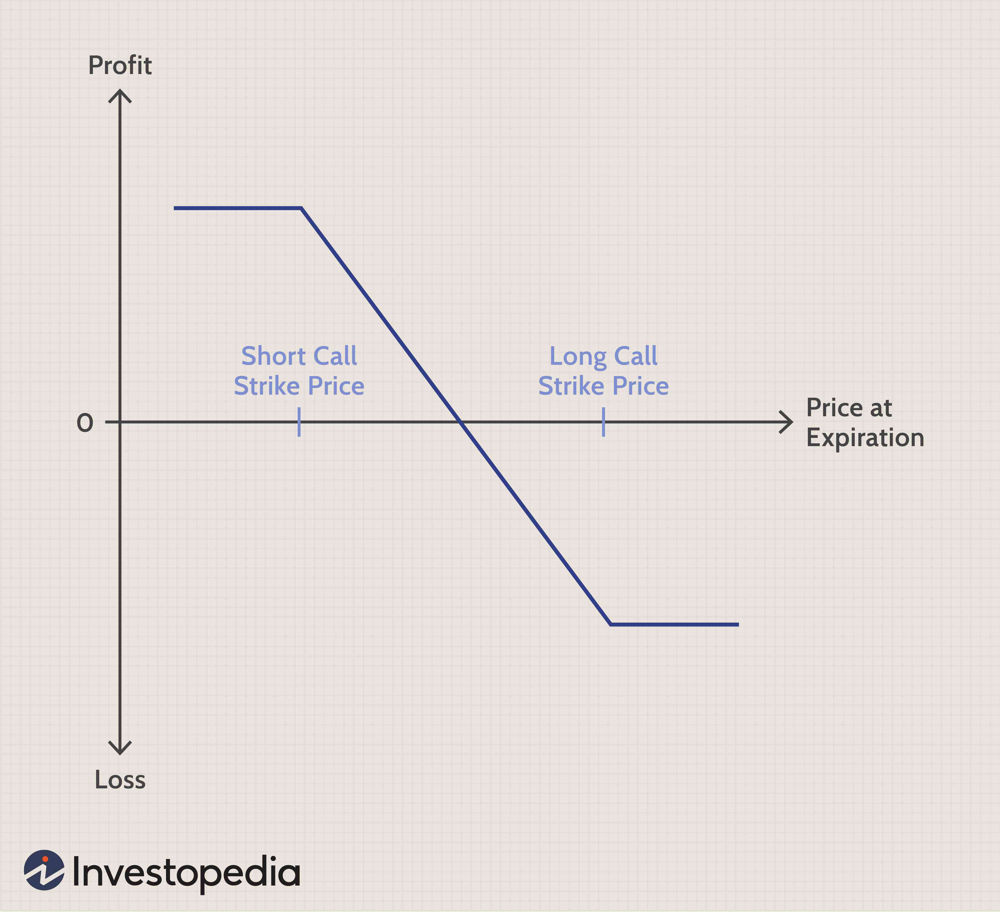

The continuous evolution of financial markets has highlighted the increasing importance of options spreads and algorithmic trading as indispensable tools for traders. Options spreads, which involve strategic combinations of buying and selling different options, enable investors to manage risk and optimize returns, offering tailored strategies that cater to varying market conditions and risk appetites. These instruments provide flexibility by allowing traders to hedge positions and potentially leverage opportunities at reduced costs compared to direct asset investments.

Alongside options spreads, algorithmic trading has transformed the trading landscape, incorporating advanced computer programs to execute trades based on predetermined criteria with speed and precision. This automation reduces the impact of human emotions on trading decisions, allowing traders to capitalize on market opportunities as they arise.



Crucial to navigating options trading and algorithmic strategies are risk metrics known as the Greeks. These metrics, including Delta, Gamma, Theta, and Vega, assess various dimensions of risk and sensitivity in options portfolios. Delta measures how much an option’s price is expected to change concerning moves in the underlying asset. Gamma provides insights into the stability of Delta as market conditions change. Theta accounts for the time decay of options, while Vega gauges sensitivity to market volatility. Understanding these metrics is vital for effective options trading, informing both strategic planning and risk management.

This article aims to examine options spreads, algorithmic trading, and risk metrics, highlighting their interconnectedness and significance in contemporary financial trading. In a rapidly changing market, mastering these components is essential for traders seeking to enhance performance and gain a competitive advantage.

## Table of Contents

## Understanding Options and Spreads

Options are financial derivatives that give traders the right, though not the obligation, to buy or sell an underlying asset at a predetermined price before a specified expiration date. This feature makes options versatile tools for both speculative strategies and hedging purposes, allowing investors to leverage their positions while managing risk more effectively.

Options serve two primary purposes:

1. **Speculation**: Traders can use options to speculate on the future direction of an asset's price. By paying a premium, they can gain a leveraged position without having to invest large amounts of capital. This leverage can magnify potential returns but also elevates the risk of significant losses if the market moves unfavorably.

2. **Hedging**: Investors use options to protect their portfolios against adverse price movements. By strategically selecting option contracts, they can effectively create a safety net that limits potential losses from volatile market conditions.

An options spread is a strategy that involves the simultaneous purchase and sale of options contracts. The principal aim of options spreads is to manage risk while potentially enhancing returns. Through strategic combinations of different options contracts, traders can design a risk-return profile suited to their market view and risk tolerance.

Common options spread strategies include:

- **Bull Call Spreads**: This strategy involves purchasing a call option with a lower strike price while selling another call option with a higher strike price. The trader benefits if the asset's price rises, but the maximum profit is capped, which makes it a conservative bullish strategy.
$$
  \text{Profit} = (\text{Spot Price at Expiration} - \text{Lower Strike Price}) - (\text{Premium Paid} - \text{Premium Received})

$$

  The maximum profit is limited to the difference between the strike prices minus the net premium paid.

- **Iron Condors**: This strategy uses four different options contracts, consisting of a call spread and a put spread. It’s designed to benefit from low volatility in the underlying asset. Traders sell an out-of-the-money call and an out-of-the-money put, and simultaneously buy a further out-of-the-money call and put to cap potential losses. The iron condor is favored for its ability to generate steady returns by capitalizing on time decay and range-bound movements.
$$
  \text{Max Profit} = \text{Premium Collected} - \text{Premium Paid}

$$

  The strategy profits if the asset price remains between the two middle strike prices, where both the call spread and the put spread would expire worthless.

Each of these strategies involves varying degrees of complexity and risk management and is chosen based on the trader's specific market outlook and risk aversion preferences. By understanding and employing these spreads correctly, traders can tailor their investment approach to better align with their financial goals.

## Risk Metrics: The Greeks

The Greeks are crucial tools for managing the risks associated with options trading. They provide insight into how different factors can affect the pricing of options, enabling traders to make informed decisions.

Delta is arguably the most well-known of the Greeks. It measures the rate of change of the option's price with respect to a small change in the price of the underlying asset. In mathematical terms, delta (Δ) can be expressed as:

$$
\Delta = \frac{\partial V}{\partial S}
$$

where $V$ is the option's price and $S$ is the asset's price. For example, a delta of 0.5 implies that for every $1 increase in the underlying asset's price, the option's price is expected to increase by $0.50.

Gamma provides additional depth by assessing the rate of change of delta with respect to the underlying asset's price. Essentially, gamma ($\Gamma$) is the second derivative of the option's price with respect to the underlying asset price:

$$
\Gamma = \frac{\partial^2 V}{\partial S^2}
$$

A high gamma value indicates that delta can change rapidly, signaling significant sensitivity to price movements in the underlying asset.

Theta offers insights into how an option’s value diminishes over time, a phenomenon known as time decay. Theta ($\Theta$) represents the sensitivity of the option's price to the passage of time and is calculated as:

$$
\Theta = \frac{\partial V}{\partial t}
$$

Negative theta signifies that the option's value decreases as the expiration date approaches, which is generally true for long positions in options.

Vega measures the sensitivity of the option’s price to [volatility](/wiki/volatility-trading-strategies) in the underlying asset. Although not directly represented by a Greek letter, vega ($\nu$) reflects the change in the option's price for a 1% change in the asset's volatility. It can be expressed as:

$$
\nu = \frac{\partial V}{\partial \sigma}
$$

where $\sigma$ is the volatility. A high vega value suggests the option is highly sensitive to changes in market conditions.

By understanding and utilizing these metrics, traders can effectively gauge and hedge the risk present in options portfolios. Collectively, the Greeks assist in crafting strategies that are responsive to market dynamics, ensuring a balanced approach to risk management.

## Algorithmic Trading in Options

Algorithmic trading leverages computer programs to automate trading processes using pre-defined strategies. It has become increasingly prominent in options trading due to its ability to process vast quantities of data and execute trades at speeds unmatched by human traders. By integrating [algorithmic trading](/wiki/algorithmic-trading) with options spreads, traders can achieve enhanced efficiency and profitability, thanks to the quick analysis and execution of complex strategies.

Algorithmic trading provides the unique ability to analyze market conditions in real time and execute trades based on sophisticated algorithms designed to [factor](/wiki/factor-investing) in numerous variables and market metrics. For instance, specific trading algorithms can be programmed to employ options spread strategies, such as bull call spreads or iron condors, whenever predetermined conditions are met, without requiring human intervention.

One of the significant advantages of using algorithmic trading in options is the reduction of emotional decision-making. Trading decisions that stem from emotional responses can often lead to suboptimal outcomes. By contrast, algorithmic trading operates purely on logic and predefined criteria, ensuring that trades are executed consistently based on the designed strategy.

Moreover, algorithmic trading allows traders to capitalize on more market opportunities, as it can respond instantaneously to favorable market conditions. This immediate execution capability is crucial in the fast-paced environment of options trading, where market conditions can change rapidly. The computer programs can sweep through different market scenarios, calculate the risk-reward balance for each potential trade and act when optimal conditions occur, thereby maximizing potential returns.

Additionally, the automation of trading strategies through algorithms can lead to significant cost savings by optimizing transaction timing and minimizing human resource requirements. Traders can refine their strategies continuously, utilizing [backtesting](/wiki/backtesting) to analyze historical data and optimize their algorithms for future trades.

In summary, algorithmic trading in options facilitates enhanced trading operations by coupling the speed and precision of computer algorithms with the advantageous strategies of options spreads. This convergence results in more effective trading, characterized by reduced emotional decisions and the swift exploitation of market inefficiencies.

## Integrating Risk Metrics into Algo Trading

Integrating risk metrics into algorithmic trading allows traders to manage portfolios with precision and respond to market dynamics effectively. The incorporation of the Greeks—Delta, Gamma, Theta, and Vega—into trading algorithms is essential for developing strategies that are not only adaptive but also robust in volatile market conditions.

Delta measures the sensitivity of an option's theoretical value to movements in the price of the underlying asset. Algorithmically, Delta can be used to estimate the expected change in an option's price with respect to a specified change in the underlying asset’s price. By coding Delta into algorithms, traders can automate adjustments in their portfolios to maintain a desired sensitivity level, which helps in dynamically balancing between hedging and profit opportunities.

Gamma, the rate of change of Delta, provides insights into how Delta will change with price fluctuations of the underlying asset. Understanding Gamma helps algorithms anticipate shifts in Delta, allowing preemptive actions to optimize returns or mitigate risks. Incorporating Gamma ensures that any adjustments made based on Delta are done with foresight, enhancing stability and prediction accuracy.

Theta, representing time decay, is crucial for strategies where the timing of trades is critical. By factoring Theta into trading algorithms, it becomes possible to estimate how much value an option might lose as expiration approaches. This allows algorithms to optimize entry and [exit](/wiki/exit-strategy) points, taking time decay into account to minimize losses and maximize time-sensitive profits.

Vega evaluates sensitivity to volatility changes, thereby guiding algorithms on how to handle unexpected market movements. By integrating Vega, algorithms can adjust their positions to either capitalize on increased volatility or defend against its adverse effects, maintaining a balanced risk-reward scenario.

In Python, incorporating these metrics could look like:

```python
class OptionGreeks:
    def __init__(self, delta, gamma, theta, vega):
        self.delta = delta
        self.gamma = gamma
        self.theta = theta
        self.vega = vega

    def adjust_portfolio(self, market_data):
        # Logic to adjust portfolio based on the Greeks
        # Example: rebalance based on Delta
        adjustments = self.delta * market_data['price_change']
        # other adjustments based on gamma, theta, vega can be added
        return adjustments
```

By embedding these risk metrics into the core structures of trading algorithms, traders ensure that their strategies are both adaptable and resilient. This fusion of quantitative analysis with algorithmic execution enables a consistent and controlled approach to trading, balancing the intrinsic risks and rewards associated with different market conditions. Hence, the integration of risk metrics promotes a calculated approach to algorithmic trading, key to achieving sustained success in fluctuating markets.

## Advantages and Challenges

Utilizing options spreads and algorithmic trading in financial markets presents several benefits, including cost efficiency and precise execution. Options spreads allow traders to implement defined risk strategies by combining two or more options positions. This approach can limit potential losses while maintaining favorable risk-reward ratios. Reduced margin requirements often accompany spread strategies, allowing increased capital efficiency. Additionally, algorithmic trading automates the execution of trades, minimizing human error and enabling rapid response to changing market conditions. Algorithms can execute trades at optimal prices by leveraging real-time data, thus improving the probability of successful outcomes.

However, challenges are inherent in the use of options spreads and algorithmic trading. Market [liquidity](/wiki/liquidity-risk-premium) can significantly affect the execution of spread strategies, particularly in instruments that are not heavily traded. A lack of liquidity might lead to significant slippage, where the execution price diverges from the expected price. This situation is exacerbated in fast-moving markets or when large orders are placed.

Model failure represents another critical challenge in algorithmic trading. Algorithms are designed based on market assumptions and historical data, which may not always predict future conditions accurately. A reliance on historical patterns can result in significant losses if market regimes shift unexpectedly. To mitigate these risks, traders and developers need to continuously refine and adapt their strategies, incorporating newly available data and adjusting to evolving market conditions. Robust backtesting and stress testing of algorithmic models are essential to understand the potential impacts of different market scenarios.

In summary, while options spreads and algorithmic trading offer substantial advantages, careful strategy development and continuous monitoring are necessary to navigate their intrinsic challenges effectively. Successful traders employ dynamic strategies and maintain vigilance to enhance trading outcomes while managing risk prudently.

## Conclusion

Options spreads, risk metrics, and algorithmic trading are pivotal in the landscape of modern trading. These tools, when understood and skillfully utilized, have the potential to significantly enhance trading performance. Options spreads allow traders to construct flexible strategies that manage risk and optimize returns by combining various option positions. These strategies can be tailored to align with specific market expectations and risk tolerance levels, providing traders with a robust framework for decision-making.

Risk metrics like the Greeks—Delta, Gamma, Theta, and Vega—offer valuable insights into how different factors affect options pricing. By analyzing these metrics, traders can understand the risks inherent in their portfolios and make informed adjustments to mitigate potential losses. Delta, for instance, helps in understanding the sensitivity of an option's price relative to the underlying asset, while Theta quantifies the impact of time decay on an option's value.

Algorithmic trading further amplifies the effectiveness of these strategies by employing computational power to execute predefined trading rules at high speed and with precision. This approach minimizes emotional biases and allows for the continuous monitoring and adjustment of strategies in response to fluctuating market conditions. The integration of risk metrics into algorithmic frameworks ensures that trading algorithms are both robust and adaptive, capable of maintaining a calculated risk-reward balance.

However, the fast-paced and dynamic nature of financial markets necessitates continuous education and the refinement of trading strategies. As technology evolves and markets become more complex, traders must remain vigilant in updating their knowledge and techniques. This ongoing process of learning and adaptation is crucial for maintaining a competitive edge and achieving long-term success in trading.

## References & Further Reading

[1]: Chance, D. M., & Brooks, R. (2015). ["An Introduction to Derivatives and Risk Management"](https://books.google.com/books/about/Introduction_to_Derivatives_and_Risk_Man.html?id=b8PgBQAAQBAJ) Cengage Learning.

[2]: Hull, J. C. (2017). ["Options, Futures, and Other Derivatives"](https://www.semanticscholar.org/paper/Options%2C-Futures%2C-and-Other-Derivatives-Hull/89bdee500c8623864fc9eb7a471546aa713acc44) Pearson Education.

[3]: Lopez de Prado, M. (2018). ["Advances in Financial Machine Learning"](https://www.amazon.com/Advances-Financial-Machine-Learning-Marcos/dp/1119482089) Wiley.

[4]: Stefanica, D. (2011). ["A Primer for the Mathematics of Financial Engineering"](https://www.amazon.com/Mathematics-Financial-Engineering-Advanced-Background/dp/0979757622) FE Press.

[5]: Taleb, N. N. (2008). ["The Black Swan: The Impact of the Highly Improbable"](https://www.jstor.org/stable/23045073) Random House Trade Paperbacks.

[6]: Wilmott, P. (2006). ["Paul Wilmott Introduces Quantitative Finance"](https://www.amazon.com/Paul-Wilmott-Introduces-Quantitative-Finance/dp/0470319585) Wiley.