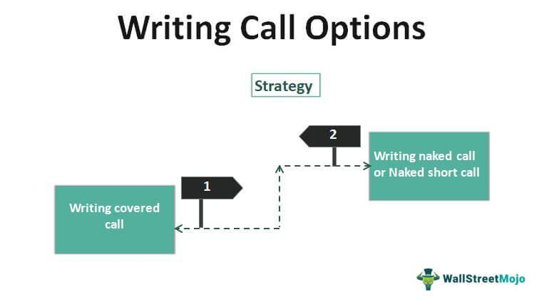

Options trading has witnessed a marked increase in popularity over recent years, reflecting a growing interest among investors and traders seeking to optimize their portfolios and capitalize on market movements. Options, which are contracts providing the right but not the obligation to buy or sell an asset at a specified price before a certain date, come principally in two forms: call options and put options. Call options allow traders to buy an asset at a predetermined price, while put options enable the sale of an asset under similar conditions. These instruments offer strategic advantages such as leverage, risk management, and portfolio diversification.

The integration of options trading with algorithmic trading represents a significant evolution in financial markets. Algorithmic trading, which employs computer algorithms to execute trades according to pre-defined criteria, enhances traditional trading strategies by providing speed, precision, and the capacity to process large data sets without the encumbrance of emotional bias. This synergy is gaining momentum as traders and institutional investors recognize the potential of algorithmic systems to optimize entry and exit points, manage complex options strategies, and automate backtesting for improved risk-reward outcomes.



This article will explore the applications and benefits of combining options trading with algorithmic trading, including efficiency enhancements in trade execution and strategic management, reduced emotional trading, and improved consistency in outcomes. Readers should expect to gain insights into how the integration of these strategies can lead to more informed decision-making and greater opportunities within the market. Through understanding this synergy, traders can better navigate the evolving landscape of financial markets and leverage technological advances for potentially more profitable outcomes.

## Table of Contents

## Understanding Options: Call and Put Options

Options are financial derivatives that provide traders with the right, but not the obligation, to buy or sell an underlying asset at a predetermined price, known as the strike price, within a specified period. They are versatile instruments in the financial markets, offering strategic advantages like leverage and risk management.

### Call Options

A call option grants the holder the right to purchase an underlying asset at a specified strike price before the option's expiration date. Call options are typically used when a trader anticipates that the price of the underlying asset will increase. The key advantage of call options is that they enable traders to leverage their positions, potentially controlling a larger amount of asset with a relatively smaller investment compared to purchasing the asset outright.

For example, consider a trader who expects the stock of Company XYZ to rise over the next three months. Instead of buying the stock, the trader purchases a call option with a strike price of $50, allowing the purchase of the stock at that price before the option expires. If the stock price rises to $60, the trader can exercise the option, buying the stock at $50 and selling it at $60, thus realizing a profit.

### Put Options

Conversely, a put option gives the holder the right to sell the underlying asset at a predetermined strike price until the expiration date. Put options are advantageous when a trader expects the price of the underlying asset to fall. They enable traders to hedge against potential losses in their portfolio by securing a selling price in advance.

For instance, if a trader owns shares of Company ABC and fears that the stock price might drop, they might purchase put options with a strike price of $100. If the stock falls to $80, the trader can exercise the option, selling the stock at the higher strike price of $100, thereby minimizing their loss.

### Strategic Advantages

Options trading offers several strategic advantages:

- **Leverage**: Options allow traders to control larger positions with a smaller initial investment, amplifying potential returns.

- **Risk Management**: Options can be used to hedge against price movements, protecting portfolio value in volatile markets.

- **Flexibility**: The wide range of strike prices and expiration dates available provides traders with numerous strategic opportunities to tailor their positions.

### Buying vs. Writing Options

There is a fundamental distinction between buying and writing options. 

- **Buying Options**: When a trader buys an option, they acquire the right to exercise the option. Their maximum loss is limited to the premium paid for the option.

- **Writing Options**: When a trader writes an option, they take on the obligation to fulfill the contract if exercised by the buyer. This strategy involves higher risk, as potential losses can be significant, especially if the market moves unfavorably.

### Real-World Examples

Options are used in various real-world scenarios, such as:

- **Portfolio Hedging**: Investors use put options to protect against potential stock market downturns, ensuring they can sell their stocks at a predetermined price despite market declines.

- **Income Generation**: Traders write call options on stocks they own to earn premium income, betting that the stock price will remain flat or decline.

- **Speculation**: A trader believes a stock is undervalued and purchases call options anticipating the price will increase, allowing them to leverage the expected rise for a higher return.

Options are powerful tools in the financial markets, offering versatility and strategic benefits when utilized effectively. Understanding their fundamental mechanics is essential for leveraging their potential to enhance trading strategies.

## What is Algorithmic Trading?

Algorithmic trading, often referred to as "algo trading," refers to the use of computer algorithms to automate trading strategies. These algorithms are programmed to follow a set of predefined conditions and criteria for executing trades, aiming to maximize speed and efficiency while minimizing manual intervention.

The evolution of [algorithmic trading](/wiki/algorithmic-trading) has been shaped significantly by advancements in technology and the increasing complexity of financial markets. Initially, algorithms were designed to manage simple, high-frequency trades, but over time, they have evolved to execute intricate strategies by analyzing large datasets and capitalizing on market opportunities that are often undetectable to human traders.

Algorithmic trading operates by employing mathematical models and statistical analyses to determine the most opportune moments to buy or sell financial instruments. These pre-defined criteria can be based on various factors, such as price movements, timing, [volume](/wiki/volume-trading-strategy), and other market conditions. When these criteria are met, the algorithm automatically executes the trade at the optimal time, as specified by its programming.

The benefits of algorithmic trading are multi-faceted. One of the key advantages is speed; algorithms can execute trades in a fraction of a second, much faster than any human can react. This speed advantage allows traders to take advantage of market conditions instantly. Precision is another significant benefit, as algorithms can execute trades with high accuracy, minimizing errors that may arise from manual trading. Moreover, algorithmic trading helps eliminate emotional biases that often affect human decision-making, promoting a more disciplined and systematic approach to trading.

Algorithms also play a crucial role in analyzing large datasets. They can process complex and substantial amounts of data swiftly, identifying patterns and trends that can inform strategies for executing trades. This capability is particularly valuable in a market environment where data volume is tremendous and constantly growing. By leveraging sophisticated algorithms, traders can execute trades based on complex strategies that consider multiple variables and interdependencies.

The successful implementation of algorithmic trading requires a robust technological infrastructure. This includes high-speed internet connections, advanced computing systems, and access to comprehensive market data feeds. Additionally, there is a need for specialized software platforms that can not only facilitate the development and deployment of trading algorithms but also ensure their efficient execution and monitoring. Furthermore, expertise in programming languages, such as Python, is often necessary to write and optimize the algorithms that drive trading decisions.

In summary, algorithmic trading is a technological advancement that has transformed trading practices within financial markets. Its capacity to process data rapidly and execute trades with precision has made it indispensable for contemporary trading strategies, highlighting the importance of both technological and analytical prowess in modern finance.

## Synergies: Options Trading Meets Algorithmic Trading

Integrating options with algorithmic trading significantly enhances trading efficiency and decision-making capabilities. Algorithms, employing vast computational power and sophisticated mathematical models, can process large amounts of market data to identify optimal entry and [exit](/wiki/exit-strategy) points for options trading. This optimization ensures that traders can capitalize on favorable market conditions with minimal delay, thereby maximizing potential returns.

For complex strategies such as straddles and condors, which involve multiple options positions to exploit [volatility](/wiki/volatility-trading-strategies) or achieve profit within defined price ranges, algorithmic support is invaluable. Algorithms can swiftly analyze market volatility, price movements, and other indicators to manage these strategies effectively. For instance, in a straddle strategy where a trader buys a call and a put option with the same strike price and expiration date, an algorithm can continuously monitor volatility conditions. If volatility increases, the algorithm might suggest maintaining the position; if it decreases, the algorithm might decide to close the position entirely or adjust the strike prices.

Backtesting is another crucial area where algorithms play a vital role. Through [backtesting](/wiki/backtesting), algorithms simulate option strategies against historical market data to determine their potential effectiveness. This process allows traders to fine-tune their strategies for better risk-reward outcomes by identifying patterns and potential pitfalls that may not be immediately apparent through manual analysis. By adjusting parameters based on backtest results, traders can optimize their strategies to adapt to different market conditions, enhancing their potential for success.

For traders, the integration of algorithms in options trading reduces the emotional component often associated with manual trading. Emotions such as fear and greed can lead to inconsistent decision-making and suboptimal outcomes. Algorithms, devoid of human emotions, adhere strictly to pre-defined rules, ensuring consistent and objective execution of trades. This consistency often leads to reduced errors and improved reliability in executing trading strategies, providing more consistent results over time.

Conclusively, the synergy between options trading and algorithmic systems offers a robust framework for traders to navigate complex financial markets with increased precision and confidence. As trading technology continues to evolve, these integrated approaches promise greater opportunities for consistent and profitable trading outcomes.

## Algorithmic Strategies in Options Trading

Algorithmic strategies have revolutionized options trading by introducing systematic approaches that enhance decision-making processes and optimize trading outcomes. Among the most popular strategies employed are [trend following](/wiki/trend-following), mean reversion, and [arbitrage](/wiki/arbitrage). Each of these approaches leverages the computational power of algorithms to analyze and execute trades with precision.

**Trend Following**

Trend following strategies focus on capturing gains through the sustained movement of asset prices. Algorithms identify significant price movements and initiate buy or sell orders based on predefined trends. In options trading, a trend-following algorithm might track the underlying asset's price and use indicators such as moving averages to trigger the purchase of call options in an uptrend or put options in a downtrend. This strategy benefits from the speed and objectivity of algorithms, which can adjust to new trends faster than manual trading.

**Mean Reversion**

Mean reversion strategies assume that asset prices will revert to their historical mean over time. Algorithmic systems detect deviations from this average and execute trades predicting a return to the mean. In options trading, this could involve selling call options when an asset's price is significantly above the average and using the proceeds to buy at a lower price later. The precise timing provided by algorithms can increase the profitability of mean reversion strategies by enhancing entry and exit accuracy.

**Arbitrage**

Arbitrage opportunities occur when there are price discrepancies between markets or related assets. Algorithmic trading is particularly effective in spotting and exploiting these inefficiencies due to its ability to process vast amounts of data rapidly. An example would be using algorithms to simultaneously buy and sell options and the underlying asset across different exchanges to lock in a risk-free profit. The high-frequency nature of algorithmic trading is essential in arbitrage, where opportunities may exist for only fractions of a second.

**Enhancing Strategies Like Market Making and Volatility Trading**

Algorithms also play a pivotal role in enhancing market-making and volatility trading strategies. Market makers provide [liquidity](/wiki/liquidity-risk-premium) by continuously quoting buy and sell prices, and algorithms optimize this process by dynamically adjusting quotes based on market conditions. In volatility trading, strategies such as straddles or strangles benefit from algorithms' capability to monitor implied volatility levels and execute trades that profit from predicted volatility changes.

**Time-Weighted Average Price (TWAP)**

TWAP is a strategy that involves executing trades that aim to achieve the average price of an asset over a specific time period. This approach minimizes market impact and is particularly useful for large transactions in options. For instance, if a trader needs to acquire a significant number of options contracts, using a TWAP algorithm can prevent drastic price movements by spreading the trades evenly over time, thus achieving a more favorable average price.

```python
def calculate_twap(prices, intervals):
    return sum(prices[i] * intervals[i] for i in range(len(prices))) / sum(intervals)

prices = [100, 102, 101, 98, 105]
intervals = [1, 1, 1, 1, 1]  # Assuming uniform intervals
twap = calculate_twap(prices, intervals)
print(f"TWAP: {twap}")
```

**Adaptation and Optimization**

Traders can adapt and optimize these algorithmic strategies to align with their specific trading goals. By adjusting parameters such as trend thresholds, reversion triggers, or execution timing, traders tailor strategies to their risk tolerance and market outlook. Moreover, continuous backtesting and performance evaluation are vital in refining these strategies, ensuring they remain effective under changing market conditions.

Incorporating algorithmic strategies into options trading provides a significant edge by combining sophisticated analytics with the ability to execute trades at lightning speed. This synergy not only enhances traditional trading approaches but also opens new avenues for profit in the dynamic world of financial markets.

## Benefits and Risks of Algorithmic Options Trading

Algorithmic options trading offers several advantages, making it a powerful tool in modern financial markets. One of the most significant benefits is speed. Algorithms can execute trades in milliseconds, far quicker than human traders, allowing for the rapid capitalizing on fleeting market opportunities. This speed is complemented by precision, as algorithms execute trades based on pre-set rules, thereby reducing human error and ensuring consistency in strategy implementation.

Furthermore, algorithmic trading can enhance market opportunities. Algorithms can monitor multiple markets and instruments simultaneously, identifying opportunities that may not be apparent to the human eye. This ability allows traders to exploit arbitrage opportunities, manage large volumes, and react promptly to market movements, often benefiting from tighter spreads and lower transaction costs.

Despite these advantages, algorithmic trading is not without risks. Technical glitches pose a significant threat, as evidenced by historical market events where faulty algorithms led to significant financial losses. Market anomalies, such as sudden volatility spikes, can also have adverse effects on automated trading systems if they are not programmed to handle such situations.

Robust risk management and continuous monitoring are therefore critical. Algorithms must be rigorously tested, or backtested, against historical data to ensure they perform as expected under various market conditions. This process involves simulating trades using historical data to validate strategies and refine them for better performance. 

Moreover, regulatory compliance is a significant consideration in algorithmic trading. Given the increased scrutiny and regulatory oversight in financial markets, compliance with regulations such as the Markets in Financial Instruments Directive (MiFID II) in Europe, and guidelines set by the U.S. Securities and Exchange Commission (SEC), is paramount. These regulations often entail strict requirements for market transparency, transaction reporting, and the implementation of robust risk controls.

For traders to navigate the risks associated with algorithmic options trading effectively, meticulous planning and strategy evaluation are essential. This includes conducting thorough due diligence on the algorithms employed, incorporating safeguards against potential system failures, and continuously updating strategies to adapt to evolving market conditions. Risk mitigation also involves setting parameters for time-weighted average price (TWAP) execution and incorporating volatility measures that align with individual risk tolerance levels. By doing so, traders can enhance their ability to achieve sustainable and profitable trading outcomes.

## Conclusion

The integration of options and algorithmic trading has revolutionized trading strategies by enhancing efficiency and precision. This synergy enables traders to harness sophisticated algorithms to analyze vast datasets swiftly, providing insights for identifying optimal entry and exit points in options markets. Consequently, this can lead to more consistent and potentially profitable trading outcomes. 

Furthermore, it is crucial for traders to possess a comprehensive understanding of both options trading and algorithmic processes. This knowledge empowers them to fully leverage the combination, optimizing strategies to suit varying market conditions. As financial technology continues to evolve, we can anticipate even more innovative tools and methods emerging, offering expansive possibilities for traders willing to adapt and learn.

For those interested in delving deeper into the intricacies of algorithmic options trading, numerous resources, including academic publications and online courses, are available. These materials can provide valuable insights and guidance, helping traders navigate this rapidly advancing field and capitalize on its potential benefits.

## References & Further Reading

[1]: Taleb, N. N. (1997). ["Dynamic Hedging: Managing Vanilla and Exotic Options."](https://www.amazon.com/Dynamic-Hedging-Managing-Vanilla-Options/dp/0471152803) John Wiley & Sons.

[2]: Hull, J. C. (2018). ["Options, Futures, and Other Derivatives."](https://www.semanticscholar.org/paper/Options%2C-Futures%2C-and-Other-Derivatives-Hull/89bdee500c8623864fc9eb7a471546aa713acc44) Pearson Education.

[3]: Kissell, R. (2013). ["The Science of Algorithmic Trading and Portfolio Management."](https://www.sciencedirect.com/book/9780124016897/the-science-of-algorithmic-trading-and-portfolio-management) Academic Press.

[4]: Glasserman, P. (2003). ["Monte Carlo Methods in Financial Engineering."](https://link.springer.com/book/10.1007/978-0-387-21617-1) Springer.

[5]: Chan, E. (2009). ["Quantitative Trading: How to Build Your Own Algorithmic Trading Business."](https://github.com/ftvision/quant_trading_echan_book) John Wiley & Sons.

[6]: Das, S. R. (2003). ["Computational Models for Options Pricing."](https://srdas.github.io/Papers/BlackScholesNN.pdf) Springer.

[7]: Engel, A., & Last, C. (2018). ["Algorithmic Trading Demystified."](https://onlinelibrary.wiley.com/doi/full/10.1111/1745-9133.12358) Springer.

