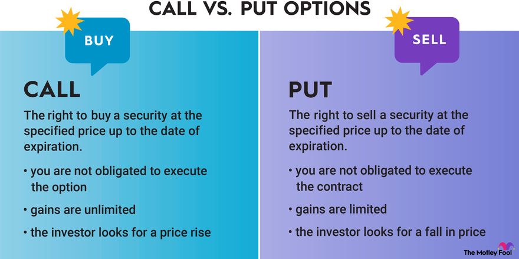

## Table of Contents

## What is options writing?

Options writing, also known as options selling, is when someone creates and sells an options contract. This contract gives the buyer the right, but not the obligation, to buy or sell an asset at a set price before a certain date. The person who writes the option gets money upfront, called a premium, from the buyer. This can be a way to make money, but it also comes with risks because the writer has to fulfill the contract if the buyer decides to use it.

The main risk for the person writing the option is that they might lose money if the market moves against them. For example, if they write a call option and the price of the asset goes up a lot, they have to sell the asset at the lower price agreed in the contract. This can lead to big losses. Because of these risks, options writing is often seen as more advanced and is usually done by experienced investors who understand the market well.

## What is the difference between a put option and a call option?

A call option gives the buyer the right to buy an asset at a set price before a certain date. When you buy a call option, you're hoping that the price of the asset will go up. If it does, you can buy the asset at the lower price you agreed on and then sell it at the higher market price to make a profit. The person who writes or sells the call option gets money upfront, but they have to sell the asset at the agreed price if the buyer decides to use the option, which can be risky if the price goes up a lot.

A put option, on the other hand, gives the buyer the right to sell an asset at a set price before a certain date. When you buy a put option, you're hoping that the price of the asset will go down. If it does, you can buy the asset at the lower market price and then sell it at the higher price you agreed on in the option contract, making a profit. The person who writes or sells the put option gets money upfront, but they have to buy the asset at the agreed price if the buyer decides to use the option, which can be risky if the price goes down a lot.

## How does writing a put option work, and what are the risks involved?

When you write a put option, you agree to buy a certain asset at a set price if the person who buys the option decides to use it before it expires. You get money upfront for writing the option, which is called the premium. This can be a way to make money, but it also comes with risks. If the price of the asset goes down a lot, the buyer might use the option to sell you the asset at the higher price they agreed on. This means you have to buy the asset at a price that's higher than what it's worth in the market, which can lead to a loss.

The main risk when writing a put option is that you might lose money if the price of the asset drops below the price you agreed to buy it at. This can happen if there's bad news about the asset or if the market goes down. The potential loss can be big because there's no limit to how low the price of the asset can go. Because of these risks, writing put options is often seen as an advanced strategy and is usually done by experienced investors who understand the market well and can handle the potential losses.

## How does writing a call option work, and what are the risks involved?

When you write a call option, you agree to sell a certain asset at a set price if the person who buys the option decides to use it before it expires. You get money upfront for writing the option, called the premium. This can be a way to make money, but it also comes with risks. If the price of the asset goes up a lot, the buyer might use the option to buy the asset from you at the lower price they agreed on. This means you have to sell the asset at a price that's lower than what it's worth in the market, which can lead to a loss.

The main risk when writing a call option is that you might lose money if the price of the asset rises above the price you agreed to sell it at. This can happen if there's good news about the asset or if the market goes up. The potential loss can be big because there's no limit to how high the price of the asset can go. Because of these risks, writing call options is often seen as an advanced strategy and is usually done by experienced investors who understand the market well and can handle the potential losses.

## What are the potential benefits of writing options?

Writing options can be a way to make money. When you write an option, you get money upfront from the person who buys it. This money is called the premium. If the option expires without being used, you get to keep the premium as profit. This can be a good way to earn money if you think the price of the asset won't move much or will move in a way that the option won't be used.

Another benefit of writing options is that it can be a way to generate income from assets you already own. For example, if you own a stock, you can write a call option on it. This can give you extra money from the premium while you still own the stock. If the stock price doesn't go above the price you set in the option, you keep the stock and the premium. This can be a good way to make your investments work harder for you.

## What are the key factors to consider before writing options?

Before you start writing options, it's important to think about your risk tolerance. Writing options can be risky because you might have to buy or sell an asset at a price that's not good for you if the market moves the wrong way. You need to be okay with the chance of losing money and know how much you can afford to lose. It's also a good idea to have a plan for what you'll do if the market goes against you, like having enough money to cover your losses.

Another thing to consider is your understanding of the market and the asset you're writing options on. You should know a lot about how the asset usually moves and what might make its price go up or down. It's also important to keep up with news and events that could affect the asset. Writing options is often seen as an advanced strategy, so make sure you know what you're doing before you start.

## How can an investor determine the appropriate strike price for writing options?

When an investor wants to write options, choosing the right strike price is important. The strike price is the price at which the buyer of the option can buy or sell the asset. To pick a good strike price, the investor should think about where they think the price of the asset will be when the option expires. If they think the price will stay the same or go down a little, they might choose a strike price that's close to the current price for a call option. For a put option, they might choose a strike price that's a bit higher than the current price if they think the price will stay the same or go up a little.

Another thing to consider is how much risk the investor is willing to take. A strike price that's far away from the current price might give a bigger premium, but it also means a bigger risk if the market moves a lot. For example, if an investor writes a call option with a high strike price, they get more money upfront, but they could lose a lot if the price of the asset goes way up. On the other hand, a strike price that's close to the current price might give a smaller premium, but it's less risky. The investor needs to balance the potential reward with the risk they're willing to take.

## What are covered and naked options, and how do they differ in terms of risk?

Covered options and naked options are two ways to write options, and they have different levels of risk. A covered option means you already own the asset you're writing the option on. For example, if you own a stock and you write a call option on it, that's a covered call. The risk is lower because if the buyer uses the option, you can just give them the stock you already own. You might miss out on some profit if the stock price goes up a lot, but you won't lose more than the value of the stock.

A naked option, on the other hand, is when you write an option without owning the asset. This is much riskier. If you write a naked call option and the price of the asset goes up a lot, you have to buy the asset at the higher market price and sell it at the lower price you agreed on in the option. This can lead to big losses because there's no limit to how high the price can go. The same goes for a naked put option; if the price goes down a lot, you have to buy the asset at a higher price than it's worth. Because of these risks, writing naked options is seen as a more advanced and risky strategy.

## How do expiration dates affect the strategy of writing options?

Expiration dates are a big deal when you're writing options. They tell you how long the buyer has to use the option. If you're writing an option, you need to think about how long you want to be on the hook for. A short expiration date means less time for the price of the asset to move a lot, so it's less risky. But it also means you might get less money upfront because the buyer has less time to use the option. A long expiration date gives the buyer more time, so you might get more money upfront, but it's riskier because there's more time for the price to move against you.

When [picking](/wiki/asset-class-picking) an expiration date, you should think about what you expect the price of the asset to do. If you think the price won't move much for a while, a longer expiration date might be good because you can get more money upfront. But if you think the price might move a lot soon, a shorter expiration date could be better because it's less risky. The expiration date is one of the things that affects how much money you get for writing the option, so it's important to pick one that fits your plan and how much risk you're okay with.

## What are some advanced strategies for writing put and call options?

One advanced strategy for writing options is the covered call strategy. This is when you own a stock and write a call option on it. The idea is to make extra money from the premium while still owning the stock. If the stock price stays below the strike price, the option expires worthless, and you keep the premium and the stock. But if the stock price goes above the strike price, the buyer might use the option, and you have to sell the stock at the strike price. This means you might miss out on some profit if the stock keeps going up, but you still get to keep the premium. This strategy is good if you think the stock price will stay the same or go up a little but not too much.

Another advanced strategy is the cash-secured put. This is when you write a put option and have enough cash to buy the stock if the buyer uses the option. You get money upfront from the premium, and if the stock price stays above the strike price, the option expires worthless, and you keep the premium. But if the stock price goes below the strike price, the buyer might use the option, and you have to buy the stock at the higher strike price. This can be a good way to buy a stock you like at a lower price, but it's risky because you might end up buying the stock at a price that's higher than what it's worth. This strategy is good if you want to own the stock but think the price might go down a little before going back up.

A third strategy is the iron condor, which is more complex and involves writing both a call and a put option at the same time. You write a call option with a high strike price and a put option with a low strike price, and you also buy a call option with an even higher strike price and a put option with an even lower strike price. The idea is to make money from the premiums if the stock price stays between the two middle strike prices. This strategy can be good if you think the stock price won't move much, but it's risky because you can lose money if the stock price moves a lot in either direction.

## How can options writing be used as part of a broader investment strategy?

Writing options can be a useful part of a bigger investment plan. It can help you make extra money from the assets you already own. For example, if you own a stock, you can write a call option on it and get money upfront from the premium. This can be a good way to earn more from your investments without selling them. You can also use options writing to buy stocks you like at a lower price. By writing a put option and having enough cash to buy the stock if the buyer uses the option, you can get the stock at a price you're happy with, plus the premium you got upfront.

But options writing can also be risky, so it's important to use it carefully as part of your overall plan. You need to think about how much risk you're okay with and have a plan for what to do if things don't go your way. For example, if you write a call option and the stock price goes up a lot, you might have to sell the stock at a lower price than it's worth. Or if you write a put option and the stock price goes down a lot, you might have to buy the stock at a higher price than it's worth. By understanding these risks and using options writing in a smart way, you can make your investment strategy stronger and more flexible.

## What are the tax implications of writing options, and how should they be managed?

When you write options, you need to think about taxes. The money you get from writing options, called the premium, is usually seen as regular income by the tax people. That means you have to pay taxes on it at your normal income tax rate. If you write a call option and the buyer uses it, any profit or loss you make from selling the stock at the strike price can also affect your taxes. If you write a put option and the buyer uses it, and you end up buying the stock, any profit or loss from that can also change your taxes.

It's a good idea to keep good records of all your options writing to make tax time easier. You might want to talk to a tax expert who knows about options to make sure you're doing everything right. They can help you figure out how to report your income and any profits or losses in a way that could save you money on taxes. Keeping on top of the tax rules can help you make smarter choices about writing options and manage your money better.

## References & Further Reading

[1]: Taleb, N. N. (1997). ["Dynamic Hedging: Managing Vanilla and Exotic Options."](https://www.amazon.com/Dynamic-Hedging-Managing-Vanilla-Options/dp/0471152803) John Wiley & Sons.

[2]: Hull, J. C. (2018). ["Options, Futures, and Other Derivatives."](https://www.semanticscholar.org/paper/Options%2C-Futures%2C-and-Other-Derivatives-Hull/89bdee500c8623864fc9eb7a471546aa713acc44) Pearson Education.

[3]: Kissell, R. (2013). ["The Science of Algorithmic Trading and Portfolio Management."](https://www.sciencedirect.com/book/9780124016897/the-science-of-algorithmic-trading-and-portfolio-management) Academic Press.

[4]: Glasserman, P. (2003). ["Monte Carlo Methods in Financial Engineering."](https://link.springer.com/book/10.1007/978-0-387-21617-1) Springer.

[5]: Chan, E. (2009). ["Quantitative Trading: How to Build Your Own Algorithmic Trading Business."](https://github.com/ftvision/quant_trading_echan_book) John Wiley & Sons.

[6]: Das, S. R. (2003). ["Computational Models for Options Pricing."](https://srdas.github.io/Papers/BlackScholesNN.pdf) Springer.

[7]: Engel, A., & Last, C. (2018). ["Algorithmic Trading Demystified."](https://onlinelibrary.wiley.com/doi/full/10.1111/1745-9133.12358) Springer.

