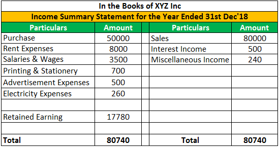

Algorithmic trading has revolutionized the way financial markets operate, offering a highly automated and efficient trading mechanism. This transformation has enabled traders to execute orders at speeds and frequencies that are impractical for manual trading. The use of algorithms allows for the rapid analysis of market conditions, instant execution of trading strategies, and effective risk management, making financial operations significantly more precise and less susceptible to human error.

Optiver, a renowned global market maker, stands at the forefront of algorithmic trading. Leveraging cutting-edge technology, Optiver utilizes specialized knowledge to improve liquidity and market structures. The firm integrates sophisticated algorithms into its trading processes, promoting transparency and efficiency across various asset classes. By providing liquidity, Optiver plays a crucial role in stabilizing markets and ensuring competitive pricing.

With over 950 employees across major financial hubs in Amsterdam, Chicago, and Sydney, Optiver represents a pinnacle in the field of proprietary trading. These major centers, each located in key financial regions, allow the company to efficiently manage and execute trading operations around the clock. The strategic placement of these offices helps Optiver maintain a competitive edge in time zone arbitrage and diversified market participation.

This article explores how Optiver has integrated algorithmic trading into its core operations and the impact it has had on modern finance trading. Since its inception, the company has continually adapted and evolved its trading strategies to maintain a leadership position. This evolution is characterized by a commitment to robust technological frameworks and an advanced understanding of market mechanics.

The historical context, operational methodologies, and significant contributions of Optiver's algorithmic trading strategies underscore its influence on the broader financial ecosystem. The firm's ability to harmonize innovation and regulation is quintessential in an industry where technological advancement often challenges existing market frameworks. The ensuing sections will outline Optiver's journey and its pivotal role in setting a benchmark for algorithmic trading practices globally.

## Table of Contents

## A Brief History of Optiver

Optiver was founded in 1986 by Johann Kaemingk, initially establishing itself as a market maker in equity options on the European Options Exchange in Amsterdam. In its early years, Optiver focused on options trading, which is reflected in its name, a combination of the Dutch words 'optie' (option) and 'verhandelaar' (trader). This initial focus laid the foundation for the firm's strategic approach to trading.

Over the decades, Optiver expanded its operations across the globe, covering major financial exchanges in Europe, the Americas, and the Asia Pacific. This geographical diversification played a critical role in Optiver's growth, allowing it to establish a presence in key financial markets and respond to varied market demands.

Optiver's transition into a global leader in high-frequency and [algorithmic trading](/wiki/algorithmic-trading) was marked by strategic growth and substantial investments in technology. By adopting cutting-edge trading technologies and methodologies, Optiver enhanced its trading capabilities and execution speed. These advancements enabled the firm to maintain and deepen its market maker role, providing [liquidity](/wiki/liquidity-risk-premium) and contributing to the efficiency of the financial markets it participates in.

The success of Optiver's growth strategy can be attributed to its continuous pursuit of technological innovation and talent acquisition, enabling the firm to evolve alongside the fast-paced changes within the financial industry.

## Optiver's Algorithmic Trading Strategies

Optiver utilizes sophisticated algorithmic trading systems to maintain liquidity and facilitate rapid trading across a diverse range of financial products. At the core of these operations are advanced algorithms, calibrated for optimal performance in dynamic markets. These systems are integral to Optiver's activities involving equity options, derivatives, government bonds, commodities, and currencies. This broad scope of operation necessitates the development of unique algorithms tailored to specific asset classes, ensuring precision in execution and risk management.

The firm's high-frequency trading ([HFT](/wiki/high-frequency-trading-strategies)) capabilities are a testament to its dedication to speed, efficiency, and market adaptation—traits essential in today's competitive trading landscapes. High-frequency trading allows Optiver to execute orders in fractions of a second, capitalizing on short-lived market opportunities. This is especially critical in an era where trading velocity can determine profitability. The deployment of high-speed data transmission networks and co-location services with exchanges is pivotal in reducing latency, thereby refining trading efficiency.

A hallmark of Optiver's trading strategy is its market-neutral approach. This method focuses on minimizing exposure to market movements while optimizing trade execution. The strategy is designed to generate returns independently of overall market trends, ensuring robustness across various market conditions. By striving for market neutrality, Optiver mitigates systematic risk and emphasizes [arbitrage](/wiki/arbitrage) opportunities between correlated assets or temporal price discrepancies.

To achieve market neutrality, Optiver employs complex mathematical models and statistical analysis. These techniques enable the firm to identify patterns and potential inefficiencies, which can be exploited through algorithmic trading. Moreover, the incorporation of [machine learning](/wiki/machine-learning) and data analytics ensures that trading algorithms evolve, adapting to new market conditions and maintaining a competitive edge.

In summary, Optiver's algorithmic trading strategies reflect a blend of technological innovation and strategic prowess. By integrating speed, adaptability, and market neutrality into its operations, Optiver not only enhances its liquidity provision but also sets a benchmark for efficiency and precision in the financial industry.

## Optiver's Global Market Impact

Optiver's significant presence on more than 50 major exchanges across the United States, Europe, and Asia highlights its influential role in the global financial landscape. The company's capacity to provide liquidity and competitive pricing is integral to enhancing market efficiency and stability. By acting as a market maker, Optiver ensures that buyers and sellers can transact with minimal delays and at fair prices, contributing to smoother market operations and reduced [volatility](/wiki/volatility-trading-strategies).

Optiver's strategic expansion into regional markets, exemplified by its office in Shanghai, underscores its adaptability to diverse regulatory environments and market demands. This move showcases the firm's commitment to understanding and navigating the complexities of different financial systems, which is particularly important in regions with unique regulatory requirements. By establishing a foothold in such markets, Optiver positions itself to cater to local clients effectively while also benefiting from new business opportunities and market insights.

Moreover, Optiver's adept use of algorithmic trading for risk management, pricing, and trading efficiency sets a high benchmark in the financial industry. The firm leverages advanced algorithms to optimize trade execution and manage risk exposure, thereby enhancing its competitiveness in the trading sector. These algorithmic systems enable Optiver to conduct high-frequency trades that capitalize on market inefficiencies, thereby providing liquidity and facilitating smoother market dynamics.

As financial markets evolve, Optiver's investment in technology and commitment to innovation will continue to define its market impact. Through the development and implementation of sophisticated trading strategies, Optiver demonstrates how algorithmic trading can be harnessed to achieve superior risk management and trading outcomes, solidifying its position as a leader in the financial industry.

## Regulatory Challenges and Achievements

Optiver, like many trading firms, has navigated a complex regulatory landscape, which is critical for ensuring fair and transparent market practices. One significant regulatory challenge came in 2008 when the U.S. Commodity Futures Trading Commission (CFTC) charged Optiver with market manipulation. The allegations centered around the firm's trading strategies in the [crude oil](/wiki/crude-oil), heating oil, and gasoline markets. The CFTC claimed that Optiver used a technique known as "banging the close," where orders were placed during a short period to influence settlement prices.

Despite the severity of these charges, Optiver has worked diligently to address regulatory concerns and enhance its compliance frameworks. This has involved implementing rigorous internal controls and promoting transparent trading practices. The firm has committed to ethical trading by fostering a culture of integrity and responsibility among its traders, thereby building trust with the financial regulators worldwide.

Optiver's ability to resolve past litigations and maintain robust regulatory relationships is indicative of its adaptability and commitment to compliance. In doing so, the firm has reinforced its standing as a reliable and trustworthy player in global markets. Optiver’s proactive approach to compliance ensures that its trading activities are consistently aligned with evolving regulatory standards.

This journey highlights the ongoing dynamic tension between innovation in algorithmic trading and ever-changing regulations. As algorithmic trading continues to develop, firms like Optiver must stay ahead of regulatory requirements to ensure that their technological advancements do not compromise market integrity. This balance between innovation and regulation is crucial for the sustained success of firms in the competitive trading industry.

## The Future of Algorithmic Trading at Optiver

Optiver stands poised to continue its leadership in algorithmic trading through sustained investment in technology and talent. The firm's ongoing commitment to research and development underscores its determination to harness cutting-edge technology in advancing trading algorithms and enhancing data analysis capabilities. By leveraging machine learning and [artificial intelligence](/wiki/ai-artificial-intelligence), Optiver is set to refine its trading models, improving both speed and market prediction accuracy.

Strategic partnerships form a cornerstone of Optiver's future strategy, driving innovation and creating synergies with other leaders and innovators in the financial industry. These collaborations open avenues for shared knowledge and resources, crucial for developing the next generation of trading technologies in response to the fast-evolving financial markets.

Optiver's adaptability and forward-thinking approach are pivotal as financial markets experience rapid transformations. The firm's agile framework allows it to swiftly respond to market changes and regulatory shifts, ensuring its trading strategies remain robust and compliant. The increasing complexity of global markets necessitates a predictive and adaptable trading strategy, areas where Optiver excels.

Central to Optiver's vision is a commitment to education and industry collaboration. The company's involvement in events such as the Algorithmic Trading Workshop with the National University of Singapore (NUS) exemplifies its role in nurturing future trading talent. By actively participating in educational initiatives, Optiver invests in human capital, ensuring a continuous influx of ideas and skills crucial for maintaining its position at the forefront of algorithmic trading. Furthermore, collaborating with academia provides Optiver with novel insights and fresh perspectives, keeping its strategies aligned with emerging academic theories and technological innovations.

In conclusion, through strategic investments in technology, partnerships, and education, Optiver is well-equipped to navigate the challenges and opportunities of the future financial landscape, reinforcing its role as a leader in algorithmic trading.

## Conclusion

Optiver's strategic application of algorithmic trading technology stands as a cornerstone of its success, greatly contributing to the modernization of financial trading. By leveraging advanced algorithms, the firm has enhanced its ability to maintain liquidity, optimize trade execution, and manage risk efficiently across a diverse range of financial products. This technological edge has allowed Optiver to deliver competitive pricing and improve market structures, thereby reinforcing its influential status within global financial markets.

The firm's ongoing commitment to balancing innovation with regulatory compliance has enabled it to navigate the complexities of global financial regulations effectively. By fostering robust relationships with financial regulators and adhering to stringent compliance frameworks, Optiver has maintained trust and integrity in its trading practices. This equilibrium between pioneering technology and regulatory awareness ensures that Optiver remains adaptable, responsive, and resilient in the face of evolving market challenges.

Looking forward, Optiver is well-positioned to drive future advancements in trading finance through sustained investment in cutting-edge technology and acquiring top-tier talent. The firm's focus on research and development, coupled with strategic collaborations, promises to yield innovative solutions in trading algorithms and data analysis. As global financial markets continue to transform, Optiver's proactive and forward-thinking approach will be crucial in addressing emerging opportunities and risks.

The rich history and operational success of Optiver provide valuable insights into both the potential and challenges associated with algorithmic trading in today's dynamic financial landscape. By drawing lessons from its experiences, Optiver can continue to refine its strategies and uphold its role as a leading force in financial trading. The firm's ongoing dedication to excellence and market enhancement will undoubtedly cement its influence in shaping the future trajectory of the trading industry.

## References & Further Reading

[1]: Bergstra, J., Bardenet, R., Bengio, Y., & Kégl, B. (2011). ["Algorithms for Hyper-Parameter Optimization."](https://dl.acm.org/doi/10.5555/2986459.2986743) Advances in Neural Information Processing Systems, 24, 2546-2554.

[2]: Lopez de Prado, M. (2018). ["Advances in Financial Machine Learning."](https://www.amazon.com/Advances-Financial-Machine-Learning-Marcos/dp/1119482089) Wiley.

[3]: Aronson, D. R. (2007). ["Evidence-Based Technical Analysis: Applying the Scientific Method and Statistical Inference to Trading Signals."](https://www.amazon.com/Evidence-Based-Technical-Analysis-Scientific-Statistical/dp/0470008741) Wiley.

[4]: Jansen, S. (2020). ["Machine Learning for Algorithmic Trading: Predictive Models to Extract Signals from Market and Alternative Data for Systematic Trading Strategies with Python."](https://github.com/stefan-jansen/machine-learning-for-trading) Packt Publishing.

[5]: Chan, E. P. (2008). ["Quantitative Trading: How to Build Your Own Algorithmic Trading Business."](https://github.com/ftvision/quant_trading_echan_book) Wiley.

[6]: Aldridge, I. (2013). ["High-Frequency Trading: A Practical Guide to Algorithmic Strategies and Trading Systems."](https://www.amazon.com/High-Frequency-Trading-Practical-Algorithmic-Strategies/dp/1118343506) Wiley.

[7]: Narang, R. K. (2013). ["Inside the Black Box: The Simple Truth About Quantitative Trading."](https://onlinelibrary.wiley.com/doi/book/10.1002/9781118267738) Wiley.

[8]: Kissell, R. (2013). ["The Science of Algorithmic Trading and Portfolio Management."](https://www.sciencedirect.com/book/9780124016897/the-science-of-algorithmic-trading-and-portfolio-management) Academic Press.

[9]: Hasbrouck, J. (2007). ["Empirical Market Microstructure: The Institutions, Economics, and Econometrics of Securities Trading."](https://academic.oup.com/book/52241) Oxford University Press.