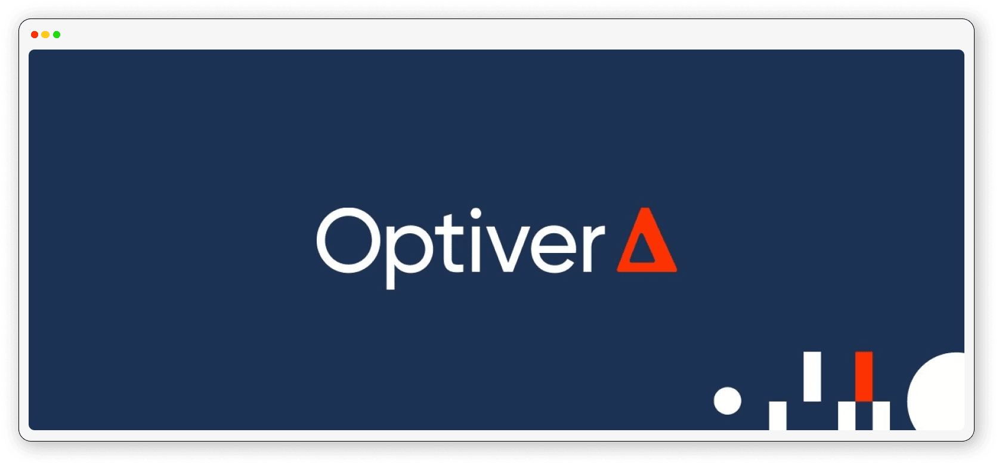

Algorithmic trading has revolutionized modern financial markets by utilizing complex algorithms and sophisticated electronic systems to execute trades at speeds and volumes beyond human capability. This method leverages data-driven strategies and technological advancements to enhance trading efficiency, reduce costs, and improve decision accuracy. It's estimated that algorithmic trading accounts for a significant portion of trading activities in major global markets, underscoring its significance and impact.

Optiver is a prominent player in the field of algorithmic trading, renowned for its cutting-edge strategies and consistent market presence. Established in 1986 in Amsterdam, Optiver began as a market-making firm on the European Options Exchange. Over the past few decades, it has transformed into a leading global trading firm, executing trades across various asset classes and markets. Optiver’s history is marked by innovation and adaptability, ensuring its position at the forefront of the trading industry.



The purpose of this article is to examine Optiver’s pivotal contributions and strategies within algorithmic trading. We will explore how Optiver distinguishes itself in a fiercely competitive landscape, where technology and adaptability are paramount. Optiver's success is grounded in its ability to integrate advanced technology and data analysis to optimize trading outcomes and maintain a competitive edge.

Optiver stands out due to its commitment to innovation and reliability. By fostering a culture of research and development, the firm continually enhances its trading systems and strategies. Its unique approach involves leveraging technology to gain insights into market dynamics, thereby contributing to market liquidity and efficiency.

This article invites readers to explore Optiver's operations, the technology that drives its trading activities, and its impact on the financial markets. Through examining Optiver’s approach to algorithmic trading, we gain deeper insights into how it navigates market challenges and prepares for future opportunities.

## Table of Contents

## Understanding Algorithmic Trading

Algorithmic trading refers to the practice of using computer algorithms to automate the execution of trades in financial markets. These algorithms analyze various market variables and execute trades at speeds and efficiencies that are virtually impossible for human traders to achieve. This form of trading has become central to modern markets, providing increased market efficiency and liquidity.

At its core, [algorithmic trading](/wiki/algorithmic-trading) uses pre-defined criteria based on time, price, [volume](/wiki/volume-trading-strategy), or any other mathematical model, enabling rapid decision-making and order execution. Algorithms can process vast amounts of data in real time, allowing traders to capitalize on fleeting market conditions. For instance, consider the following Python snippet used to demonstrate a simple moving average crossover strategy:

```python
# Simple Moving Average Crossover Strategy
def moving_average(data, window_size):
    return data.rolling(window=window_size).mean()

def crossover_strategy(prices, short_window, long_window):
    short_ma = moving_average(prices, short_window)
    long_ma = moving_average(prices, long_window)
    signals = (short_ma > long_ma).astype(float)
    return signals.diff()

# Example usage
import pandas as pd

# Assume 'prices' is a pandas DataFrame column of historical price data
signals = crossover_strategy(prices, short_window=40, long_window=100)
```

Such algorithms can be deployed to execute trades automatically once a crossover is detected, eliminating human emotions and biases from trading decisions.

One of the primary advantages of algorithmic trading is cost reduction. By executing trades at optimal times, reducing the market impact, and minimizing transaction costs, traders can significantly enhance profitability. Furthermore, algorithms improve accuracy by executing trades according to precise pre-determined criteria and avoiding the latency inherent in human decision-making processes.

Effective algorithmic trading relies heavily on robust technology and data infrastructure. High-frequency trading ([HFT](/wiki/high-frequency-trading-strategies)) platforms require low-latency connections to exchanges, powerful computing equipment, and sophisticated analytical tools to analyze live market data. Data plays a crucial role; historical and real-time data are used to train algorithms and refine strategies to adapt to evolving market conditions.

Algorithmic trading strategies often include [market making](/wiki/market-making) and [arbitrage](/wiki/arbitrage). Market making involves providing [liquidity](/wiki/liquidity-risk-premium) to markets by continuously placing buy and sell orders, profiting from the bid-ask spread. Algorithms can rapidly adjust orders based on market conditions, enhancing market liquidity and efficiency. Arbitrage strategies exploit price discrepancies across different markets or instruments, executing simultaneous buy and sell orders to capture risk-free profits.

In summary, algorithmic trading represents a significant evolution in trading technology, providing speed, accuracy, and efficiency. Mastery of algorithms, technology, and data can offer a considerable competitive edge in today's complex financial markets.

## The Role of Optiver in Algorithmic Trading

Optiver, founded in 1986, has established itself as a prominent player in algorithmic trading, leveraging technology to execute large volumes of trades with precision and speed across global markets. The firm's business model centers around proprietary trading, where it uses its own capital to undertake trades, ensuring complete control over its operations and strategies. This self-reliant model allows Optiver to swiftly adapt its trading techniques and align them with shifting market conditions, enhancing its competitive advantage.

One of Optiver's core operations involves employing sophisticated algorithmic trading systems to facilitate market making and arbitrage activities. Market making is a strategy where traders simultaneously provide buy and sell quotes on a market, [earning](/wiki/earning-announcement) the spread between these quotes if both are executed. This approach contributes to liquidity and stability in financial markets. On the other hand, arbitrage involves capitalizing on price discrepancies of the same asset across different markets. By executing these strategies at high speeds, Optiver can exploit small and transient mispricings for profit.

Optiver’s implementation of algorithmic trading is supported by its robust technological infrastructure, which ensures trades are executed efficiently across diverse asset classes and global exchanges. The firm has gained a reputation for innovation, being at the forefront of technological advancements in trading. Optiver’s systems handle massive amounts of data and execute trades with remarkable accuracy, contributing to its reliability in an industry where milliseconds can determine success.

Optiver employs various trading strategies to maintain its competitive edge. These strategies are constantly evolving, refined by ongoing research and development to account for the dynamism of financial markets. Optiver's approach emphasizes speed and efficiency, with algorithms designed to respond to market conditions in real-time, ensuring optimal execution of trades.

The firm's market impact is evident through its significant role in enhancing market liquidity and narrowing bid-ask spreads, which benefits all market participants by reducing trading costs. Optiver's successful trading activities often serve as benchmarks for performance within the industry. The firm's reputation is bolstered by its consistent ability to generate positive outcomes while maintaining a low-risk profile, a feat largely attributed to its sophisticated risk management practices.

In summary, Optiver's influence in algorithmic trading is underscored by its advanced technological capabilities, innovative trading strategies, and substantial contributions to market efficiency and liquidity. Its operations provide a model of how trading firms can leverage technology and strategic ingenuity to thrive in the competitive landscape of global financial markets.

## Optiver's Technological Edge

Optiver leverages a sophisticated technology stack to facilitate its trading operations, which are fundamental to its success in algorithmic trading. The complexity of modern financial markets necessitates the use of advanced technological infrastructure, and Optiver excels by integrating cutting-edge technology and algorithms designed to optimize performance across various trading sectors.

At the core of Optiver's technological prowess lies its ability to conduct rapid and efficient trade executions—a critical element for market-making activities. Optiver employs high-frequency trading technology that allows for the execution of trades in mere microseconds. This speed is achieved through a combination of low-latency networking, high-performance computing resources, and customized algorithmic solutions tailored to specific market conditions.

Artificial intelligence (AI) and [machine learning](/wiki/machine-learning) (ML) play pivotal roles in Optiver's trading strategies. These technologies enable the firm to analyze vast datasets, discern patterns, and make informed decisions. Machine learning algorithms are utilized to predict market movements, while AI assists in optimizing trade execution by continuously learning and adapting to new data. For instance, [reinforcement learning](/wiki/reinforcement-learning) models can be used to refine trading strategies over time, improving accuracy and profitability.

```python
# Example of a simple reinforcement learning algorithm structure

import numpy as np

class TradingAgent:
    def __init__(self, state_size, action_size):
        self.state_size = state_size
        self.action_size = action_size
        self.q_table = np.zeros((state_size, action_size))
        self.learning_rate = 0.1
        self.discount_factor = 0.99
        self.epsilon = 0.1

    def choose_action(self, state):
        if np.random.rand() <= self.epsilon:
            return np.random.choice(self.action_size)  # Explore
        return np.argmax(self.q_table[state])  # Exploit

    def learn(self, state, action, reward, next_state):
        q_predict = self.q_table[state, action]
        q_target = reward + self.discount_factor * np.max(self.q_table[next_state])
        self.q_table[state, action] += self.learning_rate * (q_target - q_predict)
```

Data science and analytics are foundational to decision-making processes at Optiver. The firm utilizes quantitative models to process and interpret real-time market data, facilitating the identification of arbitrage opportunities and the execution of strategic trades. The integration of advanced analytics allows Optiver to manage risk effectively and respond swiftly to market fluctuations.

Research and development (R&D) are central to maintaining Optiver's competitive edge in algorithmic trading. The firm invests heavily in R&D initiatives to explore new technologies and methodologies that can enhance trading performance. This commitment to innovation ensures that Optiver remains at the forefront of technological advancements in the financial markets. For example, exploring blockchain for faster settlements or quantum computing for complex problem-solving could be future focal points in their R&D efforts.

In summary, Optiver's technological edge is characterized by its use of advanced computing infrastructure, AI and ML integration, robust data analytics, and ongoing R&D investments. These elements collectively enable Optiver to execute trades with unparalleled speed and precision, thereby solidifying its status as a leader in the competitive field of algorithmic trading.

## Optiver's Global Presence and Market Influence

Optiver, a leading player in the algorithmic trading sector, has established a formidable presence across various global markets. With strategic operations in key financial hubs such as Amsterdam, Chicago, Sydney, and London, Optiver leverages its expansive infrastructure to trade across all major asset classes including equities, derivatives, and commodities. This global footprint allows Optiver to remain agile and adapt its strategies to the unique market conditions and regulatory environments of each region.

In adapting to different market conditions, Optiver employs a flexible trading model that can quickly adjust to local market dynamics and regulatory changes. This adaptability is crucial in the ever-evolving landscape of global financial markets. Optiver's proprietary algorithms are designed to interpret market signals and execute trades with precision, thus ensuring efficient market participation and compliance with regional regulations.

Optiver's role extends beyond just participation; it significantly contributes to market liquidity and stability. By acting as a market maker, Optiver provides bid and ask quotes, enhancing the liquidity of the markets in which it operates. This activity is vital for the smooth functioning of financial markets, as it helps reduce the spread between buying and selling prices, thereby facilitating easier and more efficient trade executions for other market participants.

Collaboration with exchanges and other financial entities is a cornerstone of Optiver's operational strategy. By engaging with these platforms, Optiver ensures optimal market operations. It often works alongside exchanges to develop trading systems that enhance market efficiency and transparency. These collaborations are crucial for maintaining a competitive edge and fostering innovation within the financial ecosystem.

Optiver's impact is particularly notable in regions like Europe, where it has played a pivotal role in the development of options and futures markets, and in Asia-Pacific regions, where its strategic investments and technological prowess have significantly contributed to market enhancement. In the United States, Optiver's presence in Chicago solidifies its influence in one of the world's largest and most complex financial markets, underscoring its capacity to handle high-frequency trading and large trade volumes efficiently.

Overall, Optiver's global presence not only underscores its strategic vision but also its commitment to enhancing market efficiency and stability through sophisticated algorithmic trading practices.

## Challenges and Future of Algorithmic Trading at Optiver

Algorithmic trading firms like Optiver face several challenges, including regulatory pressures and technological risks. Regulators worldwide are increasingly focused on ensuring fair and transparent markets, which has resulted in stringent compliance requirements for firms engaged in high-frequency and algorithmic trading. These regulations demand robust reporting mechanisms, transparent operational practices, and adherence to market conduct standards to mitigate market manipulation risks. Additionally, regulatory bodies have set safeguards such as circuit breakers and order-to-trade ratios to control excessive [volatility](/wiki/volatility-trading-strategies) potentially triggered by algorithmic activities.

Technological risks further complicate the landscape. The rapid evolution of technology necessitates continuous upgrades to maintain compatibility and performance. Cybersecurity threats pose significant challenges, as trading platforms are prime targets for malicious attacks. Consequently, algorithmic trading firms invest heavily in robust security frameworks and encryption technologies to protect sensitive data and proprietary trading algorithms.

Optiver’s approach to managing these challenges is comprehensive, focusing on secure and efficient trading operations. This includes leveraging advanced risk management systems that monitor market activities in real-time and automatically adjust trading strategies to align with regulatory standards and market conditions. Optiver’s teams consistently engage with regulatory authorities to ensure compliance and contribute to the development of fair trading practices.

The future of algorithmic trading at Optiver involves preparing for emerging trends in the industry. One significant trend is the increasing utilization of [artificial intelligence](/wiki/ai-artificial-intelligence) (AI) and machine learning (ML) to develop more sophisticated trading strategies. These technologies are harnessed to analyze massive datasets, identify patterns, and optimize trading decisions. Optiver is investing in AI research to refine its algorithms and achieve higher efficiency and accuracy.

Another potential growth area is the expansion into new asset classes and markets. Optiver is exploring opportunities in emerging markets where algorithmic trading is gaining traction, adapting its strategies to accommodate diverse regulatory environments and market dynamics.

In terms of potential innovations, quantum computing holds promise for the algorithmic trading domain. Although still in its infancy, quantum computing could revolutionize the speed and complexity of data processing capabilities, allowing Optiver to explore entirely new trading strategies and computational models.

Optiver is also keen on adopting cloud computing technologies to enhance scalability and flexibility in its operations. By leveraging cloud infrastructure, Optiver can scale its computational resources according to real-time demands, improving efficiency while reducing operational costs.

In summary, Optiver's strategic focus is on navigating regulatory landscapes, embracing technological advancements, and exploring innovative growth areas to maintain its competitive edge in algorithmic trading. The firm’s commitment to leveraging cutting-edge technologies while ensuring compliance and security positions it well for future success in the evolving financial markets.

## Conclusion

Optiver stands as a prominent entity in the algorithmic trading sector, showcasing its expertise and influence across global financial markets. Its prominence is attributed to a strong foundation in technological and innovative practices, which are core to its trading strategies and operations. The firm's intrinsic use of advanced algorithms and cutting-edge technology not only facilitates high-speed, accurate trade executions but also pushes the boundaries of what is possible in financial trading.

Innovation and technology are pivotal to Optiver's sustained success and competitive edge. The integration of artificial intelligence, machine learning, and sophisticated data analytics into their trading operations underscores their commitment to driving efficiency and enhancing decision-making processes. This technological prowess has enabled Optiver not only to adapt to rapidly changing market conditions but also to set benchmarks for others in the field.

Looking forward, the future of algorithmic trading is set to evolve, with firms like Optiver poised to lead transformative changes. As markets become increasingly complex, embracing advanced technologies and harnessing large datasets will become essential. Optiver's proactive stance on research and development indicates its readiness to tackle emerging challenges and seize new opportunities.

Therefore, further research and observation of Optiver's evolving strategies are encouraged. Understanding how they continue to innovate and adapt will provide valuable insights into the future trajectory of algorithmic trading. As such, Optiver remains not just a participant but a leader in shaping the future landscape of global financial markets.

## References & Further Reading

[1]: Chan, E. P. (2009). ["Quantitative Trading: How to Build Your Own Algorithmic Trading Business."](https://github.com/ftvision/quant_trading_echan_book) Wiley.

[2]: Jansen, S. (2018). ["Machine Learning for Algorithmic Trading: Predictive models to extract signals from market and alternative data for systematic trading strategies with Python."](https://github.com/stefan-jansen/machine-learning-for-trading) Packt Publishing.

[3]: Aronson, D. R. (2006). ["Evidence-Based Technical Analysis: Applying the Scientific Method and Statistical Inference to Trading Signals."](https://www.amazon.com/Evidence-Based-Technical-Analysis-Scientific-Statistical/dp/0470008741) Wiley.

[4]: Lopez de Prado, M. (2018). ["Advances in Financial Machine Learning."](https://www.amazon.com/Advances-Financial-Machine-Learning-Marcos/dp/1119482089) Wiley.

[5]: Zitzewitz, E., & Hendershott, T. (2003). ["Algorithmic Trading and Information."](https://faculty.haas.berkeley.edu/hender/ATInformation.pdf) Journal of Financial and Quantitative Analysis.