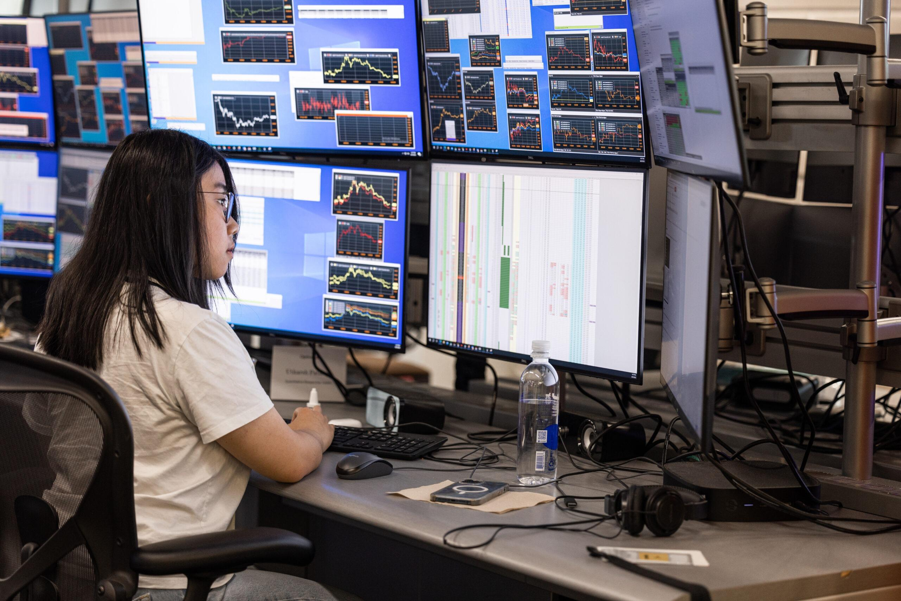

## Table of Contents

## What is Optiver?

Optiver is a company that trades in financial markets. They buy and sell things like stocks, options, and other financial products to make money. The company started in Amsterdam in 1986 and now has offices in many places around the world, like Chicago, Sydney, and Hong Kong. They use computers and smart math to decide when to buy and sell, which helps them make good choices quickly.

Optiver is known for being very good at what they do. They work with big markets and help make sure prices are fair. Their traders and engineers work together to find the best times to trade. This makes the markets run smoothly and helps everyone who uses them. Optiver also tries to teach people about trading and how markets work, so more people can understand and use them.

## When was Optiver founded?

Optiver was founded in 1986. It started in Amsterdam, which is a city in the Netherlands. Back then, the company began as a small trading firm.

Over the years, Optiver grew bigger and opened offices in other places like Chicago, Sydney, and Hong Kong. They became known for trading financial products like stocks and options. Today, Optiver uses computers and smart math to help them make quick and good trading choices.

## Where is Optiver headquartered?

Optiver is headquartered in Amsterdam, which is in the Netherlands. This is where the company started back in 1986. Amsterdam is a big city known for its canals and bikes, and it's also a center for business and finance.

From Amsterdam, Optiver runs its operations around the world. They have offices in places like Chicago, Sydney, and Hong Kong. These offices help Optiver trade in different financial markets and work with clients from all over the globe.

## What type of company is Optiver?

Optiver is a trading company that deals with financial markets. They buy and sell things like stocks, options, and other financial products to make money. The company uses computers and smart math to help them make quick and good trading choices. This is important because it helps them decide the best times to buy and sell.

The company started in Amsterdam in 1986. Since then, Optiver has grown and now has offices in many places around the world, like Chicago, Sydney, and Hong Kong. They are known for being very good at trading and helping to make sure prices in the markets are fair. Optiver also works to teach people about trading and how markets work, so more people can understand and use them.

## What are the main services offered by Optiver?

Optiver mainly offers trading services in financial markets. They buy and sell things like stocks, options, and other financial products. They use computers and smart math to make quick and good trading choices. This helps them decide the best times to buy and sell, which is important for making money in the markets.

Optiver also helps make sure prices in the markets are fair. They do this by trading a lot and using their technology to keep the markets running smoothly. Besides trading, Optiver works to teach people about how markets work. They want more people to understand trading and use the markets, so they share their knowledge and help educate others.

## How does Optiver contribute to market liquidity?

Optiver helps make markets more liquid by trading a lot. When they buy and sell many stocks, options, and other financial products, it means there are more things available for other people to buy and sell too. This makes it easier for everyone to trade because there's always something to buy or sell. It's like having more water in a river, so it flows better.

They use computers and smart math to decide when to trade. This helps them react quickly to what's happening in the market. By doing this, Optiver makes sure that prices stay fair and the market keeps moving smoothly. When prices are fair and the market is liquid, it's better for everyone who uses it.

## What is Optiver's approach to risk management?

Optiver takes risk management very seriously. They know that trading can be risky, so they use special tools and smart math to keep an eye on how much risk they are taking. They look at all the things they are trading and make sure they are not putting too much money into one thing. This way, if something goes wrong, it won't hurt them too badly.

To manage risk, Optiver also uses computers to make quick choices. If the market starts to change in a way that could be bad for them, their computers can help them react fast. They might sell something quickly or buy something to balance out the risk. This helps them stay safe and keep trading without big problems.

## Can you explain Optiver's trading strategies?

Optiver uses smart math and computers to decide when to trade. They look at lots of information about the market, like prices and how much people are buying and selling. This helps them figure out the best times to buy and sell things like stocks and options. They use special computer programs that can make choices very quickly, so they can react to changes in the market right away. This is important because the market can change fast, and they need to be ready.

Another part of their strategy is to trade a lot of different things. This helps them spread out their risk. If they only traded one thing and it went down in price, they could lose a lot of money. But by trading many different things, if one goes down, others might go up, and it balances out. They also use their computers to keep an eye on how much risk they are taking. If it looks like they might lose too much, their computers can help them make quick changes to stay safe.

## How does Optiver use technology in its operations?

Optiver uses technology a lot in its trading. They have special computer programs that help them make quick choices about when to buy and sell things like stocks and options. These programs look at lots of information about the market, like prices and how much people are trading. This helps Optiver decide the best times to trade. Because the market can change fast, their computers need to be able to react right away. This makes sure Optiver can keep up with what's happening and make good choices quickly.

Technology also helps Optiver manage risk. They use computers to keep an eye on how much risk they are taking. If it looks like they might lose too much money, their programs can help them make quick changes to stay safe. This is important because trading can be risky, and they need to make sure they don't lose too much. By using technology, Optiver can trade a lot of different things and spread out their risk. This way, if one thing goes down in price, others might go up, and it balances out.

## What is Optiver's impact on financial markets globally?

Optiver has a big impact on financial markets around the world. They trade a lot of stocks, options, and other financial products. This helps make the markets more liquid, which means there are more things for people to buy and sell. When markets are liquid, it's easier for everyone to trade because there's always something available. Optiver's trading also helps keep prices fair. They use computers and smart math to make quick choices, which helps them react to changes in the market and keep everything running smoothly.

Optiver also helps teach people about trading and how markets work. They share their knowledge so more people can understand and use the markets. This is important because when more people know how to trade, it can make the markets even better. By being in many places like Chicago, Sydney, and Hong Kong, Optiver can work with different markets and help them all run well. Their focus on risk management also makes the markets safer for everyone.

## What are some notable achievements or milestones of Optiver?

Optiver has been around since 1986 when it started in Amsterdam. Over the years, they have grown a lot and now have offices in many places like Chicago, Sydney, and Hong Kong. One big milestone for Optiver was becoming a leader in trading financial products like stocks and options. They use computers and smart math to make quick trading choices, which has helped them become very good at what they do.

Another important achievement for Optiver is how they help make markets more liquid. By trading a lot, they make sure there are always things for people to buy and sell. This makes the markets run smoothly and helps keep prices fair. Optiver also focuses on teaching people about trading and how markets work. They want more people to understand and use the markets, which is good for everyone.

## How does Optiver approach corporate social responsibility and sustainability?

Optiver cares about doing good things for the world and making sure their business lasts a long time. They believe in being responsible and helping the places where they work. Optiver does this by giving money to charities and supporting projects that help the community. They also try to be fair and honest in how they trade, which helps make the financial markets better for everyone.

Another way Optiver works on sustainability is by focusing on their people. They want to make sure their employees are happy and have good careers. Optiver also thinks about the environment. They use technology to trade in a smart way, which can help save energy and reduce waste. By doing these things, Optiver shows they care about more than just making money. They want to make a positive difference in the world.

## References & Further Reading

[1]: Chan, E. P. (2009). ["Quantitative Trading: How to Build Your Own Algorithmic Trading Business."](https://github.com/ftvision/quant_trading_echan_book) Wiley.

[2]: Jansen, S. (2018). ["Machine Learning for Algorithmic Trading: Predictive models to extract signals from market and alternative data for systematic trading strategies with Python."](https://github.com/stefan-jansen/machine-learning-for-trading) Packt Publishing.

[3]: Aronson, D. R. (2006). ["Evidence-Based Technical Analysis: Applying the Scientific Method and Statistical Inference to Trading Signals."](https://www.amazon.com/Evidence-Based-Technical-Analysis-Scientific-Statistical/dp/0470008741) Wiley.

[4]: Lopez de Prado, M. (2018). ["Advances in Financial Machine Learning."](https://www.amazon.com/Advances-Financial-Machine-Learning-Marcos/dp/1119482089) Wiley.

[5]: Zitzewitz, E., & Hendershott, T. (2003). ["Algorithmic Trading and Information."](https://faculty.haas.berkeley.edu/hender/ATInformation.pdf) Journal of Financial and Quantitative Analysis.