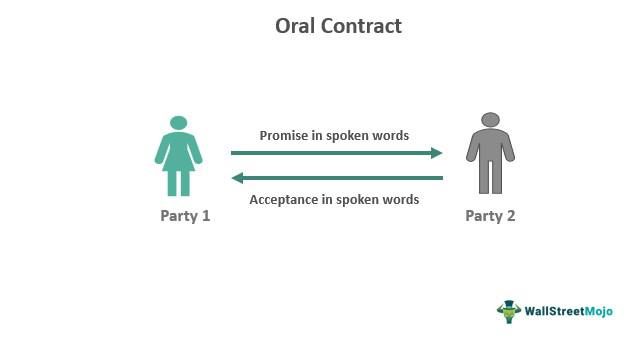

Oral agreements, often underestimated due to their informal nature, are an integral part of contract law with significant implications across various sectors, including finance and trading. This article examines how such agreements, despite their lack of written documentation, can possess legal force and be binding if they meet specific criteria. In industries like algo trading, where decisions and transactions are executed rapidly and frequently, understanding the foundational principles of oral contracts is crucial for ensuring operational integrity and minimizing legal risks.

Oral contracts, although simple in appearance, require careful consideration of key elements that contribute to their enforceability. Contract law generally demands the presence of an offer, acceptance, consideration, and a clear intention to create legal relations for any agreement, whether oral or written, to hold legal standing. These elements, when met, can transform a verbal promise into a binding obligation, thereby necessitating awareness among individuals and businesses to navigate potential legal pitfalls effectively.

The discussion will extend to the mechanisms available for enforcing oral agreements, the inherent challenges in proving their terms and conditions, and the evidentiary requirements crucial for upholding their validity in legal contexts. In algorithmic trading, where speed and precision dictate success, these principles hold particular relevance as traders and firms must frequently resort to quick decision-making and verbal agreements.

Through this exploration, the aim is to highlight the critical considerations involved in relying on oral agreements within fast-paced environments like algo trading. While written contracts remain the gold standard for ensuring clarity and reducing the risk of disputes, understanding the enforceability of oral agreements is vital for navigating the complexities of modern trading practices.

## Table of Contents

## Understanding Oral Contracts

Oral contracts represent agreements formed through spoken communication rather than documented in writing. Despite their informal nature, such agreements can hold legal validity if they comply with certain established criteria. The enforceability of oral contracts largely depends on the jurisdiction and the specific nature of the agreement. 

Key elements that constitute a valid oral contract include offer, acceptance, consideration, and the intention to create legal relations. 

1. **Offer and Acceptance**: An oral contract, like its written counterpart, begins with one party proposing terms (offer) and the other party agreeing to these terms (acceptance). Both offer and acceptance must be clear to ensure mutual understanding.

2. **Consideration**: This refers to the value exchanged between parties involved in the contract. Consideration can be anything of value, such as money, services, or goods, that each party agrees to.

3. **Intention to Create Legal Relations**: For an oral agreement to be enforceable, the involved parties must intend for their agreement to be legally binding. This mutual understanding distinguishes enforceable contracts from casual or social agreements.

The enforceability of oral agreements is often subjected to the rules of the jurisdiction in which they are made. Some legal systems may require specific types of contracts to be written, such as those involving large financial transactions or real estate, as dictated by the Statute of Frauds.

Oral contracts are typically more suited to simpler transactions. These types of agreements might govern everyday transactions and smaller business deals, where the complexity and stakes are not demanding. Larger and more intricate transactions often require written documentation to ensure clarity and prevent misunderstandings. 

Overall, while oral contracts offer the benefit of simplicity and expedience, their informal nature can lead to challenges in enforcement, making it imperative for parties to ensure that all essential contract elements are comprehensively covered and mutually understood.

## Enforcing Oral Agreements

Enforcing an oral contract presents several challenges, particularly when disputes arise regarding the precise terms agreed upon. Despite these challenges, oral agreements can be legally binding if they encompass all the necessary contractual elements, such as offer, acceptance, consideration, and the intention to create legal relations. The enforceability of an oral contract may hinge on the availability and quality of evidence that supports the claim that an agreement was indeed made.

1. **Evidence and Witness Testimony**: To substantiate the existence of an oral agreement, parties may rely on various forms of evidence. Witness testimony can be crucial, especially if third parties can corroborate the occurrence and terms of the verbal agreement. This includes any individuals present during the discussion or who have firsthand knowledge of the agreement.

2. **Correspondence and Conduct**: In some cases, correspondence such as emails, text messages, or any form of written communication that references the verbal agreement can serve as supporting evidence. The behavior of the parties involved may also indicate that an agreement exists. This could involve the subsequent actions taken by the parties that are consistent with the terms discussed, which could be argued as indicative of mutual understanding and intention to contract.

3. **Written Confirmation**: While the original agreement may have been oral, following up with a written confirmation of the terms can significantly bolster its enforceability. This written document does not transform the nature of the contract but serves as evidence of the agreed terms, providing clarity and reducing the likelihood of disputes.

4. **Legal Precedents**: Both U.S. and English legal systems recognize that oral agreements can be binding if they conform to all requisite contractual elements. Historical case law often demonstrates the importance of clear evidence in affirming the existence and specifics of oral agreements.

5. **Practical Tips**: To mitigate risks associated with oral agreements, it is prudent to maintain clear records of the discussions leading to the agreement. This can include keeping a log of conversations, noting the date, time, and essential points discussed. In practice, even brief written summaries exchanged after verbal negotiations can serve as a powerful tool for dispute resolution. Another practical approach is to consistently document any actions taken based on the agreement, further evidencing its existence and terms.

In conclusion, while oral contracts are susceptible to challenges due to their lack of formal documentation, implementing strategic measures such as maintaining detailed records, seeking witness testimony, and following up verbal agreements with written confirmations can help ensure their enforceability.

## Oral Contracts in Algorithmic Trading

Algorithmic trading, characterized by high speed and [high frequency](/wiki/high-frequency-trading), often requires traders to make instantaneous decisions, sometimes resulting in verbal agreements. Despite the informal nature of oral contracts, their enforcement remains pivotal, given the complexities involved in such a fast-paced environment. Understanding the enforceability of oral agreements under standard contract law principles—offer, acceptance, and consideration—is essential for traders and firms to safeguard their operations.

In the context of [algorithmic trading](/wiki/algorithmic-trading), oral contracts are executed rapidly to take advantage of fleeting market opportunities. However, this speed must not compromise contractual fundamentals. A valid oral agreement in this sphere requires a clear offer that is unambiguously accepted, coupled with a promise of value, known as consideration. These elements ensure the applicability of a legally binding commitment, despite the absence of written documentation.

Traders must prioritize clarity and verification when entering verbal agreements to minimize potential disputes that may arise from misunderstandings. Miscommunications in trade terms or market conditions can have significant financial implications. Therefore, establishing standard operational protocols where verbal agreements are promptly followed by written confirmations can mitigate such risks.

Advanced technologies, which are inherent in algorithmic trading systems, can facilitate the documentation of oral agreements. For instance, communication platforms that record verbal exchanges, automated logs of trade executions, and audit trails form robust evidence demonstrating the existence and terms of a contract. Such systems not only enhance transparency but also support the enforceability of oral agreements if disputes reach litigation.

As the algorithmic trading landscape evolves, so do the mechanisms supporting contract enforceability. Yet, while oral agreements provide flexibility, they demand a disciplined approach to evidence gathering and dispute resolution to be effectively harnessed. Adopting these strategies ensures continuity and mitigates risks associated with verbal agreements in the high-stakes environment of algorithmic trading.

## Challenges and Limitations

One of the primary challenges of oral contracts is establishing their terms, particularly when there is no written documentation. In many cases, disputes emerge over differing interpretations of what was agreed upon verbally or due to fading memories over time. This can create significant hurdles in proving the existence and specifics of an oral agreement in a legal setting.

Certain types of contracts, especially those that involve substantial commitments such as real estate transactions, are generally required by law to be documented in writing to ensure enforceability. This requirement is often stipulated by the Statute of Frauds, a legal doctrine designed to prevent fraudulent claims and misunderstandings by mandating written evidence for particular categories of contracts.

In the fast-moving environment of algorithmic trading, the challenges associated with oral agreements are further amplified. Due to the rapid market changes and the prevalence of high-frequency transactions, maintaining the integrity of verbal agreements can be extremely difficult. The dynamic nature of this trading sector necessitates swift decision-making, which may involve verbal commitments, yet these are often susceptible to disputes if not promptly and thoroughly documented.

Despite offering a degree of flexibility, oral contracts inherently pose a higher risk of disputes. Their lack of tangible records makes them considerably harder to enforce during litigation. To enhance the enforceability of such agreements, it is advisable to use technologies that can record verbal exchanges or quickly translate them into written form. Such documentation not only serves as a reliable reference but also helps mitigate the risks associated with the ephemeral nature of oral contracts. Therefore, while they may be expedient, oral agreements should ideally be complemented with written records to ensure clarity and avoid potential legal complications.

## Conclusion

Oral agreements remain influential across various industries, including finance and trading, despite their informal nature. Understanding the principles governing their enforceability is crucial to averting potential disputes. In algorithmic trading, where transactions occur rapidly, it is essential to maintain clear communication and comprehensive records. Although oral contracts offer convenience, transitioning to written agreements is advisable for complex dealings to ensure precision and enforceability. By combining legal insights with meticulous documentation, the challenges associated with oral agreements can be significantly mitigated, reducing the risk of misunderstandings and enhancing legal protection.

## References & Further Reading

[1]: Bergstra, J., Bardenet, R., Bengio, Y., & Kégl, B. (2011). ["Algorithms for Hyper-Parameter Optimization."](https://papers.nips.cc/paper/4443-algorithms-for-hyper-parameter-optimization) Advances in Neural Information Processing Systems 24.

[2]: ["Advances in Financial Machine Learning"](https://www.amazon.com/Advances-Financial-Machine-Learning-Marcos/dp/1119482089) by Marcos Lopez de Prado

[3]: ["Evidence-Based Technical Analysis: Applying the Scientific Method and Statistical Inference to Trading Signals"](https://www.amazon.com/Evidence-Based-Technical-Analysis-Scientific-Statistical/dp/0470008741) by David Aronson

[4]: ["Machine Learning for Algorithmic Trading"](https://github.com/stefan-jansen/machine-learning-for-trading) by Stefan Jansen

[5]: ["Quantitative Trading: How to Build Your Own Algorithmic Trading Business"](https://www.amazon.com/Quantitative-Trading-Build-Algorithmic-Business/dp/1119800064) by Ernest P. Chan