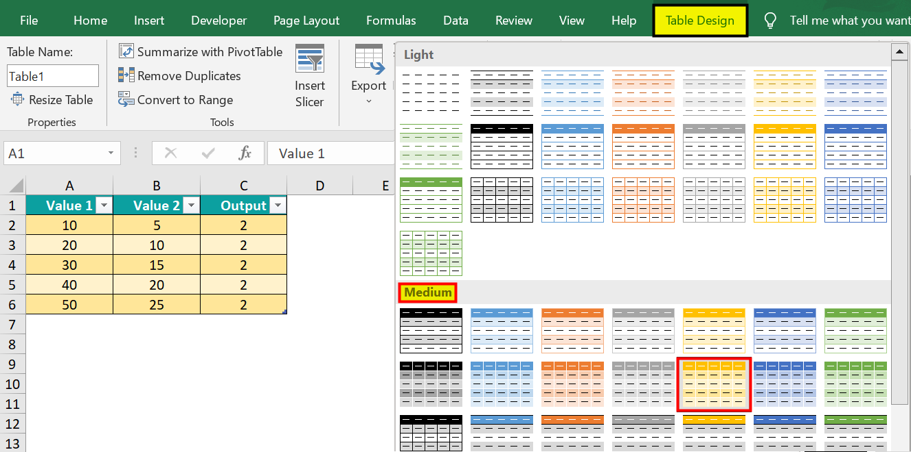

## Table of Contents

## What is the Orange Book?

The Orange Book is a list published by the U.S. Food and Drug Administration (FDA). It includes information about approved drugs and their generic versions. It helps doctors and patients know which generic drugs are the same as the brand-name drugs.

The book is important because it helps make sure that generic drugs work the same way as the brand-name drugs. This means people can choose cheaper options that are just as effective. The Orange Book is updated regularly to include new drugs and new generic versions.

## Who publishes the Orange Book?

The Orange Book is published by the U.S. Food and Drug Administration (FDA). The FDA is a government agency that makes sure medicines are safe and work well.

The Orange Book helps doctors and patients know which generic drugs are the same as brand-name drugs. It is updated often to include new drugs and their generic versions. This helps people choose cheaper options that work just as well.

## What is the purpose of the Orange Book?

The Orange Book is a list made by the U.S. Food and Drug Administration (FDA). It helps people know which generic drugs are the same as the brand-name drugs. This is important because it lets doctors and patients choose cheaper drugs that work just as well.

The book is updated all the time to include new drugs and their generic versions. This way, everyone can stay informed about the latest options. The Orange Book makes it easier for people to find and use medicines that are safe and effective.

## How often is the Orange Book updated?

The Orange Book is updated by the U.S. Food and Drug Administration (FDA) every month. This means new information about drugs and their generic versions is added regularly.

These updates help doctors and patients stay informed about the latest medicines. By keeping the Orange Book current, people can choose safe and effective drugs that might be cheaper.

## What types of products are listed in the Orange Book?

The Orange Book lists prescription and some over-the-counter drugs that have been approved by the U.S. Food and Drug Administration (FDA). These drugs can be either brand-name or generic versions. The book helps people know which generic drugs work the same as the brand-name drugs.

It includes information about the drugs like their active ingredients, how they are given, and what they are used for. This helps doctors and patients choose the right medicine. The Orange Book is important because it makes sure people can find safe and effective drugs that might be less expensive.

## How can one access the Orange Book?

You can access the Orange Book online through the U.S. Food and Drug Administration (FDA) website. Just go to the FDA's website and search for "Orange Book." You will find a link to the current edition of the book. It is easy to use because you can search for drugs by their name, active ingredient, or the company that makes them.

The Orange Book is also available in a printed version, but most people use the online version because it is updated every month. The online version lets you download the information or print out what you need. This helps doctors and patients stay up to date with the latest information about drugs and their generic versions.

## What information does the Orange Book provide about approved drug products?

The Orange Book gives information about drugs that the U.S. Food and Drug Administration (FDA) has approved. It tells you about both brand-name and generic drugs. For each drug, it lists the name, the active ingredient, how it is given, and what it is used for. This helps doctors and patients know which generic drugs work the same as the brand-name drugs.

The book also includes details about the drug's approval status, patent information, and any exclusivities that might affect when a generic version can be made. This helps people understand why some drugs might be more expensive and when cheaper options might become available. The Orange Book is important because it helps everyone make informed choices about which medicines to use.

## What is the significance of therapeutic equivalence ratings in the Orange Book?

The Orange Book includes therapeutic equivalence ratings, which are very important. These ratings tell doctors and patients if a generic drug works the same as the brand-name drug. If a generic drug has the same rating as the brand-name drug, it means they are the same in how they work in the body. This helps people choose cheaper drugs that are just as effective.

These ratings are shown with letters and numbers, like "AB" or "BX." An "AB" rating means the generic drug is the same as the brand-name drug in all important ways. This makes it easier for people to trust generic drugs and save money on their medicines. The Orange Book's ratings help make sure that everyone can get safe and effective drugs, no matter if they choose the brand-name or the generic version.

## How does the Orange Book assist in the generic drug approval process?

The Orange Book helps in the generic drug approval process by providing important information about brand-name drugs. It lists details like the active ingredients, how the drug is given, and what it is used for. This information is crucial for companies that want to make generic versions of these drugs. They need to know exactly what is in the brand-name drug so they can make a generic version that works the same way.

The Orange Book also includes patent and exclusivity information for each drug. This tells generic drug makers when they can start making their version. If a brand-name drug has a patent, it means no one else can make a generic version until the patent expires. The Orange Book helps generic drug companies know when they can apply for approval from the FDA. This makes the process smoother and helps bring cheaper drugs to the market faster.

## What are the differences between the print and electronic versions of the Orange Book?

The print version of the Orange Book is a physical book that you can hold in your hands. It is published by the U.S. Food and Drug Administration (FDA) and comes out once a year. The print version has all the information about approved drugs and their generic versions, but it can get outdated quickly because it is not updated as often as the electronic version. If you want to use the print version, you might need to wait for the next edition to get the latest information.

The electronic version of the Orange Book is available online on the FDA's website. It is updated every month, so it always has the most current information about drugs. You can search for drugs easily using the electronic version, and you can download or print out the information you need. This makes it more convenient for doctors and patients to stay up to date with the latest drug approvals and generic versions.

## How can the Orange Book be used to identify patents that may affect generic drug development?

The Orange Book helps people find out about patents that might affect generic drug development. It lists the patents that are linked to brand-name drugs. When a company wants to make a generic version of a drug, they need to know about these patents. If a drug has a patent, it means that no one else can make a generic version until the patent runs out. The Orange Book shows when these patents will expire, so generic drug makers can plan when to start their work.

This information is very important because it helps generic drug companies know when they can apply for approval from the FDA. If they start too early, they might get into legal trouble for breaking the patent. But if they wait until the patent expires, they can make their generic drug and help bring cheaper medicines to people who need them. The Orange Book makes this process easier by giving clear information about when patents will end.

## What advanced search features does the electronic Orange Book offer to expert users?

The electronic Orange Book on the FDA's website has advanced search features that help expert users find exactly what they need. You can search for drugs using many different options, like the drug's name, its active ingredient, the company that makes it, or its approval date. You can also use special codes to find drugs with certain therapeutic equivalence ratings. This makes it easy to see if a generic drug works the same as the brand-name drug. Expert users can also filter their searches to focus on specific types of information, like patents or exclusivities, which helps them plan when to develop generic drugs.

These advanced features also let you save and download your search results. This is helpful if you need to keep records or share information with others. You can choose to download the data in different formats, like a PDF or an Excel file, so you can use it in the way that works best for you. The electronic Orange Book's search tools make it easier for experts to find detailed information quickly and use it to make important decisions about drug development and patient care.

## References & Further Reading

[1]: U.S. Food and Drug Administration. ["Orange Book: Approved Drug Products with Therapeutic Equivalence Evaluations."](https://www.fda.gov/drugs/drug-approvals-and-databases/approved-drug-products-therapeutic-equivalence-evaluations-orange-book)

[2]: Prugovečki, B., and Wagner, P. (2015). ["The Impact of FDA Decisions on Stock Returns of Pharmaceutical Companies."](https://www.sciencedirect.com/science/article/pii/S0928098724001507) Journal of Economics and Finance, 39(3).

[3]: Lopez de Prado, M. (2018). ["Advances in Financial Machine Learning."](https://www.amazon.com/Advances-Financial-Machine-Learning-Marcos/dp/1119482089) Wiley.

[4]: Jansen, S. (2020). ["Machine Learning for Algorithmic Trading."](https://github.com/stefan-jansen/machine-learning-for-trading) Packt Publishing.

[5]: Aronson, D. R. (2006). ["Evidence-Based Technical Analysis: Applying the Scientific Method and Statistical Inference to Trading Signals."](https://www.amazon.com/Evidence-Based-Technical-Analysis-Scientific-Statistical/dp/0470008741) Wiley. 

[6]: Chan, E. P. (2009). ["Quantitative Trading: How to Build Your Own Algorithmic Trading Business."](https://github.com/ftvision/quant_trading_echan_book) Wiley. 

[7]: National Academies of Sciences, Engineering, and Medicine. (2017). ["Ensuring the Safety and Effectiveness of Medical Drugs through Transparency and Reporting."](https://merics.org/de/studie/chinas-long-view-quantum-tech-has-us-and-eu-playing-catch) Washington, DC: The National Academies Press. 

[8]: Shaw, L., & Ashton, T. (2015). ["The Efficiency of the FDA Approval Process; a Review of the Influences and Research."](https://pmc.ncbi.nlm.nih.gov/articles/PMC8746919/) Medical Care Research and Review, 72(4).