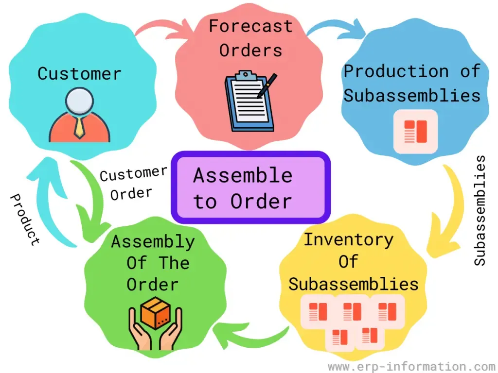

In the fast-paced world of algorithmic trading, order anticipation strategies play a crucial role in maximizing potential profits. These strategies are centered on predicting and responding to anticipated market movements before they manifest, thereby aiming to gain an edge over competitors. At their core, order anticipation strategies involve the analysis of order flow and a breadth of market data to foresee price movements. 

Order anticipation is not merely guesswork but a systematic approach that leverages advanced algorithms to automate the process and make rapid decisions grounded in statistical models. These algorithms are designed to ingest large volumes of data, identify patterns, and respond to emerging trends faster than any human could manage. This gives traders who employ such strategies a significant advantage in executing trades at optimal times and prices.



A typical algorithmic order anticipation strategy might employ techniques like machine learning to improve its predictive capabilities. For instance, by using historical order flow data and current market conditions, machine learning models can be developed to predict the likelihood of certain market movements. Traders can then automate their responses to these predictions, ensuring that they are optimally positioned in the market to maximize profit potential.

Throughout this article, we will explore the essential elements of order anticipation strategies, their tangible benefits, and how they can be effectively implemented within the framework of algorithmic trading. By understanding the mechanics and applications of these strategies, traders can enhance their market operations and thrive in increasingly complex trading environments.

## Table of Contents

## Understanding Order Anticipation Strategies

Order anticipation strategies are a pivotal component of algorithmic trading, focusing on predicting the forthcoming actions of other market participants. These strategies are particularly designed to detect large impending orders that have the potential to significantly influence price movements. By identifying such orders, traders can strategically position themselves to capitalize on these anticipated changes in market conditions.

A crucial element of order anticipation strategies is order flow analysis. This process entails closely monitoring buying and selling activities to discern market trends and investor behavior. By analyzing order flow, traders can gauge the strength and direction of price momentum. This information allows them to make informed predictions about future price movements based on the anticipated flow of large transactions. Consequently, traders can foresee trends and potential market reversals, enabling them to execute trades that take advantage of these impending price shifts.

Predictive modeling plays a key role in the development and implementation of order anticipation strategies. These models are built upon historical transaction data and market dynamics to simulate future market conditions. The quality and accuracy of these models depend on their ability to process real-time market data effectively. Access to up-to-date and comprehensive market data is essential for maintaining the precision of these models, as it ensures that traders are basing their predictions on the most accurate and timely information available.

To effectively implement order anticipation strategies, one must possess a profound understanding of market mechanics. This involves recognizing how various market factors interplay and influence order flow and price movements. Furthermore, technological tools and platforms that provide access to live data streams are essential components in executing these strategies. Advanced computing power is needed to analyze vast amounts of market data quickly and accurately, ensuring that trades are executed with minimal delay.

Order anticipation strategies not only provide an edge in predicting market movements but also help traders mitigate risks associated with adverse market selections and slippage. By strategically positioning themselves based on anticipated large orders, traders can achieve more favorable entry and [exit](/wiki/exit-strategy) points, thereby optimizing their trading outcomes. These strategies, therefore, form a foundational element in the sophisticated landscape of [algorithmic trading](/wiki/algorithmic-trading), offering traders an advantage in navigating complex and dynamic financial markets.

## Benefits of Order Anticipation in Algo Trading

Order anticipation in algorithmic trading provides significant advantages, enhancing both trade execution and market prediction capabilities. By accurately predicting upcoming market movements, traders can position themselves to execute trades at optimal prices, directly contributing to higher profit margins. This ability to foresee large market shifts allows traders to mitigate risks such as adverse selection, where trades are not executed at the expected price due to rapid market changes, and slippage, the difference between the expected and actual execution price.

Order anticipation strategies integrate seamlessly with other trading methodologies, offering a comprehensive approach to market engagement. The predictive insights gained from these strategies enable traders to align their trading decisions with anticipated market dynamics, making informed choices that maximize potential gains. Moreover, when these strategies are effectively applied, they provide a competitive advantage by allowing traders to quickly adapt to the continuously evolving and complex market landscape.

In essence, order anticipation complements and enhances the efficacy of a wider trading strategy toolkit, providing traders with a more robust and agile framework for navigating market uncertainties. The competitive edge gained through the implementation of such strategies is invaluable, particularly in today’s fast-paced trading environments where speed and accuracy are crucial for maintaining profitability.

## Implementing Order Anticipation Strategies

Implementing order anticipation strategies in algorithmic trading involves the use of advanced algorithms designed to process vast amounts of market data efficiently. These algorithms automate trade execution, allowing traders to capitalize on anticipated market movements before they occur.

The core of implementing these strategies lies in building models that replicate market behavior. These models rely on historical data to identify patterns and forecast future market conditions. To enhance model accuracy, traders refine these models continuously by incorporating feedback from past performance and considering prevailing market conditions. The use of statistical techniques, such as time series analysis and regression models, can aid in developing robust predictive models. For instance, an autoregressive integrated moving average (ARIMA) model might be used to forecast price movements based on historical data patterns.

Real-time data analysis is critical in order anticipation strategies. It involves monitoring live market feeds to detect changes in market dynamics promptly. This ability to react swiftly allows traders to adjust their positions in response to emerging trends. For example, Python libraries such as `pandas` and `numpy` can be utilized to process real-time data streams, while `scikit-learn` provides tools for developing predictive models.

```python
import pandas as pd
from sklearn.linear_model import LinearRegression

# A simple example of using real-time data to predict market trends
def predict_market_trends(data_stream):
    # Assuming data_stream is a pandas DataFrame with columns 'time' and 'price'
    X = data_stream['time'].values.reshape(-1, 1)
    y = data_stream['price'].values
    model = LinearRegression().fit(X, y)
    prediction = model.predict(X[-1].reshape(-1, 1))
    return prediction
```

Technological advancements, particularly in [machine learning](/wiki/machine-learning), significantly enhance the predictive power of these strategies. Techniques such as neural networks and decision trees can decipher complex non-linear relationships within data, offering deeper insights into potential market movements. As machine learning models improve over time, they provide a more accurate representation of market behavior, thus enhancing the effectiveness of order anticipation strategies.

To maintain their effectiveness, traders must continuously monitor market conditions and adjust their strategies accordingly. This adaptive approach ensures that strategies remain relevant in the face of evolving market dynamics. Regular [backtesting](/wiki/backtesting) with updated data sets can reveal insights into the performance of a strategy, allowing for necessary recalibrations.

In summary, implementing order anticipation strategies involves a combination of sophisticated algorithms, continuous model refinement, real-time data analysis, and the application of machine learning techniques. By utilizing these tools and maintaining flexibility in their approach, traders can effectively anticipate market movements and achieve a competitive advantage in the trading environment.

## Challenges and Considerations

One of the primary challenges associated with implementing order anticipation strategies lies in ensuring the accuracy of prediction models. These models are typically based on historical data, which might not accurately reflect future market conditions. As markets evolve and new variables emerge, reliance on historical patterns may lead to errors in prediction. Traders must constantly refine and adjust their models to account for these changes, using techniques such as machine learning to improve predictive accuracy.

The quality and latency of data are crucial factors influencing the effectiveness of these strategies. High-quality data is essential for developing reliable models, while low-latency data ensures that traders can react quickly to market changes. Delays in data processing can result in missed opportunities or poorly timed trades, thereby reducing the potential advantages of order anticipation strategies. Consequently, it is vital to invest in advanced technology and infrastructure that can handle real-time data efficiently.

Given the intricate structure of financial markets, sophisticated algorithms are necessary to process vast amounts of data swiftly and accurately. These algorithms must be capable of filtering noise and identifying genuine trends or patterns that could indicate significant market movements. Developing such algorithms requires expertise in quantitative finance, [statistics](/wiki/bayesian-statistics), and computer science, along with a deep understanding of market dynamics.

Regulatory considerations are also a significant concern for trading firms employing order anticipation strategies. Regulators closely monitor trading activities to prevent unfair practices or market manipulation. Compliance with regulations is imperative, and traders need to stay informed about changes in the legal landscape. This may involve collaborating with legal experts to ensure that their strategies do not breach regulations.

Furthermore, the popularity of order anticipation strategies contributes to increased competition among market participants. As more traders adopt similar strategies, the competitive advantage might diminish over time. To maintain an edge, traders must continuously innovate and optimize their approaches. This includes exploring new data sources, integrating advanced computational methods, and utilizing cutting-edge technologies to enhance their predictive capabilities.

## Conclusion

Order anticipation strategies in algorithmic trading serve as a powerful asset for traders aiming to maintain a competitive edge in dynamic financial markets. By harnessing the predictive capabilities of detailed market analysis and sophisticated algorithms, traders can strategically position themselves to optimize profit margins. These strategies rely on accurate predictions of market movements, allowing traders to execute decisions that align with anticipated trends and fluctuations.

While traders face challenges such as ensuring model accuracy and overcoming data latency issues, the benefits typically surpass these obstacles. Accurate prediction models are vital, as they enable traders to make informed decisions in real-time, minimizing risks such as slippage and adverse selection. To maintain precision, models need regular updating to incorporate the latest market data and trends, ensuring their robustness against changing conditions.

As trading technology continues to advance, so will order anticipation strategies, offering continual insights and advantages to market participants. This evolution demands that traders remain well-informed and adapt their strategies to the latest technological developments and regulatory changes. Continuous refinement of these strategies is crucial to fully exploit the potential opportunities presented by market dynamics and to sustain profitability in the face of increasing competition.

In conclusion, the strategic value of order anticipation in algorithmic trading cannot be overstated. Traders who effectively integrate these strategies into their operations are better equipped to navigate the complexities of modern financial markets and secure a competitive advantage, thereby driving superior trading outcomes.

## References & Further Reading

[1]: ["Advances in Financial Machine Learning"](https://www.amazon.com/Advances-Financial-Machine-Learning-Marcos/dp/1119482089) by Marcos Lopez de Prado

[2]: ["Machine Learning for Algorithmic Trading"](https://github.com/stefan-jansen/machine-learning-for-trading) by Stefan Jansen

[3]: ["Algorithmic Trading: Winning Strategies and Their Rationale"](https://www.amazon.com/Algorithmic-Trading-Winning-Strategies-Rationale/dp/1118460146) by Ernest P. Chan

[4]: ["Quantitative Trading: How to Build Your Own Algorithmic Trading Business"](https://www.amazon.com/Quantitative-Trading-Build-Algorithmic-Business/dp/1119800064) by Ernest P. Chan

[5]: Gomber, P., Koch, J.A., & Siering, M. (2017). ["Digital Finance and FinTech: Current Research and Future Research Directions"](https://link.springer.com/article/10.1007/s11573-017-0852-x). Journal of Business Economics. 

[6]: Van Vliet, B. (2008). ["Implementing QuantLib: Quantitative Finance in C++"](https://books.google.com/books/about/Implementing_QuantLib.html?id=uOHczQEACAAJ). Wiley.