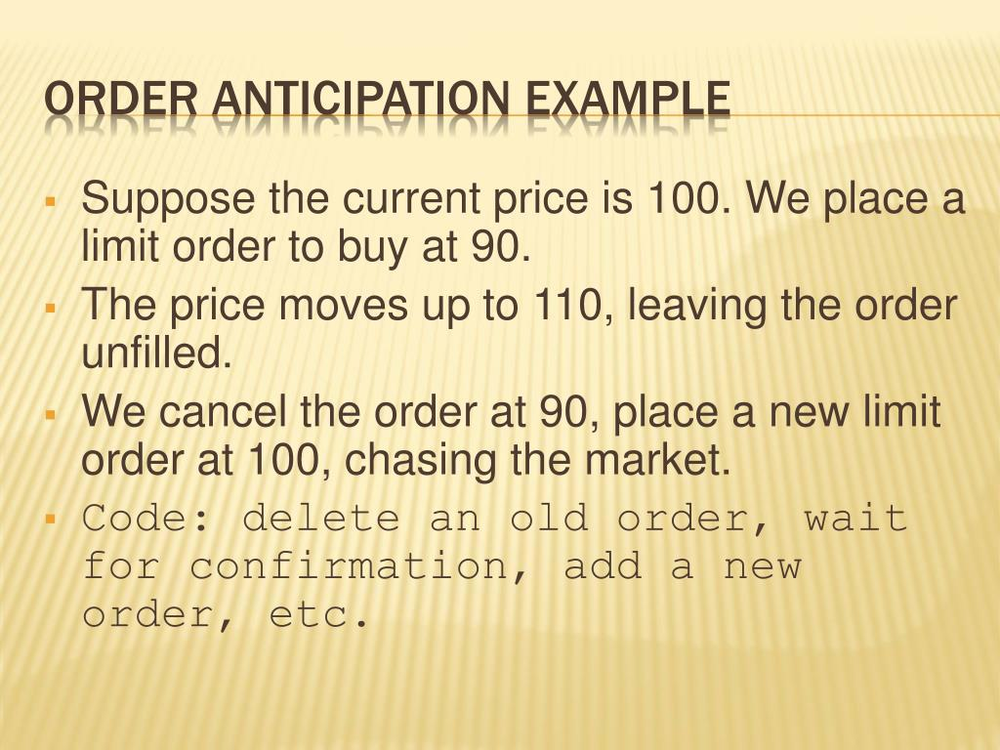

Order anticipation is a pivotal element in the field of algorithmic trading, where the core objective is to predict the trades of other market participants and adapt one's own trading strategy for optimal outcomes. This practice is underpinned by the deployment of sophisticated technologies and algorithms designed to decode market signals and foresee significant orders. As a key aspect of high-frequency trading (HFT), order anticipation requires the capacity to process information at extraordinarily high speeds, often measured in milliseconds.

The effectiveness of order anticipation is largely due to its ability to enhance market liquidity by facilitating smoother transactions and reducing market impact. However, it also steps onto a precarious boundary with market manipulation, where the ethical and legal ramifications come into play. Order anticipation can inadvertently lead to unfair advantages, prompting regulatory scrutiny and calls for transparent trading practices to safeguard market integrity.



This article examines the multifaceted nature of order anticipation and its effects on financial markets, considering both the potential benefits and the ethical concerns it raises. Through the lens of evolving market strategies and technological advancements, it becomes imperative to understand how order anticipation can influence trading landscapes and the regulatory challenges it poses.

## Table of Contents

## The Mechanics of Order Anticipation

Order anticipation strategies are an integral part of modern trading, leveraging advanced techniques to infer future market movements based on analyzing patterns and trends in trading behavior. These strategies primarily revolve around detecting subtle changes in market dynamics to project incoming market orders before they are publicly visible.

Critical to order anticipation is the analysis of trading volumes, algorithmic trading processes, and the intricacies of market microstructure. Volume analysis is pivotal as it helps in recognizing unusual trading activities that could signal impending large orders. By examining variations in trade sizes and sequences, traders aim to uncover hidden order flows that may indicate shifts in supply and demand.

Algorithmic trading enhances the prediction accuracy of order anticipation strategies. Sophisticated algorithms dissect market signals and execute trades within milliseconds, allowing traders to capitalize on fleeting market opportunities. These algorithms, powered by machine learning, continuously learn from new data, refining their predictive capabilities to adapt to evolving market conditions.

Identifying and utilizing market [liquidity](/wiki/liquidity-risk-premium) and depth are also essential components. Traders seek to minimize slippage—the difference between expected and actual transaction prices—by understanding where liquidity resides within the [order book](/wiki/order-book-trading-strategies). Market depth provides insights into the available [volume](/wiki/volume-trading-strategy) beyond the best bid and ask prices, which is crucial for executing large trades without significantly impacting market prices.

However, order anticipation must be carefully managed within regulatory constraints to avoid crossing into market manipulation territory. Understanding regulatory implications is essential as these strategies must comply with legal standards to ensure market integrity. Regulatory frameworks aim to distinguish between legitimate anticipatory strategies and those that distort market operations for unfair advantage. Traders must tread these waters cautiously, as violations can lead to significant penalties and damage to reputations.

In conclusion, the mechanics of order anticipation are rooted in advanced analysis and rapid execution, tempered by a thorough understanding of regulatory boundaries to maintain fair trading practices.

## The Thin Line Between Anticipation and Market Manipulation

Order anticipation, regarded as a legitimate strategy within the trading ecosystem, treads a fine line adjacent to market manipulation, a practice deemed illegal. The primary distinction between order anticipation and market manipulation often lies in the intent behind and the impact of the trading activities. Market manipulation typically involves deliberate, deceptive actions aimed at artificially influencing market prices, which can lead to distortionary effects that disrupt market order and fairness. 

Regulatory bodies encounter significant challenges in differentiating between sophisticated trading strategies—like order anticipation—and unethical practices meant to skew market results. This difficulty is exacerbated by the rapid evolution of trading technologies, which further obscure the boundaries between legitimate and manipulative trading behaviors. Advanced algorithms can perform transactions at velocities and complexities unfathomable to traditional regulatory tools, making it increasingly arduous to pinpoint manipulative algorithms amidst lawful trading operations.

Despite these challenges, regulatory agencies are actively developing and implementing measures to promote market fairness and enhance transparency without stifling technological innovation. These regulatory responses often involve updating trading laws and guidelines to better align with the contemporary landscape, encouraging technological advancements that prioritize integrity while punishing manipulative practices. Balancing the dual goals of innovation and equitable trading environments remains a core objective for regulators as they strive to adapt to the dynamic nature of financial markets.

## How Algorithms Predict and React

Algorithms play a pivotal role in predicting market movements by analyzing large datasets to identify patterns and trends that may indicate future price changes. These sophisticated programs capitalize on historical data to generate predictions and execute trades at speeds unattainable by human traders. For example, by employing statistical models, algorithms can forecast the likelihood of certain market events and position trades accordingly. This speed and accuracy stem from the ability of algorithms to process vast amounts of market information with minimal delay.

Machine learning significantly enhances the capabilities of these algorithms. By employing techniques such as supervised learning, algorithms can adapt to new data, improving their predictive accuracy over time. For instance, algorithms utilize regression models to analyze price trends, while classification models help in identifying bullish or bearish market signals. This adaptability ensures that trading strategies are continually optimized as market conditions change, providing a robust framework for decision-making.

In the fast-paced environment of [algorithmic trading](/wiki/algorithmic-trading), risk management protocols are crucial. These protocols are employed to mitigate potential losses during adverse market conditions. Algorithms incorporate techniques such as stop-loss orders, which automatically sell a security when its price falls below a predetermined level, and hedging strategies to protect portfolios against significant losses. Python code such as the following illustrates a basic stop-loss mechanism:

```python
def place_order(price, stop_loss_level):
    if price <= stop_loss_level:
        execute_trade("sell")
```

Ethical considerations are paramount, as algorithms must operate within regulatory frameworks to avoid manipulative actions. Compliance with market regulations is enforced by incorporating checks and protocols that ensure trading activities are fair and transparent. Traders must continuously evaluate their algorithms to prevent unethical practices, such as spoofing or layering, which can artificially manipulate market prices.

The use of algorithms impacts market dynamics profoundly. By contributing to increased liquidity, algorithms help stabilize markets under normal trading conditions. However, they can also introduce [volatility](/wiki/volatility-trading-strategies), particularly during flash events, where rapid, algorithm-driven sell-offs or buy-ins can lead to significant price swings. Balancing these dynamics is crucial for maintaining market order and efficacy.

In conclusion, algorithms are indispensable in contemporary trading, offering enhanced processing speeds and predictive accuracy. Through the integration of [machine learning](/wiki/machine-learning) and rigorous risk management protocols, they present opportunities for profit while necessitating adherence to ethical standards to maintain market integrity.

## Order Anticipation in Action

Order anticipation involves using sophisticated data analysis and trend prediction techniques to strategically position trades ahead of predicted large market orders. This method is particularly prevalent in high-frequency trading ([HFT](/wiki/high-frequency-trading-strategies)), where firms utilize complex algorithms to effectively 'front-run' the market. Front-running, in this context, does not imply illegal activity but rather indicates anticipating and responding to upcoming orders with superior speed and accuracy.

Proponents of order anticipation argue that it enhances market liquidity and efficiency. By predicting large trades, these practices contribute to smoother market functions by providing liquidity when significant orders are executed. This predictability can help prevent drastic price swings and maintain orderly markets. However, the practice is not without its critics. Opponents contend that order anticipation can distort prices and create an uneven playing field by disadvantaging larger, slower investors who cannot react as quickly. This disparity raises questions about market fairness, as those with access to advanced technologies and algorithms hold a substantial advantage over traditional market participants.

The techniques employed in order anticipation are diverse and advanced, often involving pattern recognition and statistical [arbitrage](/wiki/arbitrage). Pattern recognition aims to identify and exploit recurring trends in market data, while [statistical arbitrage](/wiki/statistical-arbitrage) seeks to profit from price inefficiencies based on extensive statistical analysis. These strategies require sophisticated mathematical models and an intricate understanding of market behavior.

In a Python-based HFT environment, algorithms might be designed to analyze various market indicators and execute trades accordingly. For instance, an algorithm could be developed to detect unusual trade volumes or volatility spikes, signaling potential large orders. An illustrative Python snippet might involve using a library like NumPy or pandas to process historical trade data and identify potential market trends:

```python
import pandas as pd

# Load historical trade data
data = pd.read_csv('trade_data.csv')

# Calculate moving averages
data['MA_50'] = data['close'].rolling(window=50).mean()
data['MA_200'] = data['close'].rolling(window=200).mean()

# Identify potential trade signals
data['Signal'] = 0
data.loc[data['MA_50'] > data['MA_200'], 'Signal'] = 1

# Potential anticipatory trade based on signals
for index, row in data.iterrows():
    if row['Signal'] == 1:
        # Execute buy order
        pass  # Insert trade execution code
```

Regulatory and ethical considerations remain critical as these anticipatory strategies can blur the lines between competitive advantage and market manipulation. Regulators face the ongoing challenge of ensuring these advanced trading techniques comply with market fairness principles. There is an ongoing debate about where to draw the line between innovative strategies and unethical practices that disrupt market equilibrium. This balancing act requires continual adaptation of regulatory frameworks to address the rapid technological advancements in order anticipation and algorithmic trading. Maintaining market integrity while fostering a level playing field for all participants is crucial in the dynamic landscape of order anticipation.

## The Impact of Order Anticipation on Market Efficiency

Order anticipation, a practice embedded in algorithmic and high-frequency trading, significantly influences market efficiency and challenges the efficient market hypothesis (EMH). This strategy exploits informational asymmetries, using advanced algorithms to predict and react to potential market movements. Such activities can lead to both beneficial and adverse effects on market dynamics.

While order anticipation can enhance liquidity by predicting and preemptively filling potential market gaps, it also introduces risks of mispricing. The anticipatory nature of trades often involves identifying patterns and executing trades based on expected orders by other market participants. This proactive approach can indeed lead to a more liquid market but may also cause unintended market inefficiencies, creating discrepancies between an asset's price and its intrinsic value.

The potential for increased volatility is another significant consequence of order anticipation. As traders execute anticipatory trades collectively, markets may experience abrupt price shifts, deviating from normal trading patterns. These rapid adjustments can arise from an accumulation of short-term trading strategies that aim to capitalize on perceived but non-public information, thereby modifying price stability.

Balancing the dynamic interactions between anticipatory trading strategies and market efficiency remains a crucial endeavor for market participants and regulators. Critics argue that while these strategies might provide short-term gains for traders, they could undermine the broader market's capacity to function efficiently. Conversely, proponents suggest that anticipatory trades contribute to price discovery and resource allocation, particularly when they align transaction prices closer to an asset's fundamental value.

The ongoing debate centers on determining the net effect of order anticipation on market functionality. On one hand, the rapid influx of anticipatory trades can mirror informed trading, contributing positively to market efficiency by incorporating new information swiftly. On the other hand, the possibility of exacerbating volatility and mispricing underlines the need for careful scrutiny and balanced regulatory measures.

Overall, understanding the influence of order anticipation involves recognizing its dual capacity to both challenge and enhance market efficiency. Such recognition is crucial for developing strategies and regulatory frameworks that optimize the equilibrium between fostering innovation in trading practices and safeguarding market integrity and efficiency.

## Ethical Considerations in Predictive Trading Practices

Predictive trading practices raise significant ethical considerations, primarily concerning market fairness and the potential for creating an uneven playing field. These practices, particularly those employing advanced algorithms and [artificial intelligence](/wiki/ai-artificial-intelligence) (AI), can have a profound impact on less informed participants in the financial markets. The speed and complexity of algorithmic trading often mean that only well-resourced entities can compete effectively, potentially leading to wealth distribution imbalances and restricted market access for smaller investors.

Transparent disclosures and the ethical use of AI are crucial measures to mitigate these potential negative impacts on market integrity. By ensuring that algorithms are programmed to avoid manipulative actions and provide transparent insights into their operations, traders can help maintain trust within the financial system. This transparency is essential not only for investors but also for regulatory bodies seeking to ensure fair practice.

Regulatory compliance is another vital aspect of ethical trading. As technology evolves rapidly, regulatory frameworks must adapt to keep pace. This adaptation involves ongoing updates to trading laws to address new challenges posed by emerging technologies in the trading landscape. By establishing clear guidelines and frameworks, regulators can help distinguish between legitimate anticipatory trading strategies and those bordering on manipulation.

The rapid evolution of technology in trading necessitates vigilant oversight to balance innovation with ethical considerations. As predictive algorithms become more sophisticated, they must be designed and employed with a strong ethical foundation, emphasizing market integrity and fairness for all participants.

## Trends and Predictions

Emerging technologies such as quantum computing and blockchain hold the potential to significantly alter the landscape of order anticipation in financial markets. Quantum computing, with its capability to perform complex calculations at unprecedented speeds, could revolutionize the way market data is processed and analyzed. By leveraging quantum algorithms, traders might achieve enhanced predictive accuracy, as these algorithms can solve optimization problems and manage vast datasets more efficiently than classical computers.

Similarly, the integration of blockchain in trading practices offers promising advancements. Blockchain technology ensures transparency and immutability in trade executions, which could reduce the risk of misconduct and provide a clear trail of transactions. This transparency may aid in differentiating between ethical trading strategies and manipulative practices, providing regulatory bodies with more robust tools to monitor trading activities.

Advanced artificial intelligence (AI) algorithms are expected to amplify pattern recognition and predictive capabilities further. Machine learning models, particularly those employing [deep learning](/wiki/deep-learning) techniques, can process historical and real-time data to predict market trends with higher precision. These models continuously learn from new data, allowing them to adapt to market changes and refine their strategies.

Regulatory bodies are anticipated to play a crucial role in shaping the future of order anticipation. The development of comprehensive frameworks to distinguish between ethical anticipation strategies and manipulative practices is essential to maintaining fair market conditions. As AI and other technologies evolve rapidly, regulatory updates will be needed to address new challenges and ensure market integrity.

The use of [alternative data](/wiki/best-alternative-data) sources, such as social media metrics, satellite imagery, and geolocation data, is gaining traction in predictive trading. These non-traditional data types can provide additional layers of insight, helping traders anticipate market movements more accurately. However, ethical considerations must be prioritized, ensuring that the utilization of these data sources does not infringe on privacy or lead to unjust market advantages.

In conclusion, the intersection of emerging technologies and regulatory advancements will likely drive the evolution of order anticipation. Maintaining ethical standards and regulatory compliance will be crucial as these technologies reshape the trading landscape.

## Balancing Profit and Fair Play in Trading

Order anticipation provides significant profit opportunities within financial markets, but ensuring a fair and transparent trading environment is essential to maintaining market integrity. Clear regulatory frameworks are necessary to distinguish between legitimate trading strategies and manipulative practices. Trading laws must evolve to adapt to the rapid advancements in technology, ensuring that order anticipation strategies comply with legal and ethical standards. 

Moreover, investor education plays a crucial role in delineating legal from illegal practices. By understanding the mechanics and implications of order anticipation, investors can make informed decisions, thereby promoting market fairness. Educating traders on the boundaries of ethical trading can help bridge the gap between sophisticated market participants and casual investors, fostering a more equitable trading environment.

Market transparency is another critical [factor](/wiki/factor-investing) in promoting fair play. When market participants have access to accurate and timely information, it reduces the likelihood of information asymmetry, where only a few benefit from privileged insights. Transparency ensures that all traders, regardless of their level of sophistication, can access similar information, driving informed trading decisions and minimizing the potential for manipulation.

Balancing competitive advantage with ethical practices poses a central challenge in order anticipation. While leveraging advanced algorithms and data analytics can provide a significant edge, it is vital to ensure that these practices do not unfairly disadvantage other market participants. By fostering a regulatory environment that encourages innovation while upholding ethical standards, regulators can support a dynamic yet fair market landscape.

Ultimately, achieving this balance requires a concerted effort from regulators, market participants, and technologists to ensure that profit motives do not compromise the core principles of market integrity and fairness. Through ongoing dialogue and cooperation, a sustainable and equitable trading ecosystem can be developed, benefiting all participants and maintaining the trust and efficiency of financial markets.

## References & Further Reading

[1]: Aldridge, I. (2013). ["High-Frequency Trading: A Practical Guide to Algorithmic Strategies and Trading Systems"](https://www.amazon.com/High-Frequency-Trading-Practical-Algorithmic-Strategies/dp/1118343506). Wiley.

[2]: Cartea, Á., Jaimungal, S., & Penalva, J. (2015). ["Algorithmic and High-Frequency Trading"](https://assets.cambridge.org/97811070/91146/frontmatter/9781107091146_frontmatter.pdf). Cambridge University Press.

[3]: Arnuk, S., & Saluzzi, J. (2012). ["Broken Markets: How High Frequency Trading and Predatory Practices on Wall Street are Destroying Investor Confidence and Your Portfolio"](https://ptgmedia.pearsoncmg.com/images/9780132875240/samplepages/0132875241.pdf). FT Press.

[4]: Patterson, S. (2013). ["Dark Pools: High-Speed Traders, A.I. Bandits, and the Threat to the Global Financial System"](https://books.google.com/books/about/Dark_Pools.html?id=LIoNSKUEn24C). Crown Business.

[5]: Pardo, R. (2011). ["The Evaluation and Optimization of Trading Strategies"](https://onlinelibrary.wiley.com/doi/book/10.1002/9781119196969). Wiley Trading.